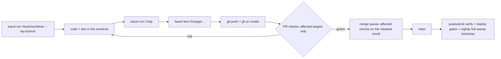
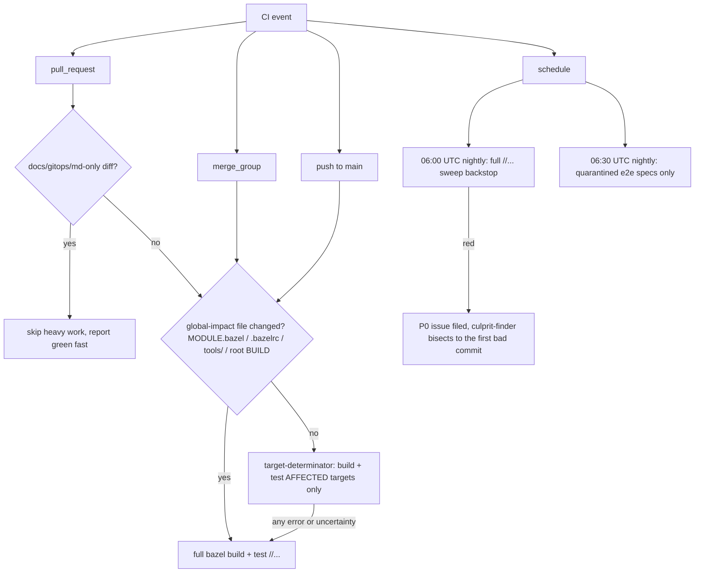
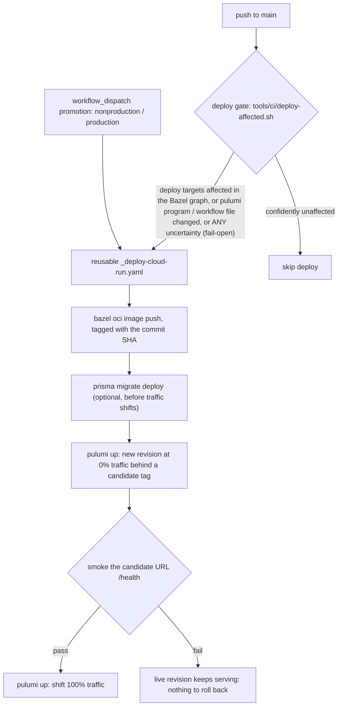

# Contributing to vitruvian-core

This is the developer Standard Operating Procedure (SOP) for the `vitruvian-core` monorepo. It is a practical runbook: how to set up your machine, run and test each app, get a change through CI and the merge queue, and ship it.

Two companion docs sit alongside this one and are referenced throughout:

- **Applications & Categories** — the app catalog and the MECE category taxonomy (the shared vocabulary for "app type" used below).
- **Alignment Gaps** — the surfaced inconsistencies (local-dev, promotion ladders, hosting/stack non-uniformity, secrets, IaC reproducibility, testing/observability). Where this SOP says "the standard is X but app Y doesn't do it yet," that doc tracks the gap.

> **How to read this doc.** Anything marked **🎯 Target** is the standard we are aligning to but is **not yet universally adopted** — do not assume an existing app already follows it. Anything stated plainly is the current, enforced reality. When in doubt, the merge queue's required checks (Section 5) are the source of truth for what actually gates a PR.

---

## 1. Prerequisites & toolchain

The build graph is **Bazel** (Bzlmod, via Bazelisk) with Aspect rulesets. Almost everything routes through Bazel, but you still need the underlying toolchains installed for the out-of-band paths (goreleaser, gcloud, direct `pnpm`/`go` work, and editor integration).

| Tool | Version / source | Why you need it |
|------|------------------|-----------------|
| **Bazelisk** (→ Bazel) | Bazel **9.1.1** is pinned by the repo; Bazelisk reads it | The primary build/test/run entrypoint for the whole repo |
| **pnpm** | **10.20.0** (workspace) | JS/TS workspace package management; not used at build time by Bazel but needed for container builds and local `pnpm dev` |
| **Node** | **22.21.1**, pinned in `.nvmrc` (and fed into the Bazel node toolchain) | All TS/JS apps. Use `nvm use` (or a manager that reads `.nvmrc`) |
| **Go** | go.work toolchain (currently **1.26.2**); see note below | `devx`, `homelab`, and all `infrastructure/pulumi/*` programs |
| **gcloud** | latest | Cloud Run deploys (CI does this for you; needed locally only for a per-app GCP dev project) |
| **devx** | `brew install vitruviansoftware/tap/devx` | Local-dev orchestrator (Lima VMs / devcontainers / ephemeral DBs / local k3s). See Section 3 |
| **gh** | latest | PRs, merge queue, looking at CI runs |

> **Go version drift is real.** `go.work`/`homelab` are on 1.26.2, `infrastructure/pulumi` on 1.26.1, `devx` on 1.25.5. Nothing enforces a single Go version yet. **🎯 Target:** every `go.mod` pins the `go.work` toolchain version with a CI check on drift. Until then, install the highest (1.26.2) and expect `devx` to lag. See the Alignment Gaps doc.

### One-time setup

```bash
# 1. Clone (use a worktree if you share this checkout across sessions/agents — see Section 4)
git clone <repo-url> vitruvian-core && cd vitruvian-core

# 2. Node toolchain
nvm install            # reads .nvmrc -> 22.21.1
corepack enable        # pnpm 10.20.0

# 3. Bazelisk — install it AS `bazel` so the `bazel` command honors .bazelversion (-> 9.1.1).
#    MODULE.bazel also declares a bazel_compatibility range, so an out-of-range or
#    non-Bazelisk `bazel` fails fast with a clear message instead of cryptic errors.
bazel version          # -> 9.1.1

# 4. Verify your environment has the right tools + versions (//<app>:doctor checks one app)
bazel run //:doctor

# 5. Smoke-test the build graph (warms the BuildBuddy remote cache)
bazel build //...

# 6. (Optional, for local-dev orchestration) install devx + gh
brew install vitruviansoftware/tap/devx
gh auth login
```

`bazel run //:doctor` checks the core toolchain; `bazel run //<app>:doctor` (e.g. `//tabula:doctor`) checks
that app's exact requirements and fails if anything is missing or the wrong version. Run it first whenever a
build or test behaves unexpectedly — it's faster than diagnosing a cryptic toolchain error.

A root **`.devcontainer/`** exists (Bazel + Kind + gcloud + Pulumi, Codespaces-capable) if you prefer a container-based setup. It is currently **generic and app-agnostic** — there is no per-app devcontainer wiring and no documented hosted-dev path. **🎯 Target / gap:** remote dev (Codespaces / Cloud Workstations) is not a supported standard today; everything is local + CI.

---

## 2. Repo layout

```
vitruvian-core/
├── tabula/                       # SaaS, multi-component (API→Cloud Run, extension, web, cli, shared)
├── oauth-user-inspector/         # SaaS, single-container web app → Cloud Run
├── devx/                         # CLI / developer tool (Go)
├── homelab/                      # CLI / infra-ops tool (Go)
├── mcp-slack/                    # Agent / MCP service (Node/TS)
├── nexus-agent/                  # Agent / MCP service (Node bot + Swift macOS app)
│
├── tools/                        # Shared build/ops tooling (Bazel rules + run-wrappers)
│   ├── pulumi/                   # //tools/pulumi — bazel-only Pulumi wrapper (identity injection)
│   ├── gitops/                   # //tools/gitops — bazel-only ArgoCD / sealed-secrets wrapper
│   ├── copybara/                 # one-way export config (copy.bara.sky)
│   ├── oci/                      # OCI node/go/py image rules
│   └── ci/, format/, lint/, ...  # affected-targets, formatters, presets
│
├── infrastructure/
│   ├── pulumi/                   # IaC: dev-local, tabula, oauth-user-inspector(+-deploy-identity),
│   │                             #      lab-gmail, repo_config; root = copybara sync-auth
│   └── gcp-identities.tsv        # per-Pulumi-project GCP account/project map
│
├── gitops/                       # ArgoCD app-of-apps for the dev-local k3s cluster
│   └── argocd/{projects,platform,applications,root-applications.yaml}
│
├── docs/                         # docs/infrastructure/, docs/tabula/, + cross-cutting topic docs
├── .github/workflows/            # CI/CD (ci.yaml, per-app deploy, copybara, charts-publish, ...)
├── .nvmrc / BUILD / MODULE.bazel # repo-root pins and the //:tidy target
└── AGENTS.md / README.md
```

For the full per-app catalog and the category definitions (SaaS web service, CLI / developer tool, Agent / MCP service, IaC / platform definition, etc.), see the **Applications & Categories** doc — the per-app commands below are organized by those same categories.

---

## 3. Local development

There is **no single uniform "run this app locally" story yet** — each app type has its own inner loop. The table below is the practical per-type recipe. Where an app's own README contradicts this, trust this SOP (several READMEs are stale; see the gap notes).

### 3.1 Inner loop by app type

| App type | Apps | Run / iterate | Test |
|----------|------|---------------|------|
| **Bazel monorepo (multi-component SaaS)** | `tabula` | `bazel run //tabula/cli:tabcli`; load extension from `bazel-bin/tabula/extension/dist`; backing Postgres/Redis come up as Bazel-managed hermetic test services | `bazel test //tabula/...` |
| **Containerized SaaS web app** | `oauth-user-inspector` | `pnpm dev` (concurrently Vite + nodemon/tsc backend on `:8080) | `bazel test //oauth-user-inspector/...` (jest server suite) |
| **Go CLI** | `devx` | `bazel run //devx:devx -- <args>` (developer build of record); release builds via goreleaser only | `bazel test //devx/...` |
| **Go CLI (infra/ops)** | `homelab` | `bazel run //homelab/cmd/homelab -- <args>` | `bazel test //homelab/...` |
| **Agent / MCP (Node/TS)** | `mcp-slack` | `pnpm install && pnpm build && pnpm start` (the MCP host injects the Slack tokens as env) | — (no tests yet) |
| **Agent / MCP + macOS** | `nexus-agent` | `pnpm start` / `pnpm dev` for the bot; `bazel build --config=macos-app //nexus-agent/macos:NexusAgent` for the menu-bar app | — (no tests yet) |

> **Known divergences you will hit (all tracked in the Alignment Gaps doc):**
> - **`tabula` ships two contradictory local-dev narratives.** The root README documents the real Bazel+pnpm flow above. `docs/tabula/getting-started/*` and `tabula/CONTRIBUTING.md` still describe a **stale pre-monorepo flow** (npm workspaces, `docker-compose up -d`, Terraform, `tabcli dev start`, cloning `github.com/BlueCentre/tabula`, Node 18). **There is no `docker-compose.yml` in this repo, the build is Bazel+Pulumi, and Node is pinned to 22.** Follow the root README, not the `getting-started` docs.
> - **`oauth-user-inspector` README deploy path is dead.** `npm run deploy` / `scripts/deploy.sh` invoke a retired Cloud Build flow (`gcloud builds submit --config cloudbuild.yaml`) and **no `cloudbuild.yaml` exists**. Deploy is CI-only (Section 8). Ignore that section of the README.
> - **`mcp-slack` and `nexus-agent` are documented with bare `npm`** even though both are members of `pnpm-workspace.yaml`. Prefer `pnpm` to keep the single lockfile honest.
> - **Two Go task runners exist out-of-band:** `devx` carries a `magefile.go`, `homelab` carries `.mise.toml`. **🎯 Target:** Bazel is the developer build of record for both; the Mage/mise runners are legacy and being retired (goreleaser stays for mirror releases only). Use the `bazel run` commands above.

### 3.2 Using devx / a local k8s cluster

`devx` is the intended local-dev orchestrator: `devx vm init`, `devx up` (brings up ephemeral DBs/emulators with automatic `.env` injection), `devx shell`, and `devx scaffold {go-api,node-api,next-app,go-cli,python-api}` to stamp a new app skeleton.

> **🎯 Target — dogfooding.** None of the six first-party apps currently ships a `devx.yaml`, so the repo does not yet dogfood its own tool. The target is for every backing-service app (starting with `tabula`'s API and `oauth-user-inspector`) to commit a `devx.yaml` and run its inner loop via `devx up` + the app's `pnpm dev`. Until that lands, use the per-type commands in 3.1.

For a **local k8s** cluster, `devx` provisions zero/multi-node K3s; the `.devcontainer/` also ships a `kind-config.yaml`. Note: the **dev-local k3s homelab hosts platform infra only** (Zitadel, observability, CNPG, MinIO, etc.) reconciled by ArgoCD — first-party apps are **not** deployed there (the one wired path, `gitops/argocd/applications/tabula.yaml.disabled`, is disabled). See Section 9.

### 3.3 Per-app GCP dev project

The two Cloud Run apps each have a per-app GCP **dev** project for runtime secrets/integration:

- `tabula` → `tabula-dev-0001` (GitHub Environment `tabula-development`)
- `oauth-user-inspector` → `gen-lang-client-…` (GitHub Environment `oauth-user-inspector-development`)

There is **no documented local-vs-dev-project split** yet — that's a known local-dev gap. Runtime secrets live in that project's GCP Secret Manager and are read at runtime (never checked out locally); see Section 7.

### 3.4 Local secret files you need (all gitignored)

| App | File | Source |
|-----|------|--------|
| `tabula` (API) | `tabula/api/.env` | copy `tabula/api/.env.example`; keys: `DATABASE_URL`, `JWT_SECRET`, `WORKOS_*`, `UPSTASH_REDIS_URL` |
| `nexus-agent` | `nexus-agent/.env` | copy `nexus-agent/.env.example`; keys: `TELEGRAM_BOT_TOKEN`, `ALLOWED_USER_IDS`, `GEMINI_*` |
| `devx` | `.env` / `.env.keys` | managed via `devx config secrets`; keys: `CF_TUNNEL_TOKEN`, `DEV_HOSTNAME` |
| Pulumi stacks | `infrastructure/pulumi/<project>/Pulumi.<stack>.yaml` | gitignored; non-secret config is committed, secrets are not (Section 7) |

> **Gap:** `oauth-user-inspector`, `mcp-slack`, and `homelab` ship **no `.env.example`**, so "how do I supply secrets to run this locally" is partly tribal knowledge. **🎯 Target:** every app that reads env/secret config commits a placeholder `.env.example`. See the Alignment Gaps doc.

---

## 4. Branching, commits, PRs, the merge queue

The default branch is **`main`**.

1. **Branch first — never commit on `main`, and branch work happens in a worktree.** `bazel run //tools/worktree -- <branch>` creates an isolated worktree with its own Bazel server. This is **enforced, not convention** (#502): `bazel build/run/test` from the *primary* checkout on a non-`main` HEAD fails via the workspace-status guard (`githooks/check-config.sh`) with recovery instructions. `VITRUVIAN_ALLOW_PRIMARY_BRANCH=1` is the break-glass override; CI and linked worktrees are exempt.
2. **Conventional Commits.** Use `feat:`, `fix:`, `docs:`, `chore:`, scoped where helpful (`fix(gitops): …`). This feeds `release-please`.
3. **Co-Authored-By trailer.** End commit messages authored with an assistant with the appropriate `Co-Authored-By:` trailer (documented in `devx/CONTRIBUTING.md`, the de-facto template).
4. **Finish branches with a PR.** When a branch is done, **push and open a GitHub PR** (`gh pr create`) for review + CI. **Never merge locally.**
5. **The merge queue is the single enforcement authority.** Branch protection, required reviews, and the merge queue are codified as IaC in `infrastructure/pulumi/repo_config` (merge queue on; `requireStatusChecks` intentionally `false` because the queue runs them). A PR merges by **entering the queue**, which runs the full required-check set against the rebased result.

PR bodies should be self-contained (what changed, why, how verified). Auto-delete of merged head branches is also managed by `repo_config`.

**The whole loop at a glance:**



---

## 5. Build & test

**Bazel is the first-class entrypoint.** `pnpm`/`go` are fallbacks for editor flows and container builds.

```bash
# Build / test everything (the full sweep — what the NIGHTLY backstop runs;
# PR / merge-queue / postsubmit lanes all run AFFECTED targets only)
bazel build //...
bazel test  //...

# Scope to one app
bazel test //tabula/...
bazel test //devx/...

# Format + BUILD hygiene — run this before every PR. It is a REQUIRED check.
bazel run //:tidy        # gazelle + buildifier + prettier/gofmt
```

`bazel run //:tidy` is the **single formatting/BUILD-hygiene entrypoint** — it regenerates BUILD files (gazelle), formats Starlark (buildifier), and runs the per-language formatters. The `tidy-check` CI job re-runs it and **fails the PR if the tree isn't clean**.

> **Frontends are NOT bazel-built — this is a deliberate, load-bearing convention.** Bazel runs only the `jest_test` for frontends/containerized web apps; the production artifact comes from a **Dockerfile** (`oauth-user-inspector`) or a **Bazel `oci` image** (`tabula/api`). Don't add a Bazel production build for a Vite/Next/webpack frontend.

### Fallback / direct commands

```bash
pnpm install               # workspace install (root)
pnpm --filter <pkg> dev    # run one TS app's dev loop
go test ./...              # inside devx/ or homelab/ (gazelle keeps go_test in the Bazel sweep)
```

### How CI decides what to run

**Every lane is graph-selective.** PRs, the merge queue, and postsubmit all build/test only the **affected targets** (`tools/ci/affected-targets.sh` via target-determinator). The whole-graph correctness backstop is the **nightly full sweep** (`periodic-full-sweep.yaml`, 06:00 UTC — files a P0 issue on red, and `culprit-finder.yaml` can bisect the range to the first bad commit). Every optimization **fails safe**: a global-impact file (`MODULE.bazel`, `.bazelrc`, `tools/**`, root `BUILD`) or *any* uncertainty inside the selection script forces the full `//...` sweep. Remote cache/RBE is **BuildBuddy** (`--config=remote` for CI builds; fork PRs degrade to local).



### The required checks (merge-queue gate set)

The authoritative list lives in `infrastructure/pulumi/repo_config/main.go` (`mergeQueueRequiredChecks`), and `//tools/conformance:check` asserts every name is produced by a job that reports on `merge_group` — so this table can't silently drift from reality without CI failing.

| Check | Workflow | What it gates |
|-------|----------|---------------|
| **build-test** | `ci.yaml` | `bazel test`, affected targets on every lane (full `//...` on global-impact/fallback) |
| **build-macos** | `ci.yaml` | macOS build incl. the `nexus-agent` app (`--config=macos-app`), step-gated on macOS-relevant paths |
| **license-check** | `ci.yaml` | whole-repo header presence (`//tools/license:check`) **and** MIT+holder content (`:verify`) |
| **go-lint (devx\|homelab)** | `ci.yaml` | golangci-lint per Go module, step-gated on that module's paths |
| **go-test (devx\|homelab)** | `ci.yaml` | `go test -race` per Go module (Bazel doesn't run `-race`), step-gated likewise |
| **validate-butane** | `ci.yaml` | devx's Fedora CoreOS template renders to valid Ignition, step-gated on the template |
| **tidy-check** | `tidy-check.yaml` | `bazel run //:tidy` produced no diff |
| **conformance-check** | `conformance-check.yaml` | `//tools/conformance:check` — version pins, JS catalog, merge-queue check names, app visibility firewall, app metadata ↔ CODEOWNERS, the nightly-sweep pairing, and the zitadel import guard |
| **gitops-validate** | `gitops-validate.yaml` | `gitops/**` renders + passes kubeconform *before* ArgoCD reconciles it live |
| **actionlint** | `actionlint.yaml` | the whole hand-tuned workflow tree is linted (workflow syntax, expressions, shellcheck on `run:` blocks) |
| *(dependabot PRs)* **reconcile** | `dependabot-bazel-reconcile.yml` | Bazel lockfile/dep reconciliation |

> Required checks stay green-fast on unrelated PRs by design: the **job always runs and reports** (never a workflow-level `paths:` filter — that once wedged the whole repo, and conformance now forbids it for required checks); only the *work inside* is skipped when the diff can't affect it.

> **Version policy.** The repo runs **one canonical version per tool** (`.bazelversion`, `go.work`, `.nvmrc`, root `packageManager`) and stays on the latest it has adopted. Every `go.mod`, Dockerfile `FROM node:`, and app `packageManager` must match canonical. To hold one back **temporarily**, add a justified row to [`tools/conformance/version-pins.tsv`](tools/conformance/version-pins.tsv) (`file`, `tool`, `pinned_value`, `review_by`, `owner`, `reason`) and delete it once the constraint clears — `conformance-check` fails on undeclared drift, on a pin whose file has caught up to canonical, and on a pin past its `review_by`.

---

## 6. Standards: license headers, formatting, governance

### License headers (addlicense)

The whole-repo `license-check` job runs:

```
addlicense -check -c "VitruvianSoftware" -l mit \
  -ignore "**/BUILD" -ignore "**/BUILD.bazel" -ignore "**/docs/**" \
  -ignore "**/internal/scaffold/templates/**" \
  -ignore "pnpm-lock.yaml" -ignore "**/package-lock.json" -ignore "**/Cargo.lock" -ignore "MODULE.bazel.lock" \
  -ignore "**/Pulumi.*.yaml" -ignore "**/prisma/migrations/**" ...
```

- **Covered file types:** source files addlicense recognizes — `.ts/.tsx/.js/.cjs`, `.go`, `.yaml`, `.sh`, `Dockerfile`, `.css`, **HTML**, etc.
- **Not covered:** `json`, `md`, lockfiles, `_helpers.tpl`, generated/scaffold trees (`docs/**`, `internal/scaffold/templates/**`, `dev-local/{crds,values,dashboards}/**`, prisma migrations, `Pulumi.*.yaml`).
- **The HTML gotcha:** addlicense inserts an **HTML comment** (`<!-- ... -->`) header into `.html`/`.css`-style files. If a header looks "missing," check that it wasn't stripped by a formatter or templating step — addlicense will re-add it; run `addlicense` without `-check` (or `bazel run //:tidy` adjacent flows) to fix locally.

> **`-check` only verifies a header is *present*, not that it's MIT or that the holder is VitruvianSoftware.** An Apache/wrong-holder header passes silently. So today `homelab`, `mcp-slack`, and `nexus-agent` ship **Apache-2.0** LICENSE files (and `mcp-slack`'s source carries an Apache header), and `tabula`'s LICENSE names `BlueCentre` — all slip through. **🎯 Target:** MIT `(c) 2026 VitruvianSoftware` everywhere, plus a content gate that fails on non-MIT/wrong-holder. New code must use the MIT/VitruvianSoftware header; do not copy headers from the Apache-licensed apps. See the Alignment Gaps doc.

### Governance files

Each first-party app should carry the governance quartet: **`LICENSE`, `CONTRIBUTING.md`, `CLA.md`, `CODE_OF_CONDUCT.md`**. `oauth-user-inspector` and `devx` are the aligned references. **🎯 Target:** generate all four from one template and add a canonical root governance set that per-app files link to (today `tabula` lacks a standalone `CODE_OF_CONDUCT.md`/`CLA.md`; `homelab` and `nexus-agent` lack `CODE_OF_CONDUCT.md`).

---

## 7. Secrets handling

The model is recently formalized and is **the authoritative target**. The invariant:

> **Secrets are NEVER committed to git — not even Pulumi `secure:`-encrypted.**

Three storage tiers, each with a clear owner:

1. **k8s platform secrets → sealed-secrets, committed to git.** `gitops/argocd/platform/sealed-secrets-manifests/*.sealedsecret.yaml` (cloudflare, cloudflared, zitadel masterkey/db, minio-root, grafana, cnpg, tempo). ArgoCD decrypts in-cluster. Re-seal/rotate via the `//tools/gitops` targets (`tools/gitops/sealed_secrets_keys.sh`). The **zitadel masterkey loss = total data loss** — back it up.
2. **Cloud Run app *runtime* secrets → per-app GCP Secret Manager.** Created (empty) by the app's Pulumi program, granted to the runtime SA, read directly at runtime (`secretKeyRef` for `tabula`; `accessSecretVersion` for `oauth-user-inspector`). **They never transit CI.**
3. **Pulumi-stack secrets → never in git; injected in CI as env, with a gitignored config-file fallback locally.** The canonical implementation is the shared `infrastructure/pulumi/pkg/secrets` module — `secrets.EnvOrConfig(cfg, "ENV_NAME", "configKey")` (and `EnvOrConfigOptional` for a secret that may be absent): read `os.Getenv(...)` in CI, fall back to `cfg.RequireSecret(...)` locally so the same code runs both places. `Pulumi.<stack>.yaml` is gitignored; **non-secret** identifiers (project id, region, SA emails, WIF provider) are committed as config-as-code.

**Local vs CI:**

- **Local:** uncommitted/gitignored files — `Pulumi.<stack>.yaml`, `~/.kube/<cluster>.yaml`, per-app GCP dev creds, the `.env` files in Section 3.4.
- **CI:** the *same* secrets are replicated into **GitHub pipeline secrets** and injected as env at run time. Scope is via **per-app GitHub Environments** (the "tabula model": `tabula-development`, `oauth-user-inspector-development`); shared-infra creds stay repo-level. The only repo-level GitHub secret on the deploy path is `PULUMI_ACCESS_TOKEN` (+ `BUILDBUDDY_API_KEY` for `tabula`'s Bazel build).

> **Former live violation (resolved in code):** `infrastructure/pulumi/repo_config/Pulumi.dev.yaml` used to commit a `secure:`-encrypted BuildBuddy key read via `cfg.RequireSecret` with no env fallback. The blob is removed and `repo_config` now routes through the shared `secrets.EnvOrConfigOptional` helper (issue #456). The remaining step is the operator key rotation — `bazel run //tools/rotate-buildbuddy-key`. See the Alignment Gaps doc.

When you add a secret to any new Pulumi stack, **route it through `infrastructure/pulumi/pkg/secrets` (`EnvOrConfig` / `EnvOrConfigOptional`)** — do not invent a per-stack mechanism, and never paste a `secure:` blob into a committed file.

---

## 8. CI/CD & deploy

Deploy mechanics are determined by **app type** (see the Applications & Categories doc). The mapping is conventional today; **🎯 Target** is to codify it as an explicit type→target matrix.

| App type | Target | Mechanism |
|----------|--------|-----------|
| **SaaS web service** (`tabula`, `oauth-user-inspector`) | **GCP Cloud Run** | image → Artifact Registry → **Pulumi `cloudrunv2`**, deployed by GitHub Actions via **keyless WIF**, keyed on a per-app **GitHub Environment** |
| **CLI / developer tool** (`devx`, `homelab`) | Standalone-repo **GitHub Releases + Homebrew tap** | `goreleaser` + `release-please` from the mirror (**released, not deployed**) |
| **Agent / MCP** (`mcp-slack`, `nexus-agent`) | npm / DMG (mirror) | `release-please`; *publishing CI is a gap — see below* |
| **Self-hosted platform** (`gitops/`) | dev-local **k3s** | **ArgoCD app-of-apps**, reconciled from git only (Section 9) |

### Cloud Run deploy (the two SaaS apps)

**When does a deploy fire?** On push to `main`, a **graph gate** (`tools/ci/deploy-affected.sh`) decides: it deploys iff the app's *deployable Bazel targets* are affected by the diff, or a non-graph input changed (the app's Pulumi program, the workflow files) — and it **fails open** (any uncertainty deploys; blue-green re-deploys are idempotent). No directory path-glob triggers: a shared-library change outside the app's dir correctly redeploys it; a docs-only change inside it correctly doesn't.

**How does it deploy?** Through the **reusable pipeline** `.github/workflows/_deploy-cloud-run.yaml` — extracted from tabula's production flow, parameterized per app via a thin caller. Deploy-time inputs (`imageTag`/`promote`/`stableRevision`) pass as **per-invocation env vars** (`TABULA_*`), never `pulumi config set` — so a local run interleaving with CI can't clobber a rollout mid-flight.



- **`tabula`** — `tabula-deploy.yaml` is the thin caller (gate + identity inputs only; all mechanics live in the reusable workflow). `tabula-development` auto-deploys on gated push to `main`; `tabula-nonproduction`/`tabula-production` are `workflow_dispatch` with environment protection. `tabula-dev-latest.yaml` shares the *same* gate universe so the extension bundle and API always re-stamp together (the update-banner coupling).
- **`oauth-user-inspector`** — `oauth-user-inspector-deploy.yaml`: builds its **Dockerfile** via buildx → Artifact Registry → `pulumi up` → curl smoke. Its directory path-glob triggers are **graph-correct as-is** (standalone build, self-contained deps — documented in the workflow); it adopts the gate + reusable pipeline when it migrates to Bazel `rules_oci`. `development` only, single-shot.
- **Advisory Pulumi previews:** PRs touching `infrastructure/pulumi/{tabula,oauth-user-inspector,pkg}` get a `pulumi preview --diff` posted as a sticky PR comment (`pulumi-preview.yaml`). Image/traffic lines are expected noise (deploy-time inputs are absent at preview); **the signal is creates/deletes/REPLACES**.
- **App metadata:** each app's `catalog-info.yaml` records its owner team, deploy/release workflow, targets, and environments — conformance enforces it exists and its owner matches CODEOWNERS.

> **Remaining gap:** the promotion ladder beyond `development` needs committed `Pulumi.<env>.yaml` stacks (none exist for `nonproduction`/`production` yet) — tracked with the staging-environment work in issue #497. oauth's Dockerfile→`rules_oci` migration is the other alignment gap (Alignment Gaps doc).

### Deploy identity (WIF)

Deploy auth is **keyless** Workload Identity Federation per GCP project, **codified as a Pulumi bootstrap**. The reference is `infrastructure/pulumi/oauth-user-inspector-deploy-identity` (repo-scoped WIF pool/provider + least-privilege deploy SA + runtime SA). **`tabula`'s WIF predates this and is click-ops** — a known gap; **🎯 Target** is a `tabula-deploy-identity` Pulumi project mirroring the reference.

### Releases

- **`apps-release.yml`** runs per-app `release-please` for the four released apps (`devx`, `homelab`, `mcp-slack`, `nexus-agent`) — version bumps in the app's manifest drive the release, so releases stay **manifest-driven by design** (not path- or graph-gated like deploys). The monorepo is the **single release authority**; mirrors self-tag off the exported manifest.
- `charts-publish.yml` publishes **OCI Helm charts to GHCR**, scoped to the chart whose directory changed in the push (fail-open to all on manual dispatch); container images stay in **GCP Artifact Registry**.

---

## 9. Infra & IaC ops

**All infra ops are bazel-only.** Never run ad-hoc `kubectl`/`pulumi`/`helm`.

```bash
# Pulumi (identity injected automatically from gcp-identities.tsv — never rely on ambient gcloud)
bazel run //tools/pulumi:<target> -- <pulumi args>

# GitOps / ArgoCD / sealed-secrets
bazel run //tools/gitops:<target> -- <args>
```

- **GCP identity** is pinned per Pulumi project in `infrastructure/gcp-identities.tsv`; the `//tools/pulumi` wrapper injects `GOOGLE_OAUTH_ACCESS_TOKEN` for the right account via `tools/pulumi/resolve_identity.sh`. Do not depend on whatever `gcloud` happens to be logged in.
- **GitOps closed-loop is mandatory.** The dev-local cluster reconciles **entirely** from git via the ArgoCD app-of-apps (`gitops/argocd/root-applications.yaml` → `projects`/`platform`/`applications`). **Out-of-band cluster changes** (manual `kubectl` writes, click-ops, manual AppSet applies) require **explicit per-instance approval** — the fix is always to the git source, not the live cluster. Removing an AppSet **orphans** (does not prune) its resources.
- Editing platform/AppSet inline Helm values: platform AppSets use `goTemplate: true`, so literal `{{ }}` in inline values breaks rendering — wrap such blocks in a raw-string passthrough and simulate-render before merge.

---

## 10. Code sharing / Copybara

Five of the six first-party apps (`devx`, `homelab`, `mcp-slack`, `nexus-agent`, `oauth-user-inspector`) are **one-way Copybara-mirrored** to a standalone repo in the `VitruvianSoftware` org. `tabula` is currently **not** mirrored.

- **Edit in the monorepo. Never edit the standalone mirror** for first-party work — Copybara exports one-way (monorepo → mirror). Config lives in `tools/copybara/copy.bara.sky`; per-component export workflows are `.github/workflows/copybara-export-<app>.yaml` (plus the shared `_copybara-export.yaml`).
- A cron **import** workflow (`copybara-import-pr.yaml`) opens monorepo PRs and re-runs `//:tidy`.
- **Seeding a brand-new empty mirror** needs `copybara ... --init-history` (first export only).
- Sync-auth (standalone deploy keys + GitHub App dispatch creds) is managed by the **root** `infrastructure/pulumi` program (`pkg/copybara_sync/sync.go`) and is CI-automated.

---

## 11. Where to get help / where docs live

- **`docs/`** — `docs/infrastructure/` (the Pulumi/k8s estate: architecture, dev-local-cluster, resilience-catalog, user-guide) and `docs/tabula/`. Cross-cutting topics at `docs/` root: `sealed-secrets.md`, `key-rotation.md`, `build-cache.md`, `remote-build.md`, `copybara-*.md`. Design/plan notes in `docs/design/` and `docs/planning/`.
- **Companion docs (this orientation layer):**
  - **Applications & Categories** — what each app is and its category (the shared vocabulary).
  - **Alignment Gaps** — every "🎯 Target / not yet adopted" item above, tracked with severity and recommendation.
- **Per-app:** each app's `README.md` / `CONTRIBUTING.md` / `AGENTS.md`; `devx/docs/`, `nexus-agent/docs/`, `devx/FEATURES.md`/`IDEAS.md`.
- **Repo-root `AGENTS.md`** and `README.bazel.md` for Bazel-specific guidance.
- **CI/CD vocabulary:** [`.github/CI_DEFINITIONS.md`](.github/CI_DEFINITIONS.md) (presubmit/postsubmit/affected targets/safety floor/deploy gate). **Flaky tests:** [`docs/engineering/flaky-tests.md`](docs/engineering/flaky-tests.md) (quarantine + culprit-finder).

> ⚠️ **Doc-drift warning.** Some per-app docs are known-stale (notably `tabula`'s `getting-started`/`CONTRIBUTING` and `oauth-user-inspector`'s deploy section — see Sections 3 and 8). When an app's own docs conflict with this SOP, **this SOP and the merge queue's required checks win**, and please open a PR to fix the stale doc.

---
