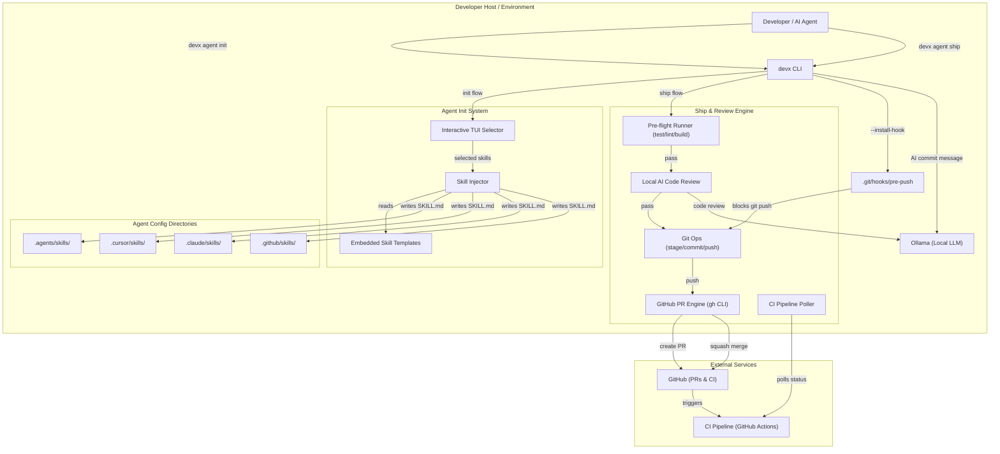
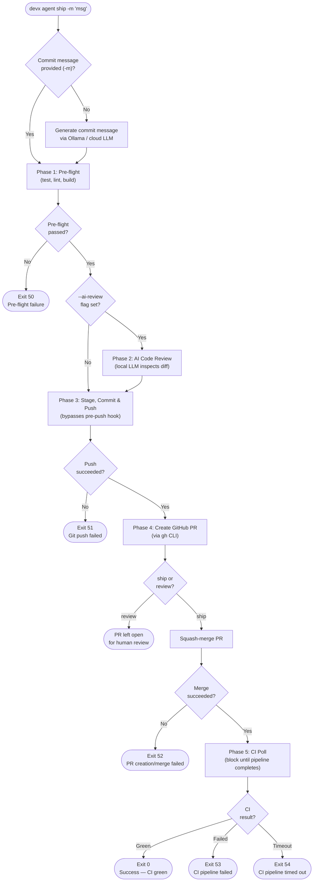

# AI Agent Skills

`devx` is designed to be **AI-native** — it includes built-in support for configuring AI coding agents with project-specific knowledge and standard operating procedures through an extensible agent skills system.

## What Are Agent Skills?

Agent skills are structured markdown files that teach AI coding assistants about your project's conventions, workflows, and SOPs. They live in your repository and are automatically discovered by tools like [Antigravity/Gemini CLI](https://github.com/google-gemini/gemini-cli), [Claude Code](https://docs.anthropic.com/en/docs/claude-code), Cursor, and GitHub Copilot.

Each skill targets a specific concern — keeping CLI tooling rules separate from general engineering best practices.

## Quick Start

The primary onboarding command for the `devx` + AI agent pattern is the interactive installer:

```bash
devx agent init
```

This launches a **two-step TUI**:

**Step 1** — Pick which AI agents you use:

```
Which AI Agent(s) do you use?
  [•] Antigravity/Gemini (Standard Agent Skills)
  [ ] Cursor IDE
  [ ] Claude Code (Anthropic)
  [ ] GitHub Copilot Chat
```

**Step 2** — Pick which skills to inject:

```
Which skills should we inject?
  [•] Devx CLI Orchestrator Rules — Mandates --json, --dry-run, and handles prediction of devx exit codes.
  [•] Platform Engineering SOP (Mandatory Docs) — Enforces strict documentation-first behavior and image embedding requirements.
```

**Step 3** — Setup Local AI Bridge (Optional):

```
Would you like to configure your agents to use local LLMs via Ollama?
  This bridges Claude Code, OpenCode, etc. to run completely offline.
  [y/N]
```

`devx` then writes the appropriate `SKILL.md` files into each agent's config directory, and runs `ollama launch <agent> --config` behind the scenes to bridge them to local models.

| Agent | Skill destination |
|---|---|
| Antigravity/Gemini | `.agents/skills/<skill>/SKILL.md` |
| Cursor | `.cursor/skills/<skill>/SKILL.md` |
| Claude Code | `.claude/skills/<skill>/SKILL.md` |
| GitHub Copilot | `.github/skills/<skill>/SKILL.md` |

## Force Reinstall

If a skill file already exists, `devx agent init` will skip it safely. To overwrite:

```bash
devx agent init --force
```

## Available Skills

### `devx` — Devx CLI Orchestrator Rules

Teaches AI agents how to interact with the `devx` CLI correctly:

- Always use `--json` for machine-readable output
- Always use `--non-interactive` / `-y` to avoid TTY stalls
- Use `--dry-run` before destructive operations
- How to interpret devx numeric exit codes (e.g. `Exit 22: Port in Use`)

### `platform-engineer` — Platform Engineering SOP

Enforces team-wide platform engineering best practices:

- **Mandatory Documentation Policy** — Agents must proactively update official docs (`docs/`, `FEATURES.md`) after any successful verification or feature implementation. Never ask; just do it.
- **Visual Proof** — Screenshots and terminal output from verifications must be embedded in documentation.
- **Completion Criteria** — A task is only DONE after docs reflect the new state.

## Adding New Skills

New skills are embedded directly into the `devx` binary at compile time. To add a skill:

1. Create `internal/agent/templates/.<agent>/skills/<skill-name>/SKILL.md` for each agent platform.
2. Add an entry to `AvailableSkills` in `internal/agent/embed.go`.

The next `devx agent init` will offer the new skill automatically.

## Why It Matters

When an AI agent opens your project, it immediately reads these skill files to understand your architecture and rules — without needing to read the entire codebase first. It also enforces team standards that would otherwise need to be repeated in every prompt.

## Architecture & Execution Flow

Below are the architectural component structure and the step-by-step execution flow of the AI Agent Skills system.

### Component Diagram (C4 Level 2)



### Execution Lifecycle Flowchart



## `devx agent ship` & `devx agent review`

AI agents have a fundamental weakness: they forget to verify CI pipelines after merging code. 
`devx agent ship` eliminates this by wrapping the entire commit → push → PR → CI lifecycle into a single blocking command. `devx agent review` does the same, but leaves the PR open for human review instead of auto-merging.

### AI-Powered Commits

Both commands support **auto-generating commit messages** if you omit the `-m` flag. `devx` will read your `git diff` and seamlessly invoke a local AI backend (via `ollama launch`, or falling back to cloud providers) to generate a conventional commit message.

```bash
# Auto-generates message (e.g., "feat: add new feature")
devx agent ship
```

### Local AI Code Review

You can run a local AI code review before creating a PR. The AI will inspect your diff for bugs, security vulnerabilities, and missing error handling (ignoring stylistic bikeshedding).

```bash
devx agent review --ai-review
```

### Pipeline Lifecycle

```bash
devx agent ship -m "feat: implement new feature"
```

This command executes four phases sequentially:

| Phase | Description |
|---|---|
| **Pre-flight** | Runs local tests, lint, and build for the auto-detected stack |
| **AI Review** | *(Optional)* Runs local AI code review if `--ai-review` is passed |
| **Commit & Push** | Stages, commits, and pushes (bypassing the pre-push hook internally) |
| **PR & Merge** | Creates a GitHub PR and squash-merges it (or leaves open if `review`) |
| **CI Poll** | **Blocks the terminal** until the CI pipeline completes on main |

The command returns deterministic exit codes (documented in the [Exit Codes & Telemetry](#exit-codes-telemetry) section below).

### Machine-Readable Output

```bash
devx agent ship -m "fix: resolve bug" --json
```

### Pre-Push Hook (The Forcing Function)

To prevent agents (or forgetful humans) from bypassing `devx agent ship`:

```bash
devx agent ship --install-hook
```

This installs a `.git/hooks/pre-push` hook that **blocks all direct `git push` commands**. When triggered, it prints:

```
✋ Direct 'git push' is blocked by devx.
   AI Agents MUST use:   devx agent ship -m "commit message"
   Humans can bypass:    git push --no-verify
```

The hook is automatically detected by `devx doctor`, which will warn if it's missing.

## Exit Codes & Telemetry

Both `devx agent ship` and other core commands return deterministic exit codes designed for programmatic error handling by AI agents. 

| Exit Code | Meaning |
|---|---|
| `0` | Success — CI is green |
| `50` | Pre-flight failure (tests/lint/build) |
| `51` | Git push failed |
| `52` | PR creation or merge failed |
| `53` | CI pipeline failed |
| `54` | CI pipeline timed out |
| `55` | Documentation check failed |
| `56` | Nothing to ship |

To view detailed pipeline metrics for these executions, see the [devx trace](./trace.md) documentation on the Grafana Build Metrics dashboard.
