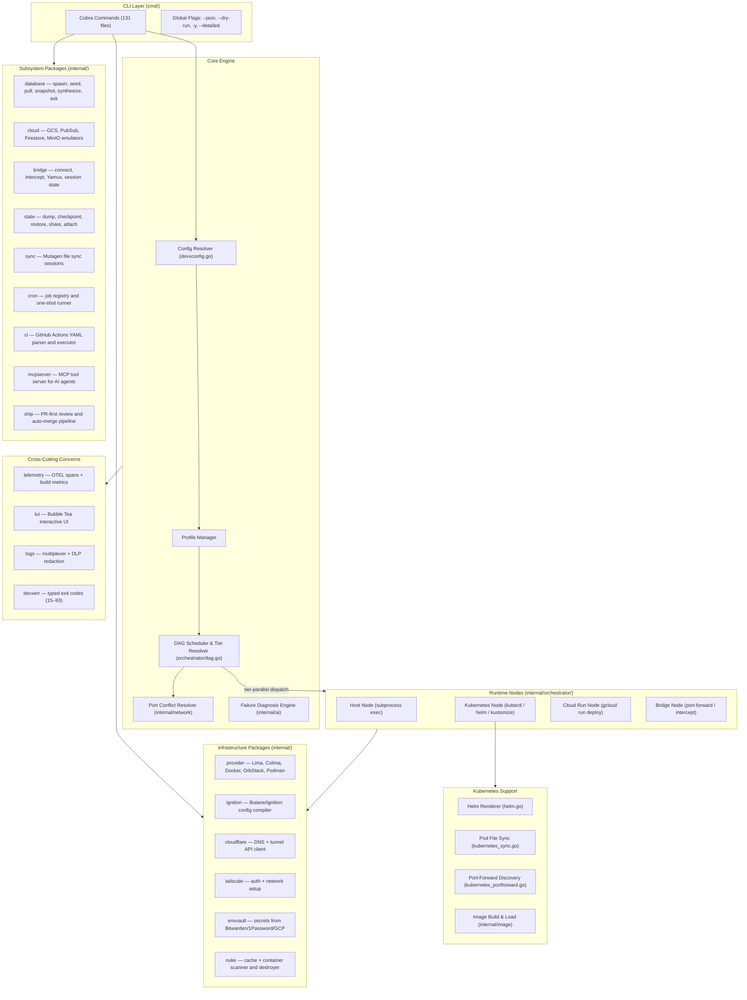
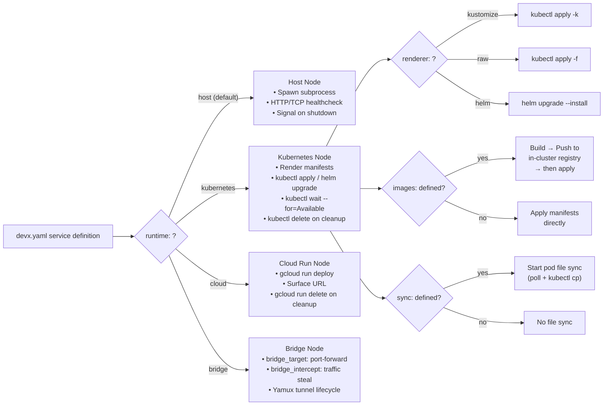
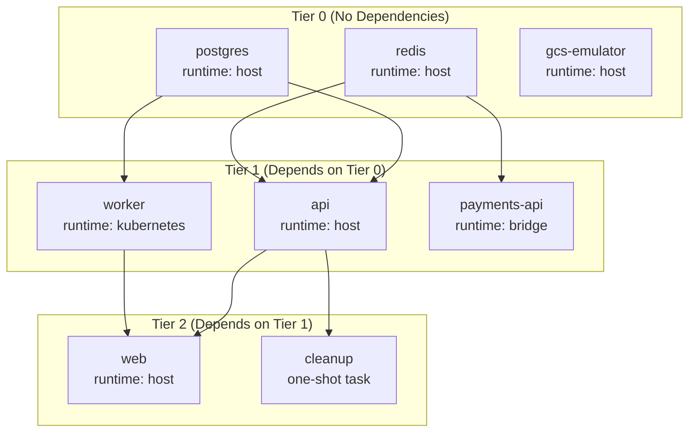
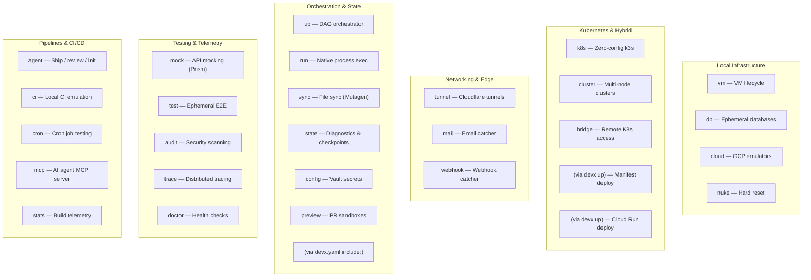

# Architecture

This page is the canonical reference for how `devx` is structured — from the external systems it connects to, down to the internal package layout. Each feature area has its own dedicated guide with detailed C4 diagrams and flowcharts; this page ties them all together.

## System Context (C4 Level 1)

`devx` sits at the center of the developer's workflow, orchestrating interactions with a wide range of external systems:

```mermaid
graph TD
    dev["👤 Developer / AI Agent"]

    subgraph devx ["devx CLI"]
        core["Orchestration Engine"]
    end

    subgraph runtimes ["Container & Compute Runtimes"]
        podman["Podman / Docker / Lima / OrbStack"]
        k8s["Kubernetes Clusters (k3s / GKE / EKS)"]
        cloudrun["Google Cloud Run"]
    end

    subgraph networking ["Networking & Edge"]
        cf["Cloudflare (Tunnels + DNS API)"]
        ts["Tailscale (WireGuard Mesh)"]
    end

    subgraph secrets ["Secrets & Config"]
        bw["Bitwarden"]
        op["1Password"]
        gcpsm["GCP Secret Manager"]
    end

    subgraph ai ["AI / LLM Providers"]
        ollama["Ollama (Local)"]
        lmstudio["LM Studio (Local)"]
        openai["OpenAI API (Cloud)"]
    end

    subgraph scm ["Source Control & CI"]
        gh["GitHub (PRs, Actions, Pages)"]
    end

    subgraph observability ["Observability"]
        jaeger["Jaeger"]
        grafana["Grafana LGTM"]
    end

    dev -->|"devx up / run / shell"| core
    core -->|"create, exec, checkpoint"| podman
    core -->|"kubectl apply, helm, port-forward"| k8s
    core -->|"gcloud run deploy"| cloudrun
    core -->|"tunnel expose, DNS CNAME"| cf
    core -->|"join tailnet"| ts
    core -->|"pull / push secrets"| bw
    core -->|"pull / push secrets"| op
    core -->|"pull / push secrets"| gcpsm
    core -->|"diagnose, synthesize, db ask"| ollama
    core -->|"diagnose, synthesize, db ask"| lmstudio
    core -->|"diagnose, synthesize, db ask"| openai
    core -->|"PR, CI, Pages deploy"| gh
    core -->|"spawn trace backend"| jaeger
    core -->|"spawn trace backend"| grafana
```

## Internal Architecture (C4 Level 2)

Inside the CLI, the architecture follows a layered design: **Config Resolution → DAG Orchestration → Runtime Nodes → Subsystem Packages**.

## Runtime Dispatch

The central design pattern of `devx up` is **runtime dispatch**: each service declares a `runtime:` field that determines how it's started, health-checked, and cleaned up.

## DAG Execution Model

When `devx up` runs, services are resolved into **parallel execution tiers** based on `depends_on` declarations. Services within the same tier start concurrently; a service only begins once all of its dependencies report healthy.

The DAG engine handles:
- **Port collision resolution** — auto-shifts ports when conflicts are detected
- **Crash diagnostics** — on failure, pulls container logs and runs pattern-based diagnosis
- **Graceful shutdown** — stops services in reverse tier order on `Ctrl+C`
- **One-shot tasks** — services that run to completion and exit rather than staying alive

## CLI Command Groups

## Internal Package Map

The `internal/` directory contains **46 packages** organized by concern:

| Layer | Packages | Purpose |
|---|---|---|
| **Orchestration** | `orchestrator`, `config` | DAG engine, config resolution, runtime node dispatch |
| **Runtime Nodes** | `orchestrator/dag.go`, `kubernetes_node.go`, `cloudrun_node.go`, `bridge_node.go`, `helm.go`, `kubernetes_sync.go`, `kubernetes_portforward.go` | Per-runtime lifecycle (start, healthcheck, cleanup) |
| **Databases** | `database` | Engine lifecycle: spawn, seed, pull, snapshot, synthesize (AI), ask (AI) |
| **Images** | `image` | Build, push, and load container images into k8s clusters via in-cluster registry |
| **Networking** | `cloudflare`, `tailscale`, `network`, `exposure`, `trafficproxy`, `authproxy` | Tunnel management, DNS, overlay networks, port allocation |
| **Bridge** | `bridge`, `bridge/agent` | Outbound connect, inbound intercept, Yamux tunnels, self-healing agent pod |
| **State** | `state`, `sync` | CRIU checkpoints, diagnostic dumps, peer-to-peer replication, Mutagen sync |
| **Secrets** | `secrets`, `envvault` | Vault provider abstraction (Bitwarden, 1Password, GCP SM), `.env` management |
| **AI** | `ai` | Two-tier failure diagnosis, LLM provider resolution (Ollama → LM Studio → OpenAI) |
| **Infrastructure** | `provider`, `ignition`, `podman`, `k8s`, `multinode`, `cloud` | VM provisioning, Butane/Ignition, container runtime abstraction, cluster management |
| **CI/CD** | `ci`, `ship`, `agent`, `preview`, `scaffold` | GitHub Actions parser, PR workflow, preview sandboxes, project scaffolding |
| **Observability** | `telemetry`, `logs`, `inspector` | OTEL spans, log multiplexing, DLP redaction, traffic inspection |
| **Testing** | `mock`, `testing`, `audit`, `cron` | Prism mock servers, ephemeral test DBs, Gitleaks/Trivy scanning, cron runner |
| **MCP** | `mcpserver`, `mcpinstall` | Model Context Protocol server exposing devx as AI agent tools |
| **UI** | `tui` | Bubble Tea interactive components (tables, spinners, prompts) |
| **Error Handling** | `devxerr` | Typed exit codes (15–93) for deterministic error signaling |
| **Maintenance** | `updater`, `nuke`, `doctor`, `prereqs`, `devcontainer` | Self-update, hard reset, health probes, prerequisite checking |

## Feature Guide Cross-Reference

Every feature area has its own dedicated guide with architectural diagrams:

| Area | Guides |
|---|---|
| **Infrastructure** | [Container VMs](virtual-machine.md) · [Providers](providers.md) · [Databases](databases.md) · [Cloud Emulators](cloud-emulators.md) · [Nuke](nuke.md) |
| **Kubernetes** | [Zero-Config k3s](kubernetes.md) · [Kubernetes Deploy](kubernetes-deploy.md) · [Multi-Node Clusters](multinode.md) · [Cloud Run](cloud-run.md) |
| **Networking** | [Hybrid Bridge](bridge.md) · [Cloudflare Tunnels](tunnels.md) · [Email Catcher](mail.md) · [Webhook Catcher](webhook.md) |
| **Orchestration** | [Service Orchestration](orchestration.md) · [Multirepo](multirepo.md) · [Vault Secrets](vaults.md) · [File Sync](sync.md) · [Native Apps & Logs](execution.md) |
| **State** | [Diagnostics & Checkpoints](state.md) · [State Replication](state-replication.md) · [PR Preview](preview.md) · [Failure Recovery](failure-recovery.md) |
| **Testing** | [API Mocking](mocking.md) · [Ephemeral E2E](testing.md) · [Security Auditing](audit.md) · [Distributed Tracing](trace.md) · [Doctor](doctor.md) |
| **Pipelines** | [Pipeline Stages](pipeline.md) · [Local CI](ci.md) · [Cron Jobs](cron.md) · [Predictive Building](caching.md) · [MCP Server](mcp.md) · [AI Agents](ai-agents.md) |

## Design Principles

1. **Declarative-first**: Everything is configured in `devx.yaml` — no imperative scripts needed.
2. **Client-driven**: No permanent server-side agents or controllers. All operations are initiated from the developer's machine.
3. **Runtime-agnostic**: The DAG orchestrator dispatches to pluggable runtime nodes. Adding a new runtime means implementing one interface.
4. **AI-native**: Every command supports `--json` for agent consumption. The MCP server exposes devx as a tool surface. Failure diagnosis is automatic.
5. **Progressive disclosure**: `devx up` is the only command most developers need. Power features (`bridge intercept`, `state share`, `ci run`) are there when you need them.
