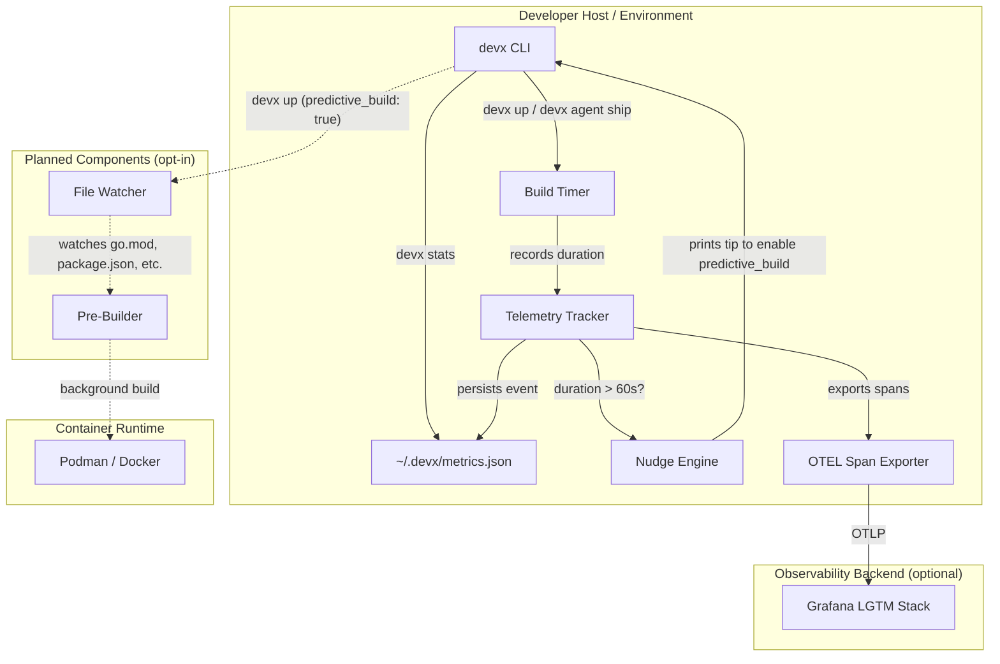
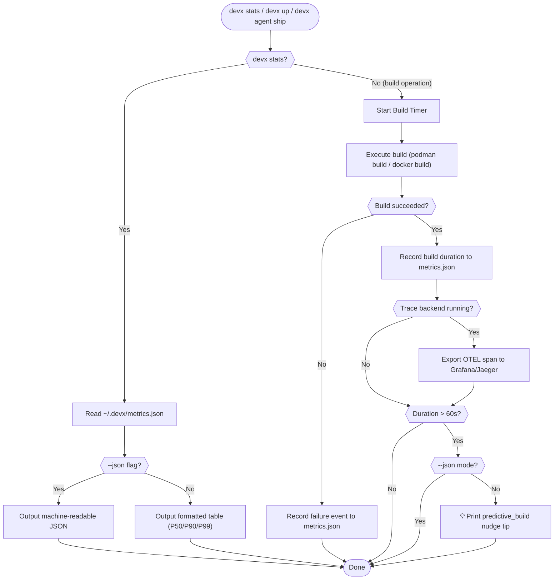

# Predictive Background Pre-Building

## Overview

As your project grows, container rebuild times can silently erode your inner development loop. What starts as a 2-second build can become a 60-second wait every time you restart a service — breaking your flow state.

`devx` addresses this with two features designed under the **Future-Proofing for Growth** design principle:

1. **Local Telemetry** — `devx` silently records build durations. When they cross the 60-second threshold, it proactively nudges you toward the solution.
2. **Predictive Pre-Building** *(opt-in)* — A background file-watcher that pre-builds container images when dependency manifests change, so your next restart is instant.

## Architecture & Execution Flow

Below are the architectural component structure and the step-by-step execution flow of Predictive Background Pre-Building.

### Component Diagram (C4 Level 2)



### Execution Lifecycle Flowchart



## Local Metrics

`devx` records timing data for key operations (builds, startup) in `~/.devx/metrics.json`. This data never leaves your machine.

### Viewing Your Metrics

```bash
devx stats
```

```
📊 devx local metrics (last 30 days)

  Event               Count   P50       P90       P99
  ─────────────────── ─────── ───────── ───────── ─────────
  agent_ship_build    47      8.2s      42.1s     1m12s
  up_startup          23      3.1s      5.8s      12.4s
```

### Machine-Readable Output

```bash
devx stats --json
```

### Clearing Metrics

```bash
devx stats --clear
```

## The Build Nudge

When a build exceeds 60 seconds, `devx` prints a helpful tip:

```
💡 Tip: Your build took 1m12s. Enable 'predictive_build: true' on container
   services in devx.yaml to have devx silently pre-build heavy dependency
   layers in the background. See: https://devx.vitruviansoftware.dev/guide/caching
```

This nudge is suppressed in `--json` mode to avoid breaking AI agent workflows.

## Predictive Pre-Building (Coming Soon)

::: warning PLANNED FEATURE
Predictive background pre-building is currently in the design phase. The telemetry foundation is live — once we collect enough data on real-world build times, the background watcher will be implemented.
:::

When available, you'll enable it per-service in `devx.yaml`:

```yaml
services:
  - name: api
    runtime: container
    build:
      dockerfile: ./Dockerfile
      context: .
    predictive_build: true  # Enable background pre-building
    command: ["api-server"]
    port: 8080
```

### How It Works

1. During `devx up`, services with `predictive_build: true` spawn a background file-watcher.
2. The watcher monitors dependency manifests (`go.mod`, `package.json`, `Cargo.toml`, `requirements.txt`).
3. When a change is detected (with a 500ms debounce), it silently triggers your runtime's build command (`podman build`, `docker build`, etc.) in the background.
4. The next time you restart the container, all heavy dependency layers are already cached.

### When to Enable It

- ✅ Your container builds take **over 60 seconds**
- ✅ You frequently edit dependency files (`go.mod`, `package.json`)
- ❌ Your builds take under 5 seconds (no benefit, wastes CPU)
- ❌ You're on battery power and want to conserve resources

## Grafana Observability Integration

When a local [distributed tracing backend](/guide/trace) is running, `devx` automatically exports build telemetry as OpenTelemetry spans. This means you can visualize your build performance in Grafana with zero configuration:

```bash
# Spawn the Grafana LGTM stack (auto-provisions the devx dashboard)
devx trace spawn grafana

# Ship code — telemetry is exported automatically
devx agent ship -m "feat: my feature"
```

Open `http://localhost:3000` and navigate to the **devx Build Metrics** dashboard to see:

- **Build duration over time** — spot regressions instantly
- **P50/P90/P99 latency** — understand your build performance profile
- **Test/Lint/Build pass rates** — track your CI health locally
- **Recent builds table** — full history with stack, branch, and outcomes

Each span carries rich attributes (`devx.stack`, `devx.branch`, `devx.test.pass`, `devx.lint.pass`, `devx.build.pass`) that you can query directly in Tempo.
