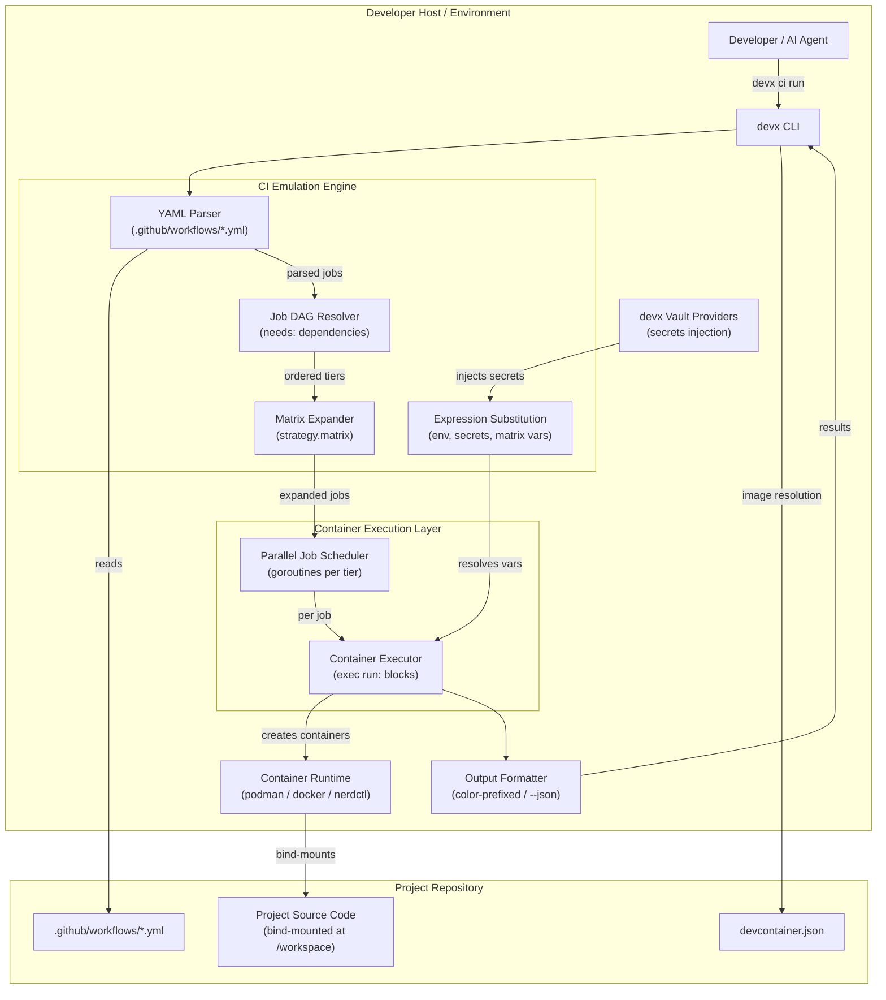
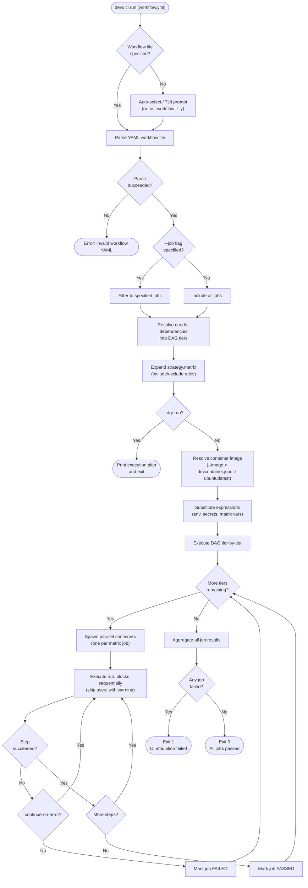
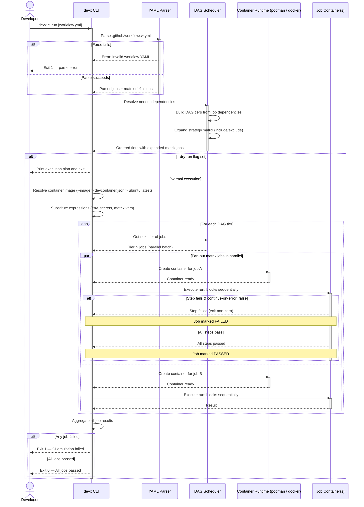

# Local CI Pipeline Emulation

The `devx ci run` command parses your GitHub Actions workflow files and executes them locally inside isolated Podman/Docker containers.

Instead of the painful "fix ci → push → wait 3 minutes → fail → repeat" loop, you can debug your entire CI pipeline locally in seconds.

## Quick Start

```bash
# Run the default workflow interactively
devx ci run

# Run a specific workflow
devx ci run ci.yml

# Run only the test job
devx ci run ci.yml --job test

# Preview the execution plan without running
devx ci run ci.yml --dry-run

# JSON output for AI agent consumption
devx ci run ci.yml --json
```

## Architecture & Execution Flow

Below are the architectural component structure and the step-by-step execution flow of `devx ci run`.

### Component Diagram (C4 Level 2)



### Execution Lifecycle Flowchart



### Job Execution Sequence



## How It Works

1. **Parses** your `.github/workflows/*.yml` files natively — no third-party runners required.
2. **Resolves** `needs:` job dependencies into a DAG, executing independent jobs in parallel (just like GitHub).
3. **Expands** `strategy.matrix` into concrete jobs (e.g., a 2×2 matrix produces 4 parallel containers).
4. **Creates** an isolated container per job, bind-mounting your project at `/workspace`.
5. **Executes** each `run:` block sequentially inside that container via your provider's `exec` (e.g. `docker exec`, `nerdctl exec`, `podman exec`).
6. **Substitutes** <code v-pre>${{ env.VAR }}</code>, <code v-pre>${{ secrets.VAR }}</code>, and <code v-pre>${{ matrix.VAR }}</code> expressions.

## What `devx ci run` Does NOT Do

::: warning INTENTIONAL LIMITATION
**`uses:` actions are NOT executed.** Third-party composite and JavaScript actions like `actions/setup-go`, `actions/upload-artifact`, or `golangci/golangci-lint-action` are **skipped with a visible warning**.

This is a deliberate design decision. Emulating `uses:` faithfully is why `nektos/act` is 50,000+ lines of code and still struggles with environment parity. We trade completeness for reliability — the 80% of CI logic that lives in `run:` blocks is what developers actually need to debug locally.
:::

**Workaround:** If a `uses:` action is critical for your local debugging, add the equivalent shell commands directly to a `run:` block in your workflow. For example, instead of relying on `actions/setup-go`, ensure Go is installed in your container image.

## Supported Features

| Feature | Status |
|---------|--------|
| `run:` shell blocks | ✅ Full support |
| `strategy.matrix` expansion | ✅ Including `include`/`exclude` |
| `needs:` job dependencies (DAG) | ✅ Parallel tiers |
| `env:` at workflow/job/step | ✅ Full merge chain |
| `if:` conditionals | ✅ Simple equality/inequality; complex expressions fail-open |
| <code v-pre>${{ secrets.X }}</code> | ✅ Injected from devx Vault providers |
| <code v-pre>${{ matrix.X }}</code> | ✅ From expanded matrix |
| <code v-pre>${{ env.X }}</code> | ✅ From merged environment |
| <code v-pre>${{ github.* }}</code> | ⚠️ Stubbed (e.g., `event_name` → `"push"`) |
| <code v-pre>${{ runner.* }}</code> | ⚠️ Stubbed (e.g., `os` → `"Linux"`) |
| `working-directory:` | ✅ Per-step |
| `shell:` | ✅ bash/sh |
| `continue-on-error:` | ✅ Step-level |
| `timeout-minutes:` | ✅ Step-level |
| `uses:` actions | ❌ Skipped with warning |
| <code v-pre>${{ steps.id.outputs.X }}</code> | ❌ Not supported |
| `services:` containers | 🔜 Planned |

## Flags

```
--job          Run only specific job(s) by name (comma-separated)
--image        Override the container image (default: auto-detect from devcontainer.json)
--runtime      Container runtime: podman, docker, or nerdctl (default: auto-detected)
--json         Structured JSON output
--dry-run      Show execution plan without creating containers
-y             Non-interactive mode (auto-select first workflow)
```

## Container Image Resolution

`devx ci run` resolves the container image in this order:

1. **`--image` flag** — if provided, always used.
2. **`devcontainer.json`** — if found in the project, uses the declared `image`.
3. **`ubuntu:latest`** — fallback with a warning that tools may be missing.

## Parallel Output

When matrix jobs run in parallel, output uses Docker Compose-style prefixed streaming:

```
build·dar·amd             │ go build -ldflags="-s -w" -o devx .
build·dar·arm             │ go build -ldflags="-s -w" -o devx .
build·lin·amd             │ go build -ldflags="-s -w" -o devx .
build·lin·arm             │ go build -ldflags="-s -w" -o devx .
```

Each job gets a unique color-coded prefix. Lines are guaranteed not to interleave mid-line.

## Comparison vs `nektos/act`

| | `devx ci run` | `nektos/act` |
|---|---|---|
| `run:` blocks | ✅ | ✅ |
| `uses:` actions | ❌ Skipped | ⚠️ Partial (many break) |
| Matrix parallelism | ✅ Real goroutines | ❌ Sequential |
| Image | Auto-detect or custom | Requires massive 20GB runner image |
| Secret injection | Native devx Vault | Manual `.secrets` file |
| Setup complexity | Zero (uses existing Podman) | Requires Docker + large images |
| Codebase size | ~800 lines | 50,000+ lines |
