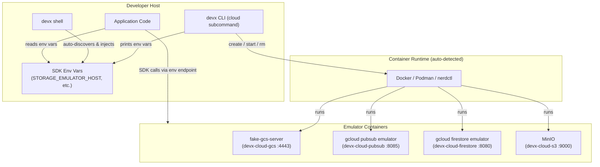
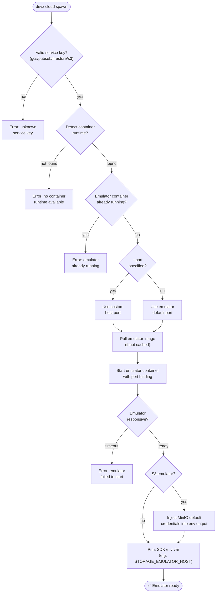

# Cloud Emulators (GCS, S3 & more)

`devx cloud` spins up local cloud service emulators inside the devx VM so your application can use real cloud SDKs (Google Cloud, AWS) without touching actual cloud infrastructure during development.

## Why Emulators?

- **No credentials needed** — no GCP project, no service account JSON
- **Zero cloud costs** — everything runs on your local machine
- **Safe by default** — data only lives in memory; no accidental production writes
- **SDK compatible** — GCP client libraries automatically pick up the emulator endpoint via standard env vars

## Spawn an Emulator

```bash
devx cloud spawn gcs       # Google Cloud Storage (fake-gcs-server)
devx cloud spawn pubsub    # Google Cloud Pub/Sub
devx cloud spawn firestore # Google Cloud Firestore
devx cloud spawn s3        # Amazon S3 (MinIO)
```

On success, `devx cloud spawn` prints the environment variable your application needs:

```
✅ Google Cloud Storage emulator is running!

  Container: devx-cloud-gcs
  Port:      4443

  Add to your .env:

    STORAGE_EMULATOR_HOST=http://localhost:4443

  Or use 'devx shell' to have these injected automatically.
```

::: tip Auto-injection via `devx shell`
When you use `devx shell` to launch your dev container, it automatically discovers all running
`devx cloud` emulators and injects their endpoint env vars. No manual `.env` changes needed.
:::

## Flags

| Flag | Default | Description |
|------|---------|-------------|
| `--port` | emulator default | Host port to bind |
| `--runtime` | `auto-detected` | Container runtime (`podman`, `docker`, `nerdctl`) |

## Architecture & Execution Flow

Below are the architectural component structure and the step-by-step execution flow of Cloud Emulators.

### Component Diagram (C4 Level 2)



### Execution Lifecycle Flowchart



## List Running Emulators

```bash
devx cloud list
```

Shows all running emulators and the env var keys they expose:

```
devx — Cloud Emulators

  Google Cloud Storage  devx-cloud-gcs  Up 5 minutes  0.0.0.0:4443->4443/tcp
    env:  STORAGE_EMULATOR_HOST  http://localhost:4443
```

## Remove an Emulator

```bash
devx cloud rm gcs
```

Stops and removes the container. Since emulators run with in-memory backends, no persistent data is left behind.

## Supported Services

| Key | Name | Port | SDK Env Var(s) |
|-----|------|------|----------------|
| `gcs` | Google Cloud Storage | 4443 | `STORAGE_EMULATOR_HOST` |
| `pubsub` | Google Cloud Pub/Sub | 8085 | `PUBSUB_EMULATOR_HOST` |
| `firestore` | Google Cloud Firestore | 8080 | `FIRESTORE_EMULATOR_HOST` |
| `s3` | Amazon S3 (MinIO) | 9000 | `AWS_ENDPOINT_URL_S3`, `AWS_ENDPOINT_URL`, `AWS_ACCESS_KEY_ID`, `AWS_SECRET_ACCESS_KEY`, `AWS_REGION` |

The S3 emulator pre-seeds MinIO's default credentials (`minioadmin` / `minioadmin`) into the injected env vars so the AWS SDKs work out of the box — these credentials only grant access to your local container.

## Connecting from Your Code

### Go (GCS)

```go
// The GCP client library automatically reads STORAGE_EMULATOR_HOST
client, err := storage.NewClient(ctx)
```

### Node.js (GCS via @google-cloud/storage)

```js
// No code changes needed — just set STORAGE_EMULATOR_HOST in your env
const { Storage } = require('@google-cloud/storage');
const storage = new Storage();
```

### Python (GCS via google-cloud-storage)

```python
# No code changes needed when STORAGE_EMULATOR_HOST is set
from google.cloud import storage
client = storage.Client()
```

### Go (S3 via aws-sdk-go-v2)

```go
// AWS SDK v2 reads AWS_ENDPOINT_URL_S3 automatically from the environment.
cfg, _ := config.LoadDefaultConfig(ctx)
client := s3.NewFromConfig(cfg, func(o *s3.Options) { o.UsePathStyle = true })
```

### Python (S3 via boto3 1.34+)

```python
# boto3 1.34+ reads AWS_ENDPOINT_URL_S3 automatically. For older versions,
# pass endpoint_url=os.environ["AWS_ENDPOINT_URL_S3"] explicitly.
import boto3
s3 = boto3.client("s3")
```

### Node.js (S3 via @aws-sdk/client-s3 v3)

```js
// AWS SDK v3 reads AWS_ENDPOINT_URL_S3 automatically.
import { S3Client } from "@aws-sdk/client-s3";
const s3 = new S3Client({ forcePathStyle: true });
```
