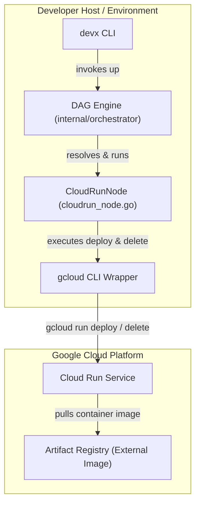
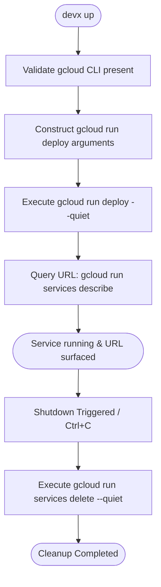

# Cloud Run Deploy

Deploy a service to **Google Cloud Run** as part of `devx up` with `runtime: cloud`. devx shells out to `gcloud run deploy` (no GCP SDK — consistent with how it drives kubectl/helm), records the deployed service so it can tear it down on shutdown, and surfaces the public URL. This is the deploy path behind ephemeral, per-PR preview environments.

## Prerequisites

- The `gcloud` CLI on your PATH, authenticated (`gcloud auth login`, or a service account).
- A GCP **project** and **region**, and a container **image** in a registry Cloud Run can pull (e.g. Artifact Registry).

## Configuration in `devx.yaml`

```yaml
services:
  - name: brms-offer
    runtime: cloud
    cloud_run:
      image: us-docker.pkg.dev/my-proj/brms/offer:pr-42   # required
      region: us-central1                                  # required
      project: my-dev-project                              # required (no implicit default)
      service: brms-offer-pr-42        # optional (default: the service name)
      allow_unauthenticated: false     # optional (default: private)
      env:                             # optional env vars
        RULES_MANIFEST: gs://my-bucket/manifest.json
      flags: ["--memory", "512Mi", "--cpu", "1"]   # optional: extra `gcloud run deploy` flags
```

## Architecture & Execution Flow

Below are the architectural component structure and the step-by-step execution flow of `runtime: cloud`.

### Component Diagram (C4 Level 2)



### Execution Lifecycle Flowchart



## What happens

On `devx up`, for a `runtime: cloud` service devx:

1. Validates the `gcloud` CLI is present.
2. Runs `gcloud run deploy <service> --image … --region … --project … --platform managed [--set-env-vars …] [--(no-)allow-unauthenticated] [flags] --quiet`.
3. Surfaces the URL via `gcloud run services describe … --format='value(status.url)'`.
4. Records the deploy so `gcloud run services delete … --quiet` runs on shutdown.

::: warning `project` is required
There is no implicit default project — `project` must be set explicitly, so a deploy can never accidentally target the wrong account.
:::

## Limitations

- The image must already exist in a registry Cloud Run can pull — devx does not build + push to a cloud registry for this path (yet).
- Traffic splitting, revisions, secrets, and IAM beyond `allow_unauthenticated` are configured through the `flags` escape hatch.
