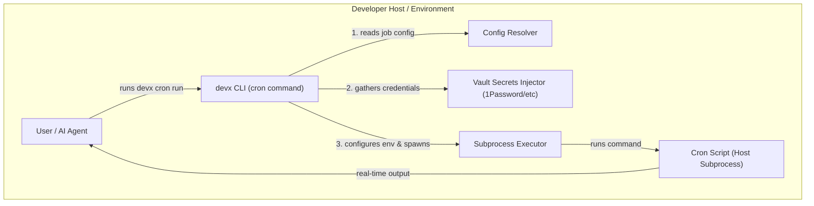
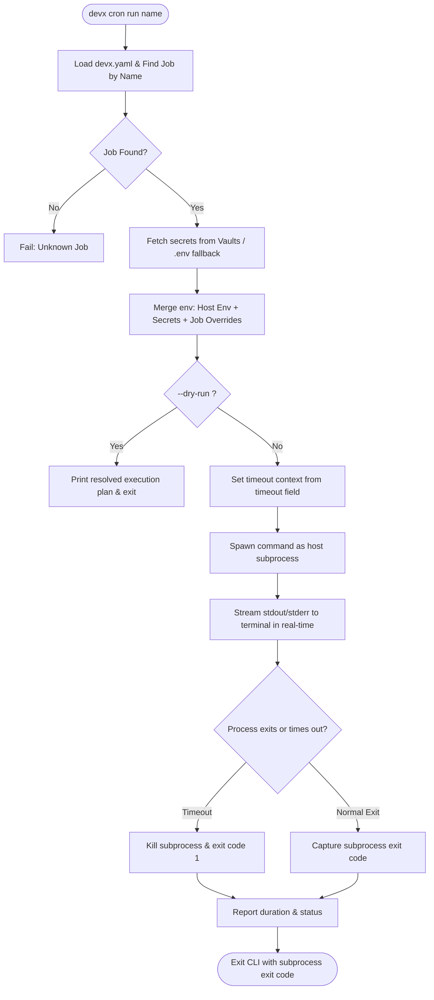

# Cron Job Testing (`devx cron`)

`devx cron` makes the local-test loop for your production cron jobs trivial. Instead of waiting hours for the schedule to fire — or cobbling together a one-off invocation with the right env vars and DB connection — declare each job in `devx.yaml` and run it on demand with `devx cron run <name>`.

## Why

Most apps have at least a few scheduled tasks: nightly cleanups, hourly snapshots, weekly reports, periodic webhook syncs. They share a frustrating property — you can't really test them locally because:

- The production cadence (e.g. `0 2 * * *`) is too slow for iteration.
- Manually invoking `node scripts/cleanup.js` requires knowing the right env vars, vault secrets, and working directory.
- A bug in the job code only surfaces after deploy, in the middle of the night, when nobody's watching.

`devx cron` solves all three: declare the job once, run it any time with the same env + secrets the rest of your devx environment uses.

## Declare jobs in `devx.yaml`

Add a top-level `cron:` block:

```yaml
cron:
  - name: nightly-cleanup
    schedule: "0 2 * * *"
    description: "Purge sessions older than 30 days"
    command: ["node", "scripts/cleanup.js"]
    timeout: "5m"
    env:
      DRY_RUN: "false"

  - name: hourly-snapshot
    schedule: "0 * * * *"
    command: ["pg_dump", "-Fc", "-f", "/backups/snap.dump", "myapp"]
```

| Field | Required | Notes |
|-------|----------|-------|
| `name` | ✓ | Unique identifier used with `devx cron run`. |
| `command` | ✓ | Argv to execute. Use the array form, not a single string — no shell parsing applies. |
| `schedule` | optional | Cron expression. **Informational only in this version** — `devx cron run` is one-shot. Use it to document the production cadence. |
| `description` | optional | Free-text purpose; surfaced in `devx cron list`. |
| `timeout` | optional | Go duration string (`5m`, `30s`, `1h30m`). Empty = no timeout. |
| `env` | optional | Per-job env vars, merged on top of project env. Job-level `env` wins over vault secrets with the same key. |

## Architecture & Execution Flow

Below are the architectural component structure and the step-by-step execution flow of `devx cron run`.

### Component Diagram (C4 Level 2)



### Execution Lifecycle Flowchart



## Commands

### List

```bash
devx cron list
```

```
🕐 2 cron job(s) in devx.yaml:

  NAME              SCHEDULE     COMMAND                                     DESCRIPTION
  nightly-cleanup   0 2 * * *    node scripts/cleanup.js                     Purge sessions older than 30 days
  hourly-snapshot   0 * * * *    pg_dump -Fc -f /backups/snap.dump myapp     —

  Run one with:  devx cron run <name>
```

Pass `--json` for structured output (agent / scripting consumption).

### Run

```bash
devx cron run nightly-cleanup
```

```
🕐 Running cron job: nightly-cleanup
   Schedule:   0 2 * * *  (informational; one-shot run)
   Purpose:    Purge sessions older than 30 days
   Command:    node scripts/cleanup.js
   Timeout:    5m
🔒 Injected 7 secrets from devx.yaml (op://, file://.env)

[stdout/stderr from your script streams here in real time]

✅ Completed in 4.2s (exit 0)
```

The job runs as a host subprocess with:
- Your existing host env (`os.Environ()`)
- Vault secrets pulled the same way `devx shell` injects them (1Password, Bitwarden, GCP Secret Manager, `.env` fallback)
- The job's per-job `env:` block layered on top (highest precedence)

Returns a non-zero exit code if the job fails, times out, or is unknown — chain it in pre-push hooks or CI with `&&` / `||`. The exact subprocess exit code is reported in the human / JSON output.

### Dry-run

```bash
devx cron run nightly-cleanup --dry-run
```

Prints the resolved plan (command, timeout, env keys) without executing. Useful for confirming you're about to run the right thing.

### JSON mode

Every command honors `--json`:

```bash
$ devx cron run nightly-cleanup --json
{"job":"nightly-cleanup","started_at":"2026-05-17T14:32:01.234Z","duration":4200000000,"duration_ms":4200,"exit_code":0}
```

## What `devx cron` is **not**

To keep the v1 scope honest:

- **Not a scheduler.** There is no long-running `devx cron daemon` that fires jobs on their cron expressions. Production scheduling is your existing cron / Kubernetes CronJob / cloud scheduler. `devx cron` is for local testing only.
- **Not k8s-CronJob aware.** Future versions may auto-discover from `manifests/**.yaml`, but for now you declare jobs in `devx.yaml`.
- **Not container-isolated.** Jobs run as host subprocesses (like `devx run`), not inside the project's service container. Container exec may come in a future version when there's a clear use case.

## Tips

- **Mirror production exactly.** Keep your `devx.yaml` `cron:` block in sync with the actual schedule in your production tooling (crontab, k8s manifests, Terraform). The schedule field has no functional effect locally, but it's the only documentation a new contributor will see.
- **Use `timeout:` for any job that could hang.** A vault fetch or DB query that hangs in production hangs your terminal locally too.
- **Test the schedule expression separately.** `devx cron` doesn't validate cron expressions — use a dedicated linter if your team cares (e.g., `crontab -l | check-cron`).
