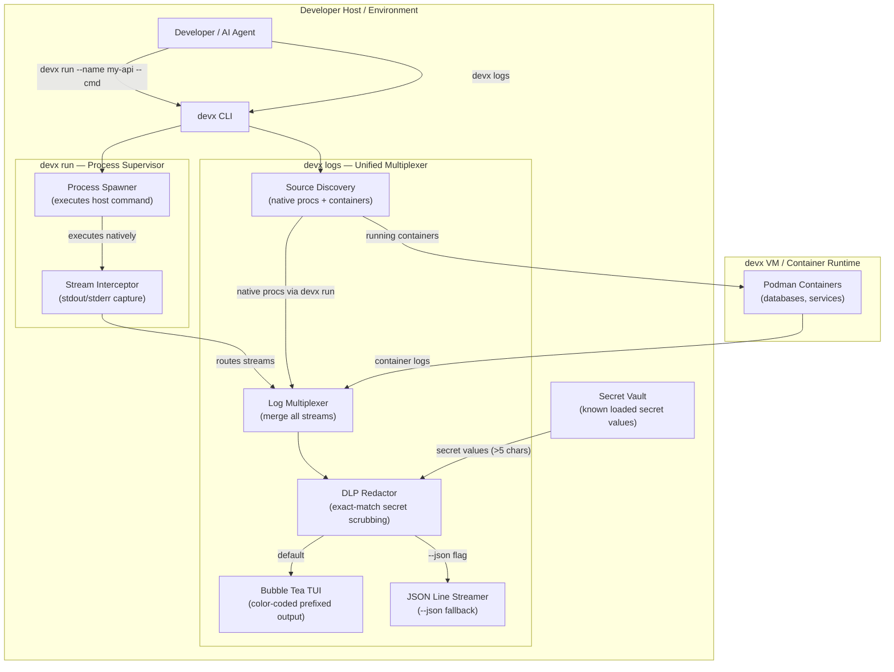
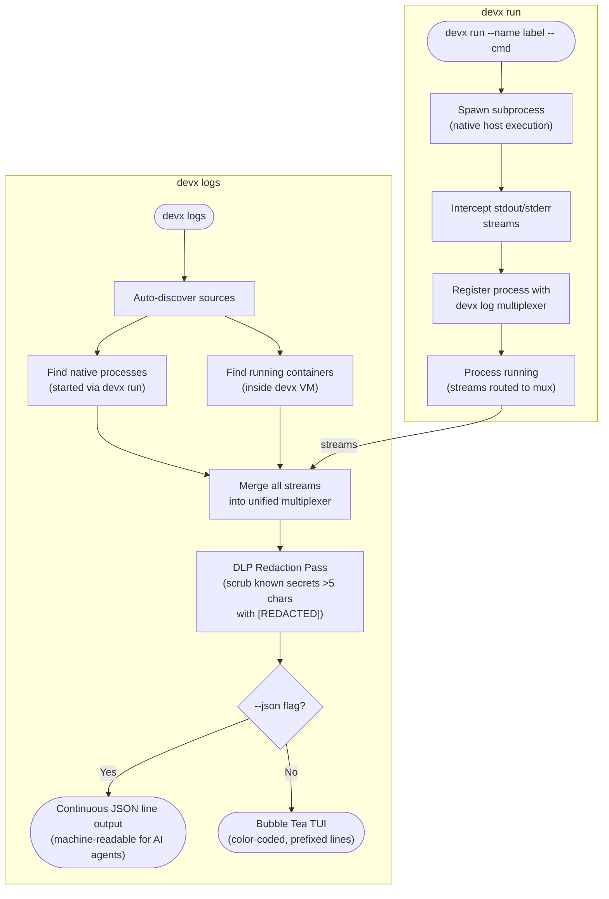

# Native Apps & Logs

The `devx` ecosystem provides a unified execution and logging layer that effortlessly bridges **containerized databases** and **native host processes** running locally on your Mac.

Rather than forcing every part of your application stack into a heavy Dockerfile from day one, `devx` introduces the **Process Bridge**.

## Architecture & Execution Flow

Below are the architectural component structure and the step-by-step execution flow of the Native Apps & Logs system.

### Component Diagram (C4 Level 2)



### Execution Lifecycle Flowchart



## Native Execution (`devx run`)

For APIs or frontends that you run natively on your machine (like `npm run dev` or `go run main.go`), you can prefix the command with `devx run`. 

`devx run` natively executes your command exactly as you typed it, but intercepts the `stdout`/`stderr` streams and routes them securely into the internal `devx` log multiplexer.

```bash
# Provide a readable label to the process
devx run --name my-api -- npm run dev

# Or simply let devx infer the name
devx run go run main.go
```

## Unified Multiplexer (`devx logs`)

Once you have Native and Containerized components running in the background, keeping track of them across 10 terminal tabs becomes chaotic.

`devx logs` completely solves this by acting as a single, centralized message broker.

```bash
devx logs
```

When started, it automatically discovers:
1. All native host processes started via `devx run`
2. All running Podman containers and databases spawning inside the `devx` VM

It combines their standard output into a beautifully color-coded **Bubble Tea Terminal UI**, prefixing each line dynamically so you can visually trace a single user request as it hits the Cloudflare Tunnel, routes to your native Node.js process on Mac, and queries the containerized Postgres database—all in one window.

### Native Secrets Redaction (DLP)

Screensharing logs during pair programming or recording demos historically risks leaking production API keys injected from your `.env` or remote Vault sources.

Because `devx` natively coordinates Secret Vault injection to components, it has unique global awareness of the exact values of all secrets injected into your workspace. The `devx logs` stream actively runs every stdout/stderr line through an exact-match substitution engine **before** it hits your Bubble Tea TUI viewport or JSON output. 

Any string matching a known loaded secret (greater than 5 characters to avoid false-positive corruption) is automatically scrubbed entirely and visually replaced with a `[REDACTED]` token.

### AI Agent Support

Because beautifully rendered Terminal UI components (ANSI characters, colors, and interactive viewports) break the context windows of AI Agents interacting with the CLI, `devx logs` implements a strict fallback mode via the global `--json` flag.

```bash
devx logs --json
```

This bypasses the TUI completely, instructing the internal streaming daemon to continuously tail and flush deterministic, machine-readable JSON lines for agents to consume directly.
