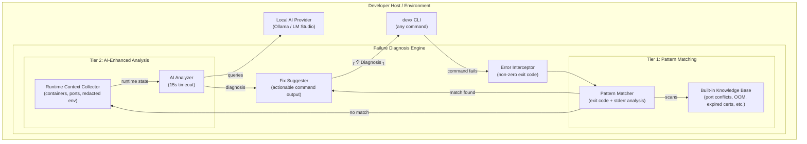
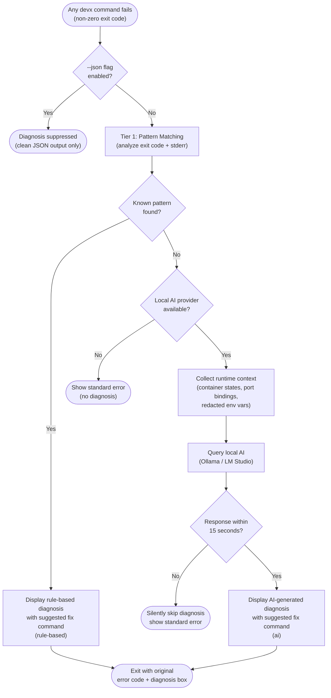

# Intelligent Failure Recovery

`devx` features an automatic, two-tier failure diagnosis engine hooked into every command. When a command fails with a non-zero exit code, `devx` intercepts the error and attempts to explain the root cause and provide an actionable fix before exiting.

## Architecture & Execution Flow

Below are the architectural component structure and the step-by-step execution flow of Intelligent Failure Recovery.

### Component Diagram (C4 Level 2)



### Execution Lifecycle Flowchart



## How it works

The diagnosis engine operates in two tiers:

### Tier 1: Pattern Matching (No AI)
`devx` maintains a built-in knowledge base of common failure modes (e.g., password mismatches, port conflicts, OOMKilled containers, expired certificates). It analyzes the exit code and `stderr` output against this knowledge base.

If a match is found, `devx` immediately prints a diagnosis and a suggested command to fix it. This tier works entirely locally, is instantaneous, and requires zero configuration.

```bash
$ devx db spawn postgres
Error: listen tcp :5432: bind: address already in use

╭───────────────────────────────────────────────────────────────────╮
│ 💡 Diagnosis                                                      │
│                                                                   │
│ Port conflict — another process is already listening on the       │
│ required port.                                                    │
│                                                                   │
│   → lsof -i :<port>   # find the conflicting process, then kill   │
│                                                                   │
│   (rule-based)                                                    │
╰───────────────────────────────────────────────────────────────────╯
```

### Tier 2: AI-Enhanced Analysis
If no pattern matches the error, and a local AI provider is available (such as Ollama or LM Studio), `devx` silently collects the runtime context (container states, port bindings, and redacted environment variables) and requests a custom diagnosis.

```bash
$ devx up
Error: connection refused

╭───────────────────────────────────────────────────────────────────╮
│ 💡 Diagnosis                                                      │
│                                                                   │
│ The 'api' container failed to start because it cannot reach the   │
│ 'postgres' database. The database is currently in an 'exited'     │
│ state, likely due to a misconfigured devx.yaml volume mount.      │
│                                                                   │
│   → devx db rm postgres && devx db spawn postgres                 │
│                                                                   │
│   (ai)                                                            │
╰───────────────────────────────────────────────────────────────────╯
```

To ensure a smooth developer experience, AI calls have a strict 15-second timeout. If the AI is too slow, or if no provider is configured, the diagnosis is silently skipped, allowing the standard error to surface without delay.

## Suppressing Output

The diagnosis engine is automatically disabled when the `--json` flag is used. This ensures that AI agents and scripts parsing structured output do not receive free-form diagnosis text injected into their JSON streams.
