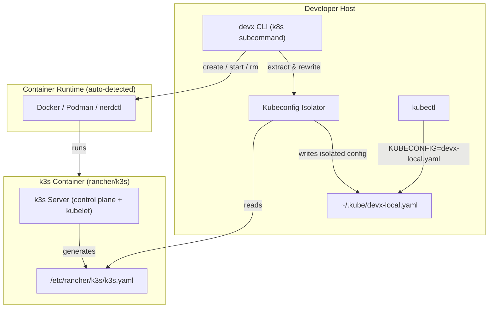
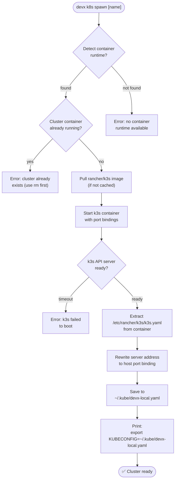

# Zero-Config Kubernetes

If your project ultimately deploys to a Kubernetes cluster, testing Helm charts, operators, or raw YAML manifests locally is essential. Traditionally, this requires installing heavy virtual machine orchestrators like Minikube or complex local Docker implementations like Kind or k3d.

With `devx`, local Kubernetes is **Zero-Install** and **Zero-Config**.

## The Solution: `devx k8s spawn`

`devx k8s` uses the incredibly lightweight `k3s` distribution. Because k3s ships the entire Kubernetes control plane inside a single binary, `devx` can boot a fully compliant Kubernetes cluster natively with one simple container API call—giving you an instant k8s environment without relying on external CLIs.

```bash
devx k8s spawn
```

## Safe Kubeconfig Isolation

To ensure absolute safety for your personal host configuration, `devx` never automatically overwrites your primary `~/.kube/config`. 

Instead, when a cluster is spawned, its connection credentials are extracted, rewritten to work natively with your host's port bindings, and saved to an isolated file (e.g. `~/.kube/devx-local.yaml`).

You simply `export` the provided variable to connect `kubectl` to your new cluster!

## Architecture & Execution Flow

Below are the architectural component structure and the step-by-step execution flow of Zero-Config Kubernetes.

### Component Diagram (C4 Level 2)



### Execution Lifecycle Flowchart



## Lifecycle Commands

| Command | Description |
|---------|-------------|
| `devx k8s spawn [name]` | Spawns a new zero-config cluster (defaults to "local") |
| `devx k8s list` | List running clusters with their isolated Kubeconfig paths |
| `devx k8s rm <name>` | Stop the cluster and safely remove its kubeconfig |

## Verification Proof

The sequence below demonstrates reading from the isolated Kubeconfig to execute native `kubectl` commands against the newly created local k3s cluster.


::: tip Fast Feedback Loops
Booting a `devx k8s` cluster takes approximately **2-4 seconds** on an Apple Silicon Mac, making it fast enough to be utilized in CI/CD pipelines or ephemeral integration test setups.
:::

::: info Why k3s over Kind?
`Kind` requires pulling a full OS-in-a-container image and executing complex multi-step `kubeadm` sequences inside it. By orchestrating a raw `rancher/k3s` container directly, `devx` dramatically reduces initialization time and removes the need for multi-stage external orchestration binaries.
:::

::: tip Deploy your app to this cluster
Spawning a cluster is step one. To deploy a service onto it as part of `devx up` — rendering kustomize/raw manifests and readiness-gating the DAG — declare `runtime: kubernetes`. See [Kubernetes Deploy](kubernetes-deploy.md).
:::
