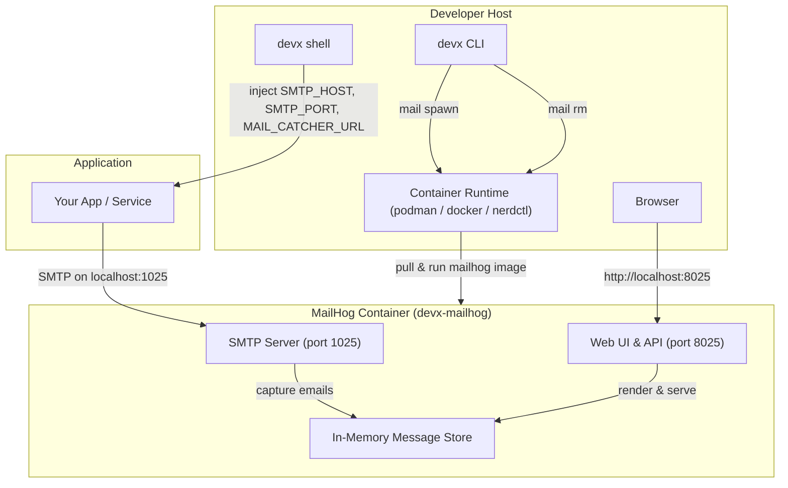
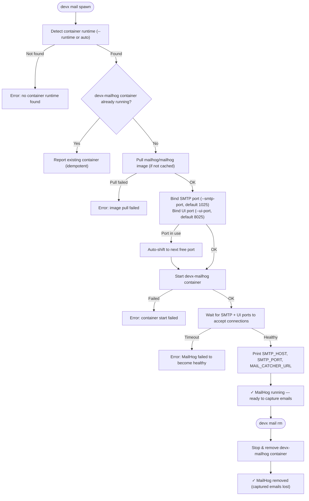

# Local Email Catcher (`devx mail`)

`devx mail spawn` starts a local SMTP catch-all server using [MailHog](https://github.com/mailhog/MailHog). Every email your application sends is captured and inspectable — no external service, no Mailtrap account, and zero risk of accidentally emailing real users.

## Quick Start

```bash
devx mail spawn
```

```
🚀 Spawning MailHog (SMTP:1025  UI:8025)...

✓ MailHog is running!

  Add to your .env:

    SMTP_HOST=localhost
    SMTP_PORT=1025
    MAIL_CATCHER_URL=http://localhost:8025

  Web UI:  http://localhost:8025
  API:     http://localhost:8025/api/v2/messages

  Or use 'devx shell' to have these injected automatically.
```

Open **http://localhost:8025** in your browser — every email your app sends to `localhost:1025` appears there immediately with full HTML rendering, headers, and raw source view.

## Architecture & Execution Flow

Below are the architectural component structure and the step-by-step execution flow of the Local Email Catcher.

### Component Diagram (C4 Level 2)



### Execution Lifecycle Flowchart



## Auto-Injection into devx shell

When MailHog is running, `devx shell` automatically injects the following environment variables into your dev container — no `.env` editing required:

| Variable | Value |
|---|---|
| `SMTP_HOST` | `localhost` |
| `SMTP_PORT` | `1025` |
| `MAIL_CATCHER_URL` | `http://localhost:8025` |

```bash
devx mail spawn       # Start MailHog
devx shell            # SMTP_HOST, SMTP_PORT, MAIL_CATCHER_URL are already set
```

## Connecting Your Application

Point your application's SMTP library at `localhost:1025`. MailHog accepts any sender and recipient without authentication.

::: code-group

```env [.env]
SMTP_HOST=localhost
SMTP_PORT=1025
```

```python [Python (smtplib)]
import smtplib
from email.mime.text import MIMEText

msg = MIMEText("Hello!")
msg["Subject"] = "Test"
msg["From"] = "app@example.com"
msg["To"] = "user@example.com"

with smtplib.SMTP(os.environ["SMTP_HOST"], int(os.environ["SMTP_PORT"])) as s:
    s.sendmail(msg["From"], [msg["To"]], msg.as_string())
```

```go [Go (net/smtp)]
import "net/smtp"

smtp.SendMail(
    os.Getenv("SMTP_HOST") + ":" + os.Getenv("SMTP_PORT"),
    nil, // no auth required
    "app@example.com",
    []string{"user@example.com"},
    []byte("Subject: Test\r\n\r\nHello!"),
)
```

```javascript [Node.js (nodemailer)]
const nodemailer = require("nodemailer");
const transporter = nodemailer.createTransport({
  host: process.env.SMTP_HOST,
  port: parseInt(process.env.SMTP_PORT),
});
await transporter.sendMail({
  from: "app@example.com",
  to: "user@example.com",
  subject: "Test",
  text: "Hello!",
});
```

:::

## Inspecting Captured Emails

### Web UI

Open [http://localhost:8025](http://localhost:8025) — MailHog renders each email with:
- Full HTML view
- Plain text fallback
- Raw source (headers + body)
- MIME part viewer

### JSON API

Useful for integration tests — assert that the right emails were sent:

```bash
# List all captured messages
curl http://localhost:8025/api/v2/messages | jq .

# Delete all captured messages (reset between test runs)
curl -X DELETE http://localhost:8025/api/v1/messages
```

```javascript
// In your test suite
const res = await fetch(process.env.MAIL_CATCHER_URL + "/api/v2/messages");
const { items } = await res.json();
assert(items[0].Content.Headers.Subject[0] === "Welcome to MyApp!");
```

## Flags

| Flag | Default | Description |
|------|---------|-------------|
| `--smtp-port` | `1025` | Host port for the SMTP server |
| `--ui-port` | `8025` | Host port for the web UI |
| `--runtime` | `auto-detected` | Container runtime (`podman`, `docker`, `nerdctl`) |

## Lifecycle

```bash
devx mail spawn        # Start MailHog
devx mail list         # Show status and injected env vars
devx mail rm           # Stop and remove MailHog
```

::: warning Emails are in-memory only
MailHog does not persist emails to disk. All captured emails are lost when the container is removed with `devx mail rm`. Use the JSON API to export important messages before removing:

```bash
curl http://localhost:8025/api/v2/messages > captured-emails.json
devx mail rm
```
:::
