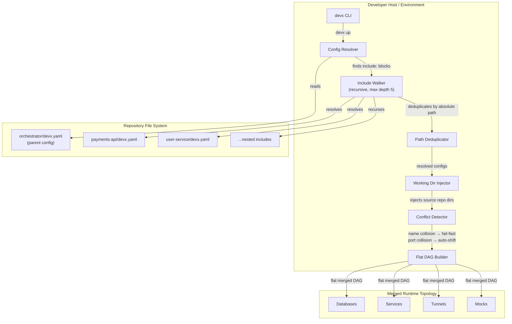
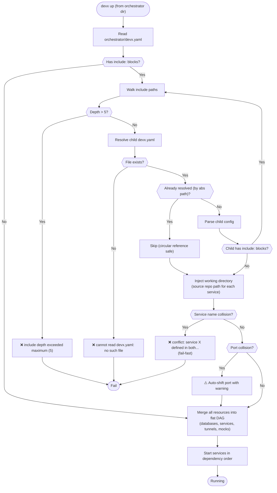

# Multirepo Orchestration

Running a company's full-stack infrastructure locally often means juggling multiple
separate repositories. Each team maintains their own `devx.yaml` — but there's no way
to compose them into a single unified environment.

**Unified Multirepo Orchestration** solves this. A parent `devx.yaml` can "include" the configurations of other projects, merging their databases, services, tunnels, and bridge configurations into a single, massive dependency DAG, creating a local master-node orchestrator that starts everything in the correct dependency order.

## Architecture & Execution Flow

Below are the architectural component structure and the step-by-step execution flow of Multirepo Orchestration.

### Component Diagram (C4 Level 2)



### Execution Lifecycle Flowchart



## Quick Start

Create an orchestrator `devx.yaml` at the root of your workspace:

```
~/workspace/
├── orchestrator/          ← run devx up from here
│   └── devx.yaml
├── payments-api/
│   └── devx.yaml
└── user-service/
    └── devx.yaml
```

```yaml
# orchestrator/devx.yaml
name: my-platform

include:
  - path: ../payments-api/devx.yaml
  - path: ../user-service/devx.yaml

# Cross-repo dependency — payments-api can depend on services from user-service
services:
  - name: gateway
    runtime: host
    command: ["go", "run", "./cmd/gateway"]
    port: 8000
    depends_on:
      - name: payments-api        # defined in ../payments-api/devx.yaml
        condition: service_healthy
      - name: user-profile-svc    # defined in ../user-service/devx.yaml
        condition: service_healthy
```

Then start the full stack:

```bash
cd orchestrator
devx up
```

## Syntax

### Short Syntax

```yaml
include:
  - path: ../payments-api/devx.yaml
  - path: ../user-service/devx.yaml
```

### Long Syntax (per-include env override)

```yaml
include:
  - path: ../payments-api/devx.yaml
  - path: ../user-service/devx.yaml
    env_file: ../user-service/.env.staging  # override .env for this sub-project
```

| Field      | Required | Description |
|------------|----------|-------------|
| `path`     | ✅       | Path to the included `devx.yaml` (relative to the parent file's directory) |
| `env_file` | ❌       | Optional environment file to use for this sub-project's vault resolution |

## How It Works

### Flat Merge
All databases, services, tunnels, and mocks from every included file are merged into
a single flat topology. There are no sub-projects at runtime — the merged result is
indistinguishable from a manually-authored monolithic `devx.yaml`.

### Working Directory Injection
Each included service and database runs in its own repository's directory. If
`payments-api` has a service with `command: ["go", "run", "./cmd/payments"]`, that
command executes from `../payments-api/` — not the orchestrator's directory.

This is critical: without directory injection, relative paths like `./cmd/payments`,
`npm run dev`, or `node_modules/.bin/prisma` would resolve against the wrong directory.

### Recursive Includes
Included files can themselves contain `include` blocks — they will also be resolved.
To prevent infinite loops, recursion is capped at **depth 5**. Each file is also
deduplicated by absolute path, so circular references are handled safely.

## Conflict Rules

### Service Name Collision → Fail-Fast

If two included projects both define a service named `api`, `devx up` will immediately fail:

```
conflict: service "api" defined in both /workspace/orchestrator/devx.yaml
and /workspace/payments-api/devx.yaml

Rename one service or use a 'profiles:' overlay in the parent devx.yaml to resolve.
Tip: use descriptive names like 'payments-api' instead of just 'api'.
```

**Solution:** Use unique, descriptive names in each repository (e.g. `payments-api`, `user-svc`, `web-frontend`).

### Port Collision → Auto-Shift with Warning

If two included projects expose the same port (e.g. both `postgres: port 5432`), the
existing port-shifting logic automatically bumps the second port and prints a visible warning:

```
⚠️ Port 5432 (user-service/postgres) shifted to 5433 — collides with payments-api/postgres
```

## Universal Feature Coverage

The `include` directive is processed by a single, unified config resolution engine.
Every `devx` command that reads `devx.yaml` will automatically see included projects:

| Command | Multirepo-aware? |
|---------|-----------------|
| `devx up` | ✅ — starts services from all included repos in dependency order |
| `devx sync up` | ✅ — discovers sync blocks from all included repos |
| `devx db seed` | ✅ — finds seed commands, runs them from the included project's directory |
| `devx map` | ✅ — generates architecture diagram for the full multi-repo topology |
| `devx config pull` | ✅ — merges vault env sources from all included projects |
| `devx config push` | ✅ — uses merged vault sources |
| `devx config validate` | ✅ — validates against merged vault sources |
| `devx test ui` | ✅ — provisions databases from all included repos |

## Troubleshooting

### `conflict: service "X" defined in both...`
Two included projects use the same service name. Rename one of them to be more descriptive.

### `include resolution failed: cannot read /path/to/devx.yaml: no such file`
The `path` in your `include` block doesn't exist. Check that the sibling repository
is checked out and the path is correct.

### `include depth exceeded maximum (5)`
You have a long chain of nested includes. Check for accidental circular references.
devx handles truly circular includes (A→B→A) safely by deduplication, but very long
chains will trip the depth limit.

### `devx sync up` doesn't see sync blocks from included projects
Make sure you run `devx sync up` from the same directory as your orchestrator `devx.yaml`.
The sync command uses the same `include` resolver as `devx up`.
