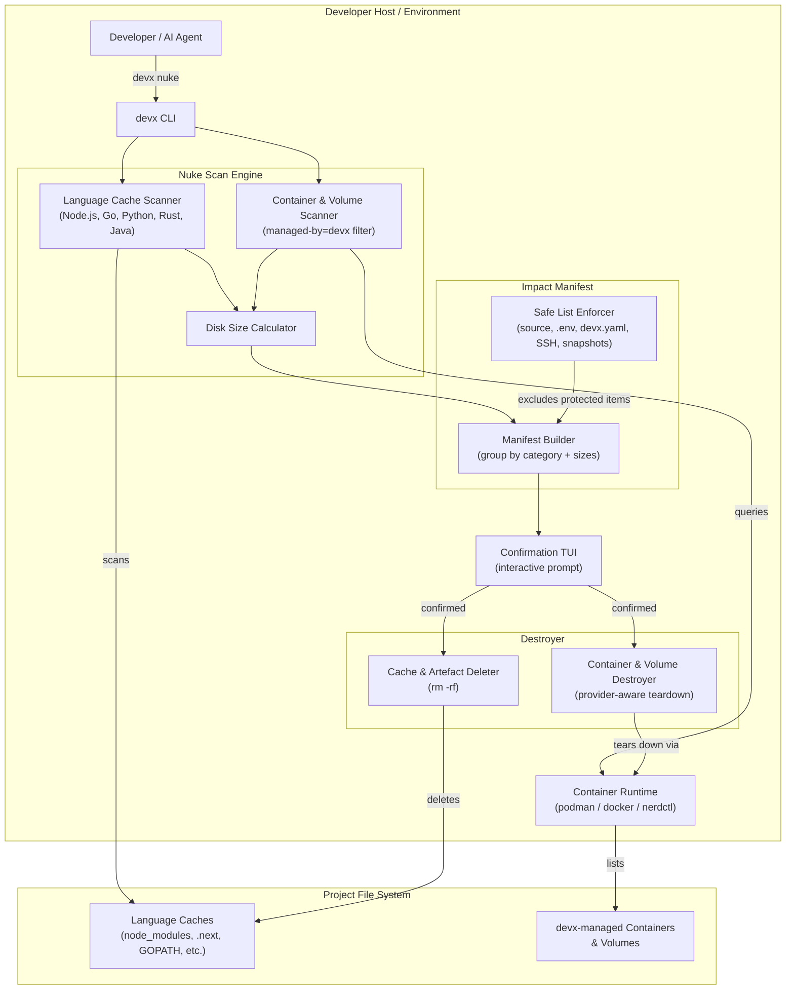
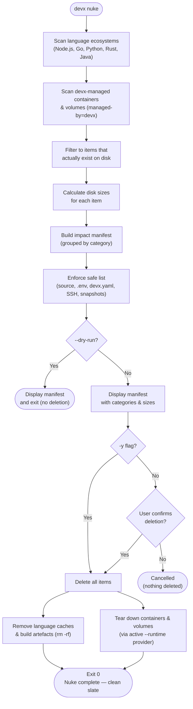

# The "Nuke It" Button (`devx nuke`)

`devx nuke` is a safe, confirmation-guarded hard reset for your local development environment. When caches go corrupt, containers drift, or you just need to start completely fresh — one command does it all.

## Architecture & Execution Flow

Below are the architectural component structure and the step-by-step execution flow of `devx nuke`.

### Component Diagram (C4 Level 2)



### Execution Lifecycle Flowchart



## What Gets Nuked

Before deleting anything, `devx nuke` **scans first and shows you exactly what will be removed** — grouped by category and with disk sizes — then asks for confirmation.

```bash
devx nuke
```

```
devx nuke — scanning project...

  The following will be permanently deleted:

  Node.js
    ✗  node_modules                              (612.4 MB)
       /Users/james/myapp/node_modules
    ✗  .next (build cache)                       (84.1 MB)
       /Users/james/myapp/.next

  Go
    ✗  module cache (GOPATH/pkg/mod/cache)       (1.1 GB)
       /Users/james/go/pkg/mod/cache
    ✗  build cache (GOCACHE)                     (863.3 MB)
       /Users/james/Library/Caches/go-build

  devx
    ✗  devx-db-postgres                          (container)
    ✗  devx-data-postgres                        (volume)
    ✗  devx-cloud-gcs                            (container)

  Total: 2.7 GB across 7 items

  Safe (never touched):
    ✓  Source code
    ✓  .env files
    ✓  devx.yaml
    ✓  SSH keys
    ✓  ~/.devx/snapshots

⚠ This cannot be undone.
Delete 7 items (2.7 GB) from your project?

Databases, containers, caches, and build artefacts will be permanently removed.
Your source code and config files (.env, devx.yaml) are safe.

[ Yes, nuke it all ] [ Cancel ]
```

## What Is Always Safe

`devx nuke` **never** touches:

| Safe | Why |
|------|-----|
| Your source code | Read-only — only caches and artefacts are removed |
| `.env` files | Secrets are yours to manage |
| `devx.yaml` | Project config is preserved |
| SSH keys | Credentials are untouched |
| `~/.devx/snapshots` | Database snapshots you created with `devx db snapshot` |

::: note
`devx nuke` respects the active `--provider` (e.g., `podman` vs `docker`) when executing container teardowns, ensuring it only cleans up containers and volumes managed by devx for that specific runtime.
:::

## Languages Supported

`devx nuke` recognises caches and build artefacts for:

| Language / Tool | What gets removed |
|---|---|
| **Node.js / JS** | `node_modules/`, `.next/`, `.nuxt/`, `dist/`, `build/`, `.turbo/`, `.parcel-cache/` |
| **Go** | `vendor/`, `GOPATH/pkg/mod/cache`, `GOCACHE` |
| **Python** | `.venv/`, `venv/`, `.pytest_cache/`, `__pycache__/` |
| **Rust** | `target/` |
| **Java / JVM** | `target/` (Maven), `build/` (Gradle) |
| **devx** | All `managed-by=devx` containers and volumes |

Only directories that **actually exist** are shown — if your project doesn't use Python, no Python entries appear.

## Flags

| Flag | Description |
|------|-------------|
| `--dry-run` | Show the manifest without deleting anything |
| `-y, --non-interactive` | Skip the confirmation prompt (for CI) |
| `--runtime` | Container runtime to use (defaults to active provider runtime e.g. `nerdctl`, `docker`, `podman`) |

## After Nuking

Once `devx nuke` completes, you'll have a completely clean slate:

```bash
devx nuke                  # Nuke everything
devx up                    # Provision fresh databases, tunnels, and containers
devx config pull           # Re-sync secrets from vault
devx config validate       # Verify all required keys are present
npm install && npm run dev # Reinstall dependencies and start your app
```

::: tip Use snapshots before nuking databases
If your database contains important test data, take a snapshot first:

```bash
devx db snapshot create postgres before-nuke
devx nuke
# Later, if needed:
devx db snapshot restore postgres before-nuke
```
:::
