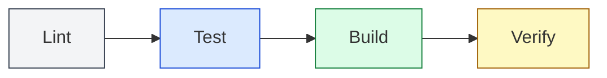

# Pipeline Stages

## Overview

`devx` supports Skaffold-inspired declarative pipeline stages that let you define **exactly** how your project is tested, linted, built, and verified — regardless of your technology stack. This follows the **Familiarity-First** design principle: developers who have used Skaffold or Docker Compose should feel at home.

## Zero-Config Default

The pipeline enforces a strict sequential execution order (`Lint -> Test -> Build -> Verify`) to ensure that cheap pre-flight checks fail fast before side-effect prone or slow operations begin.



By default, `devx agent ship` **auto-detects** your stack from marker files:

| Marker File | Stack | Test | Lint | Build |
|-------------|-------|------|------|-------|
| `go.mod` | Go | `go test ./...` | `go vet ./...` | `go build ./...` |
| `package.json` | Node/JS/TS | `npm test` | `npm run lint` | `npm run build` |
| `Cargo.toml` | Rust | `cargo test` | `cargo clippy` | `cargo build` |
| `pyproject.toml` | Python | `pytest` | `ruff check .` | — |
| `pom.xml` | Java/Maven | `mvn test` | `mvn checkstyle:check` | `mvn package -DskipTests` |
| `build.gradle` | Java/Gradle | `./gradlew test` | `./gradlew check` | `./gradlew build -x test` |
| `build.gradle.kts` | Kotlin/Gradle | `./gradlew test` | `./gradlew check` | `./gradlew build -x test` |
| `*.csproj` / `*.sln` | .NET | `dotnet test` | `dotnet format --verify-no-changes` | `dotnet build` |

This works out of the box with no configuration. However, when you need custom commands — or your project uses a non-standard build system — you can define explicit pipeline stages.

::: tip MULTI-STACK DETECTION
`devx` detects **all** matching stacks in your repository. When no explicit pipeline is configured, it runs the primary (highest-precedence) stack. Use `DetectAllStacks` programmatically or define an explicit `pipeline:` block for full control in monorepo setups.
:::

### Unknown Stack Warning

If `devx` cannot detect any recognized stack **and** no `pipeline:` block is defined, it will emit a visible warning instead of silently passing:

```
⚠ WARN  no recognized stack detected (go.mod, package.json, ...) and no
        pipeline: block in devx.yaml — pre-flight checks were skipped
Tip: add a pipeline: block to devx.yaml to define custom checks for your stack.
```

This ensures developers always know when their pre-flight checks aren't running.

## Explicit Pipeline

Add a `pipeline:` block to your `devx.yaml` to override auto-detection entirely:

```yaml
pipeline:
  test:
    command: ["pytest", "-v", "--cov=app"]
  lint:
    command: ["ruff", "check", "."]
  build:
    command: ["docker", "build", "-t", "myapp", "."]
  verify:
    command: ["./scripts/integration-test.sh"]
```

::: warning EXPLICIT WINS
When a `pipeline:` block is present, auto-detection is **completely bypassed**. If you only define `build:` and `lint:`, there will be no test step — `devx` will not attempt to auto-detect a test command.
:::

### Achieving CI Parity

The default auto-detected commands (e.g., `go vet` for Go) are intentionally **universal** — they work in any project without extra tooling. If your CI pipeline runs stricter checks (like `golangci-lint` or `addlicense`), define them explicitly to shift those checks left:

```yaml
# devx.yaml — CI-parity for a Go project with strict linting
pipeline:
  test:
    command: ["go", "test", "-race", "./..."]
  lint:
    commands:
      - ["golangci-lint", "run"]
      - ["addlicense", "-check", "-c", "YourOrg", "-l", "mit", "."]
  build:
    command: ["go", "build", "./..."]
```

This way, `devx agent ship` catches the same errors locally that your CI would catch on GitHub, drastically shortening the feedback loop.

### Multi-Command Stages

Need to run multiple commands in a single stage? Use `commands:` (plural) instead of `command:`:

```yaml
pipeline:
  test:
    commands:
      - ["go", "test", "./..."]
      - ["go", "vet", "./..."]
  build:
    command: ["go", "build", "./..."]
```

Each command in the list runs sequentially. If any command fails, the stage fails immediately.

### Verify Stage

The `verify:` stage is **pipeline-only** — it has no auto-detected equivalent. Use it for post-build validation like integration tests or smoke checks:

```yaml
pipeline:
  build:
    command: ["go", "build", "./..."]
  verify:
    command: ["./scripts/smoke-test.sh"]
```

### Lifecycle Hooks (`before:` / `after:`)

Each pipeline stage supports `before:` and `after:` hooks — sequential commands that run immediately before or after the stage's main commands:

```yaml
pipeline:
  lint:
    before:
      - ["echo", "▸ Running linter..."]
    command: ["go", "vet", "./..."]
  build:
    before:
      - ["npm", "run", "clean"]
    command: ["go", "build", "./..."]
    after:
      - ["echo", "✓ Build artifacts ready"]
      - ["./scripts/notify-slack.sh"]
```

**Execution order:** `before[0]` → `before[1]` → ... → `command` → `after[0]` → `after[1]` → ...

::: warning FAIL-FAST
If a `before:` hook fails, the stage's main commands and `after:` hooks are **skipped entirely**. If a main command fails, `after:` hooks are skipped. This prevents cascading side effects.
:::

## Language-Specific Examples

### Java (Maven)

```yaml
pipeline:
  test:
    command: ["mvn", "test"]
  lint:
    command: ["mvn", "checkstyle:check"]
  build:
    command: ["mvn", "package", "-DskipTests"]
```

### Java/Kotlin (Gradle)

```yaml
pipeline:
  test:
    command: ["./gradlew", "test"]
  lint:
    command: ["./gradlew", "check"]
  build:
    command: ["./gradlew", "build", "-x", "test"]
```

### .NET

```yaml
pipeline:
  test:
    command: ["dotnet", "test"]
  lint:
    command: ["dotnet", "format", "--verify-no-changes"]
  build:
    command: ["dotnet", "build"]
```

### Python

```yaml
pipeline:
  test:
    command: ["pytest", "-v", "--cov=app"]
  lint:
    commands:
      - ["ruff", "check", "."]
      - ["mypy", "app/"]
```

## Custom Actions (`devx action`)

Define named, on-demand tasks under `customActions:` in `devx.yaml`:

```yaml
customActions:
  ci:
    commands:
      - ["go", "test", "./..."]
      - ["go", "vet", "./..."]
      - ["go", "build", "./..."]
  seed-db:
    command: ["npm", "run", "db:seed"]
  generate-mocks:
    commands:
      - ["mockgen", "-source=./internal/...", "-destination=./internal/mock/..."]
```

Run them with `devx action`:

```bash
devx action ci              # run the full CI suite locally
devx action seed-db          # seed the database
devx action --list           # list all available actions
devx action ci --dry-run     # preview commands without executing
devx action ci --detailed    # show full verbose output instead of concise summary
devx action ci --json        # machine-readable output
```

### Action Telemetry & TUI Mode

By default, `devx action` executes commands using a **Concise TUI Mode**. It fully suppresses messy `stdout` (like hundreds of `t.Log` traces or compilation steps) and renders clean `✓ package name` summary dots to your terminal. Full raw logs are silently appended to `~/.devx/logs/action-<name>.log` for auditing, and automatically dumped inline only if a step `✗ fails`.

Additionally, every single step executed within an action natively emits `devx_run` telemetry spans containing execution duration and exit codes — beautifully populating your "Build & Run Activity" Grafana metrics automatically.

::: tip GO TEST INTERCEPTION
If any sub-command inside a custom action is a `go test` invocation, it gets deeply intercepted. `devx` automatically instruments `-json`, aggregates pass/fail states into the TUI, and streams microscopic `go_test: TestName` spans to Grafana for unparalleled metrics.
:::

## `devx run` — Universal Telemetry Wrapper

Run **any** host command with automatic telemetry:

```bash
devx run -- npm test
devx run -- go build ./...
devx run -- make deploy
```

Every `devx run` invocation:
1. Times the command execution
2. Records the exit code
3. Exports an OTel span to your local trace backend (if running)
4. Routes stdout/stderr to the devx log stream

### Global Flags
```bash
devx run --dry-run -- npm test    # prints intent without executing
devx run --name api -- go run ./cmd/api  # custom label for the log stream
```

### Viewing Telemetry

When a [distributed tracing backend](/guide/trace) is running, `devx run` spans appear alongside build metrics:

```bash
devx trace spawn grafana
devx run --name test -- go test ./...
# Open http://localhost:3000/d/devx-build-metrics/devx-build-metrics
```

### Granular Test Telemetry (Go Only)

For Go projects, `devx run` and `devx agent ship` automatically intercept `go test` commands, inject `-json`, and reconstruct the output. This captures precise duration and pass/fail status for every individual test case in your OTLP backend, enabling granular dashboards without extra configuration.

## Integration with `devx agent ship`

When you run `devx agent ship`, the pre-flight checks automatically use your pipeline configuration:

1. If `devx.yaml` has a `pipeline:` block → explicit commands are used
2. Otherwise → auto-detection from marker files (the default)

```bash
# Uses your custom pipeline
devx agent ship -m "feat: add new feature"

# Output shows pipeline source
  ▸ Phase 1: Pre-flight checks
    ℹ  using devx.yaml pipeline config
    ✓ PASS  all local checks passed (pipeline)
```

### Version-Aware Telemetry

All pre-flight spans are enriched with `service.version` attributes, enabling version-specific dashboards in Grafana. The SDLC-aligned dashboard layout tracks telemetry across five phases: **Setup → Dev → Test → Ship → Health**.
