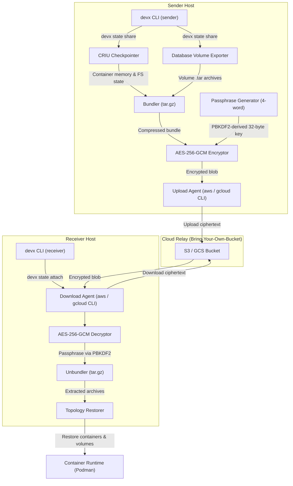
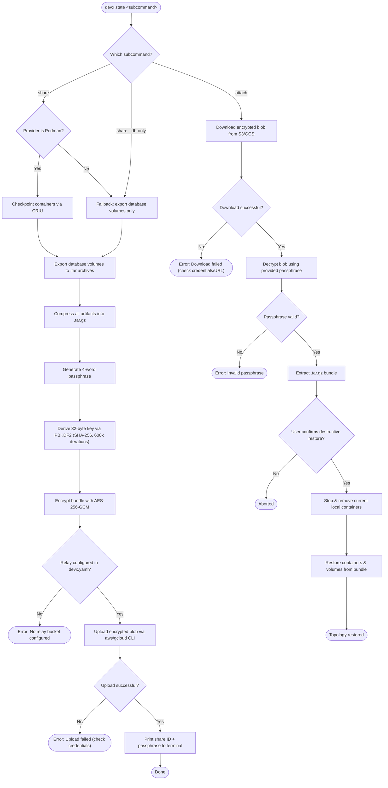
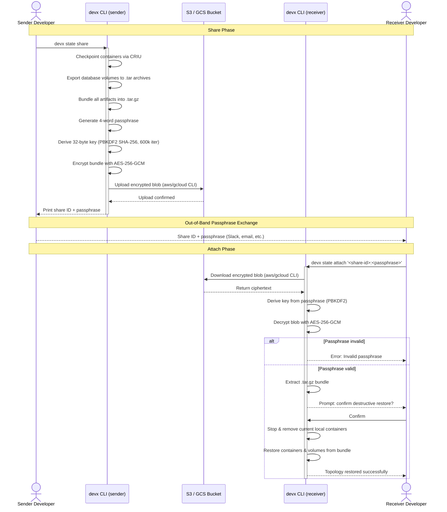

# Peer-to-Peer State Replication

Devx enables you to bundle your exact running environment state and share it with teammates to eliminate "it works on my machine" debugging friction. 

By using `devx state share` and `devx state attach`, you can snapshot running containers, exported database volumes, and environment metadata into a single encrypted artifact and securely transfer it via your own S3 or Google Cloud Storage buckets.

## Architecture & Execution Flow

Below are the architectural component structure and the step-by-step execution flow of `devx state share` and `devx state attach`.

### Component Diagram (C4 Level 2)



### Execution Lifecycle Flowchart



### Sharing & Attaching Sequence



## How it works

When you run `devx state share`, Devx performs the following steps:
1. **Container Checkpointing:** Uses CRIU (via Podman) to capture the exact memory and filesystem state of your running containers.
2. **Database Snapshotting:** Exports all local database volumes into `.tar` archives.
3. **Bundling:** Compresses all artifacts into a `.tar.gz` bundle.
4. **Encryption:** Generates a secure, human-readable 4-word passphrase and encrypts the entire bundle locally using AES-256-GCM.
5. **Upload:** Uploads the encrypted blob to your configured S3 or GCS bucket using the native `aws` or `gcloud` CLIs.

## Configuration (Bring-Your-Own-Bucket)

Devx strictly enforces a Bring-Your-Own-Bucket (BYOB) model. You must configure an S3 or GCS bucket to act as the relay.

Add the following to your `devx.yaml`:

```yaml
state:
  # Use your own S3/GCS bucket for secure team sharing
  relay: "s3://my-team-devx-state/checkpoints"
  # relay: "gs://my-team-devx-state/checkpoints"
```

*Note: You must have the corresponding CLI (`aws` or `gcloud`) installed and authenticated.*

## Usage

### Sharing State

To share your state, simply run:

```bash
devx state share
```

You will receive an output similar to this:
```
✅ State successfully bundled, encrypted, and uploaded!

Share this ID with your teammate to attach:

  s3://my-team-devx-state/checkpoints/_share_1680000000.encrypted:fast-blue-rabbit-dawn

They can run: devx state attach 's3://...:fast-blue-rabbit-dawn'
```

### Attaching State

To restore a shared state on your machine, run the attach command with the provided ID:

```bash
devx state attach 's3://my-team-devx-state/checkpoints/_share_1680000000.encrypted:fast-blue-rabbit-dawn'
```

> [!WARNING]
> Attaching state is destructive! It will stop and overwrite your current local containers and database volumes to match the shared state. Devx will prompt for confirmation before proceeding.

### Fallback: Database-Only Mode

CRIU container checkpointing is only supported when using **Podman** as your VM backend. If you or your teammate are using Docker Desktop, Lima, or Colima, Devx gracefully falls back to sharing database volumes only.

You can explicitly force this mode:
```bash
devx state share --db-only
```

## Security

The relay destination (S3/GCS) only ever sees opaque ciphertext. The data is encrypted entirely on your local machine using a 32-byte key derived from the generated passphrase using PBKDF2 (SHA-256, 600,000 iterations). The passphrase is required to decrypt the bundle.
