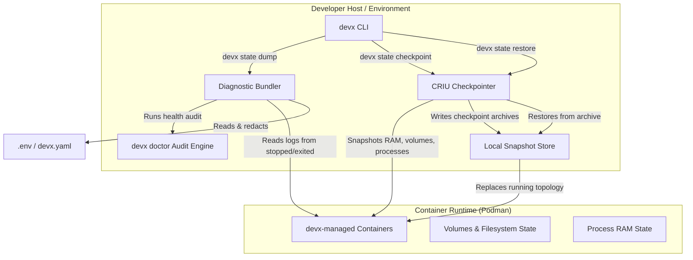
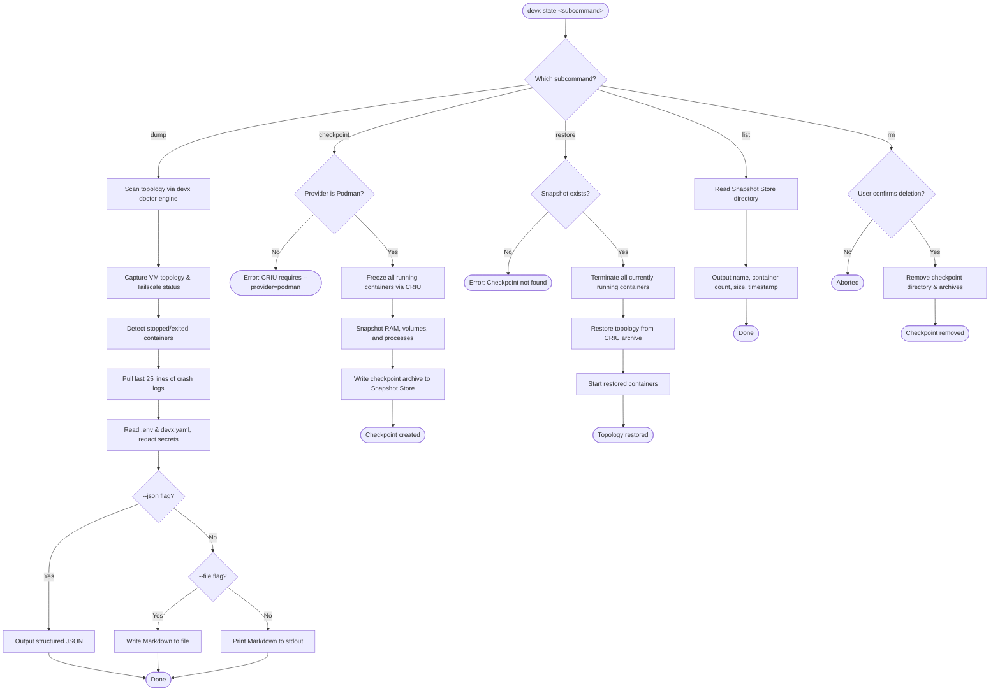

# Diagnostics and Time-Travel Checkpoints

The `devx state` command hierarchy manages the macro topological state of the entire devx environment. 

We found that developers spend too much time copying arbitrary terminal logs and environment dumps when saying "it doesn't work on my machine." We also found that testing destructive database migrations locally forces developers to rely on heavy SQL dumps to roll back state.

`devx state` provides unified, observable solutions for both sharing diagnostic context and performing literal time-travel debugging.

## Architecture & Execution Flow

Below are the architectural component structure and the step-by-step execution flow of `devx state`.

### Component Diagram (C4 Level 2)



### Execution Lifecycle Flowchart



## Shareable Diagnostic Dumps 

The `devx state dump` command securely snapshots the running topology, failing container logs, and redacted `.env` state into a structured diagnostic report.

```bash
# Output formatted markdown to stdout
devx state dump

# Output formatted markdown to a file
devx state dump --file /tmp/devx-dump.md

# Output structured JSON for AI and tooling pipelines
devx state dump --json
```

### What is included in the dump?
1. **System Health & Prerequisite Tooling:** Leverages the internal `devx doctor` audit engine to capture the host system, architecture, and whether tools like VM backends, `cloudflared`, and required global vault credentials exist.
2. **VM Topology & Status:** Analyzes the active VM, its orchestrating `devx.yaml` topology map, and its Tailscale status.
3. **Redacted Configuration:** Natively reads `.env` variables and the active `devx.yaml` file, intelligently redacting any discovered values to `<REDACTED>`. This makes it 100% safe to copy-paste the output into GitHub Issues or public Slack channels.
4. **Context-Aware Crash Logs:** The engine detects any `devx-` managed containers that are actively in a broken `stopped` or `exited` state and aggressively pulls the last 25 lines of their termination logs inline.

## Time-Travel Debugging (CRIU Checkpoints)

Podman natively supports CRIU (Checkpoint/Restore In Userspace). Devx abstracts this to support full-topology Time-Travel debugging.

Instead of just snapshotting a single database volume, `devx state checkpoint` snapshots the entire topology's RAM, volumes, and running processes exactly as they stand, allowing a user to seamlessly "rewind" all containers back exactly 5 minutes prior to a failure.

### Usage

**1. Create a Snapshot**

Take a snapshot just before triggering a dangerous state change:
```bash
devx state checkpoint pre-migration
```

**2. Rollback to Snapshot**

If the bug happens, restore the exact topology back in time. All currently running developer containers will automatically be terminated and swapped for the snapshot images:
```bash
devx state restore pre-migration
```

### Managing Checkpoints

```bash
devx state list
```
*(Outputs the checkpoint name, container count, storage size, and creation timestamp)*

```bash
devx state rm pre-migration
```
*(Prompts for interactive confirmation before destructively removing the checkpoint directory and all related archives)*

### Limitations
- **Provider Restriction:** Time-travel checkpointing requires `podman` as the underlying virtualizer (`--provider=podman`). Docker Mac and OrbStack usually do not ship with natively supported, un-flagged CRIU support compiled into their kernels and daemon.
- **Ephemeral Sockets:** CRIU can sometimes struggle with extremely active external inbound/outbound TCP sockets at the exact microsecond of the checkpoint. When possible, perform checkpoints during idle periods.
