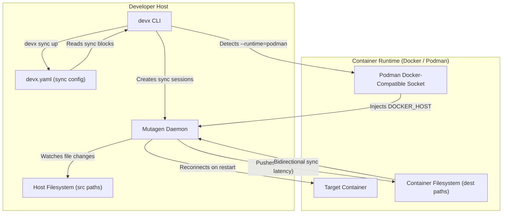
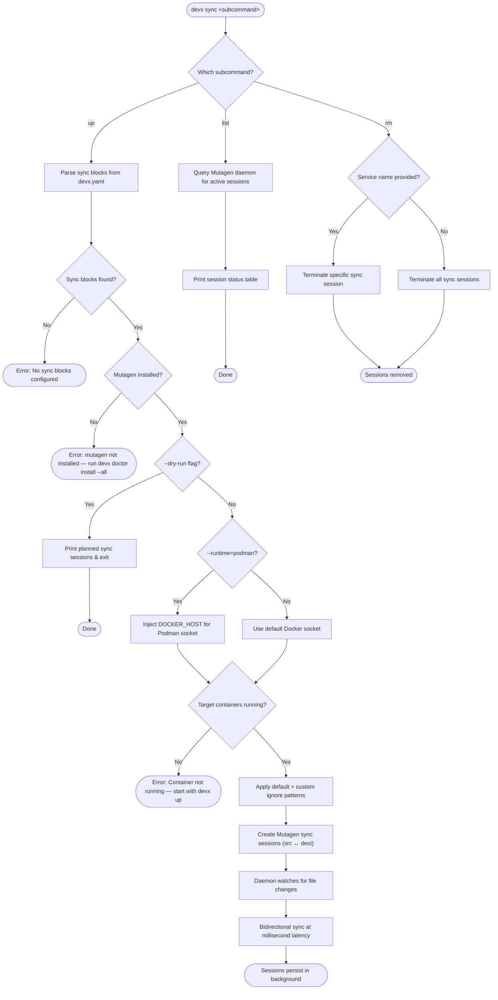

# Smart File Syncing

> ⚡ **Zero-Rebuild Hot Reloading** — bypass slow VirtioFS volume mounts with intelligent file syncing.

## The Problem

On macOS, container volume mounts (VirtioFS) suffer from catastrophic performance degradation when watching thousands of files. A typical `node_modules` directory with 200k+ files can cause multi-second delays on every save, destroying developer flow state entirely.

Rebuilding full container images just to inject a one-line code change is even worse.

## The Solution

`devx sync` wraps [Mutagen](https://mutagen.io/) to create a high-performance, bidirectional file sync between your host machine and running containers. Changes propagate in **milliseconds**, not seconds.

## Architecture & Execution Flow

Below are the architectural component structure and the step-by-step execution flow of `devx sync`.

### Component Diagram (C4 Level 2)



### Execution Lifecycle Flowchart



## Quick Start

### 1. Add sync blocks to `devx.yaml`

```yaml
services:
  - name: api
    runtime: container
    command: ["docker", "run", "--name", "my-api", "-p", "8080:8080", "myorg/api:dev"]
    sync:
      - container: my-api
        src: ./src
        dest: /app/src
        ignore: ["*.test.ts", "coverage/"]
```

### 2. Start sync sessions

```bash
devx sync up
```

### 3. Edit code and watch it sync instantly

Changes to `./src` on your host will appear in the container at `/app/src` within milliseconds.

## Configuration Reference

The `sync` block is nested under each service in `devx.yaml`:

| Field       | Type       | Required | Description |
|-------------|------------|----------|-------------|
| `container` | string     | ✅       | Target container name (must match a running container) |
| `src`       | string     | ✅       | Host source path (relative to `devx.yaml` location) |
| `dest`      | string     | ✅       | Absolute path inside the container |
| `ignore`    | string[]   | ❌       | Additional ignore patterns (on top of defaults) |

### Default Ignore Patterns

Every sync session automatically excludes these patterns to prevent performance degradation:

- `.git`
- `node_modules`
- `.devx`
- `__pycache__`
- `.next`
- `.nuxt`
- `dist`
- `build`

You can add additional patterns via the `ignore` field. These are **additive** — they don't replace the defaults.

## Managing Sessions

### List active sessions

```bash
devx sync list
```

### Stop all sessions

```bash
devx sync rm
```

### Stop a specific session

```bash
devx sync rm api
```

### Preview without executing

```bash
devx sync up --dry-run
```

## Podman Compatibility

`devx sync` automatically detects when `--runtime=podman` is used and injects the `DOCKER_HOST` environment variable to point Mutagen at Podman's Docker-compatible socket. This is transparent — no manual configuration needed.

::: warning
If you encounter issues with rootless Podman, install the Docker CLI as a fallback:
```bash
devx doctor install --all
```
:::

## Session Lifecycle

Sync sessions are **persistent background processes** managed by the Mutagen daemon. They:

- ✅ Survive terminal exit (you can close your terminal and sync continues)
- ✅ Automatically reconnect if a container restarts
- ✅ Are cleaned up by `devx nuke`
- ⚠️ Must be explicitly stopped with `devx sync rm`

## Cleanup

`devx nuke` automatically detects and offers to terminate orphaned Mutagen sync sessions alongside containers and volumes.

## Troubleshooting

### "mutagen is not installed"

Install Mutagen via the devx doctor:

```bash
devx doctor install --all
```

Or manually:

```bash
brew install mutagen-io/mutagen/mutagen
```

### "Container is not running"

Sync requires the target container to be running. Start it first:

```bash
devx up          # starts all services
# or manually
docker run -d --name my-api myorg/api:dev
```

### Session stuck in "Connecting" state

1. Verify the container is running: `docker ps | grep <container>`
2. Ensure the destination path exists inside the container
3. Check Mutagen logs: `mutagen sync list -l`
