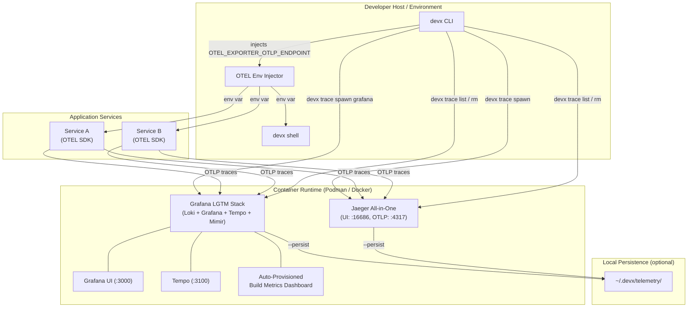
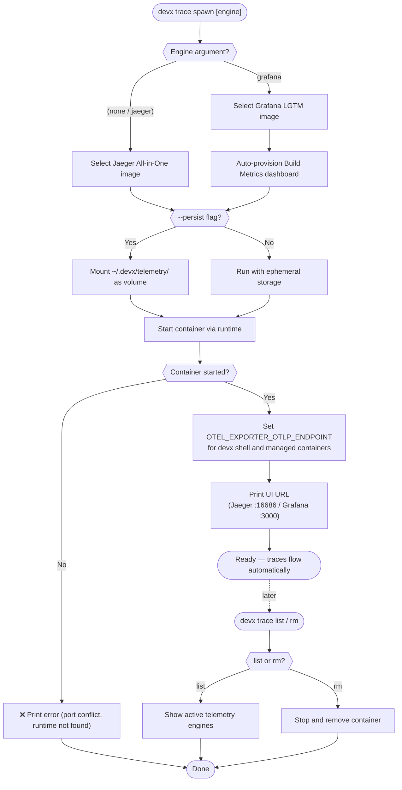

# Shift-Left Distributed Observability

When running multiple microservices locally natively or via `devx.yaml`, figuring out *where* a request failed often requires tailing multiple sets of logs. Full distributed tracing is traditionally reserved for cloud/production environments due to the friction of setting up an OTLP collector and trace backends locally.

`devx` brings observability to your local environment with zero configuration.

## Architecture & Execution Flow

Below are the architectural component structure and the step-by-step execution flow of Shift-Left Distributed Observability.

### Component Diagram (C4 Level 2)



### Execution Lifecycle Flowchart



## Spawning a Trace Backend

You can instantly spin up a lightweight OpenTelemetry backend locally:

```bash
# Default: runs the lightweight jaegertracing/all-in-one backend
devx trace spawn

# Or use the full Grafana LGTM (Loki, Grafana, Tempo, Mimir) stack
devx trace spawn grafana
```

### Data Persistence

Trace data is ephemeral by default, meaning deleting the container loses your traces. If you are comparing performance over time or doing benchmarking, you can persist the data locally:

```bash
devx trace spawn grafana --persist
```

This ensures trace data is durably stored in `~/.devx/telemetry/<engine>/` even across container restarts.

## Automatic Environment Injection

`devx` automatically maps the correct endpoints. Whenever a trace backend is running, `devx shell` and any managed containers will automatically have the `OTEL_EXPORTER_OTLP_ENDPOINT` environment variable injected.

This means standard OpenTelemetry SDKs running in your applications will beam traces directly to your local backend out-of-the-box, without editing your `.env` files.

## Visualizing Traces

### Jaeger

If you spawned `jaeger`, the UI is available at `http://localhost:16686`. 


### Grafana Tempo

If you spawned `grafana`, the UI is available at `http://localhost:3100` (Default login: admin/admin).

To find your traces:
1. Navigate to **Explore** (Compass icon) in the left sidebar.
2. Select **Tempo** from the top data sources dropdown.
3. Use the Search tab to view recent traces.


## devx Build Metrics Dashboard

When you spawn the Grafana backend, `devx` automatically provisions a **Build Metrics** dashboard that visualizes your CI performance from `devx agent ship`:

```bash
devx trace spawn grafana
```

The dashboard is accessible at `http://localhost:3000/d/devx-build-metrics/devx-build-metrics` and includes:

| Panel | Description |
|-------|-------------|
| Total Builds | Count of all build events |
| P50/P90 Build Time | Percentile latency from Tempo spans |
| Build Duration Over Time | Time series showing build duration trends |
| Recent Agent Ship Preflights | Table with stack, branch, and pass/fail outcomes |
| Test Details | Table containing individual granular test spans (Go only) |
| Test/Lint/Build Results | Bar Gauges showing pass/fail/skip breakdown |


### Dashboard Verification

Here is an automated verification of the Build Metrics dashboard in action:


Each `devx agent ship` and `devx run` execution exports an enriched span. `devx agent ship` pre-flights attach attributes like `devx.stack`, `devx.branch`, `devx.test.pass`, `devx.lint.pass`, and `devx.build.pass`. Furthermore, `devx run -- go test` emits individual test spans with `devx.test.name` and `devx.test.status`. All data is queryable directly in Tempo's TraceQL metrics explorer.

::: tip DOGFOODING
We use this dashboard ourselves during `devx` development — every commit to the `devx` CLI generates build metrics that we monitor to catch performance regressions.
:::

## Managing Backends

You can list running backends and remove them when finished:

```bash
# List all active telemetry engines
devx trace list

# Teardown the backend
devx trace rm jaeger
```
