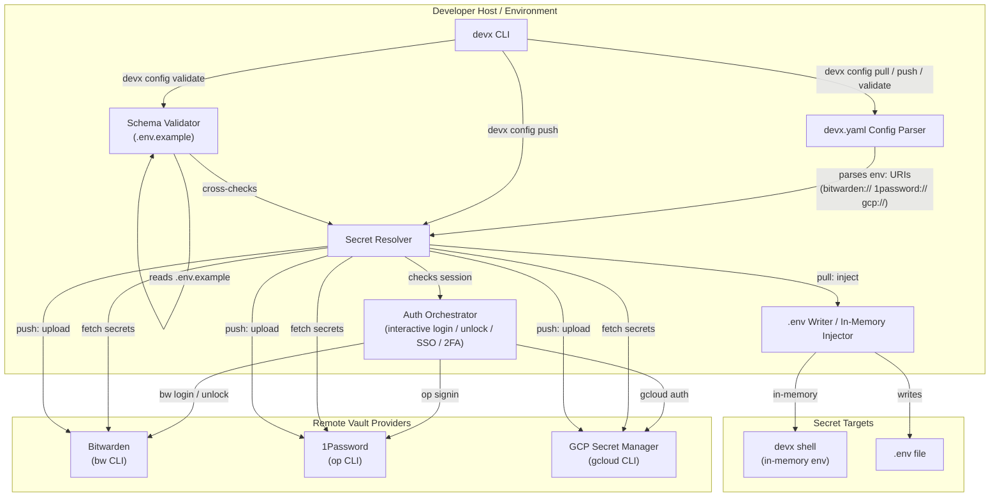
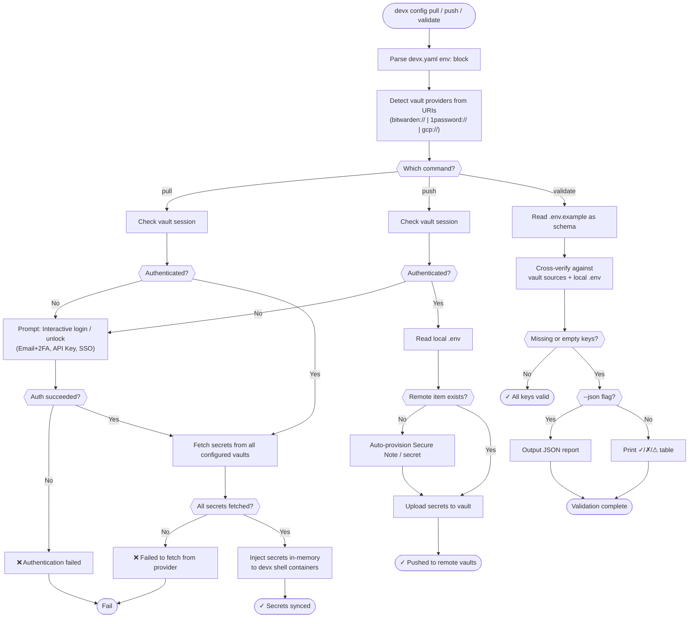

# Vault Secrets Syncing

Setting up `.env` files across a team securely is historically a massive pain, resulting in Slack DMs or wildly out-of-sync configurations between developers.

`devx` integrates directly with secure remote vaults (Bitwarden, 1Password, GCP Secret Manager) to securely synchronize zero-trust infrastructure environments into local Macbook development workflows.

## Architecture & Execution Flow

Below are the architectural component structure and the step-by-step execution flow of Vault Secrets Syncing.

### Component Diagram (C4 Level 2)



### Execution Lifecycle Flowchart



## Pulling Secrets (`devx config pull`)

Instead of sharing `.env` files manually, team members define their secret locations in the `devx.yaml` topology mapping:

```yaml
# devx.yaml
env:
  - bitwarden://devx-env       # Bitwarden Secure Note or Item
  - gcp://projects/my-org/secrets/my-prod/versions/latest
  - 1password://dev/my-app/env # 1Password Item
```

When you start the project for the first time, simply run:

```bash
devx config pull
```

**How it works seamlessly:** 
1. `devx` will intelligently detect if your vault session is missing or locked.
2. It natively wraps interactive flows (like the Bitwarden CLI's `bw login`) into a unified UI prompt right inside your terminal, elegantly bypassing complicated `export BW_SESSION` handling.
3. It fetches the secrets, parses them, and injects them completely in-memory to running `devx shell` container sandboxes.

```text
$ devx config pull
Fetching secrets from 1 sources...
🚫 Bitwarden vault is unauthenticated.
? How would you like to authenticate to Bitwarden?
> Interactive (Email, Password, 2FA)
  API Key (Client ID & Secret)
  SSO (Single Sign-On)
```

## Pushing Secrets (`devx config push`)

If you updated the secrets locally and want to securely push those updates back uphill to the global team vault:

```bash
devx config push
```

**Self-Healing Features:**
- **Auto-unlocking**: Like `pull`, if your session expires, `devx config push` orchestrates inline authentication, supporting robust passkey, SSO, and 2FA prompts dynamically without throwing raw errors at you.
- **Auto-provisioning:** If the secret file or Secure Note doesn't exist remotely yet, `devx` will elegantly build the correct API schema and provision the note for you instantly.

```text
$ devx config push
Pushing local .env to configured vaults...
🔒 Bitwarden vault is locked. Prompting for unlock...
🔓 Vault unlocked! Continuing operations...
Bitwarden item "devx-env" not found. Creating it as a new Secure Note...
✓ Successfully pushed local secrets to remote vaults.
```

## Validating Schema compliance (`devx config validate`)

Before deploying your app or starting a test, you can audit your environment variables for regressions:

```bash
devx config validate
```

```text
📋 Schema: .env.example
🔑 Secret source: devx.yaml (bitwarden://devx-env)

  ✓ CF_API_TOKEN
  ✓ CF_TUNNEL_TOKEN
  ✗ STRIPE_SECRET_KEY  (missing — not found in any vault source)
  ⚠ OPENAI_API_KEY     (present but empty)

  2 of 4 keys failed validation
```

It parses `.env.example` as the single source of truth, cross-verifies against the remote vaults or your local `.env`, and deterministically reports gaps! It also supports **`--json`** so AI agents can natively detect missing environment variables.
