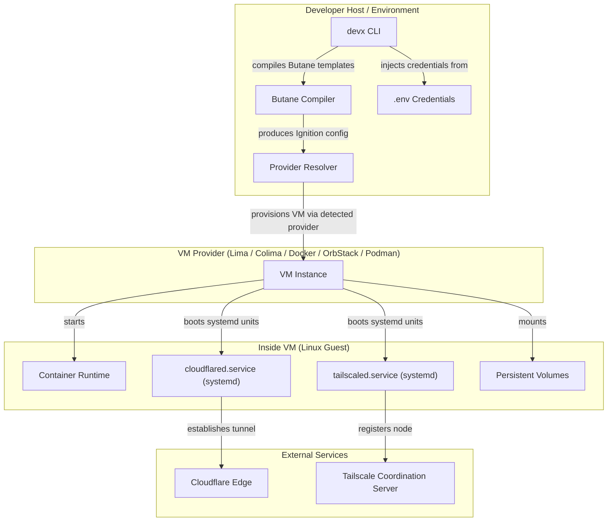
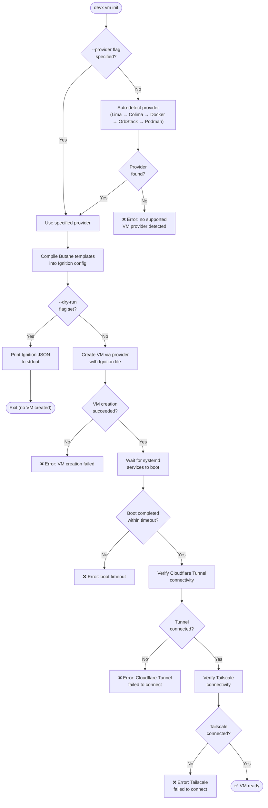
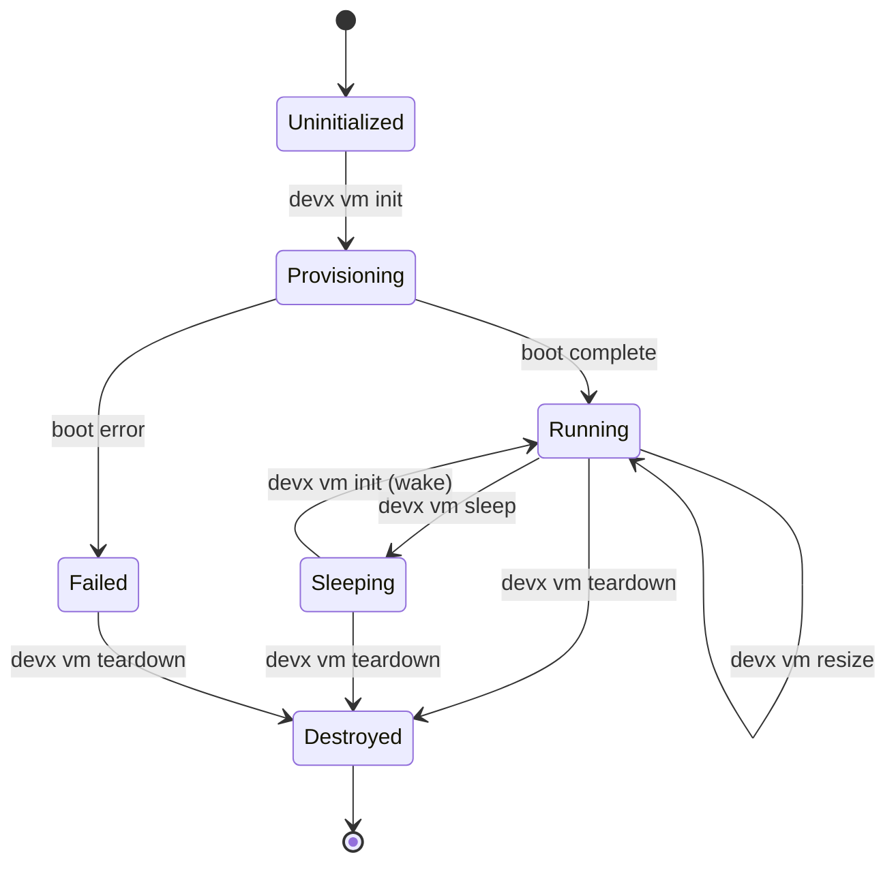

# Container VMs

The `devx vm` commands manage the lifecycle of your local development VM — a lightweight Linux instance running inside your chosen provider (Lima, Colima, Docker, OrbStack, or Podman).

## Architecture & Execution Flow

Below are the architectural component structure and the step-by-step execution flow of the Container VM feature.

### Component Diagram (C4 Level 2)



### Execution Lifecycle Flowchart



### VM Lifecycle States



## Commands

### `devx vm init`

Provisions a new VM with Cloudflare Tunnel and Tailscale pre-configured.

```bash
devx vm init
```

This is the only command most developers need to run. It:

1. Compiles a Butane config into Ignition format
2. Creates a VM using your selected provider with the Ignition file
3. Starts the VM and waits for systemd services to boot
4. Verifies Cloudflare Tunnel and Tailscale connectivity

**Flags:**

| Flag | Default | Description |
|------|---------|-------------|
| `--provider` | `auto-detect` | Backend: `lima`, `colima`, `podman`, `docker`, or `orbstack` |
| `--dry-run` | — | Preview the Ignition config without creating the VM |

### `devx vm status`

Shows the health of all three components:

```bash
devx vm status
```

```
┌──────────────────────────────────────────────────────
│  📊 VM Status
├──────────────────────────────────────────────────────
│  VM:               ✅ running
│  Cloudflare:       ✅ connected (tunnel-id: abc123)
│  Tailscale:        ✅ connected (100.x.x.x)
└──────────────────────────────────────────────────────
```

### `devx vm resize`

Dynamically adjust VM resources without reprovisioning:

```bash
devx vm resize --cpus 4 --memory 8192
```

### `devx vm ssh`

Drop into an SSH shell inside the VM:

```bash
devx vm ssh
```

### `devx vm sleep` / `devx vm sleep-watch`

Pause the VM to free resources, or run a background daemon that auto-sleeps idle VMs:

```bash
devx vm sleep              # Pause now
devx vm sleep-watch        # Auto-sleep after idle timeout
```

### `devx vm teardown`

Stop and remove the VM. This is a **destructive** operation and will prompt for confirmation:

```bash
devx vm teardown
```

## Ignition Configuration

The VM is configured using a [Butane](https://coreos.github.io/butane/) file that compiles to Ignition format. This config:

- Installs and starts `tailscaled` and `cloudflared` as systemd units
- Sets kernel parameters (`fs.inotify.max_user_watches`, `fs.aio-max-nr`)
- Configures persistent volumes for container data
- Injects credentials from your `.env` file

The Butane templates are stored in `internal/ignition/` and compiled at `devx vm init` time.
