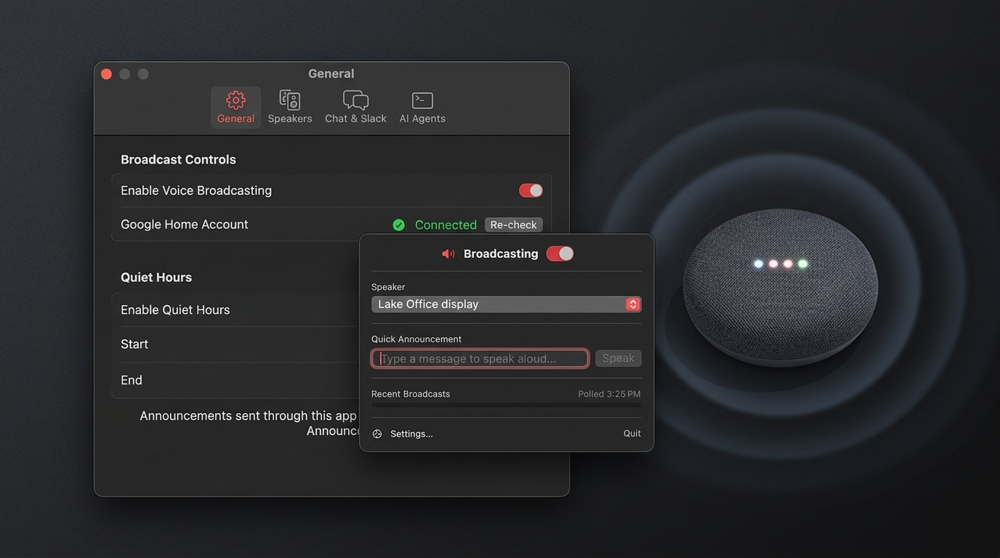

# HomeSpeaker

<p align="center">
  
</p>

A macOS menu bar app that reads things aloud on your Google Home speakers and
Nest displays: a one-line summary of each Claude Code reply, new Slack or
Google Chat messages, or anything you type into the Quick Announcement box.

It lives in the menu bar (no Dock icon), talks straight to Google's hosted
Home API over HTTPS, and needs nothing else installed.

---

## Before you start

You need all three of these. The app cannot work without them.

| Requirement | Why |
|---|---|
| **macOS 14 (Sonoma) or newer**, Apple Silicon or Intel | The app is a universal binary. |
| **A Google Home with at least one speaker or display**, and a **Google Home Premium Advanced** subscription (US, English) | Google gates the Home API behind this plan. Without it the sign-in succeeds but the speaker list comes back empty. |
| **A Google Cloud project of your own** with the Home API enabled (and the Chat API, if you want chat announcements) — or an existing Antigravity login | Google requires every app that touches your home to identify itself, and the app is built so that identity is yours, not a shared one. See [Signing in](#signing-in). |

Optional, only for the features you turn on:

- **Claude Code** — for spoken summaries of each reply.
- **A Slack user token** with the `search:read` scope — for Slack announcements.
- **Google Chat access** on the same Google account — for Google Chat announcements (asked for the first time you switch it on).

---

## Install

HomeSpeaker is **not notarized** — there is no paid Apple Developer ID behind
it — so macOS blocks a normal browser download on first launch. Use the
install script, which downloads the release, checks its published SHA-256,
and clears the quarantine flag:

```bash
curl -fsSL https://raw.githubusercontent.com/VitruvianSoftware/vitruvian-core/main/apps/desktop/home-speaker/scripts/install.sh | bash
```

Prefer to do it by hand? Download `HomeSpeaker-x.y.z-macOS.zip` from the
[Releases page](https://github.com/VitruvianSoftware/vitruvian-core/releases?q=home-speaker),
unzip it, drag `HomeSpeaker.app` to Applications, then **either**:

- open the app once, dismiss the warning, and click **Open Anyway** under
  *System Settings → Privacy & Security*; **or**
- run `xattr -dr com.apple.quarantine /Applications/HomeSpeaker.app`.

You only do this once per install. Verify a download with
`shasum -a 256 -c HomeSpeaker-x.y.z-macOS.zip.sha256`.

---

## First run

Click the speaker icon in the menu bar. The popup walks you through two steps:

1. **Sign in to Google Home** — opens your browser; approve access; come back.
2. **Find speakers** — loads every speaker and display in your home.

That's it. Pick a default speaker, type something in *Quick Announcement*,
press Return.

### Signing in

HomeSpeaker talks to Google as *you*, through an OAuth client you control.
That is deliberate: a shared client would make one project the gatekeeper for
everyone's home, cap it at 100 users until Google verifies it, and put every
user's consent on someone else's screen. So the normal path is your own
Google Cloud project. It is a few minutes, once, and *Settings → Google Cloud*
walks through it:

1. **Create or pick a project** at console.cloud.google.com, on the Google
   account that owns your home.
2. **Enable the Home API** (APIs & Services → Library). Enable the **Google
   Chat API** too if you want chat announcements.
3. **Consent screen → External → Publish.** Left on *Testing*, Google expires
   the login every **7 days** — the app will tell you if that is what is
   happening.
4. **Create an OAuth client.** *Desktop app* needs nothing else. *Web
   application* must list every callback the app can use:
   `http://127.0.0.1:8765/callback` through `:8768/callback`.
5. **Paste the client ID and secret** into *Settings → Google Cloud*, then
   press **Sign In** under *General*.

Two shortcuts, when they apply:

- **Reuse an Antigravity login.** If the Antigravity Google Home connector is
  already signed in on this Mac, *Settings → General → Import Antigravity
  login* copies that session — and the OAuth client behind it — into
  HomeSpeaker's own owner-only secrets file. Nothing else is needed; the
  login refreshes on its own. (That client was registered with Antigravity's
  callback, so the in-app **Sign In** button — needed only to add Google Chat
  permission later — will be refused until you add the loopback callbacks
  above to it.)
- **A release with a bundled client.** If a build ships one, Sign In works
  out of the box. Your own client, when saved, always takes precedence.

Sign out any time from *Settings → General*; it also revokes the token with
Google.

---

## Features

- **Speaker switching** — one click in the menu bar; *Whole Home* broadcasts everywhere.
- **Master switch + quiet hours** — automated announcements are held during quiet hours; things you type yourself still play.
- **Claude Code** — *Settings → AI Agents → Install Hook* adds one `Stop` hook to `~/.claude/settings.json` that runs `HomeSpeaker --claude-stop-hook`. Existing hooks are left alone; the entry is updated automatically if you move the app.
- **Slack / Google Chat** — off by default. Turn on under *Settings → Chat & Slack*; polling runs inside the app, nothing is installed elsewhere.
- **Open at Login** — a standard macOS login item, toggled under *Settings → General*.
- **Command line** — `HomeSpeaker --say "dinner is ready"` announces from a script (exit 1 on failure); `HomeSpeaker --discover` lists what the signed-in account can see, for troubleshooting an empty speaker list. The binary is at `/Applications/HomeSpeaker.app/Contents/MacOS/HomeSpeaker`.

---

## What's stored where

| File | Contents |
|---|---|
| `~/.gemini/speaker_broadcast.json` | Non-secret settings: speakers, default target, quiet hours, monitor toggles. Shared with the `speaker-broadcast` CLI and Gemini/Antigravity skills. |
| `~/Library/Application Support/HomeSpeaker/secrets.json` | Google tokens, Slack token, OAuth client override. Mode `0600`. |
| `~/.gemini/speaker_history.json` | The last 30 announcements shown in the menu. |

Nothing leaves your Mac except requests to Google (Home API, OAuth, Chat API
if enabled) and Slack (if enabled). The app has no telemetry.

Why a file and not the Keychain: an app without a Developer ID has no stable
code identity, so Keychain items would trigger an "allow access?" prompt after
every update. An owner-only file is what `gcloud` and `gh` do.

---

## Building from source

```bash
cd apps/desktop/home-speaker

# Tests (wraps `swift test` with the swift-testing plugin path the
# Command Line Tools toolchain needs; plain `swift test` fails without Xcode)
./scripts/test.sh

# Debug build, run directly
swift build && .build/debug/HomeSpeaker

# Release package exactly as CI produces it (universal .app + zip + sha256)
./scripts/publish.sh --dry-run

# Bazel (monorepo)
bazel build //apps/desktop/home-speaker:HomeSpeaker
```

To embed an OAuth client in a package you build yourself, set
`HOMESPEAKER_GOOGLE_CLIENT_ID` and `HOMESPEAKER_GOOGLE_CLIENT_SECRET` before
running `publish.sh`; CI reads them from repository secrets of the same name.

Releases are cut by release-please from conventional commits under this
directory (tag `home-speaker-vX.Y.Z`). The version is stamped into
`Sources/HomeSpeakerCore/Version.swift` and `Resources/Info.plist` together;
a test fails if they drift.

---

## Known limitations

- **Not notarized.** First launch needs the one-time step above. Fixing this
  requires a paid Apple Developer ID.
- **No auto-update.** Re-run the install script to upgrade.
- **Google Home Premium Advanced is required** by Google for the Home API;
  this is not something the app can work around.

---

## License

Copyright (c) 2026 VitruvianSoftware. MIT Licensed.
