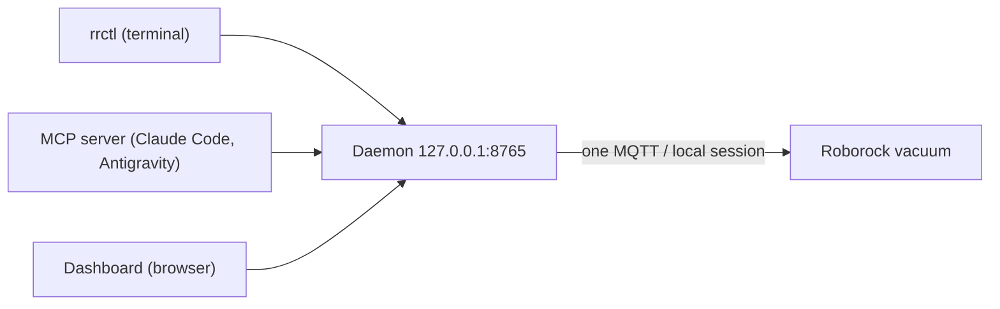

# vitruvian-roborock

Check on and control a Roborock vacuum from this machine: from a terminal
(`rrctl`), from an AI agent (an MCP server), or from a live map in the browser.

One small background process, the **daemon**, holds the only connection to the
vacuum. Everything else asks the daemon.



## Quick start

```sh
rrctl setup        # log in: enter your Roborock email, then the code they email you
rrctl status       # what the vacuum is doing
rrctl dashboard    # live map in the browser
```

If you have used the upstream `roborock` CLI before, `rrctl setup` is not needed:
the login in `~/.roborock` is copied over the first time it is wanted.

## Commands

| Command | What it does |
|---|---|
| `rrctl setup` | Log in with an emailed verification code |
| `rrctl status [--json]` | State, battery, errors, rooms |
| `rrctl map [-o file.png]` | Save the current map |
| `rrctl pause` / `resume` / `dock` | Control the current clean |
| `rrctl daemon [run\|start\|stop\|status]` | Run in the foreground (default) or manage the background daemon |
| `rrctl dashboard [--no-open]` | Open the live dashboard |
| `rrctl mcp` | Serve the MCP tools over stdio |

Commands that need the daemon start it if it is not running.

## Use it from an agent

`plugin/` is both a Claude Code plugin and an Antigravity extension. Each launches
the server with `uvx vitruvian-roborock mcp` and ships two skills, one for first-time
setup and one for day-to-day control.

> **Not on PyPI yet.** Until the package is published, that `uvx` line cannot
> resolve. Run from this checkout instead:
> `uvx --from /path/to/apps/mcp/roborock vitruvian-roborock mcp`.

Tools: `get_status`, `start_clean`, `control`, `return_to_dock`, `wash_mop`,
`get_map`, `setup_login`. Resources: `roborock://status`, `roborock://map.png`,
`ui://dashboard`.

## Where things live

| Path | Contents |
|---|---|
| `~/.config/vitruvian/roborock/credentials.json` | Your Roborock login, mode `0600` |
| `~/.config/vitruvian/roborock/daemon-token` | The secret local clients present to the daemon, mode `0600` |
| `~/.config/vitruvian/roborock/cache/` | Device list cache, so restarts do not spend Roborock's small hourly quota |
| `~/.config/vitruvian/roborock/daemon.log` | Log of a background daemon |

`VITRUVIAN_ROBOROCK_PORT` changes the port; `VITRUVIAN_ROBOROCK_DEVICE` picks a
vacuum by name or id when the account has more than one.

## Development

```sh
uv run pytest              # from apps/mcp/roborock/
bazel test //apps/mcp/roborock:roborock_test
```

See [docs/index.md](docs/index.md) for how it works, the security model, and what
Phase 1 does not do yet.
