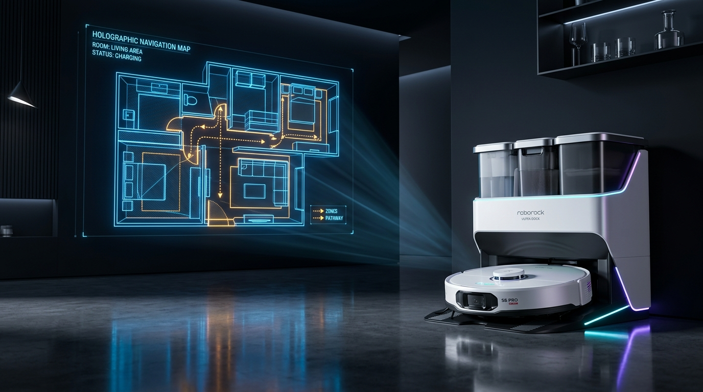
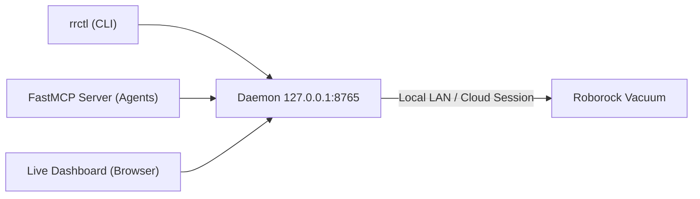

# vitruvian-roborock



> **Autonomous agent control and real-time telemetry for Roborock vacuums.**
> Check on and control your vacuum from a terminal (`rrctl`), from an AI agent (**Antigravity** and **Claude Code**), or from a live map in your browser.

---

## Architecture

One lightweight local process, the **daemon**, manages the single authenticated session with the vacuum (over local LAN or cloud MQTT), protecting device connection quotas. The CLI, MCP tools, and live dashboard communicate securely with the daemon over local loopback.



---

## Quick Installation

### Option 1: Claude Code Plugin (Zero-Checkout)
```bash
claude plugin marketplace add VitruvianSoftware/mcp-roborock
claude plugin install vitruvian-roborock
```

### Option 2: Antigravity Plugin
```bash
git clone https://github.com/VitruvianSoftware/mcp-roborock.git ~/.config/plugins/mcp-roborock
agy plugin install ~/.config/plugins/mcp-roborock/plugin
```

### Option 3: Standalone CLI (`rrctl`)
```bash
uv tool install git+https://github.com/VitruvianSoftware/mcp-roborock
```

---

## Quick Start

```bash
rrctl setup        # Log in with your Roborock account (email verification code)
rrctl status       # Display live vacuum state, battery, and rooms
rrctl dashboard    # Open the real-time visual map in your browser
```

---

## Command Reference

| Command | Description |
|---|---|
| `rrctl setup` | Log in with an emailed Roborock verification code |
| `rrctl status [--json]` | View state, battery, room layout, and cleaning history |
| `rrctl map [-o file.png]` | Save the current floor plan map as a high-res PNG |
| `rrctl pause` / `resume` / `dock` | Control cleaning runs |
| `rrctl daemon [status\|start\|stop]` | Manage the background connection daemon |
| `rrctl dashboard [--no-open]` | Launch the live web dashboard |
| `rrctl mcp` | Start the FastMCP server over stdio |

---

## Agent Capabilities & Skills

When installed as a plugin, your AI agent automatically gains two specialized skills and seven FastMCP tools:

- **Skills**:
  - `roborock-control`: Natural language cleaning, targeted room dispatch, docking, and mop washing.
  - `roborock-setup`: First-time authentication flow directly inside the conversation.
- **FastMCP Tools**:
  - `get_status`: Live status, battery, active errors, and room names.
  - `start_clean`: Start cleaning (full floor plan).
  - `control`: Pause, resume, stop, or find the vacuum.
  - `return_to_dock`: Return to the Ultra dock.
  - `wash_mop`: Trigger automatic mop washing on Ultra docks.
  - `get_map`: Fetch real-time rendered floor map with vacuum trajectory.
  - `setup_login`: Authenticate with Roborock cloud.

---

## Documentation

- [Detailed Installation & User Guide](docs/installation.md)
- [Architecture & Security Model](docs/index.md)
