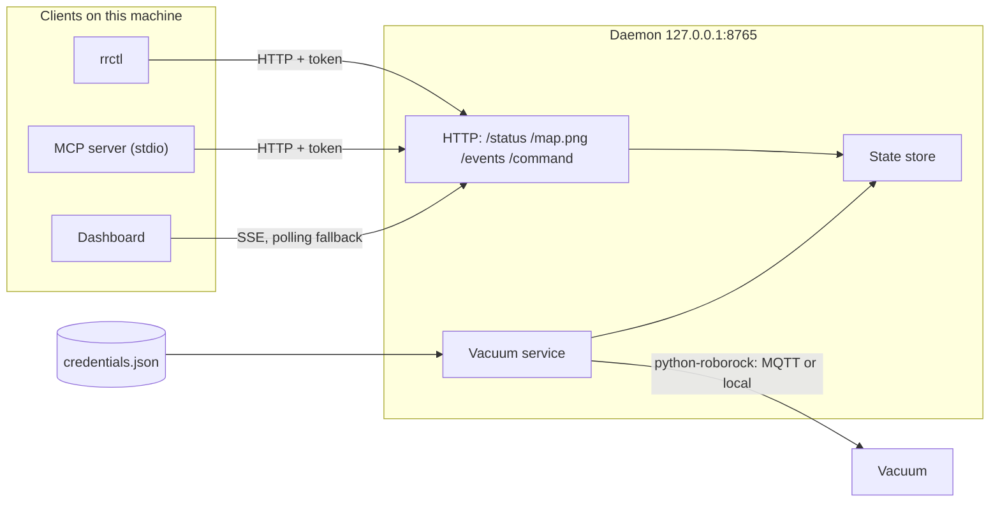

# vitruvian-roborock

Local control of a Roborock vacuum for people and for AI agents. See the
[README](../README.md) for installation and the command list.

## How it fits together



There is one connection to the vacuum, and the daemon owns it. Roborock limits how
often an account may log in and list devices, and the vacuum accepts few sessions,
so three tools each opening their own would get in each other's way. The CLI and
the MCP server are deliberately thin: they make one HTTP request and print the answer.

| Package | Job |
|---|---|
| `core/config.py` | Paths, the credentials file, migration from `~/.roborock`, the daemon token |
| `core/auth.py` | The emailed-code login |
| `core/device.py` | The vacuum: status snapshot, map, commands |
| `daemon/state.py` | Latest status and map; the connect, poll and reconnect loop |
| `daemon/server.py` | The HTTP endpoints and their access checks |
| `daemon/client.py` | The HTTP client the CLI and MCP server share |
| `cli/` | `rrctl` |
| `mcp/` | MCP tools and resources |
| `dashboard/` | The single-file web page |

## The daemon's API

Every endpoint except `/` and `/healthz` needs `Authorization: Bearer <token>`.

| Endpoint | Returns |
|---|---|
| `GET /` | The dashboard page |
| `GET /healthz` | Name, version and pid. Used to tell our daemon from another program on the port |
| `GET /status` | The status document |
| `GET /map.png` | The map. `404` until the vacuum has sent one |
| `GET /events` | Server-sent events: `status` (full document) and `map` (new version number) |
| `POST /command` | `{"command": "pause"}`, optionally with `"params"`. Runs one action |
| `POST /reload` | Re-read the login and reconnect |
| `POST /shutdown` | Stop the daemon |

Actions: `start`, `pause`, `resume`, `stop`, `dock`, `find`, `wash_start`,
`wash_stop`, and `clean_rooms` with `{"rooms": [...], "repeat": 1}`.

A refusal is always the same shape, so every client can explain it:

```json
{"ok": false, "error": "not_authenticated", "message": "Not logged in to Roborock. ..."}
```

| Status | `error` | Meaning |
|---|---|---|
| 401 | `unauthorized` | Missing or wrong token |
| 403 | `forbidden_host`, `forbidden_origin` | Request did not come from this machine's own page |
| 409 | `not_authenticated` | Nobody has logged in, or Roborock rejected the stored login |
| 503 | `not_connected` | Logged in, but the vacuum or cloud is unreachable |
| 502 | `device_error` | The vacuum refused the action |
| 400 | `unknown_command`, `bad_request` | The request itself is wrong |

## Before anyone has logged in

Nothing crashes and nothing retries against Roborock. The daemon starts, reports
`authenticated: false` with a hint, and answers commands with `409`. The MCP tools
pass that on as an ordinary result, so an agent reads the hint and offers
`setup_login`. After a login, `POST /reload` (sent automatically by `rrctl setup`
and `setup_login`) makes the daemon connect.

If Roborock later rejects the stored login, the daemon stops trying and says so,
rather than repeating a login the cloud has already refused.

## Security model

The daemon listens on loopback only, but a browser on the same machine can reach
loopback from any web page, so loopback alone is not enough. Three checks apply:

1. **Host header.** Must be `127.0.0.1:<port>` or `localhost:<port>`. Stops a
   hostile domain that resolves to `127.0.0.1` (DNS rebinding).
2. **Origin header.** If present, must be the daemon's own. Stops another site's
   page from calling the API. No CORS headers are ever sent.
3. **Bearer token.** 256 random bits in a `0600` file. Only processes running as
   you can read it.

`POST` bodies must be `application/json`, which a cross-site HTML form cannot send.
The dashboard gets its token in the URL fragment (`/#token=...`), which browsers do
not send to servers; the page moves it to `sessionStorage` and clears the address
bar. The token is never accepted in a query string.

What this does not defend against: another program already running as you. It can
read the token file, and the credentials file beside it.

## Credentials

Stored at `~/.config/vitruvian/roborock/credentials.json`, written `0600` through a
temp file and an atomic rename so they are never briefly world-readable. The format
wraps python-roborock's own `UserData`.

If that file is absent and `~/.roborock` (written by the upstream `roborock` CLI)
holds a login, the login is copied across on first use. Only the login is copied,
not the upstream cache, and `~/.roborock` is left untouched so the upstream CLI keeps working.

## Not in Phase 1

- **Only V1-protocol vacuums** (the S and Q series robots). Newer B01 models and the
  Dyad and Zeo appliances are detected and refused with a clear message.
- **One vacuum at a time.** With several on an account, the first is used unless
  `VITRUVIAN_ROBOROCK_DEVICE` names another.
- **No zones, schedules, suction or water settings.**
- **Not published to PyPI**, so the plugin's `uvx vitruvian-roborock mcp` does not
  resolve until it is.
- **The MCP App dashboard is untested in a real host.** Served by the daemon, the
  dashboard uses plain HTTP. Embedded by an MCP host as `ui://dashboard`, it talks
  to the host over `postMessage` instead; that path follows the MCP Apps spec but
  has not been run against a host that renders apps.
- **No service unit.** The daemon is started on demand, not at login.
