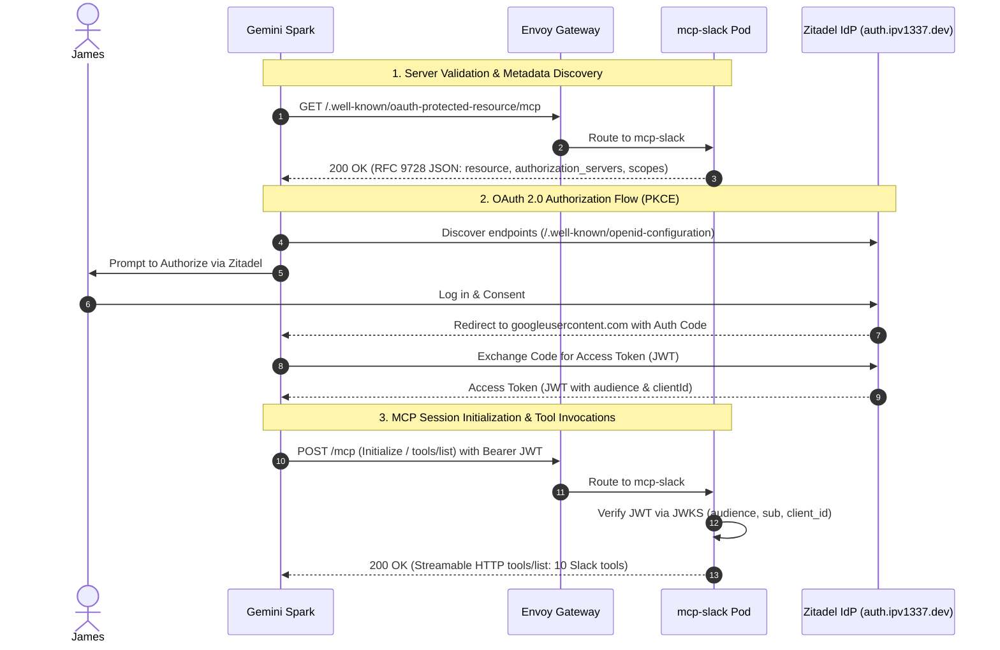

# Extend `mcp-slack` for Gemini Spark Custom App Support

## Overview
We will adapt and extend the hosted HTTP transport of `mcp-slack` so that it seamlessly connects to Google Gemini Spark as a custom MCP application over Streamable HTTP and OAuth 2.0, mirroring the successful integration pattern we implemented for Backstage MCP.

---

## Technical Context & Learnings from Backstage MCP

Gemini Spark requires specific protocol handshakes when connecting to an OAuth-protected MCP server:
1. **RFC 9728 Protected Resource Metadata Discovery**:
   - Gemini probes `GET /.well-known/oauth-protected-resource` or `GET /.well-known/oauth-protected-resource/mcp`.
   - The response must return HTTP 200 with JSON describing the resource URI, authorization servers (`https://auth.ipv1337.dev`), and supported scopes.
2. **RFC 6750 / RFC 9728 `WWW-Authenticate` Header on 401 Responses**:
   - When `/mcp` is called without credentials or with an invalid token, the HTTP 401 response must include `WWW-Authenticate: Bearer error="...", error_description="...", resource_metadata="https://mcp-slack.ipv1337.dev/.well-known/oauth-protected-resource/mcp"`.
3. **Gateway Routing**:
   - The Kubernetes Gateway API `HTTPRoute` must route both `/mcp` and `/.well-known/oauth-protected-resource` through to the pod.
4. **Zitadel OIDC Client**:
   - The Zitadel OIDC client must issue JWT access tokens (`OIDC_TOKEN_TYPE_JWT`) and accept Gemini Spark's callback redirect URI (`https://oauth-redirect.googleusercontent.com/r/...`).
5. **Tool Naming & Schema Strictness**:
   - Tool names must strictly match `^[a-zA-Z0-9_]{1,64}$` (all 10 HTTP-advertised `slack_*` tools already satisfy this).
   - Input schemas must avoid `anyOf`/`oneOf`/unions (all `mcp-slack` schemas are clean standard JSON schemas).

---

## Architectural Workflow

---

## Proposed Changes

### Component 1: `mcp-slack` Server (`mcp-slack/src/`)

#### [MODIFY] [httpTransport.ts](file:///Users/james/Workspace/gh/application/vitruvian/vitruvian-core/mcp-slack/src/httpTransport.ts)
- Add handler for RFC 9728 discovery endpoint `/.well-known/oauth-protected-resource` and `/.well-known/oauth-protected-resource/mcp`.
- Update `writeAuthFailure()` to inject `resource_metadata="https://<host>/.well-known/oauth-protected-resource/mcp"` in the `WWW-Authenticate` header on HTTP 401.
- Ensure endpoint returns supported scopes (`openid`, `offline_access`, `urn:zitadel:iam:org:project:id:<projectId>:aud`) and authorization servers (`[config.issuer]`).

#### [MODIFY] [httpTransport.test.ts](file:///Users/james/Workspace/gh/application/vitruvian/vitruvian-core/mcp-slack/__tests__/httpTransport.test.ts)
- Add unit tests for `/.well-known/oauth-protected-resource` and `/.well-known/oauth-protected-resource/mcp` returning valid RFC 9728 JSON without authentication.
- Add assertions verifying `WWW-Authenticate` header includes `resource_metadata` on 401 rejections.

---

### Component 2: Helm Chart & Ingress (`mcp-slack/deploy/chart/`)

#### [MODIFY] [httproute.yaml](file:///Users/james/Workspace/gh/application/vitruvian/vitruvian-core/mcp-slack/deploy/chart/templates/httproute.yaml)
- Add a rule matching `/.well-known/oauth-protected-resource` prefix alongside `/mcp` so Envoy Gateway forwards metadata discovery requests to the pod.

#### [MODIFY] [values.yaml](file:///Users/james/Workspace/gh/application/vitruvian/vitruvian-core/mcp-slack/deploy/chart/values.yaml)
- Document the well-known discovery path and any relevant metadata defaults.

---

### Component 3: Zitadel Infrastructure (`infrastructure/pulumi/platform/zitadel-apps-mcp-slack/`)

#### [MODIFY] [main.go](file:///Users/james/Workspace/gh/application/vitruvian/vitruvian-core/infrastructure/pulumi/platform/zitadel-apps-mcp-slack/main.go)
- Update `RedirectUris` in `ApplicationOidcArgs` to include:
  - `https://vertexaisearch.cloud.google.com/oauth-redirect`
  - `https://oauth-redirect.googleusercontent.com/r/user_bound_custom-mcp-106163123583431838693-mcp-slack_ipv1337_dev`
  - Generic/standard Google Cloud OAuth redirect URIs.

---

### Component 4: GitOps Deployment (`gitops/argocd/applications/`)

#### [MODIFY] [mcp-slack.yaml.disabled](file:///Users/james/Workspace/gh/application/vitruvian/vitruvian-core/gitops/argocd/applications/mcp-slack.yaml.disabled)
- Prepare the Application manifest with required values:
  - `oidc.projectId`, `oidc.clientId`, `oidc.allowedSubjects`, `networkPolicy.enabled: true`.
- Ready for activation when Slack bot tokens & channels are set up.

---

## User Review Required

> [!IMPORTANT]
> **Slack App & Channel Requirements for Live Deployment**:
> 1. To complete live testing on Kubernetes, the Slack bot needs to be invited to allow-listed channels, and `mcp-slack-tokens` secret created.
> 2. For local testing and PR validation, all unit tests and chart renders run completely offline with mocked credentials.

---

## Verification Plan

### Automated Tests
- Run `pnpm test` in `mcp-slack` (all 6 test suites, 134+ tests).
- Run `bazel test //...` across the monorepo.
- Run `bazel run //:tidy` and format checks.
- Run Helm chart rendering checks (`helm template`).

### Manual / Integration Verification
- Verify RFC 9728 endpoint locally:
  `curl -i http://127.0.0.1:<port>/.well-known/oauth-protected-resource/mcp` -> returns 200 with valid JSON.
- Verify 401 challenge locally:
  `curl -i -X POST http://127.0.0.1:<port>/mcp` -> returns 401 with `WWW-Authenticate: Bearer ..., resource_metadata="..."`.
