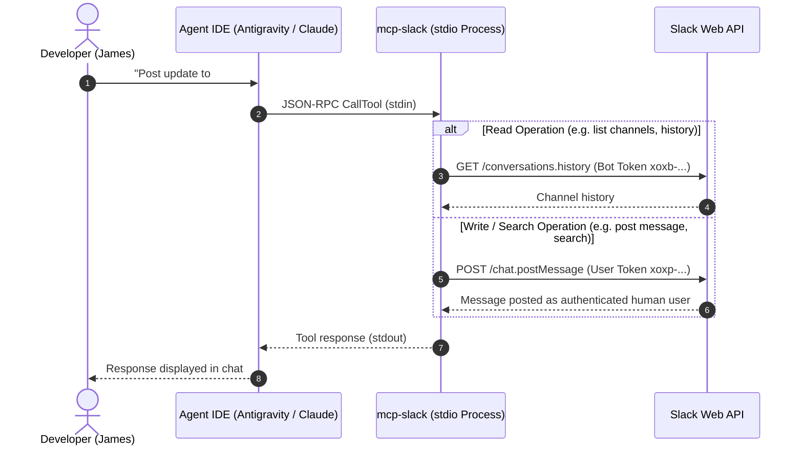
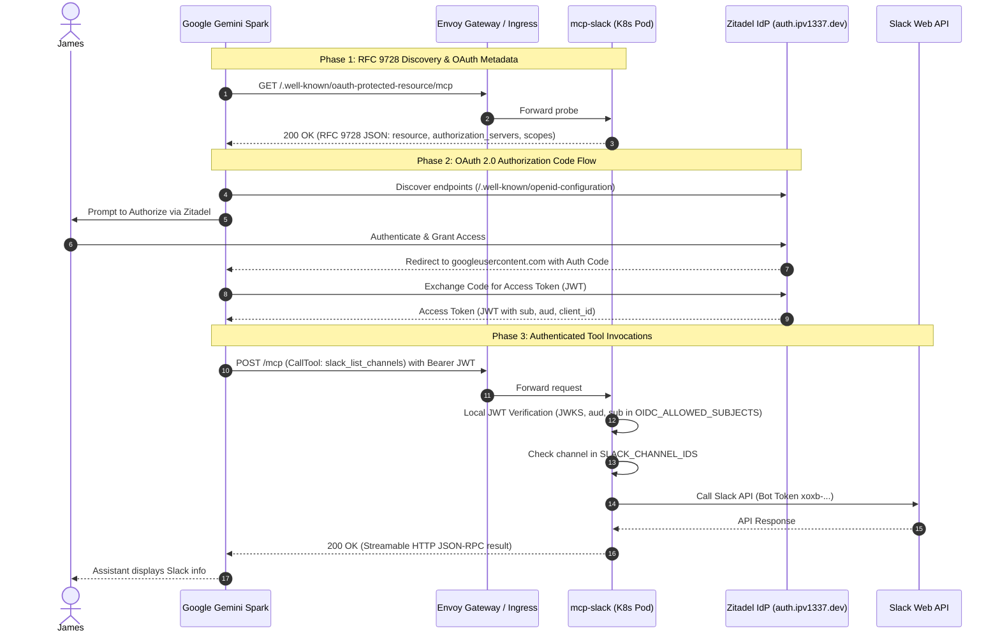

# `mcp-slack` Gemini Spark Custom App Integration Walkthrough

We have extended `mcp-slack` to support Google Gemini Spark custom MCP connections and added comprehensive documentation with visual sequence diagrams.

---

## 🏛️ The Two Usage Modes

`mcp-slack` supports two operating modes tailored to different execution environments and trust boundaries:

| Property | Mode 1: Local Stdio Transport | Mode 2: Hosted Streamable HTTP Transport |
|---|---|---|
| **Target Client** | Claude Code, Antigravity, Cursor, Codex | Google Gemini Spark Custom MCP Apps |
| **Transport Protocol** | `stdio` (JSON-RPC over stdin/stdout) | `Streamable HTTP` (RFC 9728 + OAuth 2.0) |
| **Authentication** | Local process environment variables | RFC 9728 metadata discovery + Zitadel OAuth (JWT) |
| **Identity & Writes** | Dual-Token: Posts *as you* (User Token `xoxp-...`) | Bot Token: Posts as app bot (Bot Token `xoxb-...`) |
| **Security Controls** | Local machine boundary; optional channel filter | Strict per-request Zitadel `sub` allowlist + channel allowlist |
| **Tool Surface** | All 22 tools (messaging, search, canvases, pins) | 10 curated HTTP-safe tools |

---

## 📊 Visual Sequence Diagrams

### 1. Mode 1: Local Stdio Architecture (Desktop Pair Programming)

---

### 2. Mode 2: Hosted Streamable HTTP Architecture (Gemini Spark Custom MCP App)

---

## 🛠️ Summary of Code Changes in PR #1966

1. **RFC 9728 Discovery** in [`httpTransport.ts`](file:///Users/james/Workspace/gh/application/vitruvian/vitruvian-core/mcp-slack/src/httpTransport.ts):
   - Handles `GET /.well-known/oauth-protected-resource` and `/.well-known/oauth-protected-resource/mcp`.
   - Injects `resource_metadata` in `WWW-Authenticate` header on HTTP 401 challenges.
2. **Ingress Routing** in [`httproute.yaml`](file:///Users/james/Workspace/gh/application/vitruvian/vitruvian-core/mcp-slack/deploy/chart/templates/httproute.yaml):
   - Added `/.well-known/oauth-protected-resource` PathPrefix routing.
3. **Zitadel OIDC Redirect URIs** in [`main.go`](file:///Users/james/Workspace/gh/application/vitruvian/vitruvian-core/infrastructure/pulumi/platform/zitadel-apps-mcp-slack/main.go):
   - Added Gemini Spark `googleusercontent.com` OAuth callback URIs.
4. **Documentation** in [`README.md`](file:///Users/james/Workspace/gh/application/vitruvian/vitruvian-core/mcp-slack/README.md) & [`docs/index.md`](file:///Users/james/Workspace/gh/application/vitruvian/vitruvian-core/mcp-slack/docs/index.md):
   - Added comprehensive user guides, comparison table, and Mermaid sequence diagrams.
5. **Unit Tests** in [`httpTransport.test.ts`](file:///Users/james/Workspace/gh/application/vitruvian/vitruvian-core/mcp-slack/__tests__/httpTransport.test.ts):
   - Added automated tests verifying discovery endpoints and challenge header injection (135 tests passing).
