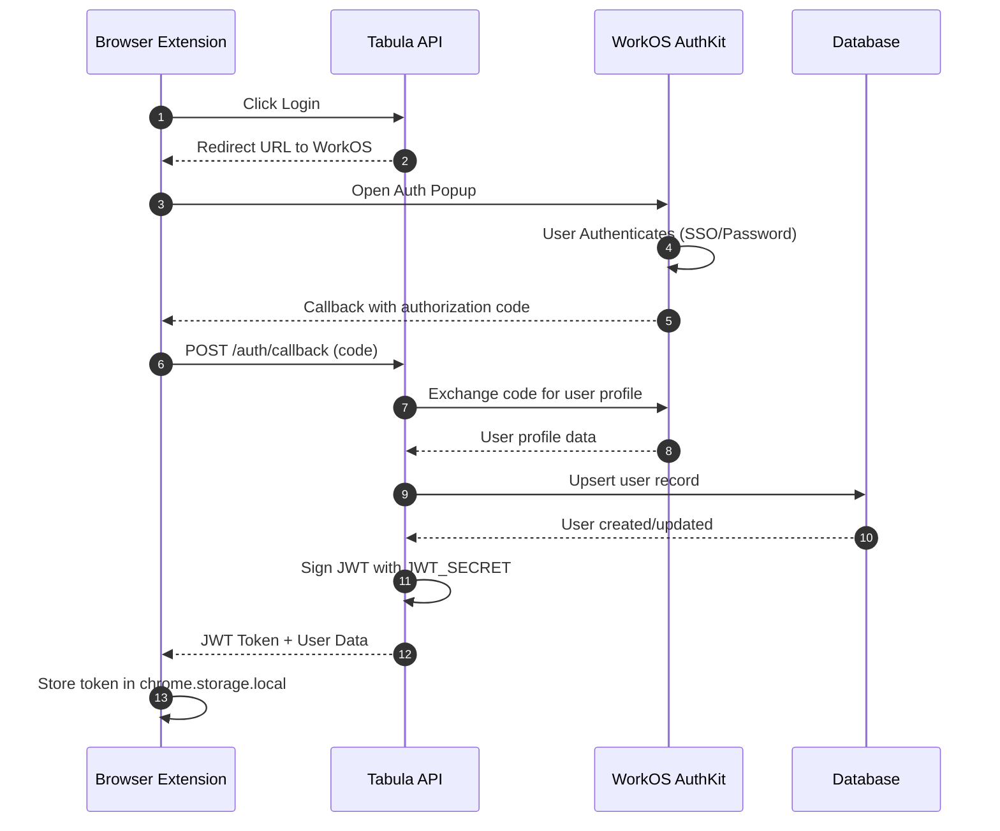
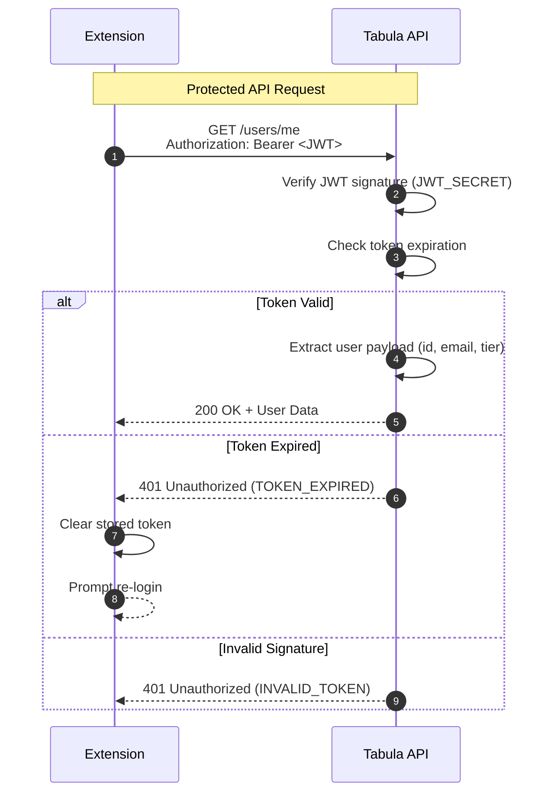
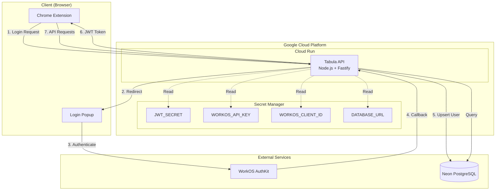
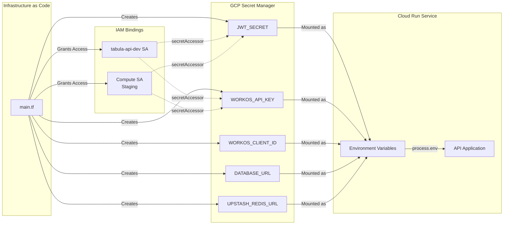

# Authentication & Authorization

## Overview

Tabula uses a secure, modern authentication system built on WorkOS AuthKit for SSO capabilities and
JWT tokens for API authentication. This approach provides enterprise-grade security while
maintaining a simple developer experience.

## Architecture

### Authentication Flow



### JWT Token Lifecycle



### Component Architecture



### Secret Management (Cloud Run)



## Components

### WorkOS AuthKit

**Purpose**: SSO authentication provider

**Features**:

- Google, Microsoft, GitHub SSO
- Magic link authentication
- Password-based authentication
- MFA support
- Session management
- Password reset flows

**Integration**:

- API Key and Client ID stored in environment variables
- Redirect URLs configured in WorkOS dashboard
- Users synced to local database on first login

**Endpoints**:

- `/api/v1/auth/login` - Redirects to WorkOS AuthKit
- `/api/v1/auth/callback` - Handles OAuth callback and issues JWT

### JWT Tokens

**Purpose**: API authentication and authorization

**Token Structure**:

```json
{
  "id": "user-uuid",
  "email": "user@example.com",
  "tier": "free",
  "iat": 1234567890,
  "exp": 1234567890
}
```

**Configuration**:

- Secret: Stored in `JWT_SECRET` environment variable
- Expiration: 15 minutes (configurable via `JWT_EXPIRATION`)
- Refresh tokens: 7 days (configurable via `JWT_REFRESH_EXPIRATION`)

**Storage**:

- Extension: Chrome local storage (`chrome.storage.local`)
- Web: HTTP-only cookies (Phase 2)

### Session Management

**Database Schema**:

```sql
CREATE TABLE sessions (
  id UUID PRIMARY KEY,
  user_id UUID REFERENCES users(id),
  refresh_token_hash VARCHAR(255),
  device_info JSONB,
  ip_address INET,
  created_at TIMESTAMP,
  expires_at TIMESTAMP,
  last_active_at TIMESTAMP
);
```

**Features**:

- Session tracking per device
- Automatic session cleanup
- Device fingerprinting
- IP address logging
- Last active tracking

## API Endpoints

### Authentication Endpoints

#### `GET /api/v1/auth/login`

Initiates SSO authentication flow by redirecting to WorkOS AuthKit.

**Response**: 302 Redirect to WorkOS

---

#### `GET /api/v1/auth/callback`

Handles OAuth callback from WorkOS and issues JWT token.

**Query Parameters**:

- `code`: Authorization code from WorkOS

**Response** (JSON):

```json
{
  "token": "eyJhbGci...",
  "user": {
    "id": "user-uuid",
    "email": "user@example.com",
    "name": "John Doe",
    "tier": "free"
  }
}
```

**Response** (HTML for browser): Returns HTML page that posts message to opener window with token
and user data.

---

### User Profile Endpoints

#### `GET /api/v1/users/me`

Get current user profile.

**Authentication**: Required (JWT Bearer token)

**Response**:

```json
{
  "data": {
    "id": "user-uuid",
    "email": "user@example.com",
    "name": "John Doe",
    "tier": "free",
    "createdAt": "2024-01-01T00:00:00Z",
    "updatedAt": "2024-01-01T00:00:00Z",
    "lastLoginAt": "2024-01-01T00:00:00Z",
    "preferences": {}
  }
}
```

---

#### `PATCH /api/v1/users/me`

Update current user profile.

**Authentication**: Required

**Request Body**:

```json
{
  "name": "John Doe",
  "preferences": {
    "theme": "dark"
  }
}
```

**Response**: Updated user profile

---

#### `DELETE /api/v1/users/me`

Delete current user account.

**Authentication**: Required

**Response**: 204 No Content

**Note**: This permanently deletes all user data including workspaces, tabs, and backups.

---

#### `POST /api/v1/users/password-reset`

Request password reset URL.

**Request Body**:

```json
{
  "email": "user@example.com"
}
```

**Response**:

```json
{
  "data": {
    "resetUrl": "http://api.tabula.app/api/v1/auth/login?action=reset_password",
    "message": "Password reset URL generated"
  }
}
```

**Note**: Password reset is handled by WorkOS AuthKit. The URL redirects to the WorkOS
authentication flow.

## Security Considerations

### Token Security

1. **Storage**:
   - Tokens stored in Chrome local storage (not accessible by web pages)
   - Never store tokens in session storage or localStorage in web contexts
   - Use HTTP-only cookies for web dashboard (Phase 2)

2. **Transmission**:
   - Always use HTTPS in production
   - Bearer token in Authorization header
   - Never pass tokens in URL query parameters

3. **Expiration**:
   - Short-lived access tokens (15 minutes)
   - Longer-lived refresh tokens (7 days)
   - Automatic token refresh before expiration

### Password Security

1. **Hashing**:
   - bcrypt with 10 rounds for password hashing
   - Never store plain text passwords
   - Password hashing only used as fallback (WorkOS preferred)

2. **Requirements**:
   - Minimum 8 characters
   - Enforced by WorkOS AuthKit for password-based auth

3. **Reset Flow**:
   - Time-limited reset tokens
   - Handled entirely by WorkOS AuthKit
   - Email verification required

### Rate Limiting

1. **Authentication Endpoints**:
   - 5 login attempts per IP per 15 minutes
   - 10 failed password attempts locks account for 1 hour

2. **API Endpoints**:
   - 100 requests per user per minute
   - 1000 requests per user per hour
   - Implemented via `@fastify/rate-limit` with Redis

### Session Security

1. **Session Hijacking Prevention**:
   - Device fingerprinting
   - IP address validation (optional)
   - User agent validation
   - Session timeout on inactivity

2. **Concurrent Sessions**:
   - Multiple devices allowed
   - Session list visible in account settings
   - Remote session termination supported (Phase 2)

## Extension Integration

### Authentication Service

The extension includes an `AuthService` that handles authentication flow:

```typescript
// Login (opens popup to API/WorkOS)
await AuthService.login();

// Logout
await AuthService.logout();

// Get current user
const user = await AuthService.getUser();

// Get access token
const token = await AuthService.getToken();
```

### API Service

All API requests automatically include authentication:

```typescript
// Gets profile (automatically includes Bearer token)
const profile = await ApiService.getUserProfile();

// Update profile
await ApiService.updateUserProfile({ name: 'New Name' });
```

### Account Settings UI

The extension includes a comprehensive Account Settings component:

**Features**:

- View and edit profile information
- Change password (redirects to WorkOS)
- Delete account with confirmation
- View account tier and plan details

**Navigation**:

- Access via Settings icon in popup header
- Modal overlay with sidebar navigation
- Sections: Account, Preferences

## Testing

### Unit Tests

**Authentication Service**:

- `api/tests/unit/auth.service.test.ts` - Password hashing and verification
- `api/tests/unit/auth.workos.service.test.ts` - WorkOS integration
- `api/tests/unit/user.service.test.ts` - User profile management

**Authentication Middleware**:

- `api/tests/unit/auth.middleware.test.ts` - JWT verification

### Integration Tests

**Auth Routes**:

- `api/tests/integration/auth.routes.test.ts` - Login and callback flows
- `api/tests/integration/user.routes.test.ts` - User profile endpoints

**Extension**:

- `extension/src/services/auth.test.ts` - Extension auth service

### E2E Tests

**Authentication Flow** (Playwright):

- User can log in via WorkOS
- User can access protected resources
- User can log out
- User can view and edit profile
- User can delete account

## Configuration

### Environment Variables

**API (`api/.env`)**:

```bash
# JWT Configuration
JWT_SECRET=your-super-secret-jwt-key-change-this
JWT_REFRESH_SECRET=your-super-secret-refresh-key-change-this
JWT_EXPIRATION=15m
JWT_REFRESH_EXPIRATION=7d

# WorkOS Configuration
WORKOS_API_KEY=your-workos-api-key
WORKOS_CLIENT_ID=your-workos-client-id

# API URL (for callbacks)
API_URL=http://localhost:8080
```

**WorkOS Dashboard**:

1. Create a WorkOS account at [workos.com](https://workos.com)
2. Create a new application
3. Configure redirect URIs:
   - Development: `http://localhost:8080/api/v1/auth/callback`
   - Production: `https://api.tabula.app/api/v1/auth/callback`
4. Enable authentication methods:
   - Google OAuth
   - Microsoft OAuth
   - GitHub OAuth
   - Magic Link
   - Password (optional)

## Troubleshooting

### Common Issues

**Issue**: "WORKOS_API_KEY is not defined"

- **Solution**: Add WorkOS API key to `api/.env` file

**Issue**: "Authentication window blocked by popup blocker"

- **Solution**: User needs to allow popups for the extension

**Issue**: "JWT token expired"

- **Solution**: Token refresh not yet implemented - user needs to log in again

**Issue**: "User not synced to database"

- **Solution**: Check WorkOS callback handler and database connection

**Issue**: "Account deletion fails"

- **Solution**: Check cascade delete constraints in database schema

## Future Enhancements

### Phase 2

- Refresh token implementation
- Remember me functionality
- Session list and management
- Multi-device notification

### Phase 3

- Two-factor authentication (2FA)
- Biometric authentication (WebAuthn)
- Social login (Twitter, Apple)
- Custom SSO domains

### Phase 4

- Team accounts and role-based access
- Admin panel for user management
- Audit logs
- Compliance reporting (GDPR, SOC 2)
