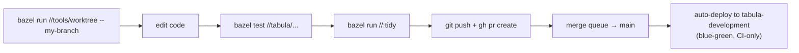

# Development guide

The day-to-day loop for working on Tabula. Assumes you've done the one-time
[Setup](setup.md).

> **Bazel is the build of record.** Tabula builds and tests through the monorepo graph;
> `pnpm`/`node` are editor/tooling fallbacks, not the source of truth. Repo-wide
> mechanics (branching, the merge queue, CI) live in
> [CONTRIBUTING.md](../../../CONTRIBUTING.md); this page is the Tabula-specific inner
> loop.

## The loop



## Run the components

| Component | Command | Notes |
|---|---|---|
| **API** | `bazel run //tabula/api:api_bin` | Reads `tabula/api/.env`; serves on `:8080` |
| **CLI** (`tabcli`) | `bazel run //tabula/cli:tabcli -- <args>` | The admin/ops tool |
| **Extension** | `bazel build //tabula/extension/...` | Then load `bazel-bin/tabula/extension/dist` as an unpacked extension |

**Load the extension in Chrome:** open `chrome://extensions/`, enable *Developer mode*,
click *Load unpacked*, and select `bazel-bin/tabula/extension/dist`.

Backing **Postgres and Redis for tests come up automatically** as Bazel-managed
hermetic services — you do not start a database by hand.

## Test

```bash
bazel test //tabula/...                    # all Tabula tests
bazel test //tabula/api/...                # scope to the API
bazel coverage //tabula/...                # with coverage
```

End-to-end extension specs run as Bazel targets under `//tabula/extension`; flaky
specs are quarantined and exercised nightly rather than blocking a merge — see the
[flaky-test policy](../../../docs/engineering/flaky-tests.md) and the Tabula
[testing guide](../guides/testing.md).

## Database migrations (Prisma)

The schema lives at `tabula/api/prisma/schema.prisma`. Migrations follow the repo's
**expand → deploy → contract** model: the deploy applies *expand* (backward-compatible)
migrations **before** traffic shifts, and genuinely destructive changes are separate
`*_contract` migrations applied only after the old revision drains. The
`migration-safety` required check **fails the PR** on an unsafe expand migration.

- Deploy-path migrations run via `bazel run //tabula/api:migrate_deploy_bin -- --phase expand`.
- The full rules (why, and how to mark a contract migration) are in
  [Guiding Principles § 2.15 and Expand/contract migrations](../../../docs/engineering/application-development-principles.md#215-infra-lands-before-the-app-that-needs-it--expand-deploy-contract).

## Format & land

```bash
bazel run //:tidy          # gazelle + formatters — REQUIRED before every PR
git push && gh pr create   # never merge locally; the merge queue is the only path to main
```

Use Conventional Commit subjects (`feat:`, `fix:`, `docs:` …) — they drive
release-please.

## How Tabula ships

Merging to `main` **auto-deploys `tabula-development`** via a blue-green Cloud Run
rollout (candidate at 0% traffic → smoke → promote). Promotion to
`tabula-nonproduction`/`tabula-production` is **release-gated** (the release-please PR
merges) and runs the *same* immutable image digest. Deploys are **CI-only** — there is
no local `pulumi up` to production; the pipeline is the trigger. The full picture is in
[The SDLC](../../../docs/concepts/sdlc.md), and the infra it deploys into is the
[infrastructure reference](../reference/infrastructure.md).

## Where to go next

- [Architecture overview](../architecture/overview.md) — the system design
- [Operations guide](../guides/operations.md) — running the deployed service
- [Infrastructure reference](../reference/infrastructure.md) — the Pulumi stacks
- [Tabula docs home](../index.md)
