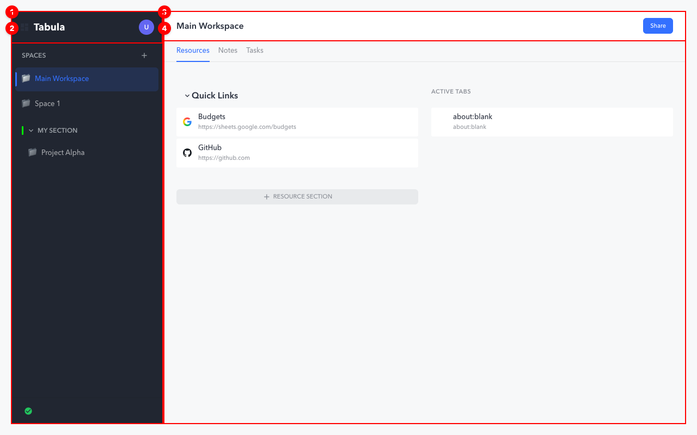
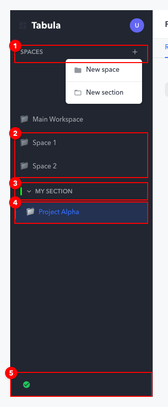
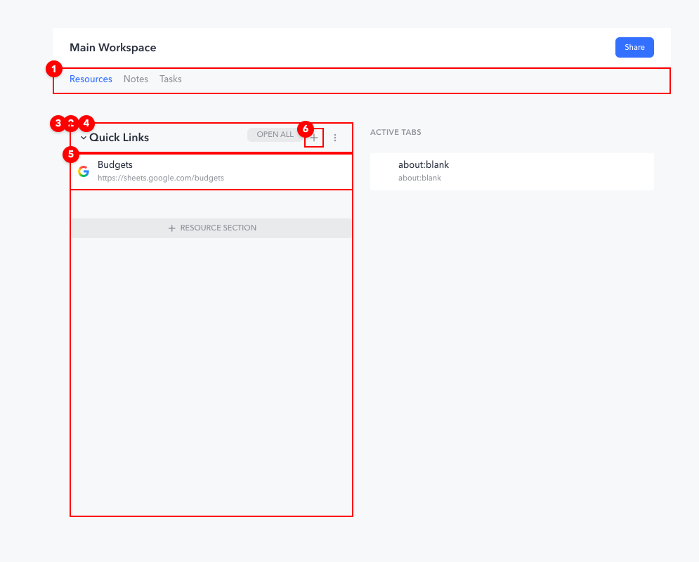
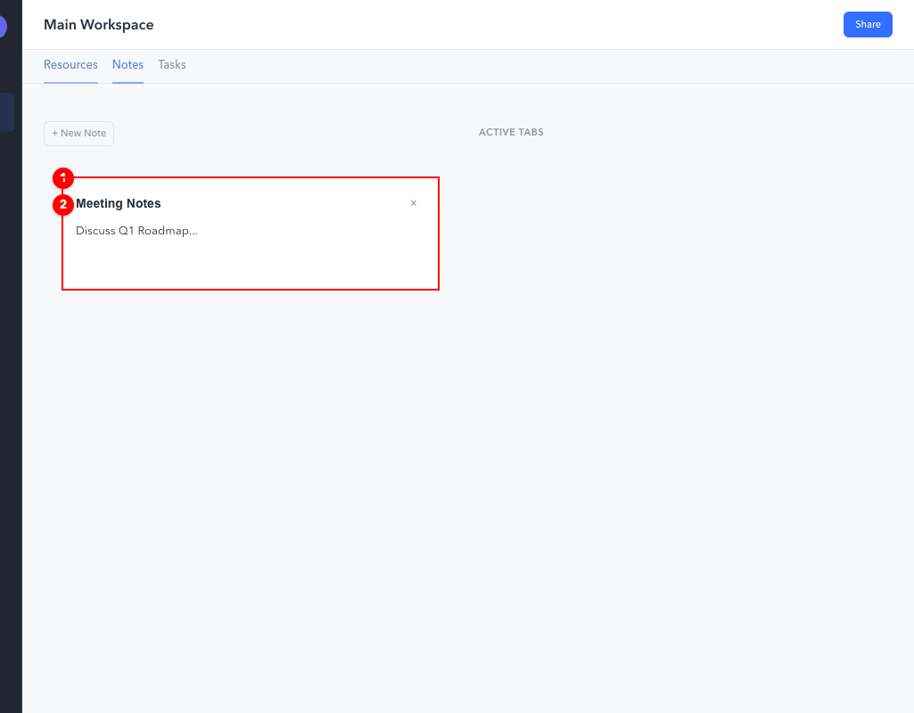
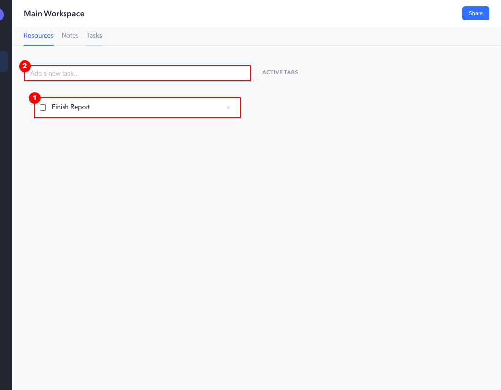
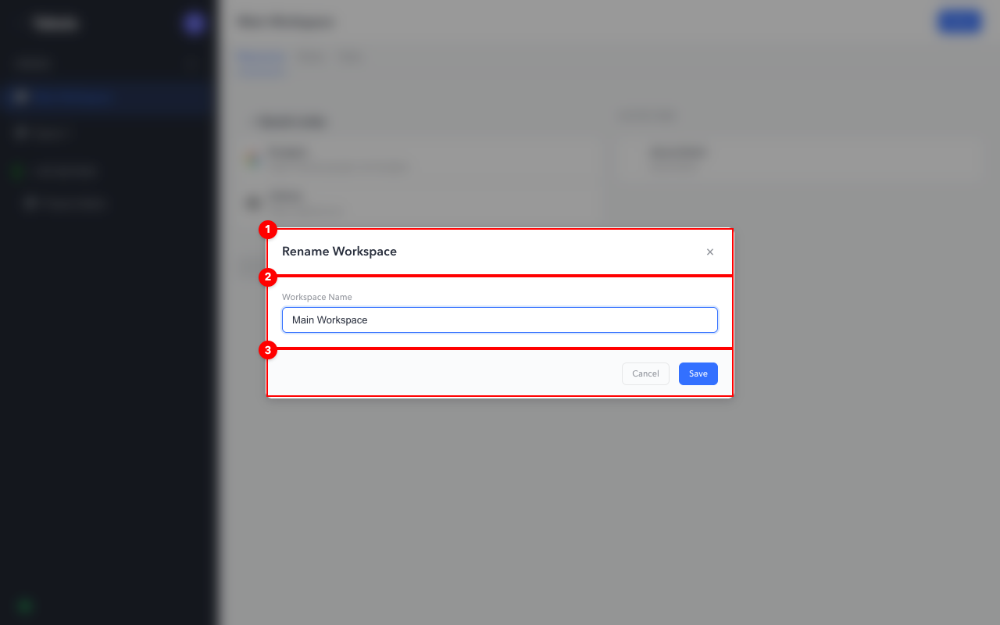

# UI Design Language

This document serves as the canonical reference for the Tabula UI components, their names, and their
visual representation. It is intended to standardize communication regarding UI issues and features.

## 1. Dashboard Structure

The Dashboard is the primary interface for managing workspaces.

1.  **Sidebar**: The left-hand navigation column containing workspaces and groups.
2.  **SidebarHeader**: Top-left area containing the App Logo, User Avatar, and settings trigger.
3.  **MainContent**: The central area displaying the active workspace's details.
4.  **WorkspaceHeader**: The top bar of the main content showing Workspace Name, Tab Count, and
    Actions.

---

## 2. Navigation & Sidebar

The Sidebar manages the hierarchy of spaces.

1.  **SpacesHeader**: The label "SPACES" and top-level action buttons (Add Space, Add Section).
2.  **UngroupedList**: The container for workspaces that don't belong to a section (e.g., "Space
    1").
3.  **SidebarGroupHeader**: The collapsible header for a grouped section (e.g., "My Section").
4.  **WorkspaceNavItem**: An individual navigable workspace item within the list.
5.  **SidebarFooter**: Contains the Sync Status indicator (e.g., Green check for synced).

### 2.1 WorkspaceNavItem Styling

The active workspace displays a **color accent bar** on its left edge. The accent color follows a
priority hierarchy:

| Priority | Source          | CSS Implementation                   |
| -------- | --------------- | ------------------------------------ |
| 1        | Workspace Color | `--workspace-accent-color: <color>`  |
| 2        | Group Color     | Inherited from parent SpaceGroup     |
| 3        | Default         | `var(--color-accent-primary)` (blue) |

**Visual States:**

- **Default**: Neutral text, no background
- **Hover**: Subtle white background highlight (`rgba(255, 255, 255, 0.08)`)
- **Active**: Slightly brighter background (`rgba(255, 255, 255, 0.12)`) + colored accent bar

---

## 3. Workspace Panels

The Main Content area switches between different panels based on user selection.

### 3.1 Resources Panel (Home View)

1.  **TabNavigation**: The pill-shaped switcher at the top (Resources | Notes | Tasks).
2.  **ResourcePanel**: The primary container for resource sections.
3.  **ResourceSection**: A collapsible container for a specific group of resources (e.g., "My
    Section").
4.  **SectionHeader**: The title row for a resource section.
5.  **ResourceCard**: An individual item representing a saved link/resource (e.g., "Budgets").
6.  **AddResourceButton**: The (+) button in the section header used to add new resources.

### 3.2 Notes Panel

1.  **NotesPanel**: The container for all note items.
2.  **NoteItem**: The individual note card (or form) containing title and content.

### 3.3 Tasks Panel

1.  **TasksPanel**: The container for task management.
2.  **TaskInput**: The input field for adding new tasks.

---

## 4. Modals & Overlays

Interactions often trigger overlays for focused actions.

### 4.1 Generic Modal

1.  **ModalHeader**: Displays the title (e.g., "Rename Workspace").
2.  **ModalBody**: Contains the form content involved (e.g., Name input).
3.  **ModalFooter**: Contains the main actions (Cancel, Create/Save).

### 4.2 User Menu

_(Uses standard dropdown components anchored to the Avatar)_
