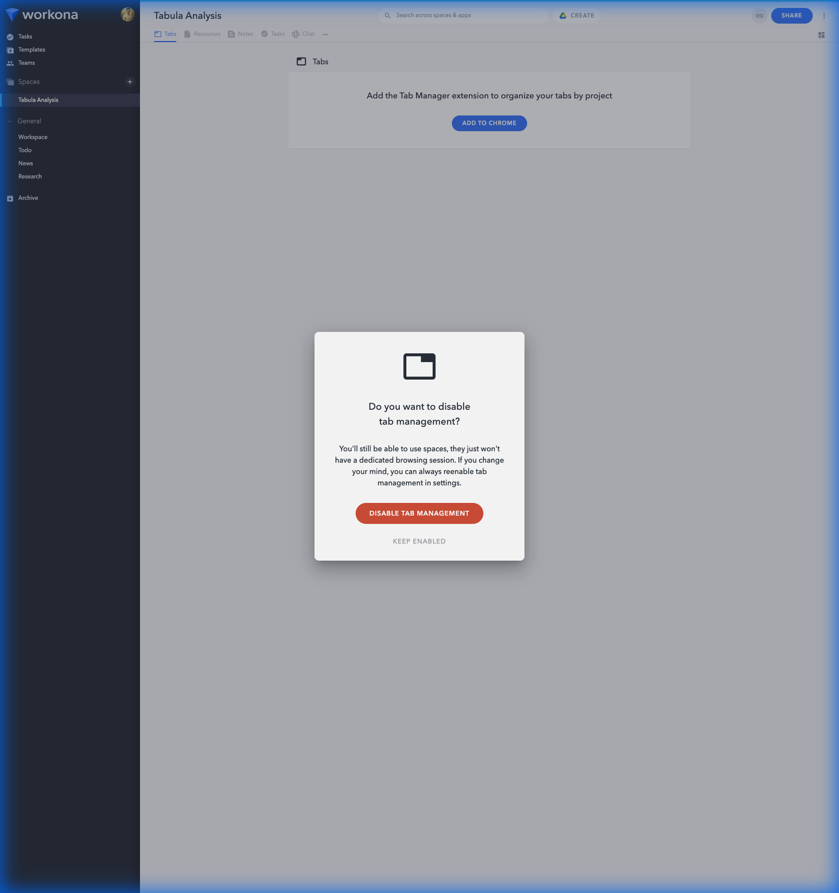

# Workona User Journey Walkthrough

This document records a step-by-step walkthrough of key user journeys within Workona to serve as a
baseline for gap analysis with Tabula.

## Walkthrough Recording

## 1. Workspace Organization

**Objective**: Organize work into distinct spaces.

### Observations

- **Creation**: Spaces are created via a "+" button in the sidebar.
- **Context Menu**: A "three dots" menu provides access to Rename, Change Color, Share, Archive, and
  Delete.
- **Sectioning**: Workspaces can be grouped into custom sections (e.g., "Analysis Results") in the
  sidebar.
- **Aesthetics**: The UI uses subtle shadows, distinct colors for spaces, and smooth modal
  transitions.

### Screenshots

 _Use of a context menu for quick workspace
actions._

## 2. Resource Management

**Objective**: Save and organize links/docs.

### Observations

- **Resources Tab**: A dedicated tab separates saved resources from active tabs.
- **Adding Resources**: A prominent "Add resource" button allows adding URLs.
- **Structure**: Resources are listed clearly with favicons.

## 3. Tab Management

**Objective**: Manage active browser sessions.

### Observations

- **Extension Dependency**: Workona relies on its extension to manage potential "suspension" or
  state saving. The web UI reflects this state.
- **Separation**: Clear distinction between "what I'm working on now" (Tabs) and "what I saved for
  later" (Resources).

## 4. Notes & Tasks

**Objective**: Lightweight project management.

### Observations

- **Notes**: Simple rich-text editor for project context.
- **Tasks**: Checkbox-based task list. Both are integrated directly into the workspace view.
