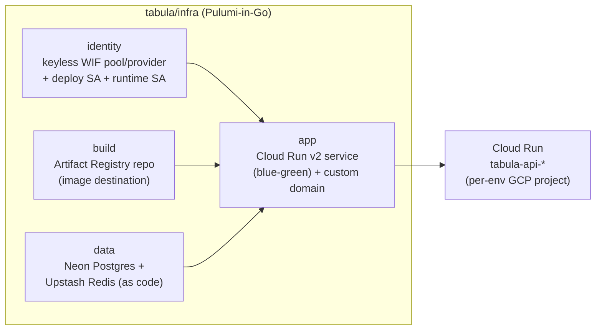

# Tabula infrastructure

Tabula's cloud infrastructure is **Pulumi-in-Go**, one program per concern, under
[`tabula/infra`](../../infra). It is driven exclusively through the monorepo's Bazel
wrappers and applied by the pipeline — never Terraform, never a laptop `pulumi up` to
production.

> This is the Tabula-specific reference. The estate-wide model (identity pinning, the
> wrapper pattern, state) is in
> [docs/infrastructure](../../../docs/infrastructure/index.md); the rule for *where* a
> resource's IaC belongs (foundation vs per-app) is
> [Core vs. application infrastructure](../../../docs/engineering/core-vs-application-infrastructure.md).

## The stacks



| Stack | Path | Manages |
|---|---|---|
| **identity** | [`tabula/infra/identity`](../../infra/identity) | Repo-scoped **Workload Identity Federation** pool/provider, a least-privilege **deploy** service account, and the **runtime** service account — keyless, no JSON keys |
| **build** | [`tabula/infra/build`](../../infra/build) | The Artifact Registry repository the API image is pushed to |
| **data** | [`tabula/infra/data`](../../infra/data) | The stateful tier as code — **Neon** Postgres and **Upstash** Redis (provisioned by Pulumi, not clicked in a console) |
| **app** | [`tabula/infra/app`](../../infra/app) | The **Cloud Run v2** service, traffic/revisions, runtime env + secret wiring, and the custom domain mapping |

Each stack exposes the standard wrapper verbs (identity injected per-project from
`infrastructure/gcp-identities.tsv`):

```bash
bazel run //tabula/infra/<stack>:preview     # everyday: see the diff
bazel run //tabula/infra/<stack>:up          # break-glass only — the pipeline applies
# also: refresh, config, stack, state, import, destroy, setup
```

See the [Bazel targets catalog](../../../docs/reference/bazel-targets.md#infrastructure--pulumi)
and [CONTRIBUTING § Infra & IaC ops](../../../CONTRIBUTING.md#9-infra--iac-ops).

## Runtime shape

- **Compute:** Google **Cloud Run v2**, one service per environment
  (`tabula-api-development`, `-nonproduction`, `-production`), each in its **own GCP
  project** provisioned by the foundation (business-unit-2). The image is pulled from
  the `build` stack's Artifact Registry repo by digest.
- **Data:** **Neon** serverless Postgres (via Prisma) and **Upstash** Redis, both
  declared in the `data` stack.
- **Auth:** **WorkOS** (SSO); see [architecture/authentication](../architecture/authentication.md).
- **Domain:** a stable custom domain per environment (e.g.
  `tabula-api.dev.vitruviansoftware.dev`), mapped in the `app` stack — the deploy does
  not depend on a deploy-minted `*.run.app` URL.

## How it deploys

Deploys are **CI-only** and **blue-green**. On a gated push to `main`,
`tabula-deploy.yaml` (a thin caller over the reusable `_deploy-cloud-run.yaml`)
authenticates keyless via WIF, builds and pushes the image, runs expand-phase Prisma
migrations, brings up a new revision at **0% traffic**, smokes `/health`, then shifts
100%. Promotion to nonproduction/production is release-gated and reuses the same image
digest. The end-to-end flow (with diagrams) is [The SDLC](../../../docs/concepts/sdlc.md)
and [Deployment strategy](../../../docs/engineering/deployment-strategy.md).

## Secrets & config

Three tiers, per the repo model
([CONTRIBUTING § Secrets handling](../../../CONTRIBUTING.md#7-secrets-handling)):

- **App runtime secrets → GCP Secret Manager** (prefix `TABULA_`), read by the runtime
  service account at request time. They **never transit CI**.
- **Pulumi-stack secrets → env-injected in CI**, gitignored `Pulumi.<stack>.yaml`
  locally, via the shared `secrets.EnvOrConfig` helper. Never a committed `secure:`
  blob.
- **Non-secret identifiers** (project id, region, SA emails, WIF provider) *are*
  committed as config-as-code in `Pulumi.<env>.yaml`.

The local development `.env` (`tabula/api/.env`) is a **separate, gitignored** set of
dev values — see [Setup](../getting-started/setup.md).

## See also

- [Architecture overview](../architecture/overview.md) — the system design
- [Operations guide](../guides/operations.md) — running the deployed service
- [Infrastructure estate](../../../docs/infrastructure/index.md) — the repo-wide Pulumi estate
- [Tabula docs home](../index.md)
