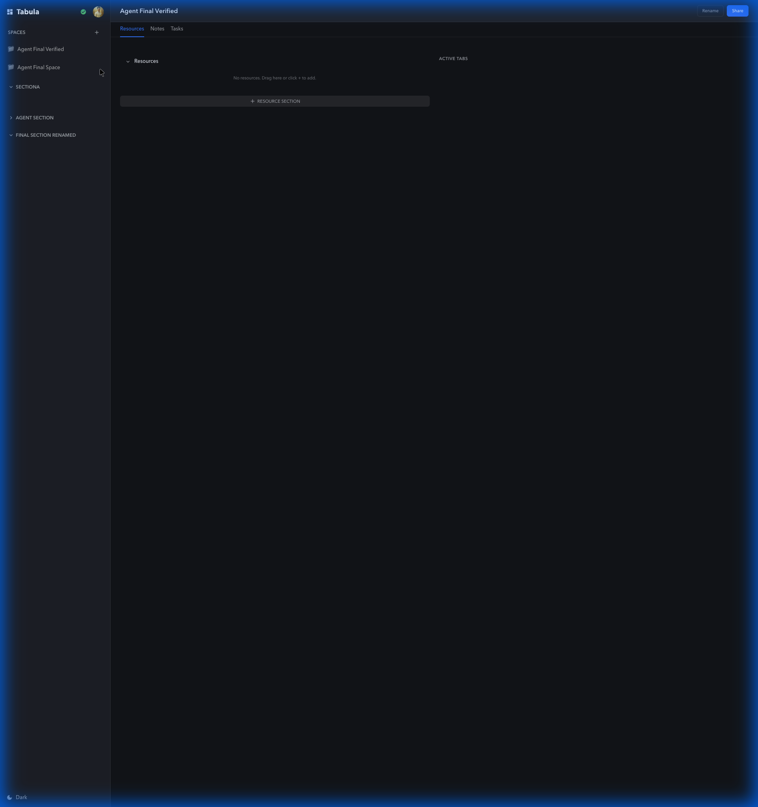
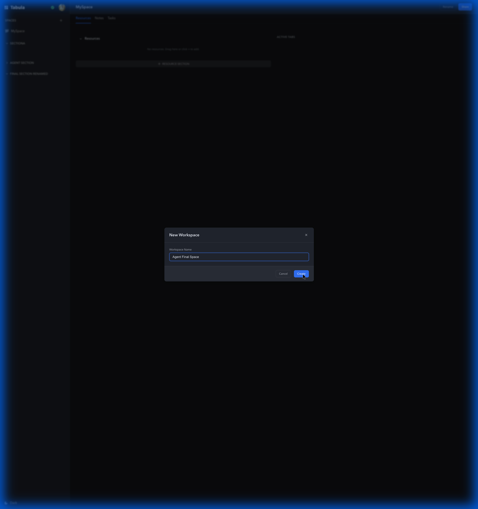

# Tabula Browser Extension

A lightweight, privacy-conscious browser tab management extension with workspace support.

## Features

- 🗂️ **Workspace Management**: Create up to 10 workspaces to organize your tabs
- 💾 **Tab Saving**: Save and restore tab sessions with one click
- 🔄 **Workspace Switching**: Seamlessly switch between different projects
- 💤 **Tab Suspension**: Reduce memory usage by suspending inactive tabs
- 🎨 **Customization**: Personalize workspaces with icons and colors
- 🪟 **Multi-Window**: Open different workspaces in different windows (like Workona)
- 🔗 **Local-First Sharing**: Share workspaces with public links without compromising privacy
- 🔒 **Privacy-First**: All data stored locally, no external tracking

## Quick Start

### Development

```bash
# Install dependencies (from project root)
npm install

# Build extension
npm run build --workspace=extension

# Development mode with watch
npm run dev --workspace=extension

# Run tests
npm test --workspace=extension
```

### Installation

#### Chrome

1. Navigate to `chrome://extensions/`
2. Enable "Developer mode" (top right)
3. Click "Load unpacked"
4. Select the `extension/dist` directory
5. Pin the extension to your toolbar

#### Edge

1. Navigate to `edge://extensions/`
2. Enable "Developer mode" (left sidebar)
3. Click "Load unpacked"
4. Select the `extension/dist` directory
5. Pin the extension to your toolbar

#### Firefox (Development)

1. Navigate to `about:debugging#/runtime/this-firefox`
2. Click "Load Temporary Add-on"
3. Select `manifest.json` from `extension/dist`

**Note**: Firefox extension will reload on browser restart in development mode.

## Usage



### Creating a Workspace

1. Click the Tabula icon in your browser toolbar
2. Click "+ New" button
3. Enter workspace name and optional description
4. Choose an icon and color
5. Click "Create"



### Saving Tabs

1. Open the tabs you want to save
2. Click the Tabula icon
3. Select or create a workspace
4. Click "Save Tabs"

### Restoring Tabs

1. Click the Tabula icon
2. Find your workspace
3. Click "Restore" to open tabs in a new window
4. Or click "Switch" to replace current tabs

### Suspending Tabs

- Enable auto-suspend in settings
- Configure suspension timeout (default: 30 minutes)
- Inactive tabs will be suspended automatically
- Or manually suspend tabs to save memory

## Architecture

### Components

```
extension/
├── src/
│   ├── background/       # Service worker for background tasks
│   ├── popup/           # Main extension popup UI
│   ├── components/      # Reusable React components
│   ├── services/        # Business logic services
│   │   ├── storage.ts   # Chrome storage API wrapper
│   │   ├── tabs.ts      # Tab management operations
│   │   └── workspace.ts # Workspace CRUD operations
│   ├── stores/          # Zustand state management
│   │   ├── workspace.ts # Workspace state
│   │   └── settings.ts  # Extension settings
│   ├── types/           # TypeScript definitions
│   └── icons/           # Extension icons
└── tests/              # Unit and E2E tests
```

### Tech Stack

- **React 18**: UI framework
- **TypeScript**: Type safety
- **Zustand**: Lightweight state management
- **Webpack 5**: Build system
- **Jest**: Unit testing
- **Playwright**: E2E testing
- **Manifest V3**: Modern extension API

## Testing

### Unit Tests

```bash
npm test --workspace=extension
```

Tests cover:

- Storage operations
- Workspace management
- Tab operations
- State management

### E2E Tests

```bash
npm run test:e2e --workspace=extension
```

Tests cover:

- User workflows
- UI interactions
- Extension lifecycle

### Code Coverage

```bash
npm run test:coverage --workspace=extension
```

## Building

### Development Build

```bash
npm run dev --workspace=extension
```

Creates unminified build with source maps for debugging.

### Production Build

```bash
npm run build --workspace=extension
```

Creates optimized, minified build for distribution.

### Build Output

```
dist/
├── manifest.json        # Extension manifest
├── popup.html          # Popup HTML
├── popup.js            # Popup bundle (~154KB)
├── background.js       # Background worker (~288B)
└── icons/              # Extension icons
    ├── icon16.png
    ├── icon48.png
    └── icon128.png
```

**Total Size**: ~304KB (well under 50MB limit)

## Performance

- **Startup Time**: < 100ms
- **Popup Load**: < 200ms
- **Memory Footprint**: < 20MB
- **Tab Suspension**: Reduces per-tab memory by ~95%

## Browser Support

| Browser | Status       | Version | Notes            |
| ------- | ------------ | ------- | ---------------- |
| Chrome  | ✅ Supported | 88+     | Primary target   |
| Edge    | ✅ Supported | 88+     | Chromium-based   |
| Firefox | ⚠️ Partial   | 109+    | Requires testing |

## Security

### Permissions

- `tabs`: Read and manage browser tabs
- `storage`: Store workspace data locally
- `alarms`: Schedule background tasks
- `host_permissions`: Access tab URLs for saving

### Privacy

- ✅ All data stored locally
- ✅ No external API calls in MVP
- ✅ No analytics or tracking
- ✅ No personal data collection
- ✅ Open source and auditable

## Troubleshooting

### Extension not loading

- Ensure you selected the `dist` folder, not the `src` folder
- Check browser console for errors
- Try rebuilding: `npm run build --workspace=extension`

### Tabs not saving

- Check extension has `tabs` permission
- Verify active window
- Check browser console for errors

### Settings not persisting

- Check extension has `storage` permission
- Verify local storage isn't full
- Try clearing extension data and reloading

### Build errors

```bash
# Clean rebuild
rm -rf node_modules dist
npm install
npm run build --workspace=extension
```

## Contributing

See [CONTRIBUTING.md](../../CONTRIBUTING.md) for guidelines.

### Development Workflow

1. Create feature branch
2. Make changes
3. Add tests
4. Run linting: `npm run lint:fix --workspace=extension`
5. Run tests: `npm test --workspace=extension`
6. Build: `npm run build --workspace=extension`
7. Test manually in browser
8. Submit PR

### Code Style

- TypeScript strict mode
- Functional components with hooks
- ESLint + Prettier
- Comprehensive JSDoc comments

## License

MIT - See [LICENSE](../../LICENSE)

## Links

- [Documentation](https://bluecentre.github.io/tabula/)
- [GitHub Repository](https://github.com/VitruvianSoftware/vitruvian-core)
- [Issue Tracker](https://github.com/VitruvianSoftware/vitruvian-core/issues)

## Roadmap

### Phase 1 (MVP) - Current

- [x] Workspace management (10 workspaces)
- [x] Tab save/restore
- [x] Tab suspension
- [x] Chrome support
- [x] Edge support
- [ ] Firefox compatibility
- [ ] Chrome Web Store submission

### Phase 2 - Planned

- [ ] Multi-Window Workspaces (URL-based state)
- [ ] "Relay" Sharing (Local-First Public Links)
- [ ] Cloud sync
- [ ] Session history (30 days)
- [ ] Search across workspaces
- [ ] Keyboard shortcuts
- [ ] Context menus
- [ ] Import/export

### Phase 3 - Future

- [ ] Tab preview thumbnails
- [ ] Workspace templates
- [ ] Collaboration features
- [ ] Mobile companion app
- [ ] Advanced filtering
- [ ] Analytics dashboard
