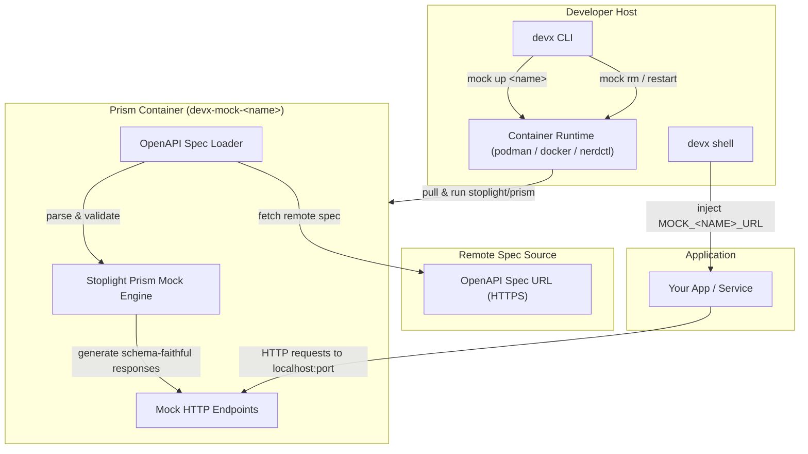
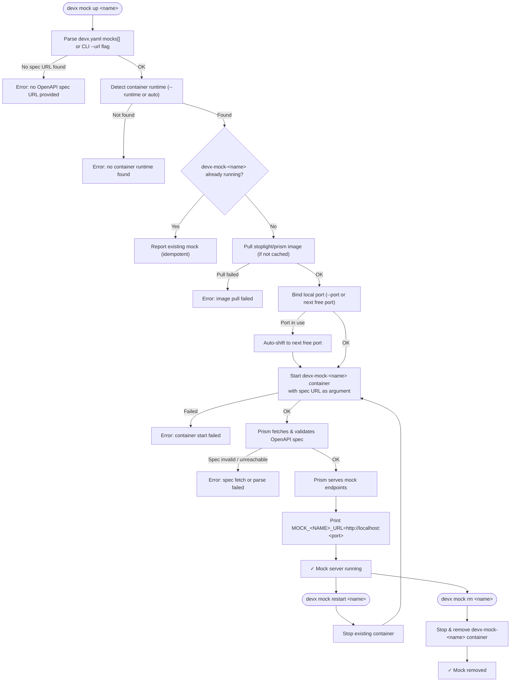

# Local API Mocking

## The Problem

If Stripe goes down, if Twilio throttles your sandbox, or if an internal downstream team's staging API is unavailable—your local development is completely blocked. You can't test payment flows, notifications, or integrations until the dependency recovers.

## The Solution: `devx mock`

`devx mock` spins up an intelligent, **schema-faithful mock server** for any 3rd-party or internal API in seconds using a remote OpenAPI spec. Mocks run as persistent background containers alongside your databases — always available, zero cost, offline-capable.

```bash
devx mock up stripe \
  --url https://raw.githubusercontent.com/stripe/openapi/master/openapi/spec3.yaml
```

The mock returns structurally correct responses generated from the OpenAPI schema, giving your application realistic data to work with without ever hitting a real API.

## Configuration

**CLI + YAML Parity**: All options are configurable both via CLI flags and `devx.yaml`.

### YAML Configuration (committed team defaults)

```yaml
# devx.yaml
mocks:
  - name: stripe
    url: https://raw.githubusercontent.com/stripe/openapi/master/openapi/spec3.yaml
    port: 4010   # (Optional — defaults to next free port)

  - name: internal-payments
    url: https://internal-api.company.com/openapi.json
```

### CLI Flags (one-off use, overrides YAML)

```bash
# Start all mocks from devx.yaml
devx mock up

# Start a specific mock by name
devx mock up stripe

# Start an ad-hoc mock without devx.yaml
devx mock up stripe \
  --url https://raw.githubusercontent.com/stripe/openapi/master/openapi/spec3.yaml

# Use Docker instead of Podman
devx mock up stripe --runtime docker
```

## Architecture & Execution Flow

Below are the architectural component structure and the step-by-step execution flow of Local API Mocking.

### Component Diagram (C4 Level 2)



### Execution Lifecycle Flowchart



## How It Works

1. Pulls the `stoplight/prism` image (industry-standard OpenAPI mock engine)
2. Starts a background container (`devx-mock-<name>`) bound to a free local port
3. Prism fetches the remote OpenAPI spec and starts serving schema-faithful HTTP responses
4. Reports the `MOCK_<NAME>_URL` environment variable you can inject into your application

## Lifecycle Commands

| Command | Description |
|---------|-------------|
| `devx mock up [name]` | Start all (or named) mocks from `devx.yaml` |
| `devx mock list` | List running mock servers with ports and env vars |
| `devx mock restart <name>` | Restart a mock (re-fetches the latest spec) |
| `devx mock rm <name>` | Stop and remove a mock |

## Environment Variables Injected

Each mock automatically maps to an environment variable you can use in your application:

| Mock Name | Environment Variable | Value |
|-----------|---------------------|-------|
| `stripe` | `MOCK_STRIPE_URL` | `http://localhost:4010` |
| `internal-payments` | `MOCK_INTERNAL_PAYMENTS_URL` | `http://localhost:4011` |

## Verification Proof

The sequence below demonstrates the full lifecycle: starting a mock for the Petstore3 API, listing it, querying it for a live schema-generated response, restarting it, and removing it.


The curl response `{"id":10,"petId":198772,"quantity":7,...}` is a **real, schema-faithful response** generated by Prism from the OpenAPI spec — no real API was called.

::: tip Restart to pick up spec changes
Use `devx mock restart <name>` whenever the upstream OpenAPI spec changes. Prism re-fetches and reloads the spec on restart.
:::

::: info Local file support
V1 only supports remote HTTP/HTTPS OpenAPI spec URLs. Local file spec support (volume-mounting) is planned for a future release.
:::

::: info One mock per name
Like `devx db spawn`, `devx mock up` provisions one container per named mock. Running the same `devx mock up stripe` twice is idempotent — it will detect the running container and report it as already live.
:::
