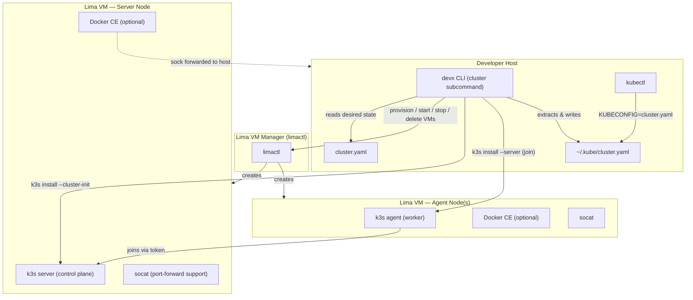
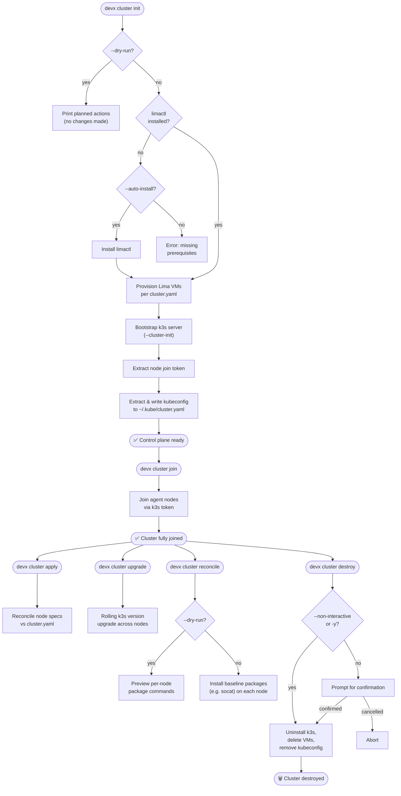

# Multi-Node Clusters

The `devx cluster` command suite allows you to provision and manage a local, multi-node Kubernetes (K3s) cluster using Lima VMs. It's designed for advanced developers whose applications are large enough to require scaling their local Kubernetes development beyond a single laptop or node.

## Configuration

To orchestrate a multi-node cluster, you define a `cluster.yaml` file at the root of your project or workspace. This file describes the desired state of your cluster, including the version of K3s and the specifications for each node.

See `cluster.yaml.example` in the repository root for a complete reference.

```yaml
cluster:
  name: devx-cluster
  k3sVersion: "v1.35.3+k3s1"
  kubeconfig: "~/.kube/cluster.yaml"

nodes:
  - host: james-mbp
    role: server
    pool: laptop-cp-1
    vm:
      cpus: 4
      memory: 8GiB
      disk: 30GiB
```

## Architecture & Execution Flow

Below are the architectural component structure and the step-by-step execution flow of Multi-Node Clusters.

### Component Diagram (C4 Level 2)



### Execution Lifecycle Flowchart



## Commands

The cluster manager provides several commands to handle the lifecycle of your multi-node cluster.

### `devx cluster init`

Bootstraps a new cluster from the config file. It will provision the Lima VMs on each configured host, install prerequisites, and bootstrap the initial K3s server in HA mode.

*   **Idempotent**: It skips steps that are already completed.
*   **Dry Run**: Use `-n` or `--dry-run` to see what would happen without making changes.
*   **Auto Install**: Use `--auto-install` to automatically install missing local prerequisites (like `limactl`).

### `devx cluster join`

Joins new or pending agent nodes to the existing cluster. Useful for expanding your cluster after the initial `init`.

### `devx cluster reconcile`

Converges already-provisioned nodes to devx's current **node baseline** without rebuilding them. Today that means ensuring the standard package set is installed inside every node's Lima VM — notably **`socat`**, which `kubectl port-forward` and [`devx bridge`](bridge.md) require to carry traffic on Docker-runtime k3s nodes.

Run this on a cluster that was created before a node-level requirement landed (for example, an older cluster whose nodes predate the `socat` baseline), so it can adopt the requirement without a `destroy`/`init` cycle.

*   **Idempotent**: package installs are no-ops on nodes that already satisfy the baseline; safe to run repeatedly.
*   **Dry Run**: use `-n` or `--dry-run` to preview the exact per-node command without changing anything.
*   **Scope**: it only installs packages inside existing VMs — it does **not** touch K3s, node membership, or VM lifecycle (use `init`/`join`/`apply` for those).

### `devx cluster apply`

Reconciles the cluster state. It ensures all running nodes match the specifications in the `cluster.yaml` configuration.

### `devx cluster upgrade`

Performs a rolling upgrade of the K3s version across the cluster according to the `k3sVersion` specified in the configuration. 

### `devx cluster remove`

Gracefully drains and cordons a specific node, and removes it from the Kubernetes cluster.

### `devx cluster destroy`

Tears down the entire cluster. Uninstalls K3s, stops and deletes all Lima VMs, and removes the exported kubeconfig.

*   **Non-Interactive**: Use `-y` or `--non-interactive` to skip the destructive confirmation prompt.

## Docker Runtime Support

By default, the cluster nodes use the internal `containerd` container runtime inside the Lima VMs. If you require standard Docker runtime support (for example, to build and run images using the Docker CLI directly, or run containers side-by-side with Kubernetes on the node), you can enable the Docker runtime.

To do this, add the `docker` option under the `cluster` configuration block in `cluster.yaml`:

```yaml
cluster:
  name: devx-cluster
  k3sVersion: "v1.35.3+k3s1"
  kubeconfig: "~/.kube/cluster.yaml"
  docker:
    enabled: true
```

When enabled, `devx cluster` will:
1. Install Docker CE inside each VM.
2. Grant the guest login user access to the `docker` group.
3. Configure K3s to use Docker (`--docker`) as the container runtime.
4. Forward the guest VM's `/var/run/docker.sock` to the host machine.

### Accessing Docker from the Host

For each node in the cluster, you can interact with its Docker daemon directly from the node's physical host machine using the forwarded Unix socket.

#### Option 1: Symlink the Docker Socket (Frictionless, Default)

To run standard `docker` commands directly without setting any environment variables, you can symlink the forwarded socket to `/var/run/docker.sock` on the host:

```bash
sudo ln -sf "$HOME/.lima/k8s-node/sock/docker.sock" /var/run/docker.sock
docker ps
```

#### Option 2: Set the `DOCKER_HOST` environment variable

Alternatively, you can direct your Docker CLI to the socket via the `DOCKER_HOST` environment variable:

```bash
export DOCKER_HOST="unix://$HOME/.lima/k8s-node/sock/docker.sock"
docker ps
```


