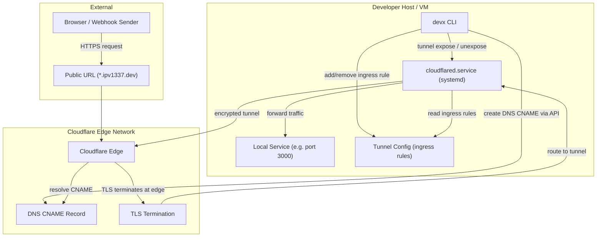
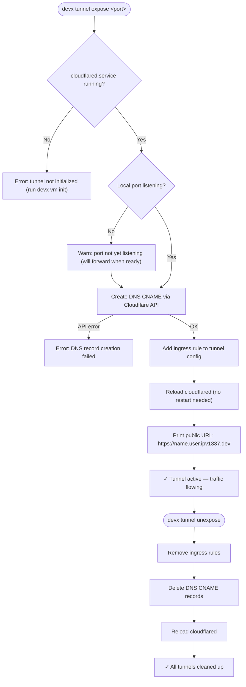

# Cloudflare Tunnels

The `devx tunnel` commands give you **ngrok-like port exposure** backed by Cloudflare's global edge network. Expose any local port to the internet with a public HTTPS URL — no port forwarding, no firewall rules, no SSL certificates to manage.

## Architecture & Execution Flow

Below are the architectural component structure and the step-by-step execution flow of Cloudflare Tunnels.

### Component Diagram (C4 Level 2)



### Execution Lifecycle Flowchart



## Commands

### `devx tunnel expose`

Expose a local port to the internet:

```bash
devx tunnel expose 3000 --name myapp
# → https://myapp.your-name.ipv1337.dev
```

This creates a DNS CNAME record in Cloudflare and adds an ingress rule to the tunnel config — all without restarting the tunnel.

**Flags:**

| Flag | Description |
|------|-------------|
| `--name` | Subdomain name (e.g., `myapp` → `myapp.your-name.ipv1337.dev`) |
| `--protocol` | Protocol to use (`http`, `https`, `tcp`) |

### `devx tunnel unexpose`

Clean up all exposed ports:

```bash
devx tunnel unexpose
```

This removes the DNS records and ingress rules created by `expose`.

### `devx tunnel list`

Show currently exposed ports and their public URLs:

```bash
devx tunnel list
```

```
PORT    NAME      URL
3000    myapp     https://myapp.james.ipv1337.dev
8080    api       https://api.james.ipv1337.dev
```

### `devx tunnel inspect`

Launch a live TUI to inspect and replay HTTP traffic flowing through the tunnel:

```bash
devx tunnel inspect
```

This provides a real-time view of requests, responses, and headers — useful for debugging webhooks and API integrations.

### `devx tunnel update`

Rotate Cloudflare credentials without rebuilding the VM:

```bash
devx tunnel update
```

## How It Works

1. `devx vm init` creates a persistent Cloudflare Tunnel with credentials stored inside the VM
2. The tunnel runs as a `systemd` unit (`cloudflared.service`) and starts automatically on boot
3. `devx tunnel expose` dynamically adds ingress rules and creates DNS CNAMEs via the Cloudflare API
4. Traffic flows: **Internet → Cloudflare Edge → Encrypted Tunnel → VM → Your Container**

## Use Cases

### Webhook Development

Test Stripe, GitHub, or Slack webhooks against your local server:

```bash
devx tunnel expose 3000 --name webhooks
# Configure Stripe webhook URL: https://webhooks.james.ipv1337.dev/stripe/events
```

### Sharing Work in Progress

Share a prototype with a teammate or stakeholder:

```bash
devx tunnel expose 5173 --name demo
# Send them: https://demo.james.ipv1337.dev
```

### Mobile Testing

Test your web app on a phone without being on the same network:

```bash
devx tunnel expose 3000 --name mobile-test
# Open https://mobile-test.james.ipv1337.dev on your phone
```

### OAuth Callbacks & Stripe Webhooks (No Local TLS Needed)

Many third-party services — Stripe, GitHub OAuth, Google OAuth, Slack — require a **verified HTTPS callback URL** and reject `http://localhost` outright.

`devx tunnel expose` solves this completely. Your public tunnel URL is backed by Cloudflare's edge with a CA-signed TLS certificate. **No `mkcert`, no local CA, no certificate management required.**

```bash
devx tunnel expose 3000 --name myapp

# Configure in Stripe Dashboard:
# Webhook URL: https://myapp.james.ipv1337.dev/webhooks/stripe

# Configure in Google OAuth:
# Authorized redirect URI: https://myapp.james.ipv1337.dev/auth/callback

# Configure in GitHub OAuth App:
# Callback URL: https://myapp.james.ipv1337.dev/auth/github/callback
```

::: tip No mkcert needed
Cloudflare manages TLS at the edge. Your local app still runs on plain `http://localhost` —
the HTTPS is handled for you end-to-end.
:::

## Declarative Mode

Define port exposures in `devx.yaml` alongside your databases:

```yaml
tunnels:
  - port: 3000
    name: frontend
  - port: 8080
    name: api
```

Then bring everything up:

```bash
devx up
```
