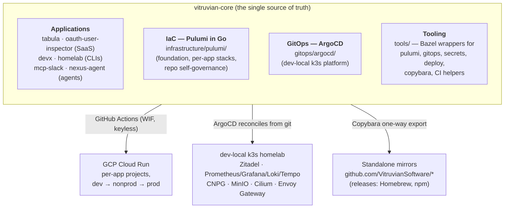

# vitruvian-core documentation

This is the documentation hub for the `vitruvian-core` monorepo — every first-party
application, the infrastructure that hosts them, the self-hosted platform, and the
tooling that ties it all together.

**Start with the page for your role.** Each quick start gets you productive in under
an hour and links onward to the deeper material.

| You are a… | You want to… | Start here |
|---|---|---|
| **Application developer** | Build, test, and ship an app (or create a new one) | [App developer quick start](getting-started/app-developer.md) |
| **Platform engineer** | Change infrastructure, the GCP foundation, or the k8s platform | [Platform engineer quick start](getting-started/platform-engineer.md) |
| **Operator** (app or platform) | Deploy, promote, monitor, rotate secrets, handle incidents | [Operator quick start](getting-started/operator.md) |
| **Repo admin** | Govern the repo: merge queue, CI checks, mirrors, releases | [Repo admin quick start](getting-started/repo-admin.md) |
| **AI agent** | Work in this repo without breaking its invariants | [`AGENTS.md`](../AGENTS.md) + [Guiding Principles](engineering/application-development-principles.md) |

## The 5-minute picture

`vitruvian-core` is a polyglot (TypeScript + Go) [Bazel](https://bazel.build) monorepo.
Apps live beside the Pulumi infrastructure that hosts them and the ArgoCD/GitOps
definition of the self-hosted platform. Everything ships through one pipeline; apps are
mirrored one-way to standalone repos — **all development happens here**.

Three invariants shape everything (the full set is in the
[Guiding Principles](engineering/application-development-principles.md)):

1. **Everything as code, applied by the pipeline.** Infra is Pulumi, the cluster
   reconciles from git via ArgoCD, repo settings are Pulumi-managed. Never click-ops,
   never an imperative one-off; the pipeline — not a laptop — is the trigger.
2. **One build graph.** Bazel builds and tests everything; `bazel run //:tidy` is the
   single hygiene gate; the merge queue is the only way to land on `main`.
3. **Secrets never live in git.** GCP Secret Manager (app runtime), sealed-secrets
   (k8s), env-injected pipeline secrets (Pulumi stacks).

## Core concepts

Read these once; they explain *why* the repo works the way it does.

| Doc | What it covers |
|---|---|
| [The SDLC: from branch to production](concepts/sdlc.md) | The full lifecycle — worktree → PR → merge queue → deploy → release → promotion — with the diagrams to navigate it |
| [Monorepo architecture](concepts/monorepo-architecture.md) | How apps, infrastructure planes, the platform, and mirrors fit together |
| [Guiding Principles](engineering/application-development-principles.md) | **The authoritative standard** — cross-cutting principles + a per-category playbook for every app type |
| [Core vs. application infrastructure](engineering/core-vs-application-infrastructure.md) | Where a resource's IaC lives — the core/archetype/application split |
| [Deployment strategy](engineering/deployment-strategy.md) | One promotion model: merge → development; release cut → nonproduction → production |
| [CI/CD approach](engineering/ci-cd-approach.md) | Smart CI (affected targets) and the safety invariants behind it |
| [CI/CD vocabulary](../.github/CI_DEFINITIONS.md) | Presubmit, postsubmit, safety floor, deploy gate, blue-green, WIF… |

## How-to guides

Task-oriented recipes for day-to-day work.

- [`CONTRIBUTING.md`](../CONTRIBUTING.md) — **the developer SOP**: setup, per-app inner
  loops, build/test, secrets, deploy. The single most load-bearing doc in the repo.
- [Onboard a new OSS app](guides/oss-app-onboarding-checklist.md) — the phase-by-phase
  checklist from empty directory to production.
- [Speed up builds with caching](guides/build-cache.md) — local disk cache, shared
  cache, BuildBuddy.
- [Remote build execution](guides/remote-build.md) — opt-in RBE via `--config=remote`.
- [Dependency versioning](dependency-versioning/index.md) — the One Version Rule and
  per-ecosystem (Go/JS/Python/JVM/…) how-tos.
- [Flaky tests](engineering/flaky-tests.md) — quarantine and culprit-finding.

## Reference

- [Bazel targets & tools catalog](reference/bazel-targets.md) — every `bazel run`
  target an engineer or operator uses, grouped by purpose.
- [Infrastructure reference](infrastructure/reference.md) — the Pulumi estate cheat
  sheet: projects, verbs, identities, file locations.
- [Version-pin exceptions](engineering/version-pin-exceptions.md) — the registry of
  deliberate, expiring version deviations.
- [App launch status](engineering/app-launch-status.md) — which apps have real users
  (and therefore stricter disruption rules).
- [Domain zone conventions](engineering/domain-zone-conventions.md) — which DNS zone
  an app belongs in.

## Deep dives by area

| Area | Docs |
|---|---|
| **Infrastructure (Pulumi + k8s estate)** | [`infrastructure/`](infrastructure/index.md) — architecture, user guide, reference, the dev-local cluster, [dev-local vs GKE](infrastructure/dev-local-vs-gke.md), [resilience catalog](infrastructure/resilience-catalog.md) |
| **Operations** | [`operations/`](operations/) — runbooks ([break-glass deploy](operations/break-glass-deploy-runbook.md), [sealed-secrets](operations/sealed-secrets.md), [key rotation](operations/key-rotation.md)) and [incident postmortems](operations/incidents/) |
| **Repo administration** | [`admin/`](admin/) — [Copybara mirror sync](admin/copybara-sync.md); plus [merge automation](../.github/workflows/README.md) |
| **Engineering standards** | [`engineering/`](engineering/) — principles, [alignment gaps](engineering/application-alignment-gaps.md) (the honest current-state delta), migrations in flight |
| **Per-app docs** | [`tabula/`](tabula/index.md) ⚠️ *partially stale — see banner*; other apps document themselves in their own directories (`devx/docs/`, `oauth-user-inspector/docs/`, …) |

## Historical material

- [`archive/`](archive/README.md) — completed plans, designs, audits, assessments, and
  cutover records. Point-in-time artifacts: useful for archaeology, **not** current
  guidance.
- [`superpowers/`](superpowers/README.md) — the working area for agent-executed specs
  and plans (some still in flight). Same rule: a plan is not a doc of record.

## Where does a new doc go?

| You are writing… | Put it in |
|---|---|
| A concept/explanation that outlives any one change | `docs/concepts/` (repo-wide) or `docs/infrastructure/` (infra estate) |
| A how-to for a repeatable task | `docs/guides/` |
| A runbook (operational, step-by-step, break-glass) | `docs/operations/` |
| An engineering standard or policy | `docs/engineering/` |
| An incident postmortem | `docs/operations/incidents/` (dated) |
| A design/spec or an execution plan | `docs/superpowers/{specs,plans}/` (dated); move to `docs/archive/` when done |
| Per-app documentation | The app's own directory (mirrored with the app) |

Two rules keep this tree healthy: **date point-in-time artifacts and archive them when
done**, and **never let a doc contradict `CONTRIBUTING.md`** — when mechanics change,
fix the SOP first, then the satellite docs.
