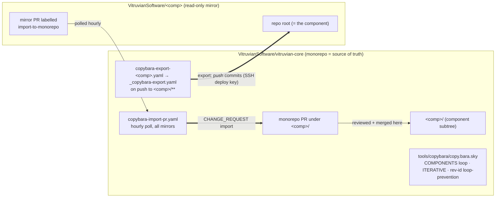
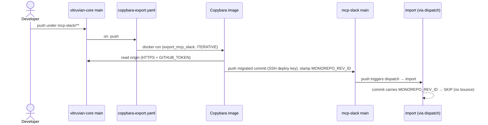
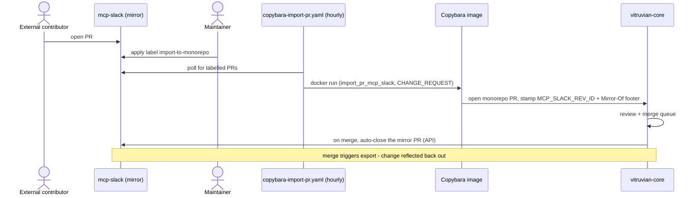
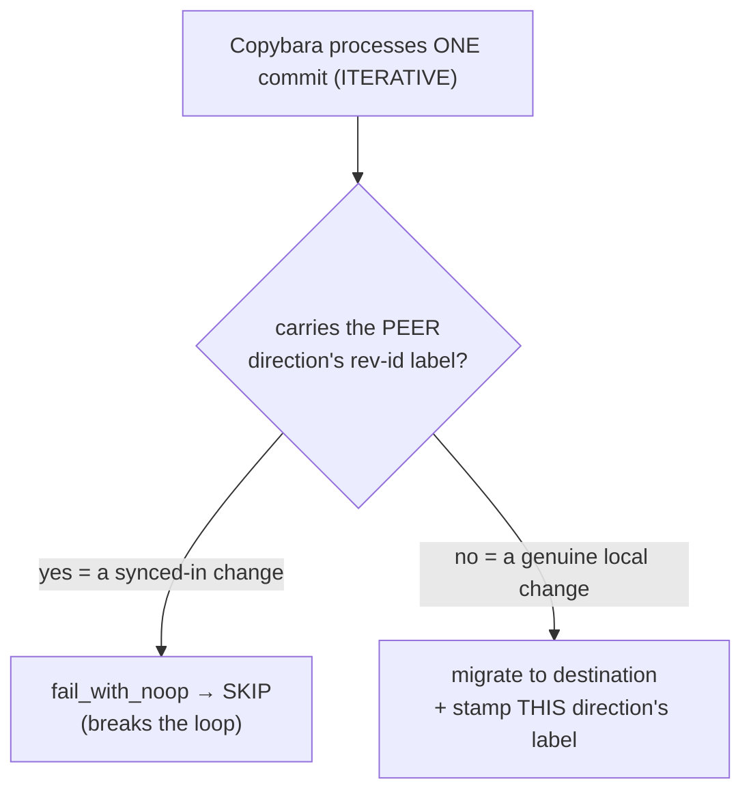
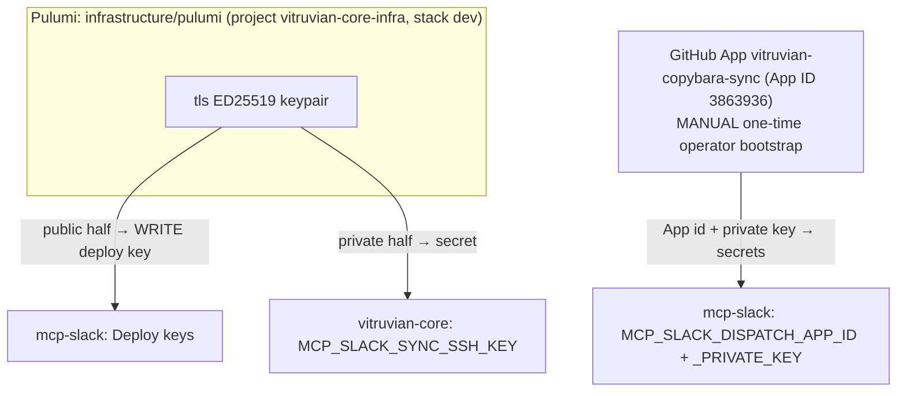
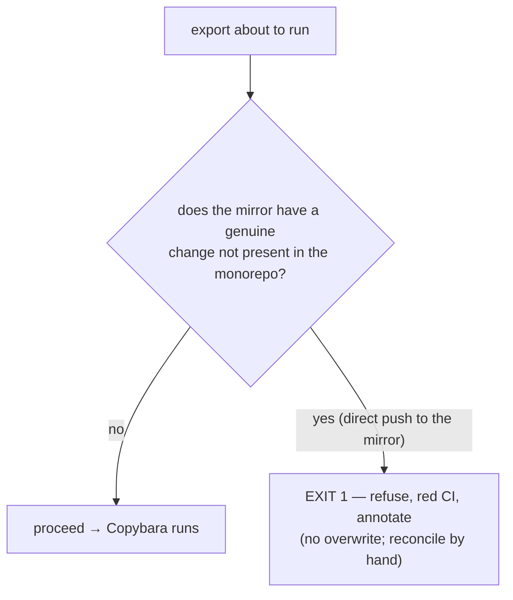
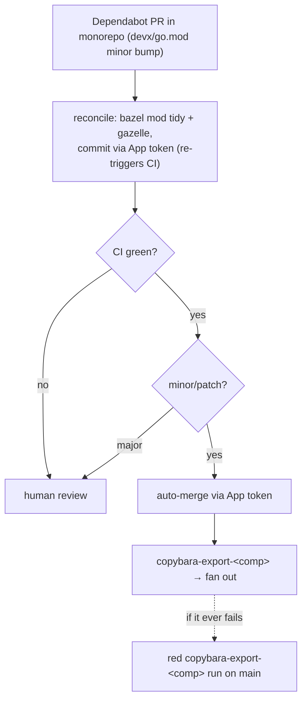

# Copybara Sync — Admin Runbook

**Scope:** how each `vitruvian-core/<component>/` subtree is mirrored to its standalone
`github.com/VitruvianSoftware/<component>` repo, how to operate and maintain it, and what to watch
out for. **The monorepo is the single source of truth for every component.** No component syncs
bidirectionally — see [§0 Sync shapes](#0-sync-shapes-what-replaced-bidirectional).

> [!NOTE]
> **This runbook described bidirectional sync until 2026-07.** Every component has since converged
> on one-way (the monorepo writes; the mirror is read-only), which removed the silent-divergence
> failure mode this doc used to open with a warning about. `copy.bara.sky` keeps `is_one_way=False`
> as a knob for a future component that genuinely needs writable-both-ways sync, but **no component
> uses it**. The pilot history is in `docs/archive/planning/2026-05-25-copybara-bidi-sync-{design,plan}.md`.

---

## 0. Sync shapes (what replaced bidirectional)

`copy.bara.sky` selects a shape per component:

| Shape | Flag | Components | Generates |
|---|---|---|---|
| **One-way w/ PR-import** | `is_one_way=True` | `mcp-slack`, `devx`, `homelab`, `nexus-agent`, `oauth-user-inspector` | `export_<comp>` (push to mirror `main`) + `import_pr_<comp>` (a labelled mirror PR → a **monorepo PR**, `CHANGE_REQUEST` mode) |
| **Export-only** | `export_only=True` | `pulumi-library`, `pulumi_go-example-foundation`, `pulumi_ts-example-foundation` | `export_<comp>` only — no import path of any kind |
| **Bidirectional** | `is_one_way=False` | *(none)* | legacy shape, retained as a knob only |

There is deliberately **no push-to-`main` `import_<comp>`** for any component. External
contributions arrive as PRs on the mirror and are imported as monorepo PRs for human review — the
Google-style round trip. That convergence removed the #1 drift risk.

---

## 1. TL;DR

- **Export is on-push, near-real-time.** A push under `vitruvian-core/<component>/**` is exported to
  that mirror. The mirror is never written by hand.
- **Import is gated and periodic.** `copybara-import-pr.yaml` polls every mirror **hourly** for open
  PRs carrying the `import-to-monorepo` label and imports each as a monorepo PR under `<component>/`.
  Applying the label in the mirror UI *is* the maintainer approval gate.
- **Centralized hub.** All sync logic (the Copybara config + the reusable export workflow) lives in
  **vitruvian-core**.
- **One config, N components.** `copy.bara.sky` generates the workflows for every component from a
  `COMPONENTS` list.
- **No bounce.** Per-direction rev-id labels + a per-commit skip-guard stop an exported change from
  returning as an import (and vice-versa).
- **Auth is IaC.** A write SSH deploy key + a GitHub App, provisioned by Pulumi.

---

## 2. Architecture at a glance



> §3–§4 walk the flow using **mcp-slack** as the worked example; every one-way component behaves
> identically (substitute `<comp>` and its `<COMP>_*` secrets / `<COMP>_REV_ID` label).

### Moving parts

| File | Repo | Purpose |
|---|---|---|
| `tools/copybara/copy.bara.sky` | vitruvian-core | The Copybara config. A `COMPONENTS` list drives a function (run via a top-level comprehension — Starlark forbids top-level `for`) that generates the per-component workflows: `ITERATIVE` mode, rev-id labels, skip-guards, path `core.move`, `**/BUILD` + context-file excludes. |
| `.github/workflows/_copybara-export.yaml` | vitruvian-core | **Reusable** (`workflow_call`). All export logic + the pinned Copybara image, parameterized by `component` / `standalone_only` / `sync_ssh_key`. Runs the conflict pre-check before Copybara. |
| `.github/workflows/copybara-export-<comp>.yaml` | vitruvian-core | Thin caller (one per component). Owns the `push` path trigger (`<comp>/**`) + per-component concurrency group; calls the export reusable. |
| `.github/workflows/copybara-import-pr.yaml` | vitruvian-core | The **only** import path. Hourly poll across all mirrors for PRs labelled `import-to-monorepo`; imports each as a monorepo PR (`CHANGE_REQUEST`). |
| `.github/workflows/copybara-import-pr-close.yaml` | vitruvian-core | On merge of an import PR, closes the originating mirror PR by API (read from the `Mirror-Of:` footer). Cross-repo closure can't be done by a commit trailer. |
| `.github/workflows/copybara-config-smoketest.yaml` | vitruvian-core | Validates `copy.bara.sky` parses and generates the expected workflows. |
| `tools/copybara/conflict_precheck/` (Go) | vitruvian-core | Component-aware pre-push guard; Bazel-built, invoked by the export reusable. Refuses to export when the mirror holds an un-synced genuine change. |
| `infrastructure/pulumi/pkg/copybara_sync/sync.go` | vitruvian-core | IaC: loops `syncedProjects`, provisioning each component's deploy key + Actions secrets. |

### Versions / identifiers (pinned)

| Thing | Value |
|---|---|
| Copybara image | `olivr/copybara@sha256:87e2e9089344e64693faebb2ee0ed33b8797358c0420b0fa98325ca611e98679` (2023-01 build, reports "Unknown version") |
| Dispatch token action | `actions/create-github-app-token@bcd2ba49218906704ab6c1aa796996da409d3eb1` (v3.2.0) |
| GitHub App | `vitruvian-copybara-sync`, **App ID 3863936**, installed on `vitruvian-core` (Contents: Read & write; Pull requests: write for the import PRs + Dependabot auto-merge). **Reused by all components.** |
| Export-push secret | `<COMP>_SYNC_SSH_KEY` (in vitruvian-core) ↔ write deploy key on the mirror. e.g. `DEVX_SYNC_SSH_KEY`, `NEXUS_AGENT_SYNC_SSH_KEY`. |
| Import gate label | `import-to-monorepo`, applied on the **mirror** PR by a maintainer. |
| Rev-id labels | export stamps `MONOREPO_REV_ID` (shared — each lands on a *separate* mirror); `import_pr` stamps a per-component `<COMP>_REV_ID` (unique — they all land in the *shared* monorepo). |

---

## 3. How the EXPORT flow works (monorepo → standalone)

**Trigger:** a push to `vitruvian-core` `main` touching `mcp-slack/**`.

1. `copybara-export.yaml` fires (`on: push`, `paths: mcp-slack/**`).
2. It writes auth to the runner: the deploy key → `~/.ssh/id_rsa` (with a guaranteed trailing
   newline), and `GITHUB_TOKEN` → `~/.git-credentials`.
3. It runs `docker run olivr/copybara@sha256:… copybara` with `COPYBARA_WORKFLOW=export_mcp_slack`.
4. Copybara **reads** vitruvian-core over **HTTPS** (`GITHUB_TOKEN`), strips the `mcp-slack/` prefix
   (`core.move`), and **pushes** the migrated commit(s) to the standalone over **SSH** (deploy key),
   stamping each with `MONOREPO_REV_ID`.
5. Nothing on the mirror side reacts. The mirror is read-only; the only way a change re-enters the
   monorepo is a labelled mirror PR (§4), and that path skip-guards any commit carrying
   `MONOREPO_REV_ID` (no bounce).



---

## 4. How the IMPORT flow works (mirror PR → monorepo PR)

**Trigger:** `copybara-import-pr.yaml` on its **hourly schedule** (or `workflow_dispatch`). There is
no push trigger and no `repository_dispatch` — a push to a mirror does **not** reach the monorepo.

1. A contributor opens a PR on `VitruvianSoftware/mcp-slack`.
2. A maintainer applies the **`import-to-monorepo`** label on that mirror PR. **Applying the label
   is the approval gate** — nothing is imported without it.
3. On the next hourly cycle the workflow queries each mirror for open PRs carrying the label.
4. For each one it runs `COPYBARA_WORKFLOW=import_pr_mcp_slack` in **`CHANGE_REQUEST`** mode:
   Copybara reads the mirror PR, adds the `mcp-slack/` prefix, and opens a **monorepo PR** on branch
   `mcp-slack-import-pr-<N>`, stamping `MCP_SLACK_REV_ID` and embedding a
   `Mirror-Of: VitruvianSoftware/mcp-slack#<N>` footer.
5. That monorepo PR goes through normal review and the merge queue like any other change.
6. On merge, `copybara-import-pr-close.yaml` reads the `Mirror-Of:` footer and closes the
   originating mirror PR by API (a commit trailer can't close a PR cross-repo).
7. The merge to `main` touches `mcp-slack/**`, so the **export** fires and reflects the change back
   out to the mirror — where the export's own skip-guard sees `MCP_SLACK_REV_ID` and does not
   re-import it.



> **Best-effort and idempotent.** A PR unlabelled between poll and import is dropped by Copybara's
> `required_labels` skip-guard (exit 4, logged). A PR labelled *after* a poll window is picked up on
> the next cycle. Re-running the workflow does not duplicate an already-imported PR.

---

## 5. How loop-prevention works (and why `ITERATIVE` is mandatory)

Two cooperating mechanisms, **both required**:

1. **Per-direction rev-id labels.** Export stamps `MONOREPO_REV_ID`; import stamps `MCP_SLACK_REV_ID`
   (via `experimental_custom_rev_id`). A change's label tells you which side it originated on.
2. **A per-commit skip-guard** (`core.dynamic_transform` → `core.fail_with_noop`): if a commit
   carries the *other* direction's label, drop it instead of migrating it back.



> [!IMPORTANT]
> **Use `ITERATIVE`, never `SQUASH`.** In SQUASH mode the skip-guard sees the labels of the *whole
> squashed range*, so a range that merely **contains** one peer-origin commit is skipped **entirely**
> — including genuine changes batched with it. Because an import lands on monorepo `main` via
> `GITHUB_TOKEN` (which doesn't advance the export baseline), the next export range includes that
> import commit, and SQUASH would skip the genuine change too — **the export direction gets stuck.**
> `ITERATIVE` evaluates the guard per commit, so only peer commits are skipped. (Verified the hard
> way in CI on 2026-05-26.)

---

## 6. Auth & secrets (all IaC except the App bootstrap)



- **Export push** (vitruvian-core → mcp-slack): the **write deploy key** on mcp-slack. Private half
  is `MCP_SLACK_SYNC_SSH_KEY` in vitruvian-core.
- **Reading vitruvian-core / writing it on import:** the workflow's `GITHUB_TOKEN` over HTTPS.
- **The dispatch** (mcp-slack → vitruvian-core): the **GitHub App**. The App is installed on
  `vitruvian-core` only (least-privilege; `repository_dispatch` needs Contents: write there). Its
  credentials live as secrets in mcp-slack.
- **Provisioned by Pulumi** (`pkg/copybara_sync/sync.go`): per component, the deploy key + all three
  secrets — it loops `syncedProjects`. The App itself is created/installed by hand (GitHub has no
  headless App-creation API); Pulumi only places its credentials, supplied as stack config secrets
  `<comp>DispatchAppId` / `<comp>DispatchAppPrivateKey` (all set to the one reused App).
- **Pulumi config gotchas:** the stack sets `github:owner=VitruvianSoftware` (without it the GitHub
  provider defaults to the token's user and 404s). The pulumi program is its own Go module outside the
  monorepo `go.work`, so run pulumi with **`GOWORK=off`** (else the build resolves the wrong main
  module). `Pulumi.dev.yaml` is gitignored; Pulumi Cloud (`ipv1337/vitruvian-core-infra/dev`) is the
  source of truth.

---

## 7. Divergence and the conflict pre-check

Under bidirectional sync this was the section that mattered most: two concurrent edits to the same
line silently overwrote each other, both runs green. **One-way removes that failure mode by
construction** — the mirror is never authoritative, so there is no second writer to race with.

What remains is the narrower case of someone pushing directly to a mirror (bypassing the PR gate).
That change is not in the monorepo, and the next export would overwrite it.

**The export refuses rather than overwriting.** Each export runs the Go pre-check
[`tools/copybara/conflict_precheck`](../../tools/copybara/conflict_precheck)
(`bazel run //tools/copybara/conflict_precheck`) **before** Copybara. It exits 1 — red, with an
error annotation — when the mirror holds a *genuine* un-synced change: a commit that does **not**
carry `MONOREPO_REV_ID`, i.e. a real edit that did not come from the monorepo. A `--force` dispatch
skips the pre-check, for deliberate re-seeds.



Recovery: bring the change into the monorepo properly — open a mirror PR and label it
`import-to-monorepo` (§4), or apply the equivalent edit in the monorepo subtree — then re-run the
export.

> [!NOTE]
> **There is no drift-check workflow.** `copybara-drift-check.yaml` existed under the bidirectional
> model as a 30-minute backstop against silent divergence and was removed at the one-way cutover.
> The pre-check above is the guard now; it fails *before* any write rather than detecting damage
> afterwards. Older docs and workflow comments referring to a drift check are stale.

---

## 8. Routine maintenance (step by step)

### 8a. Re-run a sync manually
Every caller workflow exposes `workflow_dispatch` with a `copybara_options` input. Use the
**per-component** file name:

```bash
# Export (normal), e.g. devx:
gh workflow run copybara-export-devx.yaml -R VitruvianSoftware/vitruvian-core --ref main
# Import: ONE workflow for every component; it polls all mirrors for labelled PRs.
# Run it to pick up a just-labelled PR without waiting for the hourly cycle.
gh workflow run copybara-import-pr.yaml -R VitruvianSoftware/vitruvian-core --ref main
```

### 8b. Seed a fresh component baseline (first-ever export)
A brand-new destination has **no rev-id baseline**, so a normal run errors with
`Previous revision label <LABEL> could not be found … --last-rev or --init-history were not passed`.
**`--force` alone is NOT enough** — Copybara needs `--init-history`, and the baseline is anchored by
a **real migration** (a commit that touches managed paths). If the two repos are already
byte-identical the seed no-ops and stamps nothing, so seeding needs a transient diff:

```bash
COMP=devx   # the component
# 1. Add a transient marker in the monorepo (skip CI so the export doesn't auto-fire un-seeded):
#    echo seed > $COMP/.copybara-seed ; git commit -m "seed [skip ci]" ; git push
# 2. Seed the export — a SQUASH "Project import" commit on the mirror anchors MONOREPO_REV_ID:
gh workflow run copybara-export-$COMP.yaml --ref main \
  -f copybara_options="--force --squash --init-history --ignore-noop"
# 3. Remove the marker in the MONOREPO and let the normal export fan the removal out.
```
After the seed, a **normal** `--ignore-noop` export finds the baseline and no-ops. A `--force` run
always skips the conflict pre-check.

> Only the **export** baseline is seeded. `import_pr_<comp>` runs in `CHANGE_REQUEST` mode against a
> specific PR and needs no rev-id baseline of its own. (The old two-sided seed recipe — export seed,
> then an ITERATIVE import seed pinned with `--last-rev` — applied to the retired push-to-`main`
> import and is no longer needed.)

### 8c. Watch / debug a run
```bash
gh run list   -R VitruvianSoftware/vitruvian-core --workflow=copybara-export.yaml --limit 5
gh run view  <id> -R VitruvianSoftware/vitruvian-core --log-failed
```

### 8d. Rotate the deploy key (via Pulumi)
The key lives in Pulumi state. Changing the generated key is **ForceNew** on the deploy key, so it
rotates the keypair + updates the secret. From `infrastructure/pulumi/`:
```bash
export GITHUB_OWNER=VitruvianSoftware GITHUB_TOKEN="$(gh auth token)"
pulumi preview --stack dev   # confirm only the deploy key + secret change
pulumi up --stack dev
```

### 8e. Rotate / replace the GitHub App private key
The App is a manual resource. Generate a new private key in the App settings, then update the Pulumi
config secret and re-apply:
```bash
pulumi config set --secret mcpSlackDispatchAppPrivateKey < new-key.pem   # never echo the key
pulumi up --stack dev   # updates MCP_SLACK_DISPATCH_APP_PRIVATE_KEY in mcp-slack
```

### 8f. Onboard another component
mcp-slack, devx, homelab, nexus-agent are already onboarded. For a **new** one (standalone repo must
already exist — this setup never creates repos):
1. **Config:** add a dict to `COMPONENTS` in `copy.bara.sky` — `name`, `is_one_way: True` (or
   `export_only: True` for a pure read-only mirror), a unique `standalone_rev_id`
   (`<COMP>_REV_ID`), and `standalone_only` (always the dispatch workflow; add
   `package-lock.json` for npm components). The `**/BUILD` exclude is automatic. (No `core.move` or
   workflow hand-edits — the loop generates `export_<comp>`/`import_<comp>`.)
2. **CI:** add ONE thin caller — `copybara-export-<comp>.yaml` (push `paths: <comp>/**`); copy an
   existing one and swap the component name + `<COMP>_SYNC_SSH_KEY` secret. No import caller is
   needed: `copybara-import-pr.yaml` picks the component up from the `COMPONENTS` list
   automatically. Create the `import-to-monorepo` label on the mirror — the poll fails fast if the
   gate label is missing.
3. **Auth:** append the component to `syncedProjects` in `pkg/copybara_sync/sync.go`; set its
   `<comp>DispatchAppId` / `<comp>DispatchAppPrivateKey` config to the reused App's creds
   (`pulumi config get … | pulumi config set --secret …` so the key never prints); `pulumi up`.
4. **Mirror CI:** anything the mirror carries that the monorepo never sees (historically
   `sync-to-monorepo.yaml`, listed in `standalone_only`) **must pass the mirror's OWN CI.** Every standalone now enforces the MIT header (§12), so header
   this file before pushing:
   `addlicense -c "VitruvianSoftware" -l mit .github/workflows/sync-to-monorepo.yaml`.
   This mirror-only file is invisible to the monorepo CI, so a missing header only shows up as a
   red run on the *mirror's* `main`.
5. **Seed** the export baseline per §8b, then confirm the mirror matches the subtree.

---

## 9. Troubleshooting

| Symptom (in the run log) | Cause | Fix |
|---|---|---|
| `Cannot find last imported revision … <LABEL> could not be found` | Destination has no rev-id baseline yet | Seed once with `--last-rev`/`--force` (§8b) |
| `Load key "/root/.ssh/id_rsa": invalid format` → `Permission denied (publickey)` | SSH key lost its trailing newline | We run the image directly and write the key with a guaranteed `\n` — do **not** switch to `olivr/copybara-action` (it trims the newline via `core.getInput`) |
| A genuine change silently doesn't sync; export "succeeds" as NO_OP | Skip-guard over-fired (only possible in `SQUASH`) | Ensure `mode = "ITERATIVE"` in `copy.bara.sky` (§5) |
| Export pushes but the standalone loses `package-lock.json` / the dispatch workflow; or import deletes a gazelle `BUILD` | Missing context-file exclude | Confirm the `glob(..., exclude=[…])` lists in `copy.bara.sky` (see below) |
| Export refuses with a red pre-check annotation | Someone pushed directly to the mirror, bypassing the PR gate | Bring the change in via a labelled mirror PR (§4), then re-run the export (§7) |
| A labelled mirror PR never appears as a monorepo PR | Label applied after the poll window, or the `import-to-monorepo` label is missing on the mirror | Wait one cycle or dispatch `copybara-import-pr.yaml` manually (§8a); create the label if absent |
| A **mirror's own** `main` CI is red (lint / license header) on a fanned-out commit, while the monorepo is green | A file the sync added or changed doesn't meet *that mirror's* conventions. The mirror runs its own CI on every fanned-out commit; the monorepo CI doesn't cover it. | Make the file satisfy the standalone's check. **Standalone-only** files (e.g. `sync-to-monorepo.yaml`) → fix on the standalone directly (they aren't synced). **Synced** files → fix in the monorepo subtree; the export fans the fix out. (Real case: the dispatch workflow lacked devx's MIT header — fixed via `addlicense`.) |

**Diff the component across both repos:**
```bash
gh api repos/VitruvianSoftware/vitruvian-core/contents/mcp-slack/<file>?ref=main --jq .content | base64 -d
gh api repos/VitruvianSoftware/mcp-slack/contents/<file>?ref=main --jq .content | base64 -d
```

**Context files that must NOT cross the boundary** (already configured in `copy.bara.sky`):
- export keeps each standalone's `.github/workflows/sync-to-monorepo.yaml` (and `package-lock.json`
  for npm components: mcp-slack, nexus-agent);
- both directions keep the monorepo-only gazelle `**/BUILD` files (devx alone has 57).

---

## 10. Why the unusual choices (so you don't "fix" them and break it)

- **Direct `docker run`, not `olivr/copybara-action`** — the action trims the SSH key's trailing
  newline. We pin the image by digest and manage auth ourselves.
- **`experimental_custom_rev_id` (not `custom_rev_id`)** and `_REV_ID` label format — required by the
  pinned 2023 image. On a newer Copybara you'd rename to `custom_rev_id` (the `_REV_ID` labels still
  work).
- **`ITERATIVE` mode** — mandatory (see §5).
- **GitHub App for the dispatch (not a PAT)** — org-managed, rotatable, least-privilege.
- **One shared import workflow, not per-component callers.** Imports are `CHANGE_REQUEST` PRs, not
  pushes to `main`, so the push-race that forced per-component import concurrency groups + retries
  under the bidirectional model no longer exists. (That retry logic lived in the deleted
  `_copybara-import.yaml`; a *shared* concurrency group had to be avoided back then because GitHub
  cancels intermediate pending runs in a group, which silently dropped a component's import.)
- **A label as the approval gate.** Import requires a maintainer to apply `import-to-monorepo` on
  the mirror PR — a human decision in the mirror's own UI, with no extra tooling to run.

### Pending hardening — mirror the Copybara image to GHCR
The sync pulls `olivr/copybara@sha256:…` from Docker Hub on every run. To remove that external
dependency, mirror the pinned digest to `ghcr.io/vitruviansoftware/copybara` and repin. **This needs
a token with `write:packages`** (the day-to-day automation token only has `repo`/`workflow`), so it
is an operator hand-off:
```bash
# With a PAT that has write:packages:
echo "$GHCR_PAT" | docker login ghcr.io -u <user> --password-stdin
docker pull  olivr/copybara@sha256:87e2e9089344e64693faebb2ee0ed33b8797358c0420b0fa98325ca611e98679
docker tag   olivr/copybara@sha256:87e2e90… ghcr.io/vitruviansoftware/copybara:2023-01-olivr
docker push  ghcr.io/vitruviansoftware/copybara:2023-01-olivr        # note the resulting GHCR digest
# Make the package public (simplest — it's a public-image mirror) OR add `packages: read` +
# `docker login ghcr.io` to the reusables. Then repin BOTH _copybara-{export,import}.yaml to
# ghcr.io/vitruviansoftware/copybara@sha256:<ghcr-digest> and re-run a sync to validate.
```
Do **not** repin the workflows before the GHCR image exists — every sync would fail pulling a
missing image.

---

## 11. Dependency updates (Dependabot)

Dependabot is **centralized in the monorepo** but split by what it can actually scan, then fanned out
to the standalones via the export. You manage every component's Dependabot config from here.

### Split model (who owns which ecosystem)
- **The monorepo owns** `gomod` (devx, homelab) **+** root `github-actions` — these live in
  `.github/dependabot.yml` and are scanned in-tree.
- **Each component's OWN workflow action pins** (e.g. its `sync-to-monorepo.yaml`) and **npm** are
  updated **per-standalone** — Dependabot can't scan a *subtree's* workflows from the monorepo, so
  those updates have to run where the workflow is the repo root.
- But the **standalone Dependabot configs still live here:** each is committed at
  `<comp>/.github/dependabot.yml` in the monorepo and **fans out via the export** to the standalone,
  where Dependabot then runs against it. **To add or adjust a standalone's Dependabot config, edit
  `<comp>/.github/dependabot.yml` in the monorepo** — the export does the rest. (See §8f when
  onboarding a new component.)

### Pipeline (a monorepo Go bump, end to end)
1. A monorepo Dependabot **Go PR** opens (e.g. a `devx/go.mod` bump).
2. [`dependabot-bazel-reconcile.yml`](../../.github/workflows/dependabot-bazel-reconcile.yml) runs
   `bazel mod tidy` + `bazel run //:gazelle` and **commits any fix to the PR branch via the App
   token** — which **re-triggers CI** (a bot's own `GITHUB_TOKEN` push wouldn't). Version-only bumps
   reconcile to a **no-op**.
3. **CI** (`bazel build` / `bazel test`) runs on the PR.
4. After CI succeeds, [`dependabot-auto-merge.yml`](../../.github/workflows/dependabot-auto-merge.yml)
   (triggered on **`workflow_run`** after `CI`) does a **direct merge** of **minor/patch** PRs **via
   the App token**, so the merge is **App-attributed**. Minor/patch is detected from the Dependabot
   **branch name** (our gomod/actions groups are `*-minor-patch`, so qualifying PRs land on
   `…/go-minor-patch-*` / `…/actions-minor-patch-*` branches); major bumps come on individual
   branches and never match. *(A direct `workflow_run` merge rather than `gh pr merge --auto` because
   the VitruvianSoftware org disables repo-level auto-merge.)*
5. The merge push triggers **`copybara-export-<comp>`**, which **fans the change out** to the
   standalone (same export flow as §3).
6. If a merge ever fails to fan out, the failure surfaces as a **red `copybara-export-<comp>` run**
   on `main`. (The 30-minute `copybara-drift-check` that used to backstop this was removed with the
   bidirectional model — see §7.)

> **Major bumps are NOT auto-merged.** Review, **reconcile by hand if CI is red**, then merge
> manually. A normal **user** merge is **user-attributed**, so it **still triggers the export** and
> fans out — only `GITHUB_TOKEN`-attributed pushes are inert.



### App permissions (prerequisite for auto-merge)
The reused `vitruvian-copybara-sync` App (App ID 3863936) needs **Pull requests: write** — to merge —
in addition to its **Contents: write** (export push + reconcile commit). If auto-merge fails with
`Resource not accessible by integration (repository.pullRequest)`, the App is missing Pull requests:
write: grant it in the App's settings and **re-approve** the new permission on the vitruvian-core
installation. (Auto-merge stays inert until this is granted; the rest of the sync is unaffected.)

### Secrets
`SYNC_APP_ID` / `SYNC_APP_PRIVATE_KEY` exist on **vitruvian-core** as **both** a **Dependabot secret**
(so Dependabot-triggered runs — e.g. the reconcile — can read them) **and** an **Actions secret** (so
the `workflow_run` auto-merge, which runs in the default-branch context, can read them). Both are
provisioned by Pulumi (`pkg/copybara_sync/sync.go`).

### Invariant that keeps the reconcile safe
`bazel run //:gazelle` is kept a **no-op on `main`** — the root `BUILD` carries
`# gazelle:exclude infrastructure`. That is what makes the reconcile step's `git add -A` safe: gazelle
never rewrites unrelated `BUILD` files into the PR, so the only thing committed back is the genuine
dependency reconciliation.

---

## 12. License headers (addlicense)

Every hand-authored file in the monorepo (and therefore every standalone, since headers fan out via
the export) carries the MIT header `Copyright (c) <year> VitruvianSoftware`. It is enforced in **two
places**, both `addlicense@v1.2.0` with `-c "VitruvianSoftware" -l mit`:

- **Monorepo `CI` → `license-check` (shift-left).** Runs over the **whole repo** so a missing header
  is caught on the PR, *before* fan-out. The binary lands in `GOPATH/bin` (not on the runner PATH), so
  it's invoked as `"$(go env GOPATH)/bin/addlicense"`.
- **Each standalone's OWN CI.** devx checks in its `lint` job; homelab and mcp-slack each have a
  `license-check` job; nexus-agent (which had no CI) gets a dedicated `license-check.yml`. This is the
  only check that covers **standalone-only** files (e.g. `sync-to-monorepo.yaml`) the monorepo never sees.

**Generated / tool-managed files are NEVER headered** — addlicense would fight their regeneration
(e.g. gazelle rewrites a headered `BUILD` back without the header → the check reddens next run). The
monorepo whole-repo check ignores them:

```
-ignore "**/BUILD" -ignore "**/BUILD.bazel"
-ignore "**/docs/**" -ignore "**/internal/scaffold/templates/**"
-ignore "pnpm-lock.yaml" -ignore "**/package-lock.json" -ignore "**/Cargo.lock" -ignore "MODULE.bazel.lock"
-ignore "**/gazelle_python.yaml" -ignore "**/*-baseline.xml" -ignore "**/.release-please-manifest.json"
-ignore "bazel-*/**" -ignore "**/node_modules/**" -ignore "**/*.venv/**" -ignore ".git/**"
```

Per-standalone ignore sets (no `**/BUILD` — standalones have no Bazel files):

| Component | Ignores |
|---|---|
| devx | `docs/**`, `internal/scaffold/templates/**` |
| homelab | *(none)* |
| mcp-slack | `package-lock.json`, `node_modules/**` |
| nexus-agent | `package-lock.json`, `node_modules/**`, `.release-please-manifest.json` |

**Bulk-header many files:** run add-mode (drop `-check`) from the repo root with the monorepo ignore
list, then confirm `bazel run //:gazelle` is still a no-op and `git status` shows no generated file
touched **before** committing. Headers fan out like any other content change.

---

*Bidirectional pilot design + decision history (superseded — retained as the record of why one-way
won): [`docs/planning/2026-05-25-copybara-bidi-sync-design.md`](../archive/planning/2026-05-25-copybara-bidi-sync-design.md)
and [`…-plan.md`](../archive/planning/2026-05-25-copybara-bidi-sync-plan.md) (see its `## Outcome`).
One-way cutovers: [`copybara-devx-oneway-cutover.md`](../archive/copybara/copybara-devx-oneway-cutover.md) ·
[`copybara-pulumi-oneway-cutover.md`](../archive/copybara/copybara-pulumi-oneway-cutover.md).*
