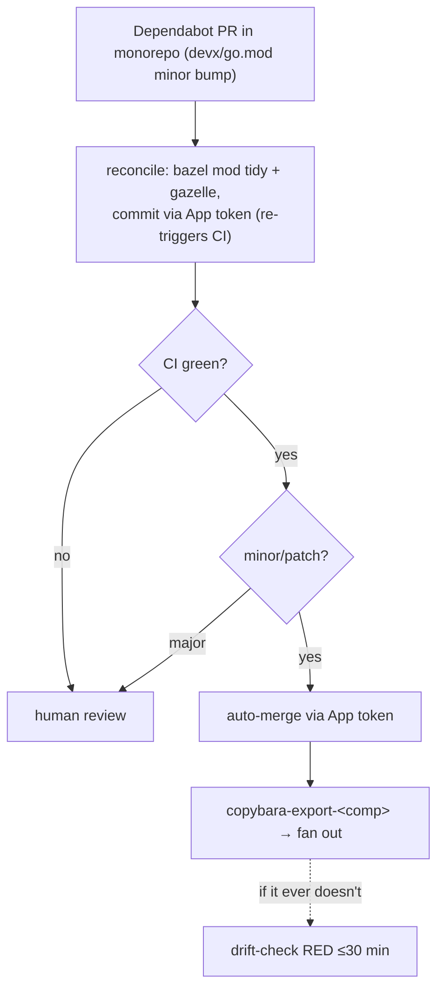

# Centralized Dependabot Implementation Plan

> **For agentic workers:** REQUIRED SUB-SKILL: Use superpowers:subagent-driven-development (recommended) or superpowers:executing-plans to implement this plan task-by-task. Steps use checkbox (`- [ ]`) syntax for tracking.

**Goal:** Run Go (`gomod`) + root GitHub-Actions Dependabot from the vitruvian-core monorepo with auto-reconcile (Bazel) and auto-merge (minor/patch, via the GitHub App token so the merge fans out through the Copybara export); keep npm per-standalone; fill coverage gaps.

**Architecture:** A monorepo-root `.github/dependabot.yml` owns Go + root workflow updates. Two monorepo workflows make those PRs hands-off: `dependabot-bazel-reconcile.yml` (commits gazelle/`mod tidy` fixes to the PR branch via the App token) and `dependabot-auto-merge.yml` (App-token merge of minor/patch after CI). Merges fan out via the existing per-component `copybara-export-*`; the 30-min drift-check backstops any missed fan-out. Standalone Dependabot configs (npm + each component's own workflows) are authored in the monorepo subtrees and exported out.

**Tech Stack:** GitHub Actions + Dependabot v2, Bazel (bzlmod + gazelle `go_deps`), Pulumi (Go, pulumi-github v6), Copybara bidi-sync.

**Spec:** [`docs/planning/2026-05-26-centralized-dependabot-design.md`](2026-05-26-centralized-dependabot-design.md). **Sync runbook:** [`docs/copybara-sync.md`](../../admin/copybara-sync.md).

**Conventions for this plan:** all paths are under `vitruvian-core/` unless noted. Run `gh`/`git` from the repo root. Pulumi commands run from `infrastructure/pulumi/` with `GOWORK=off` and `github:owner=VitruvianSoftware` already set (sync runbook §6). Never echo the App private key — use `pulumi config get … | pulumi config set --secret …` (stdin).

---

## File structure

| File | Responsibility |
|---|---|
| `infrastructure/pulumi/pkg/copybara_sync/sync.go` (modify) | Also place the reused App's id/key on vitruvian-core as a Dependabot secret + an Actions secret (`SYNC_APP_ID` / `SYNC_APP_PRIVATE_KEY`). |
| `.github/workflows/dependabot-bazel-reconcile.yml` (create) | On a Dependabot Go PR: `bazel mod tidy` + gazelle, commit fixes to the PR branch via the App token. |
| `.github/workflows/dependabot-auto-merge.yml` (create) | On a Dependabot PR: auto-merge minor/patch via the App token (major → manual). |
| `.github/dependabot.yml` (create) | Monorepo-root config: `gomod /devx`, `gomod /homelab`, `github-actions /`. |
| `devx/.github/dependabot.yml` (modify) | Remove the `gomod` block (now central); keep `github-actions /` + `npm /docs`. |
| `homelab/.github/dependabot.yml` (create) | `github-actions /` (gap-fill). |
| `nexus-agent/.github/dependabot.yml` (create) | `npm /` + `github-actions /` (gap-fill). |
| `docs/copybara-sync.md` (modify) | New "Dependency updates (Dependabot)" section. |

**Ordering rationale:** secrets (Task 1) → automation workflows that consume them (Tasks 2–3) → standalone config changes incl. removing devx's duplicate `gomod` (Task 4) → *activate* the monorepo root config (Task 5) → docs (Task 6) → end-to-end validation + fallback decision (Task 7). Activating the root config last means the first Go PRs land into ready automation, and devx's standalone `gomod` is gone before the monorepo takes Go over (no duplicate PRs).

---

### Task 1: Pulumi — App credentials as a vitruvian-core Dependabot + Actions secret

**Files:**
- Modify: `infrastructure/pulumi/pkg/copybara_sync/sync.go`

- [ ] **Step 1: Copy the reused App creds into dedicated config keys (no value printed)**

Run from `infrastructure/pulumi/`:
```bash
pulumi config get mcpSlackDispatchAppId        | pulumi config set --secret syncAppId
pulumi config get mcpSlackDispatchAppPrivateKey | pulumi config set --secret syncAppPrivateKey
pulumi config   # masked: confirm syncAppId + syncAppPrivateKey now listed as [secret]
```
Expected: both keys appear as `[secret]`; no key material printed.

- [ ] **Step 2: Add the two monorepo secrets in `sync.go`**

In `infrastructure/pulumi/pkg/copybara_sync/sync.go`, inside `ManageSyncAuth`, **after** the `for _, project := range syncedProjects` loop closes and **before** `return nil`, insert:

```go
	// Monorepo-side App credentials for the Dependabot reconcile + auto-merge
	// automation (docs/planning/2026-05-26-centralized-dependabot-design.md).
	// Dependabot-triggered workflow runs cannot read normal Actions secrets, so
	// the App id/key are placed as a Dependabot secret; the Actions-secret twins
	// cover any non-Dependabot-context step. Both reuse the single sync App.
	appID := cfg.RequireSecret("syncAppId")
	appKey := cfg.RequireSecret("syncAppPrivateKey")

	_, err := github.NewDependabotSecret(ctx, "monorepo-sync-app-id-dependabot", &github.DependabotSecretArgs{
		Repository:     pulumi.String(monorepoRepoName),
		SecretName:     pulumi.String("SYNC_APP_ID"),
		PlaintextValue: appID,
	})
	if err != nil {
		return err
	}
	_, err = github.NewDependabotSecret(ctx, "monorepo-sync-app-key-dependabot", &github.DependabotSecretArgs{
		Repository:     pulumi.String(monorepoRepoName),
		SecretName:     pulumi.String("SYNC_APP_PRIVATE_KEY"),
		PlaintextValue: appKey,
	})
	if err != nil {
		return err
	}
	_, err = github.NewActionsSecret(ctx, "monorepo-sync-app-id-actions", &github.ActionsSecretArgs{
		Repository:     pulumi.String(monorepoRepoName),
		SecretName:     pulumi.String("SYNC_APP_ID"),
		PlaintextValue: appID,
	})
	if err != nil {
		return err
	}
	_, err = github.NewActionsSecret(ctx, "monorepo-sync-app-key-actions", &github.ActionsSecretArgs{
		Repository:     pulumi.String(monorepoRepoName),
		SecretName:     pulumi.String("SYNC_APP_PRIVATE_KEY"),
		PlaintextValue: appKey,
	})
	if err != nil {
		return err
	}
```
(`monorepoRepoName` is the existing `const monorepoRepoName = "vitruvian-core"`. `cfg` is the existing `config.New(ctx, "")` at the top of `ManageSyncAuth`.)

- [ ] **Step 3: Compile (verifies `DependabotSecret` exists in pulumi-github v6)**

Run from `infrastructure/pulumi/`:
```bash
GOWORK=off go build ./...
```
Expected: exit 0. If `github.NewDependabotSecret` is undefined, the provider is too old — run `GOWORK=off go get github.com/pulumi/pulumi-github/sdk/v6@latest && GOWORK=off go mod tidy` and rebuild.

- [ ] **Step 4: Preview (must be purely additive)**

Run from `infrastructure/pulumi/`:
```bash
GOWORK=off pulumi preview --non-interactive
```
Expected: `+ 4 to create` (`monorepo-sync-app-{id,key}-dependabot`, `monorepo-sync-app-{id,key}-actions`); everything else unchanged. No replacements/deletes.

- [ ] **Step 5: Apply**

```bash
GOWORK=off pulumi up --yes --non-interactive
```
Expected: `+ 4 created`. Verify:
```bash
gh secret list --app dependabot -R VitruvianSoftware/vitruvian-core | grep SYNC_APP
gh secret list             -R VitruvianSoftware/vitruvian-core | grep SYNC_APP
```
Expected: `SYNC_APP_ID` + `SYNC_APP_PRIVATE_KEY` listed in both stores.

- [ ] **Step 6: Commit**

```bash
git add infrastructure/pulumi/pkg/copybara_sync/sync.go
git commit -m "feat(dependabot): place sync App creds on vitruvian-core (dependabot + actions secret)"
```

---

### Task 2: Reconcile workflow (`dependabot-bazel-reconcile.yml`)

**Files:**
- Create: `.github/workflows/dependabot-bazel-reconcile.yml`

- [ ] **Step 1: Write the workflow**

Create `.github/workflows/dependabot-bazel-reconcile.yml`:

```yaml
name: Dependabot Bazel reconcile

# When Dependabot bumps a component go.mod in the monorepo, regenerate the gazelle
# BUILD files + MODULE.bazel use_repo (bazel mod tidy) so the Bazel build stays
# consistent, and commit the result to the PR branch. No-op for version-only bumps
# (versions re-resolve via go_deps; BUILD/use_repo only change when the dep SET does).
# Pushes via the GitHub App token: Dependabot-triggered runs only see Dependabot
# secrets, and an App-token push re-triggers CI on the reconciled commit.
on:
    pull_request:
        branches: [main]
        paths:
            - "**/go.mod"
            - "**/go.sum"

permissions:
    contents: read

concurrency:
    group: dependabot-reconcile-${{ github.event.pull_request.number }}
    cancel-in-progress: true

jobs:
    reconcile:
        if: github.actor == 'dependabot[bot]'
        runs-on: ubuntu-latest
        steps:
            - name: Mint App token
              id: app-token
              uses: actions/create-github-app-token@bcd2ba49218906704ab6c1aa796996da409d3eb1 # v3.2.0
              with:
                app-id: ${{ secrets.SYNC_APP_ID }}
                private-key: ${{ secrets.SYNC_APP_PRIVATE_KEY }}
            - uses: actions/checkout@v6
              with:
                ref: ${{ github.event.pull_request.head.ref }}
                token: ${{ steps.app-token.outputs.token }}
            - name: Set up Bazel
              uses: bazel-contrib/setup-bazel@c5acdfb288317d0b5c0bbd7a396a3dc868bb0f86 # 0.19.0
              with:
                bazelisk-cache: true
                repository-cache: true
            - name: Reconcile (bazel mod tidy + gazelle)
              run: |
                bazel mod tidy
                bazel run //:gazelle
            - name: Commit reconcile if anything changed
              run: |
                if [ -z "$(git status --porcelain)" ]; then
                  echo "No reconcile needed (version-only bump)."; exit 0
                fi
                git config user.name "VitruvianSoftware Sync"
                git config user.email "sync@vitruviansoftware.com"
                git add -A
                git commit -m "chore(deps): bazel reconcile (gazelle + mod tidy)"
                git push origin "HEAD:${{ github.event.pull_request.head.ref }}"
```

- [ ] **Step 2: Lint**

```bash
~/go/bin/actionlint .github/workflows/dependabot-bazel-reconcile.yml
```
Expected: exit 0, no output. (If `actionlint` is missing: `go install github.com/rhysd/actionlint/cmd/actionlint@latest`.)

- [ ] **Step 3: Local dry-run of the reconcile logic (proves it's a no-op for version bumps and produces a delta for dep-set changes)**

```bash
# Version-only bump (expect: gazelle/mod tidy produce NO diff):
git checkout -b tmp-reconcile-test
go -C devx get example.com/some/existing-dep@<a-newer-patch>   # or edit devx/go.mod version by hand
bazel mod tidy && bazel run //:gazelle
git status --porcelain   # expect: only devx/go.mod (+ go.sum) changed, no BUILD churn
git checkout -- . && git checkout main && git branch -D tmp-reconcile-test
```
Expected: a pure version bump leaves `**/BUILD` and `MODULE.bazel` untouched (confirms most PRs are no-op reconciles). If unsure of a real dep, skip the live `go get` and just confirm `bazel run //:gazelle` is a clean no-op on the current tree.

- [ ] **Step 4: Commit**

```bash
git add .github/workflows/dependabot-bazel-reconcile.yml
git commit -m "feat(dependabot): auto-reconcile Bazel on Dependabot Go PRs"
```

---

### Task 3: Auto-merge workflow (`dependabot-auto-merge.yml`)

**Files:**
- Create: `.github/workflows/dependabot-auto-merge.yml`

- [ ] **Step 1: Resolve + pin the `dependabot/fetch-metadata` action SHA**

```bash
gh api repos/dependabot/fetch-metadata/releases/latest --jq '.tag_name'
gh api repos/dependabot/fetch-metadata/git/refs/tags/$(gh api repos/dependabot/fetch-metadata/releases/latest --jq .tag_name) --jq '.object.sha'
```
Record the tag (e.g. `v2.x.y`) and the commit SHA; use them in Step 2 as `dependabot/fetch-metadata@<sha> # <tag>`.

- [ ] **Step 2: Write the workflow**

Create `.github/workflows/dependabot-auto-merge.yml` (substitute the SHA/tag from Step 1):

```yaml
name: Dependabot auto-merge

# Auto-merge MINOR/PATCH Dependabot PRs once CI passes, using the GitHub App token
# so the merge is App-attributed and triggers the per-component copybara export
# (a GITHUB_TOKEN merge would NOT — that's the import-side recursion-prevention).
# MAJOR bumps are left for manual review. The 30-min drift-check backstops any
# merge that fails to fan out (see docs/copybara-sync.md).
on:
    pull_request:
        branches: [main]

permissions:
    contents: read
    pull-requests: read

jobs:
    auto-merge:
        if: github.actor == 'dependabot[bot]'
        runs-on: ubuntu-latest
        steps:
            - name: Fetch Dependabot metadata
              id: meta
              uses: dependabot/fetch-metadata@<SHA-FROM-STEP-1> # <TAG-FROM-STEP-1>
            - name: Mint App token
              id: app-token
              if: steps.meta.outputs.update-type == 'version-update:semver-minor' || steps.meta.outputs.update-type == 'version-update:semver-patch'
              uses: actions/create-github-app-token@bcd2ba49218906704ab6c1aa796996da409d3eb1 # v3.2.0
              with:
                app-id: ${{ secrets.SYNC_APP_ID }}
                private-key: ${{ secrets.SYNC_APP_PRIVATE_KEY }}
            - name: Enable auto-merge (minor/patch only)
              if: steps.meta.outputs.update-type == 'version-update:semver-minor' || steps.meta.outputs.update-type == 'version-update:semver-patch'
              env:
                GH_TOKEN: ${{ steps.app-token.outputs.token }}
              run: gh pr merge --squash --auto "${{ github.event.pull_request.html_url }}"
```

- [ ] **Step 3: Lint**

```bash
~/go/bin/actionlint .github/workflows/dependabot-auto-merge.yml
```
Expected: exit 0.

- [ ] **Step 4: Commit**

```bash
git add .github/workflows/dependabot-auto-merge.yml
git commit -m "feat(dependabot): auto-merge minor/patch Dependabot PRs via App token"
```

---

### Task 4: Standalone Dependabot configs (remove devx `gomod`; add homelab + nexus-agent)

**Files:**
- Modify: `devx/.github/dependabot.yml`
- Create: `homelab/.github/dependabot.yml`
- Create: `nexus-agent/.github/dependabot.yml`

- [ ] **Step 1: Remove the `gomod` block from `devx/.github/dependabot.yml`**

Delete the entire `- package-ecosystem: "gomod"` entry (the `# ─── Go module (root) ───` block), leaving the `github-actions` and `npm` (`/docs`) entries intact. The license header + the other two ecosystems stay.

- [ ] **Step 2: Create `homelab/.github/dependabot.yml`**

```yaml
version: 2
updates:
  - package-ecosystem: "github-actions"
    directory: "/"
    schedule:
      interval: "weekly"
    open-pull-requests-limit: 5
    labels:
      - "dependencies"
      - "ci"
    commit-message:
      prefix: "chore(ci)"
      include: "scope"
    groups:
      actions-minor-patch:
        update-types:
          - "minor"
          - "patch"
```

- [ ] **Step 3: Create `nexus-agent/.github/dependabot.yml`**

```yaml
version: 2
updates:
  - package-ecosystem: "npm"
    directory: "/"
    schedule:
      interval: "weekly"
    open-pull-requests-limit: 5
    labels:
      - "dependencies"
      - "javascript"
    commit-message:
      prefix: "chore(deps)"
    groups:
      npm-minor-patch:
        update-types:
          - "minor"
          - "patch"
  - package-ecosystem: "github-actions"
    directory: "/"
    schedule:
      interval: "weekly"
    open-pull-requests-limit: 5
    labels:
      - "dependencies"
      - "ci"
    commit-message:
      prefix: "chore(ci)"
    groups:
      actions-minor-patch:
        update-types:
          - "minor"
          - "patch"
```

- [ ] **Step 4: Validate YAML**

```bash
for f in devx/.github/dependabot.yml homelab/.github/dependabot.yml nexus-agent/.github/dependabot.yml; do
  python3 -c "import yaml,sys; d=yaml.safe_load(open('$f')); assert d['version']==2; print('$f OK', [u['package-ecosystem'] for u in d['updates']])"
done
```
Expected: `devx … ['github-actions','npm']`, `homelab … ['github-actions']`, `nexus-agent … ['npm','github-actions']`.

- [ ] **Step 5: Commit + push (fans out via export)**

```bash
git add devx/.github/dependabot.yml homelab/.github/dependabot.yml nexus-agent/.github/dependabot.yml
git commit -m "chore(dependabot): centralize Go off standalones; gap-fill homelab + nexus-agent"
git push origin main
```

- [ ] **Step 6: Watch the exports + drift**

```bash
for c in devx homelab nexus-agent; do gh run watch "$(gh run list --workflow copybara-export-$c.yaml --limit 1 --json databaseId --jq '.[0].databaseId')" --exit-status; done
gh workflow run copybara-drift-check.yaml ; sleep 8
gh run watch "$(gh run list --workflow copybara-drift-check.yaml --limit 1 --json databaseId --jq '.[0].databaseId')" --exit-status
```
Expected: each export green; drift-check reports all 4 components in sync. Confirm each standalone now has the new/edited `.github/dependabot.yml` (`gh api repos/VitruvianSoftware/<comp>/contents/.github/dependabot.yml --jq .name`).

---

### Task 5: Activate the monorepo-root `.github/dependabot.yml`

**Files:**
- Create: `.github/dependabot.yml`

- [ ] **Step 1: Write the root config**

Create `.github/dependabot.yml`:

```yaml
version: 2
updates:
  # ─── Go modules (per go.work member; root //:go.mod is an empty placeholder) ───
  - package-ecosystem: "gomod"
    directory: "/devx"
    schedule:
      interval: "weekly"
    open-pull-requests-limit: 5
    labels:
      - "dependencies"
      - "go"
    commit-message:
      prefix: "chore(deps)"
      include: "scope"
    groups:
      go-minor-patch:
        update-types:
          - "minor"
          - "patch"
  - package-ecosystem: "gomod"
    directory: "/homelab"
    schedule:
      interval: "weekly"
    open-pull-requests-limit: 5
    labels:
      - "dependencies"
      - "go"
    commit-message:
      prefix: "chore(deps)"
      include: "scope"
    groups:
      go-minor-patch:
        update-types:
          - "minor"
          - "patch"
  # ─── Root workflows only (Dependabot can't scan component subtree workflows) ───
  - package-ecosystem: "github-actions"
    directory: "/"
    schedule:
      interval: "weekly"
    open-pull-requests-limit: 5
    labels:
      - "dependencies"
      - "ci"
    commit-message:
      prefix: "chore(ci)"
      include: "scope"
    groups:
      actions-minor-patch:
        update-types:
          - "minor"
          - "patch"
```

- [ ] **Step 2: Validate YAML**

```bash
python3 -c "import yaml; d=yaml.safe_load(open('.github/dependabot.yml')); assert d['version']==2; print([ (u['package-ecosystem'],u['directory']) for u in d['updates'] ])"
```
Expected: `[('gomod','/devx'),('gomod','/homelab'),('github-actions','/')]`.

- [ ] **Step 3: Commit + push**

```bash
git add .github/dependabot.yml
git commit -m "feat(dependabot): centralize gomod (devx+homelab) + root github-actions in the monorepo"
git push origin main
```

- [ ] **Step 4: Confirm Dependabot accepted the config**

```bash
gh api repos/VitruvianSoftware/vitruvian-core/dependabot/alerts --jq 'length' >/dev/null 2>&1 && echo "dependabot API reachable"
```
Then in the GitHub UI: **Insights → Dependency graph → Dependabot** shows the three update jobs with a green "last checked"; trigger "Check for updates" on the `gomod /devx` job to force a run. (There is no public API to force a Dependabot run; the UI button or the weekly schedule drives it.)

---

### Task 6: Runbook section

**Files:**
- Modify: `docs/copybara-sync.md`

- [ ] **Step 1: Add a "Dependency updates (Dependabot)" section** after §8 (Routine maintenance) or as a new §11. Include:
  - The split model: monorepo owns `gomod` (devx, homelab) + root `github-actions`; npm + each component's own workflows run per-standalone; standalone configs are authored in the monorepo subtree and fan out via export.
  - The pipeline: Dependabot PR → `dependabot-bazel-reconcile` (gazelle/`mod tidy`, App-token commit) → CI → `dependabot-auto-merge` (minor/patch, App token) → `copybara-export-<comp>` fan-out → drift-check backstop.
  - The manual path: **major** bumps are not auto-merged — review, reconcile if CI is red, merge by hand (a normal merge is user-attributed, so it fans out).
  - Secrets: `SYNC_APP_ID` / `SYNC_APP_PRIVATE_KEY` live in vitruvian-core as **both** a Dependabot secret (for Dependabot-triggered runs) and an Actions secret; provisioned by Pulumi.
  - "To add/adjust a standalone's Dependabot config, edit `<comp>/.github/dependabot.yml` in the monorepo — the export fans it out."

  Reuse this Mermaid pipeline:


- [ ] **Step 2: Commit + push**

```bash
git add docs/copybara-sync.md
git commit -m "docs(dependabot): document the centralized Dependabot + fan-out model"
git push origin main
```

---

### Task 7: End-to-end validation + auto-merge attribution decision

**Files:** none (validation); conditional fallback edits `.github/workflows/dependabot-auto-merge.yml`.

- [ ] **Step 1: Drive one Go bump through the pipeline**

Wait for the first real Dependabot `gomod` PR (or force one via the Dependabot UI "Check for updates"). Watch:
```bash
gh pr list -R VitruvianSoftware/vitruvian-core --author 'app/dependabot' --json number,title,url
# then watch the reconcile + CI + auto-merge runs for that PR's head SHA
gh run list -R VitruvianSoftware/vitruvian-core --limit 10
```
Expected: reconcile runs (no-op or a commit), CI green, the PR auto-merges (for a minor/patch).

- [ ] **Step 2: Confirm fan-out**

After the auto-merge lands on `main`:
```bash
gh run list --workflow "copybara-export-devx.yaml" --limit 1 --json event,status,conclusion,headSha
```
Expected: a `push`-triggered `copybara-export-devx` run fired for the merge commit and is green; the bump appears in the devx standalone (`gh api repos/VitruvianSoftware/devx/contents/go.mod --jq .sha` changed). Then drift-check green.

- [ ] **Step 3: Auto-merge attribution decision (FALLBACK — only if Step 2 shows NO export fired)**

If the auto-merge merged but **no `copybara-export-*` run fired** (GitHub's native `--auto` merge didn't trigger the export), replace the merge step in `dependabot-auto-merge.yml` with a deterministic App-attributed direct merge driven by a post-CI `workflow_run`:

```yaml
# dependabot-auto-merge.yml (fallback variant)
on:
    workflow_run:
        workflows: ["CI"]
        types: [completed]
permissions:
    contents: read
    pull-requests: write
jobs:
    auto-merge:
        if: github.event.workflow_run.event == 'pull_request' && github.event.workflow_run.conclusion == 'success' && github.event.workflow_run.actor.login == 'dependabot[bot]'
        runs-on: ubuntu-latest
        steps:
            - name: Mint App token
              id: app-token
              uses: actions/create-github-app-token@bcd2ba49218906704ab6c1aa796996da409d3eb1 # v3.2.0
              with:
                app-id: ${{ secrets.SYNC_APP_ID }}
                private-key: ${{ secrets.SYNC_APP_PRIVATE_KEY }}
            - name: Resolve PR + update-type, merge minor/patch via App token
              env:
                GH_TOKEN: ${{ steps.app-token.outputs.token }}
                HEAD_SHA: ${{ github.event.workflow_run.head_sha }}
              run: |
                pr=$(gh pr list -R "$GITHUB_REPOSITORY" --head "${{ github.event.workflow_run.head_branch }}" --json number,title --jq '.[0].number')
                [ -z "$pr" ] && { echo "no PR for branch"; exit 0; }
                title=$(gh pr view "$pr" -R "$GITHUB_REPOSITORY" --json title --jq .title)
                # Dependabot titles 'Bump X from A to B' — major if the leading semver component changes.
                # Simpler: only auto-merge when the PR carries Dependabot's own semver labels, else skip.
                case "$title" in
                  *"from "*" to "*) gh pr merge "$pr" -R "$GITHUB_REPOSITORY" --squash ;;
                  *) echo "skip" ;;
                esac
```
> Note: this fallback uses an Actions secret (workflow_run runs in the default-branch context with full Actions secrets, not Dependabot secrets). Major-vs-minor gating in `workflow_run` is coarser than `fetch-metadata` — if you adopt the fallback, gate major bumps with a Dependabot config `ignore` for `version-update:semver-major` on the gomod entries, or keep the primary `pull_request` job solely for the metadata gate and only move the *merge* to `workflow_run`. Decide during this task based on observed behavior; commit whichever variant fans out.

- [ ] **Step 4: Confirm a major bump is NOT auto-merged**

When a `semver-major` Dependabot PR appears (or simulate by checking the auto-merge run's `meta.outputs.update-type`), confirm the auto-merge job skipped it (no merge enabled) and it stays open for review.

- [ ] **Step 5: Final commit (only if the fallback was applied)**

```bash
git add .github/workflows/dependabot-auto-merge.yml
git commit -m "fix(dependabot): merge via workflow_run App token so auto-merge fans out"
git push origin main
```

---

## Notes on iteration

The genuinely uncertain piece is **auto-merge attribution** (does GitHub's native `--auto` merge, enabled via the App token, produce a push that triggers `copybara-export-*`?). Task 7 validates it empirically and Step 3 is the bounded fallback; the **drift-check** means even a temporarily-missed fan-out is loud, never silent. The reconcile workflow's safety rests on it running only gazelle/`mod tidy` (no dependency code execution) — do not add a `bazel build`/`test` to it (CI already does that under the read-only Dependabot token).
