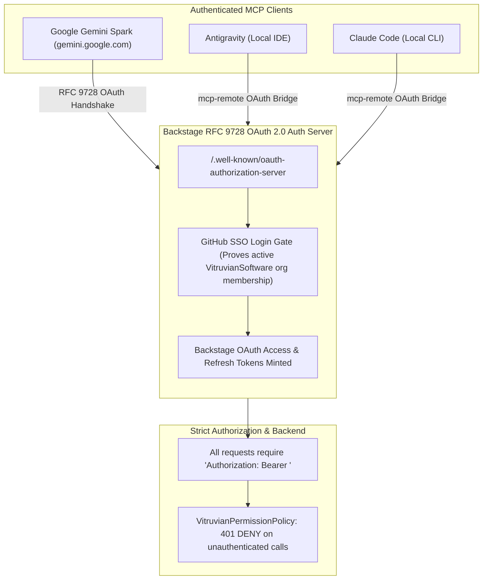

# Backstage MCP (Model Context Protocol) Server

The Backstage Developer Portal exposes its Software Catalog, Scaffolder templates, TechDocs, and platform operations to AI assistants (including Google Gemini Spark, Antigravity, and Claude Code) via the **Model Context Protocol (MCP)** using the Streamable HTTP transport.

---

## Architecture & Authentication Flow

The Backstage backend runs [`@backstage/plugin-mcp-actions-backend`](https://github.com/backstage/backstage/tree/master/plugins/mcp-actions-backend) backed by RFC 9728 OAuth 2.0 discovery and GitHub SSO organisation verification:



---

## Security Model & Invariants

1. **No Unauthenticated Access**:
   The portal is internet-facing (`https://backstage.vitruviansoftware.dev`). Anonymous/unauthenticated requests receive an immediate `401 Unauthorized` (`AuthenticationError: Missing credentials`). The `VitruvianPermissionPolicy` strictly denies all operations for unauthenticated callers.
2. **Organisation Verification**:
   GitHub SSO login verifies active membership in the `VitruvianSoftware` GitHub organisation (`authModuleGithubOrgProvider`) before issuing a Backstage OAuth token.
3. **Role-Based Authorization**:
   - **Administrators** (`platform-team` / `user:default/ipv1337`): Granted full permissions to run Scaffolder tasks, update catalog entities, and query resources.
   - **Members / Contributors**: Granted read-only permissions across the catalog and documentation. Mutating actions (`create`, `update`, `delete`) are denied.

---

## Endpoint Details

- **Public Endpoint**: `https://backstage.vitruviansoftware.dev/api/mcp-actions/v1`
- **Local Development**: `http://localhost:7007/api/mcp-actions/v1`
- **Transport**: MCP Streamable HTTP (JSON-RPC 2.0 over HTTP POST with bearer token authentication).
- **Available Tool Capabilities**:
  - `catalog.*`: Query components, systems, APIs, resources, and ownership relations.
  - `scaffolder.*`: Execute software templates and application render tasks.

---

## Client Setup & Configuration

### 1. Google Gemini Spark (`gemini.google.com`)

1. Open **Gemini Apps** → **Custom apps for Spark** → **Add a custom app link**.
2. Enter the URL:
   ```
   https://backstage.vitruviansoftware.dev/api/mcp-actions/v1
   ```
3. Click **Next**. Gemini will automatically discover the OAuth 2.0 authorization server, prompt you to log in via GitHub SSO, and connect the MCP server.

---

### 2. Antigravity IDE

Configure the server in `~/.gemini/config/mcp_config.json` using `mcp-remote`:

```json
{
  "mcpServers": {
    "backstage": {
      "command": "npx",
      "args": [
        "-y",
        "mcp-remote",
        "https://backstage.vitruviansoftware.dev/api/mcp-actions/v1"
      ]
    }
  }
}
```

*When starting a session, `mcp-remote` opens your browser for a one-time GitHub SSO authentication, caches the token securely in your local keychain, and authenticates all requests.*

---

### 3. Claude Code / Claude Desktop

Configure `~/.claude.json` using `mcp-remote`:

```json
{
  "mcpServers": {
    "backstage": {
      "type": "stdio",
      "command": "npx",
      "args": [
        "-y",
        "mcp-remote",
        "https://backstage.vitruviansoftware.dev/api/mcp-actions/v1"
      ]
    }
  }
}
```

Or add via CLI:
```bash
claude mcp add --transport stdio backstage -- npx -y mcp-remote https://backstage.vitruviansoftware.dev/api/mcp-actions/v1
```

---

## Configuration Reference (`backstage/app-config.yaml`)

```yaml
auth:
  environment: production
  experimentalRefreshToken:
    enabled: true
  clientIdMetadataDocuments:
    enabled: true
    allowedClientIdPatterns:
      - "https://gemini.google.com/*"
      - "https://*.google.com/*"
      - "https://claude.ai/*"
      - "https://vscode.dev/*"
      - "http://localhost:*"
      - "http://127.0.0.1:*"
    allowedRedirectUriPatterns:
      - "https://gemini.google.com/**"
      - "https://gemini.google.com/*"
      - "https://*.google.com/**"
      - "https://*.google.com/*"
      - "https://*.googleusercontent.com/**"
      - "https://*.googleusercontent.com/*"
      - "http://localhost:*"
      - "http://localhost:*/**"
      - "http://127.0.0.1:*"
      - "http://127.0.0.1:*/**"
  experimentalDynamicClientRegistration:
    enabled: true
    allowedRedirectUriPatterns:
      - "https://gemini.google.com/**"
      - "https://gemini.google.com/*"
      - "https://*.google.com/**"
      - "https://*.google.com/*"
      - "https://*.googleusercontent.com/**"
      - "https://*.googleusercontent.com/*"
      - "http://localhost:*"
      - "http://localhost:*/**"
      - "http://127.0.0.1:*"
      - "http://127.0.0.1:*/**"
```
