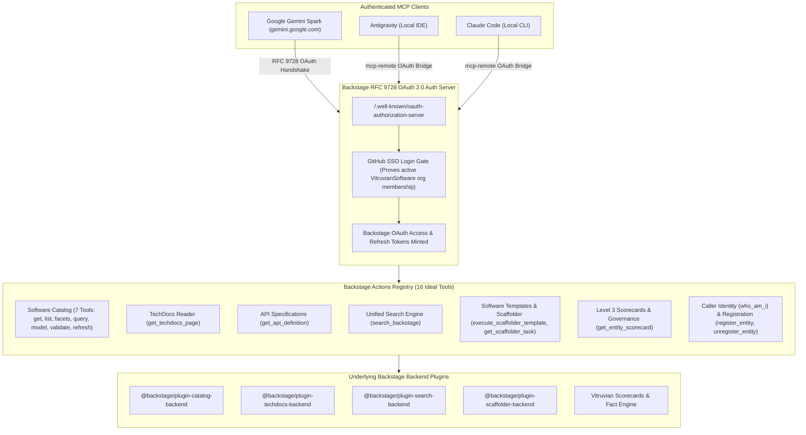

# Backstage MCP (Model Context Protocol) Server

The Backstage Developer Portal exposes its Software Catalog, Scaffolder templates, TechDocs, Unified Search, and Operational Scorecards to AI assistants (including Google Gemini Spark, Antigravity, Claude Code, and Cursor) via the **Model Context Protocol (MCP)** using the Streamable HTTP transport.

---

## Architecture & Authentication Flow

The Backstage backend runs [`@backstage/plugin-mcp-actions-backend`](https://github.com/backstage/backstage/tree/master/plugins/mcp-actions-backend) backed by RFC 9728 OAuth 2.0 discovery and GitHub SSO organisation verification:



---

## Security Model & Invariants

1. **No Unauthenticated Access**:
   The portal is internet-facing (`https://backstage.vitruviansoftware.dev`). Anonymous/unauthenticated requests receive an immediate `401 Unauthorized` (`AuthenticationError: Missing credentials`). The `VitruvianPermissionPolicy` strictly denies all operations for unauthenticated callers.
2. **Organisation Verification**:
   GitHub SSO login verifies active membership in the `VitruvianSoftware` GitHub organisation (`authModuleGithubOrgProvider`) before issuing a Backstage OAuth token.
3. **Role-Based Authorization**:
   - **Administrators** (`platform-team` / `user:default/ipv1337`): Granted full permissions to run Scaffolder tasks, update catalog entities, and query resources.
   - **Members / Contributors**: Granted read-only permissions across the catalog and documentation. Mutating actions (`create`, `update`, `delete`) are evaluated via authorization policies.

---

## Comprehensive Tool Surface (16 Tools)

| Tool Name | Title | Domain | Mutating? | Description |
| :--- | :--- | :--- | :---: | :--- |
| `get_entities` | Get Catalog Entities | Catalog | No | List and filter entities (Components, Systems, APIs, Resources, Users, Groups) |
| `get_entity_by_name` | Get Catalog Entity By Name | Catalog | No | Single entity lookup by kind, name, and optional namespace |
| `get_entity_facets` | Get Catalog Entity Facets | Catalog | No | Retrieve aggregate facet counts across entities matching a filter |
| `query_catalog_entities` | Query Catalog Entities | Catalog | No | Advanced pagination, sorting, full-text search, and relation filtering |
| `get_catalog_model_description` | Get Catalog Model Description | Catalog | No | Static markdown documentation of the Backstage data model |
| `validate_entity` | Validate Entity | Catalog | No | Validate entity YAML/JSON against the Backstage catalog schema |
| `refresh_catalog_entity` | Refresh Catalog Entity | Catalog | **Yes** | Trigger immediate re-fetch and re-processing of a catalog entity from git |
| `register_entity` | Register Entity | Catalog | **Yes** | Register a new entity location URL into the catalog |
| `unregister_entity` | Unregister Entity | Catalog | **Yes (Destructive)** | Unregister an entity location by location ID |
| `who_am_i` | Who Am I | Identity | No | Returns the catalog entity and user info for the authenticated user |
| `get_api_definition` | Get API Definition | APIs | No | Extract raw/parsed OpenAPI, AsyncAPI, GraphQL, or gRPC definitions |
| `get_techdocs_page` | Get TechDocs Page | TechDocs | No | Read rendered documentation content (HTML/markdown) for an entity |
| `search_backstage` | Search Backstage | Search | No | Unified search across Software Catalog, TechDocs, and Templates |
| `get_entity_scorecard` | Get Entity Scorecard | Governance | No | Level 3 Operational Maturity Scorecard, Golden Path & diagnostic evaluation |
| `execute_scaffolder_template` | Execute Scaffolder Template | Scaffolder | **Yes** | Trigger an automated software template task to stamp a new service/repo |
| `get_scaffolder_task` | Get Scaffolder Task | Scaffolder | No | Poll live status, logs, progress events, and output links for a template task |

---

## Backend Actions Registry Architecture

`@backstage/plugin-mcp-actions-backend` discovers tools dynamically through Backstage's `ActionsRegistry` (`alpha.actionsRegistryServiceRef`). Custom and core actions are registered via backend modules:

```typescript
// packages/backend/src/catalog/actionsModule.ts
export const catalogModuleMcpActions = createBackendModule({
  pluginId: "catalog",
  moduleId: "mcp-actions",
  register(reg) {
    reg.registerInit({
      deps: {
        actionsRegistry: actionsRegistryServiceRef,
        discovery: coreServices.discovery,
        auth: coreServices.auth,
        logger: coreServices.logger,
      },
      async init({ actionsRegistry, discovery, auth, logger }) {
        // Registers catalog.get-entities, catalog.get-entity-by-name, catalog.get-entity-facets
        await registerCatalogMcpActions({ actionsRegistry, discovery, auth, logger });
      },
    });
  },
});
```

---

## Client Setup & Configuration

### 1. Google Gemini Spark (`gemini.google.com`)

1. Open **Gemini Apps** → **Custom apps for Spark** → **Add a custom app link**.
2. Enter the URL:
   ```
   https://backstage.vitruviansoftware.dev/api/mcp-actions/v1
   ```
3. Click **Next**. Gemini will automatically discover the OAuth 2.0 authorization server, prompt you to log in via GitHub SSO, and connect the MCP server.

---

### 2. Antigravity IDE

Configure the server in `~/.gemini/config/mcp_config.json` using `mcp-remote`:

```json
{
  "mcpServers": {
    "backstage": {
      "command": "npx",
      "args": [
        "-y",
        "mcp-remote",
        "https://backstage.vitruviansoftware.dev/api/mcp-actions/v1"
      ]
    }
  }
}
```

*When starting a session, `mcp-remote` opens your browser for a one-time GitHub SSO authentication, caches the token securely in your local keychain, and authenticates all requests.*

---

### 3. Claude Code / Claude Desktop

Configure `~/.claude.json` using `mcp-remote`:

```json
{
  "mcpServers": {
    "backstage": {
      "type": "stdio",
      "command": "npx",
      "args": [
        "-y",
        "mcp-remote",
        "https://backstage.vitruviansoftware.dev/api/mcp-actions/v1"
      ]
    }
  }
}
```

Or add via CLI:
```bash
claude mcp add --transport stdio backstage -- npx -y mcp-remote https://backstage.vitruviansoftware.dev/api/mcp-actions/v1
```

---

## Configuration Reference (`backstage/app-config.yaml`)

```yaml
auth:
  environment: production
  experimentalRefreshToken:
    enabled: true
  clientIdMetadataDocuments:
    enabled: true
    allowedClientIdPatterns:
      - "https://gemini.google.com/*"
      - "https://*.google.com/*"
      - "https://claude.ai/*"
      - "https://vscode.dev/*"
      - "http://localhost:*"
      - "http://127.0.0.1:*"
    allowedRedirectUriPatterns:
      - "https://gemini.google.com/**"
      - "https://gemini.google.com/*"
      - "https://*.google.com/**"
      - "https://*.google.com/*"
      - "https://*.googleusercontent.com/**"
      - "https://*.googleusercontent.com/*"
      - "http://localhost:*"
      - "http://localhost:*/**"
      - "http://127.0.0.1:*"
      - "http://127.0.0.1:*/**"
  experimentalDynamicClientRegistration:
    enabled: true
    allowedRedirectUriPatterns:
      - "https://gemini.google.com/**"
      - "https://gemini.google.com/*"
      - "https://*.google.com/**"
      - "https://*.google.com/*"
      - "https://*.googleusercontent.com/**"
      - "https://*.googleusercontent.com/*"
      - "http://localhost:*"
      - "http://localhost:*/**"
      - "http://127.0.0.1:*"
      - "http://127.0.0.1:*/**"
```
