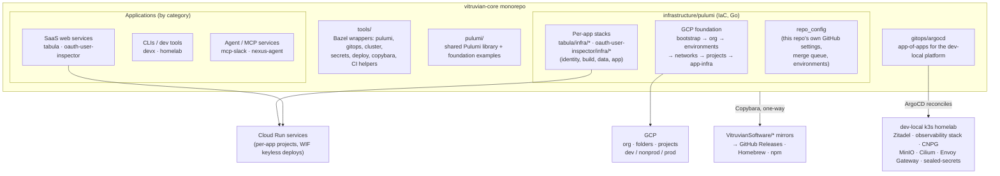
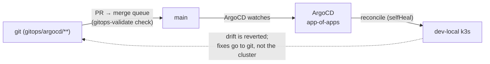

# Monorepo architecture

How the pieces of `vitruvian-core` fit together: the applications, the two
infrastructure planes, the self-hosted platform, and the mirror repos. For the SDLC
that moves code through this architecture, see [The SDLC](sdlc.md). For the deep dive
on the Pulumi estate itself, see
[Infrastructure architecture](../infrastructure/architecture.md).

## The big picture



## Applications

Six first-party apps in three categories (full taxonomy + per-category standards:
[Guiding Principles §3](../engineering/application-development-principles.md#3-per-category-playbook)):

| Category | Apps | Runs on | Ships via |
|---|---|---|---|
| SaaS web service | `tabula`, `oauth-user-inspector` | GCP Cloud Run (per-app project) | deploy pipeline (blue-green) |
| CLI / developer tool | `devx`, `homelab` | user's machine | GitHub Releases + Homebrew (mirror) |
| Agent / MCP service | `mcp-slack`, `nexus-agent` | user's machine | npm / DMG (mirror) |

The category determines the hosting target, build shape, secrets model, and release
mechanics — there is no free choice
([decision guide](../engineering/application-development-principles.md#4-decision-guide-choosing-a-category--hosting-target-for-a-new-app)).

## Two infrastructure planes

The repo drives two very different substrates, deliberately kept apart:

### Plane 1 — GCP (production-shaped, Pulumi)

Everything in `infrastructure/pulumi/`, applied by GitHub Actions with **keyless WIF
identities** — never a laptop:

- **The foundation** (`infrastructure/pulumi/foundation/*`) is a staged landing zone
  (bootstrap → org → environments → networks → projects → app-infra), promoted
  per-stage by `foundation-release.yaml`.
- **Per-app stacks** (`<app>/infra/{identity,build,data,app}`) declare each app's
  deploy identity, Artifact Registry, data tier, and Cloud Run service. The boundary
  between what the foundation provides and what an app owns is defined in
  [Core vs. application infrastructure](../engineering/core-vs-application-infrastructure.md).
- **`repo_config`** manages this repo's own GitHub settings — branch protection, the
  merge queue and its required checks, per-app GitHub Environments. Governance is code
  too.

### Plane 2 — dev-local k3s (the self-hosted platform, GitOps)

A multi-node k3s homelab hosting **platform services only** (identity, observability,
databases, ingress) — first-party apps are *not* deployed there. Its entire state is
the ArgoCD app-of-apps in `gitops/argocd/`; the cluster reconciles from git in a
closed loop, and out-of-band `kubectl` writes are forbidden. Deep dive:
[dev-local cluster architecture](../infrastructure/dev-local-cluster.md); how it maps
to a future GKE posture: [dev-local vs GKE](../infrastructure/dev-local-vs-gke.md).



## The tooling layer

Every operational action is a discoverable `bazel run //tools/...` target that bakes
in the environment the op needs — the right GCP identity
(`infrastructure/gcp-identities.tsv`), the right kubeconfig, a Bitwarden unlock — so
nobody memorizes setup and nothing depends on an ambient shell. The complete catalog
is [Bazel targets & tools](../reference/bazel-targets.md); the rule behind it is
[Principles §2.2](../engineering/application-development-principles.md#22-infra-ops-run-only-through-the-bazel-wrappers).

## Mirrors and code sharing

Released apps (and the `pulumi/` trees) export **one-way** to standalone repos in the
`VitruvianSoftware` org via Copybara. Mirrors exist for distribution and external
contribution — external PRs come back through a labelled import path as monorepo PRs.
The monorepo is always the source of truth. Full runbook:
[Copybara sync](../admin/copybara-sync.md).

## Where things live

```text
vitruvian-core/
├── tabula/  oauth-user-inspector/     # SaaS apps (each with its infra/ Pulumi stacks)
├── devx/  homelab/                    # Go CLIs
├── mcp-slack/  nexus-agent/           # agent / MCP services
├── infrastructure/
│   ├── pulumi/foundation/             # staged GCP landing zone
│   ├── pulumi/platform/               # repo_config, dev-local bootstrap, zitadel-apps
│   └── gcp-identities.tsv             # per-project GCP identity pinning
├── gitops/argocd/                     # the dev-local platform, as ArgoCD apps
├── gitops/charts/                     # forked third-party Helm chart source (controller-agnostic)
├── pulumi/                            # shared Pulumi library + foundation examples
├── tools/                             # all operational tooling as bazel run targets
├── docs/                              # ← you are here (see docs/README.md)
└── .github/workflows/                 # the pipeline: CI, deploys, releases, mirrors
```
