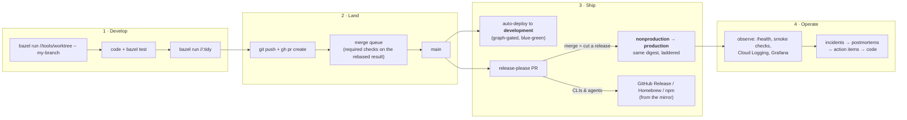
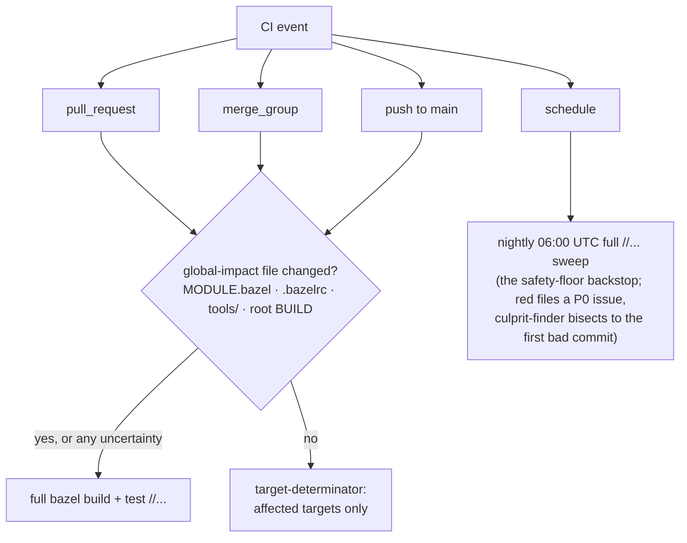
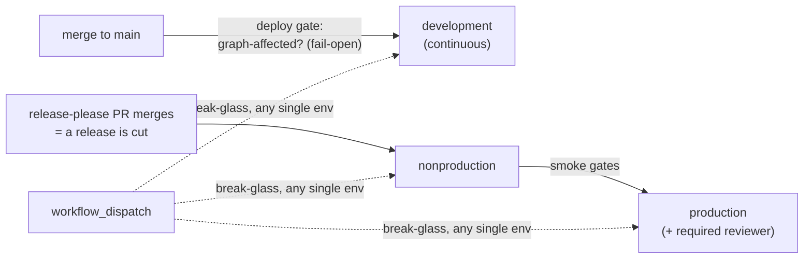
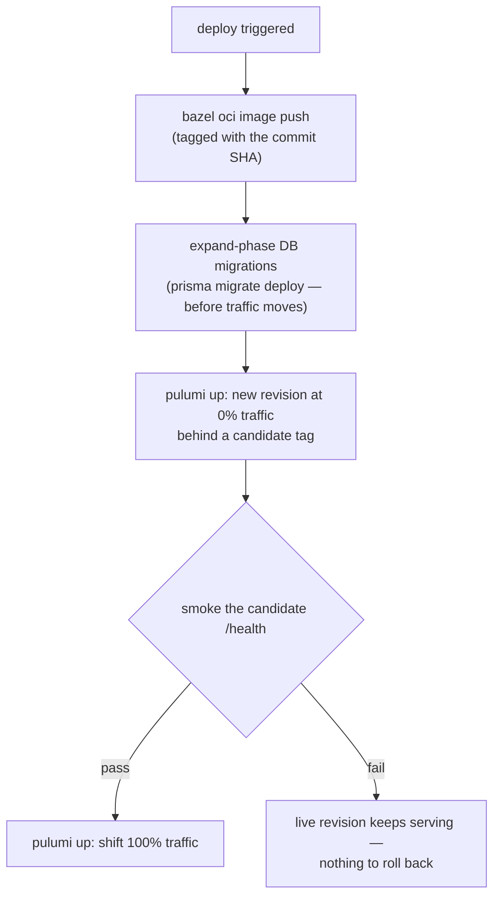

# The SDLC: from branch to production

This page walks the **entire software development lifecycle** in `vitruvian-core` —
what happens from the moment you start a change to the moment it serves production
traffic (or ships as a release), and which tools drive each step.

The mechanics (exact commands, file locations) live in
[`CONTRIBUTING.md`](../../CONTRIBUTING.md); the *why* behind the rules lives in the
[Guiding Principles](../engineering/application-development-principles.md). This page
is the map that connects them.

## The whole lifecycle at a glance

Four phases, four sections below.

## 1 · Develop

| Step | Tool | Notes |
|---|---|---|
| Verify your toolchain | `bazel run //:doctor` (or `//<app>:doctor`) | Run first when anything behaves oddly |
| Branch in an isolated worktree | `bazel run //tools/worktree -- <branch>` | **Enforced**: branch builds in the primary checkout fail via the workspace-status guard |
| Build / test | `bazel build //...`, `bazel test //<app>/...` | Bazel is the build of record for every app |
| Run the app | per-type inner loop | See [CONTRIBUTING §3](../../CONTRIBUTING.md#3-local-development) — SaaS uses `pnpm dev` + Bazel-managed test services, CLIs run via `bazel run` |
| Format + BUILD hygiene | `bazel run //:tidy` | Required check; run before every PR |

Local dev never needs production credentials: backing services are hermetic Bazel test
services or `devx up` ephemera, and secrets come from gitignored `.env` files (see
[CONTRIBUTING §3.4](../../CONTRIBUTING.md#34-local-secret-files-you-need-all-gitignored)).

## 2 · Land: PR → merge queue → main

There is exactly one way onto `main`: a PR that enters the **merge queue**. The queue
re-runs the required checks against the rebased result, so what lands is what was
tested. Branch protection, required checks, and the queue itself are IaC
(`infrastructure/pulumi/platform/repo_config`) — the check list can't drift from
reality without `conformance-check` failing.

The required-check gate set (`build-test`, `tidy-check`, `license-check`,
`conformance-check`, `gitops-validate`, `actionlint`, `migration-safety`, per-module
Go lint/test, …) is documented in
[CONTRIBUTING §5](../../CONTRIBUTING.md#5-build--test); the philosophy (fail-closed
testing, fail-open deploys, the nightly safety floor) is in
[CI/CD approach](../engineering/ci-cd-approach.md).

## 3 · Ship: deploy, release, promote

**Deploying and releasing are different acts**, keyed to app category
([Guiding Principles §3](../engineering/application-development-principles.md#3-per-category-playbook)):

| App category | Ships by | Mechanism |
|---|---|---|
| SaaS web service (`tabula`, `oauth-user-inspector`) | **Deploy** | Cloud Run via WIF + Pulumi, blue-green |
| CLI / developer tool (`devx`, `homelab`) | **Release** | GitHub Release + Homebrew tap from the mirror |
| Agent / MCP service (`mcp-slack`, `nexus-agent`) | **Release** | npm / DMG from the mirror |
| Platform service (`gitops/`) | **Merge** | ArgoCD reconciles git — merged = promoted |

### The environment ladder

One promotion model for every deployable
([Deployment strategy](../engineering/deployment-strategy.md)):

- **Merge to `main` deploys development only.** The deploy gate
  (`tools/ci/deploy-affected.sh`) decides from the Bazel graph whether the app is
  affected — and *fails open*, because a redundant blue-green deploy is an idempotent
  no-op while a silently skipped deploy is an incident.
- **Promotion is release-gated.** Merging a component's release-please PR (version
  bump + changelog — a deliberate, reviewable act) publishes a GitHub Release whose
  event fires the nonproduction → production ladder. **Build once, promote by
  digest**: production runs the exact `@sha256` image nonproduction smoke-tested.
- **Production has one human gate**: a required reviewer on the GitHub Environment.

### Inside a deploy (blue-green)

All of it runs through the reusable `_deploy-cloud-run.yaml` workflow, which calls the
same `//tools/deploy:cloud-run` sequencer you'd use from a workstation in a break-glass
scenario ([runbook](../operations/break-glass-deploy-runbook.md)). Infra changes land
**before** the app that needs them — expand/contract, enforced by the
`migration-safety` check (see
[Principles §2.15](../engineering/application-development-principles.md#215-infra-lands-before-the-app-that-needs-it--expand-deploy-contract)).

### Releases and mirrors

The monorepo is the **single release authority**. `release-please` runs per app
(`apps-release.yml`); Copybara exports each released app one-way to its standalone
mirror, where goreleaser/npm produce the installable artifacts. Never edit a mirror —
see [Copybara sync](../admin/copybara-sync.md).

## 4 · Operate

- **Observability**: every long-running service emits structured logs and exposes
  `/health`; platform services feed the dev-local Prometheus/Grafana/Loki/Tempo stack.
- **Runbooks** live in [`docs/operations/`](../operations/) — break-glass deploys,
  sealed-secrets custody, key rotation, teardown/redeploy.
- **Incidents** get dated postmortems in
  [`docs/operations/incidents/`](../operations/incidents/), and every fix ships with
  the test or check that would catch the regression
  ([Principles §2.19](../engineering/application-development-principles.md#219-every-fix-ships-with-the-test-or-check-that-would-catch-it-again)).
- **Ops commands are Bazel targets**, never bare scripts: cluster ops
  (`//tools/gitops:*`, `//tools/cluster:*`), secret ops (`//tools/gcp-secrets:*`,
  `//tools/sync-env-secrets:*`), SaaS-vendor CLIs (`//tools/saas-cli:*`). The full
  catalog: [Bazel targets & tools](../reference/bazel-targets.md).

## Who does what

| Phase | Application developer | Platform engineer | Operator | Repo admin |
|---|---|---|---|---|
| Develop | inner loop, tests | Pulumi programs, gitops manifests | — | tooling & CI itself |
| Land | PR + queue | PR + queue (plus `pulumi preview` comment) | — | keeps the queue healthy |
| Ship | watches dev deploy | foundation staged deploys | promotes releases, break-glass dispatch | release automation, mirrors |
| Operate | fixes app alerts | platform capacity/resilience | runbooks, incidents, rotation | secrets/identity custody |
