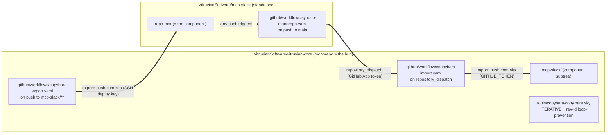
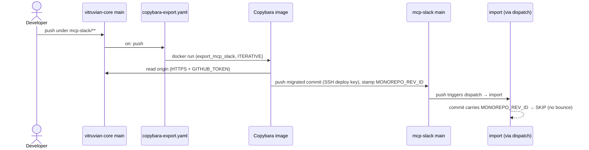
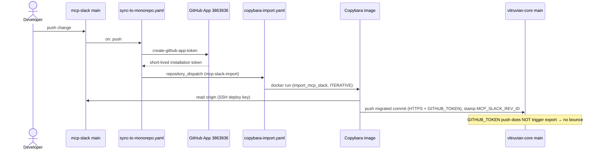
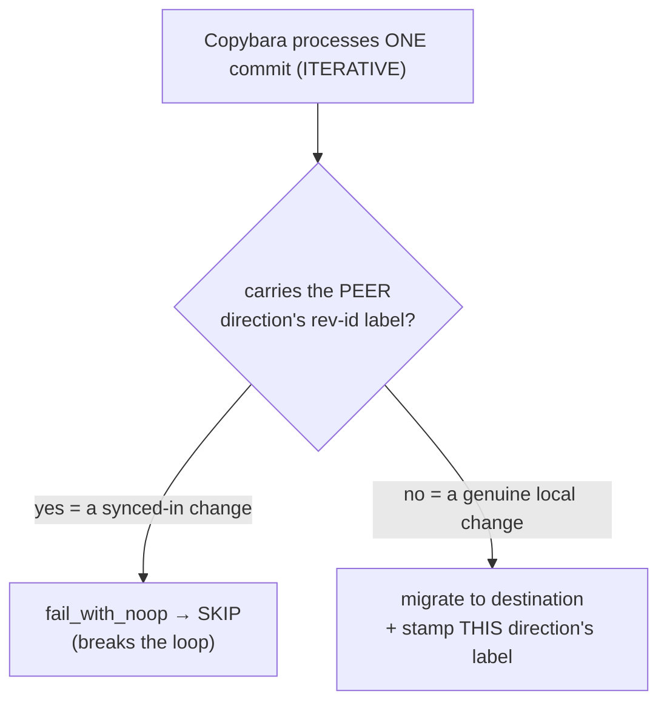
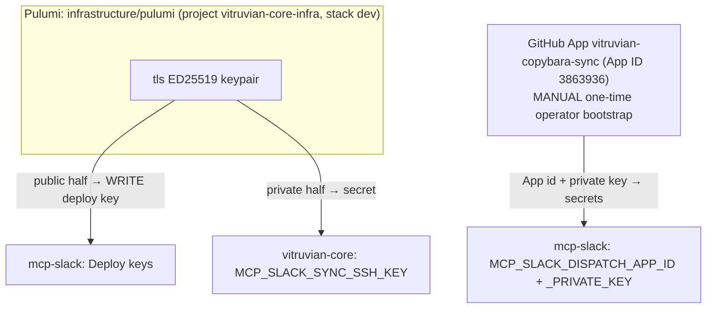

# Copybara Bidirectional Sync — Admin Runbook

**Scope:** how the bidirectional sync between `vitruvian-core/mcp-slack/` and the standalone
`github.com/VitruvianSoftware/mcp-slack` repo works, how to operate and maintain it, and what to
watch out for. This is the **mcp-slack pilot**; the same pattern templates to devx / homelab /
nexus-agent later.

> [!WARNING]
> **Conflict handling is NOT fail-loud.** If the *same line* is edited on **both** repos before a
> sync cycle completes, the two repos **silently diverge** — both syncs run green and end up holding
> opposite values, with no error. See [§7 Conflicts](#7-conflicts--the-one-thing-to-watch). Normal
> (non-concurrent) edits sync correctly with no bounce.

---

## 1. TL;DR

- **Bidirectional, on-push, near-real-time.** A push under `vitruvian-core/mcp-slack/**` is exported
  to the standalone repo; a push to the standalone repo is imported back under `mcp-slack/`.
- **Centralized hub.** All sync logic (the Copybara config + both sync workflows) lives in
  **vitruvian-core**. The standalone repo carries exactly one tiny workflow that fires a
  `repository_dispatch`.
- **No bounce.** Per-direction rev-id labels + a per-commit skip-guard stop an exported change from
  bouncing back as an import (and vice-versa).
- **Auth is IaC.** A write SSH deploy key + a GitHub App, provisioned by Pulumi.

---

## 2. Architecture at a glance



### Moving parts

| File | Repo | Purpose |
|---|---|---|
| `tools/copybara/copy.bara.sky` | vitruvian-core | The Copybara config: `export_mcp_slack` + `import_mcp_slack` workflows, `ITERATIVE` mode, rev-id labels, skip-guards, path `core.move`, context-file excludes. |
| `.github/workflows/copybara-export.yaml` | vitruvian-core | Runs `export_mcp_slack` on push to `mcp-slack/**`. Also `workflow_dispatch` (manual). |
| `.github/workflows/copybara-import.yaml` | vitruvian-core | Runs `import_mcp_slack` on `repository_dispatch` (type `mcp-slack-import`). Also `workflow_dispatch`. |
| `.github/workflows/sync-to-monorepo.yaml` | **mcp-slack** | On push, mints a GitHub App token and fires the `repository_dispatch` into vitruvian-core. The only sync machinery the standalone carries. |
| `infrastructure/pulumi/pkg/copybara_sync/sync.go` | vitruvian-core | IaC that provisions the deploy key + the three Actions secrets. |

### Versions / identifiers (pinned)

| Thing | Value |
|---|---|
| Copybara image | `olivr/copybara@sha256:87e2e9089344e64693faebb2ee0ed33b8797358c0420b0fa98325ca611e98679` (2023-01 build, reports "Unknown version") |
| Dispatch token action | `actions/create-github-app-token@bcd2ba49218906704ab6c1aa796996da409d3eb1` (v3.2.0) |
| GitHub App | `vitruvian-copybara-sync`, **App ID 3863936**, installed on `vitruvian-core` only (Contents: Read & write) |
| Export-push secret | `MCP_SLACK_SYNC_SSH_KEY` (in vitruvian-core) ↔ write deploy key on mcp-slack |
| Dispatch secrets | `MCP_SLACK_DISPATCH_APP_ID`, `MCP_SLACK_DISPATCH_APP_PRIVATE_KEY` (in mcp-slack) |
| Rev-id labels | export stamps `MONOREPO_REV_ID`; import stamps `MCP_SLACK_REV_ID` |

---

## 3. How the EXPORT flow works (monorepo → standalone)

**Trigger:** a push to `vitruvian-core` `main` touching `mcp-slack/**`.

1. `copybara-export.yaml` fires (`on: push`, `paths: mcp-slack/**`).
2. It writes auth to the runner: the deploy key → `~/.ssh/id_rsa` (with a guaranteed trailing
   newline), and `GITHUB_TOKEN` → `~/.git-credentials`.
3. It runs `docker run olivr/copybara@sha256:… copybara` with `COPYBARA_WORKFLOW=export_mcp_slack`.
4. Copybara **reads** vitruvian-core over **HTTPS** (`GITHUB_TOKEN`), strips the `mcp-slack/` prefix
   (`core.move`), and **pushes** the migrated commit(s) to the standalone over **SSH** (deploy key),
   stamping each with `MONOREPO_REV_ID`.
5. That push to mcp-slack `main` triggers `sync-to-monorepo.yaml` → a `repository_dispatch` → the
   import. The import sees the `MONOREPO_REV_ID` label and **skip-guards** it (no bounce).



---

## 4. How the IMPORT flow works (standalone → monorepo)

**Trigger:** a push to `mcp-slack` `main`.

1. `sync-to-monorepo.yaml` (in mcp-slack) fires `on: push`.
2. It mints a short-lived token from the **GitHub App** (`create-github-app-token`, using the
   `MCP_SLACK_DISPATCH_APP_*` secrets) and `POST`s a `repository_dispatch` (`event_type:
   mcp-slack-import`) to vitruvian-core. *(The App is needed because the standalone's own
   `GITHUB_TOKEN` can't reach vitruvian-core.)*
3. `copybara-import.yaml` fires on that dispatch, sets up the same auth, and runs
   `COPYBARA_WORKFLOW=import_mcp_slack`.
4. Copybara **reads** mcp-slack over **SSH** (deploy key), adds the `mcp-slack/` prefix, and
   **pushes** to vitruvian-core `main` over **HTTPS** (`GITHUB_TOKEN`, needs `contents: write`),
   stamping each commit with `MCP_SLACK_REV_ID`.
5. That push is made by `GITHUB_TOKEN`, which **does not trigger workflows** — so the export is not
   re-triggered. (The skip-guard would also catch it; this is belt-and-suspenders.)



---

## 5. How loop-prevention works (and why `ITERATIVE` is mandatory)

Two cooperating mechanisms, **both required**:

1. **Per-direction rev-id labels.** Export stamps `MONOREPO_REV_ID`; import stamps `MCP_SLACK_REV_ID`
   (via `experimental_custom_rev_id`). A change's label tells you which side it originated on.
2. **A per-commit skip-guard** (`core.dynamic_transform` → `core.fail_with_noop`): if a commit
   carries the *other* direction's label, drop it instead of migrating it back.



> [!IMPORTANT]
> **Use `ITERATIVE`, never `SQUASH`.** In SQUASH mode the skip-guard sees the labels of the *whole
> squashed range*, so a range that merely **contains** one peer-origin commit is skipped **entirely**
> — including genuine changes batched with it. Because an import lands on monorepo `main` via
> `GITHUB_TOKEN` (which doesn't advance the export baseline), the next export range includes that
> import commit, and SQUASH would skip the genuine change too — **the export direction gets stuck.**
> `ITERATIVE` evaluates the guard per commit, so only peer commits are skipped. (Verified the hard
> way in CI on 2026-05-26.)

---

## 6. Auth & secrets (all IaC except the App bootstrap)



- **Export push** (vitruvian-core → mcp-slack): the **write deploy key** on mcp-slack. Private half
  is `MCP_SLACK_SYNC_SSH_KEY` in vitruvian-core.
- **Reading vitruvian-core / writing it on import:** the workflow's `GITHUB_TOKEN` over HTTPS.
- **The dispatch** (mcp-slack → vitruvian-core): the **GitHub App**. The App is installed on
  `vitruvian-core` only (least-privilege; `repository_dispatch` needs Contents: write there). Its
  credentials live as secrets in mcp-slack.
- **Provisioned by Pulumi** (`pkg/copybara_sync/sync.go`): the deploy key + all three secrets. The
  App itself is created/installed by hand (GitHub has no headless App-creation API); Pulumi only
  places its credentials, supplied as stack config secrets `mcpSlackDispatchAppId` /
  `mcpSlackDispatchAppPrivateKey`.

---

## 7. Conflicts — THE one thing to watch

```mermaid
sequenceDiagram
    participant VC as vitruvian-core main
    participant MS as mcp-slack main
    Note over VC,MS: in sync; line L = "old"
    par concurrent conflicting edits
        VC->>VC: edit L="A", push (→ export)
    and
        MS->>MS: edit L="B", push (→ import)
    end
    VC-->>MS: export overwrites L → "A" (green)
    MS-->>VC: import overwrites L → "B" (green)
    Note over VC,MS: DIVERGED — VC="B", MS="A", NO error
```

**What happens:** Copybara's `git.destination` makes the destination *match the origin* (a state
sync, not a 3-way merge). The rev-id labels do **loop-prevention, not conflict-detection** — nothing
checks "did the destination move out from under me since the baseline?" So two concurrent conflicting
edits each overwrite the other; the repos end up inconsistent, silently, with green CI.

**What to do today:**
- Treat the sync as **last-writer-wins**, and avoid editing the *same* file on both repos at once.
- After any suspected concurrent edit, **diff the component on both repos** (see §9) and reconcile by
  hand.

**Divergence is now detected LOUD (implemented):**
[`.github/workflows/copybara-drift-check.yaml`](../.github/workflows/copybara-drift-check.yaml)
diffs `vitruvian-core/mcp-slack/` against the standalone root (applying the same context-file
excludes) and goes **RED** with a CI error annotation if they diverge. It runs **after every sync**
(`workflow_run`), **every 30 min** (`schedule`), and **on demand**
(`gh workflow run copybara-drift-check.yaml -R VitruvianSoftware/vitruvian-core`). So a conflict no
longer corrupts silently — you get a failing run pointing you at the diverged files; reconcile by
hand (see the diff in the run log).

This is *detection*. To also **prevent** the overwrite (future work), add one of:
1. **Pre-push baseline check** — fail the sync if the destination's current rev-id ≠ the expected
   baseline. The "right" fix, but hard to get right: telling "one side is legitimately ahead" apart
   from a true conflict needs a 3-way comparison against the last common baseline, and the per-commit
   rev-id echoes create false-positive traps — mis-tuned, it blocks normal syncs.
2. **Serialize syncs** — put both sync workflows in one `concurrency` group so export and import
   never run at once. Cheap; reduces a conflict from *divergence* to deterministic last-writer-wins
   (the repos stay consistent, but one side's edit is still silently lost).

---

## 8. Routine maintenance (step by step)

### 8a. Re-run a sync manually
Both sync workflows expose `workflow_dispatch` with a `copybara_options` input.

```bash
# Export (normal):
gh workflow run copybara-export.yaml -R VitruvianSoftware/vitruvian-core --ref main
# Import (normal):
gh workflow run copybara-import.yaml -R VitruvianSoftware/vitruvian-core --ref main
```

### 8b. Seed a fresh destination baseline (first-ever sync, or after a reset)
A brand-new destination has no rev-id baseline, so a normal run errors with
`Cannot find last imported revision … <LABEL> could not be found`. Seed it **once**:

```bash
# Prefer --last-rev pointing at the commit just BEFORE the change you want to seed,
# so the range excludes any peer-origin commit (avoids skip-guard surprises):
gh workflow run copybara-export.yaml -R VitruvianSoftware/vitruvian-core --ref main \
  -f copybara_options="--last-rev <vitruvian-core-sha> --ignore-noop"
# Or --force to seed from full history (fine in ITERATIVE — it skips peer commits per-commit):
gh workflow run copybara-import.yaml -R VitruvianSoftware/vitruvian-core --ref main \
  -f copybara_options="--force --ignore-noop"
```
After the first successful run, the label is stamped and normal runs work.

### 8c. Watch / debug a run
```bash
gh run list   -R VitruvianSoftware/vitruvian-core --workflow=copybara-export.yaml --limit 5
gh run view  <id> -R VitruvianSoftware/vitruvian-core --log-failed
```

### 8d. Rotate the deploy key (via Pulumi)
The key lives in Pulumi state. Changing the generated key is **ForceNew** on the deploy key, so it
rotates the keypair + updates the secret. From `infrastructure/pulumi/`:
```bash
export GITHUB_OWNER=VitruvianSoftware GITHUB_TOKEN="$(gh auth token)"
pulumi preview --stack dev   # confirm only the deploy key + secret change
pulumi up --stack dev
```

### 8e. Rotate / replace the GitHub App private key
The App is a manual resource. Generate a new private key in the App settings, then update the Pulumi
config secret and re-apply:
```bash
pulumi config set --secret mcpSlackDispatchAppPrivateKey < new-key.pem   # never echo the key
pulumi up --stack dev   # updates MCP_SLACK_DISPATCH_APP_PRIVATE_KEY in mcp-slack
```

### 8f. Onboard another component (devx / homelab / nexus-agent)
1. Add an entry to `syncedProjects` in `pkg/copybara_sync/sync.go`, create/reuse a GitHub App, set
   its config secrets, `pulumi up`.
2. Add `export_<proj>` / `import_<proj>` workflows to `copy.bara.sky` (copy the mcp-slack pair;
   adjust the `core.move` path + excludes). **For devx/homelab, exclude the monorepo-root `go.work`**
   so each standalone round-trips as a valid Go module.
3. Add the export/import workflows in vitruvian-core + the dispatch workflow in the standalone.

---

## 9. Troubleshooting

| Symptom (in the run log) | Cause | Fix |
|---|---|---|
| `Cannot find last imported revision … <LABEL> could not be found` | Destination has no rev-id baseline yet | Seed once with `--last-rev`/`--force` (§8b) |
| `Load key "/root/.ssh/id_rsa": invalid format` → `Permission denied (publickey)` | SSH key lost its trailing newline | We run the image directly and write the key with a guaranteed `\n` — do **not** switch to `olivr/copybara-action` (it trims the newline via `core.getInput`) |
| A genuine change silently doesn't sync; export "succeeds" as NO_OP | Skip-guard over-fired (only possible in `SQUASH`) | Ensure `mode = "ITERATIVE"` in `copy.bara.sky` (§5) |
| Repos hold different values for the same line, both runs green | Concurrent conflicting edit (see §7) | Reconcile by hand; consider the fail-loud options in §7 |
| Export pushes but the standalone loses `package-lock.json` / the dispatch workflow; or import deletes `mcp-slack/BUILD` | Missing context-file exclude | Confirm the `glob(..., exclude=[…])` lists in `copy.bara.sky` (see below) |

**Diff the component across both repos:**
```bash
gh api repos/VitruvianSoftware/vitruvian-core/contents/mcp-slack/<file>?ref=main --jq .content | base64 -d
gh api repos/VitruvianSoftware/mcp-slack/contents/<file>?ref=main --jq .content | base64 -d
```

**Context files that must NOT cross the boundary** (already configured in `copy.bara.sky`):
- export keeps the standalone's `package-lock.json` and `.github/workflows/sync-to-monorepo.yaml`;
- both directions keep the monorepo-only `mcp-slack/BUILD`.

---

## 10. Why the unusual choices (so you don't "fix" them and break it)

- **Direct `docker run`, not `olivr/copybara-action`** — the action trims the SSH key's trailing
  newline. We pin the image by digest and manage auth ourselves.
- **`experimental_custom_rev_id` (not `custom_rev_id`)** and `_REV_ID` label format — required by the
  pinned 2023 image. On a newer Copybara you'd rename to `custom_rev_id` (the `_REV_ID` labels still
  work). To upgrade the image, mirror a known-good build to GHCR and re-validate loop-prevention.
- **`ITERATIVE` mode** — mandatory (see §5).
- **GitHub App for the dispatch (not a PAT)** — org-managed, rotatable, least-privilege.

---

*Pilot design + decision history: [`docs/planning/2026-05-25-copybara-bidi-sync-design.md`](planning/2026-05-25-copybara-bidi-sync-design.md)
and [`…-plan.md`](planning/2026-05-25-copybara-bidi-sync-plan.md) (see its `## Outcome`).*
