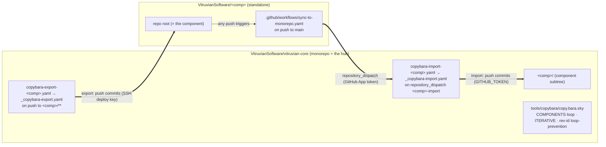
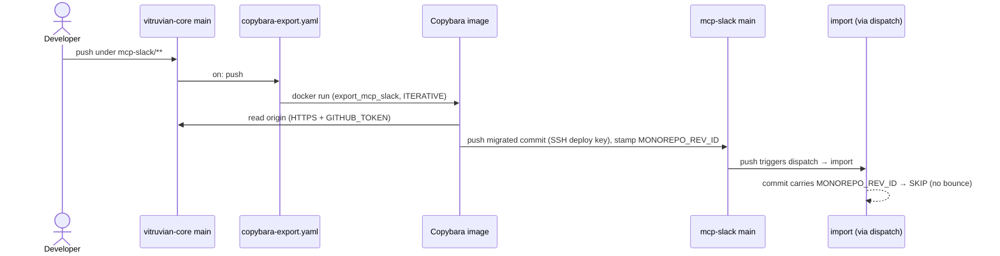
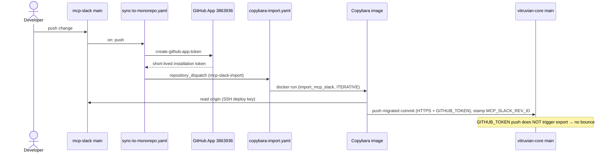
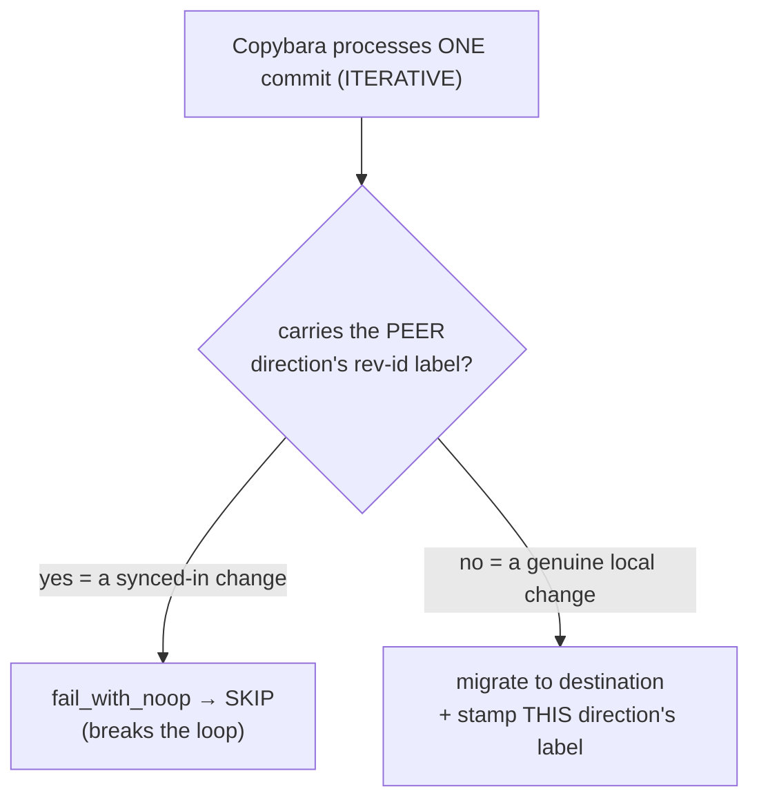
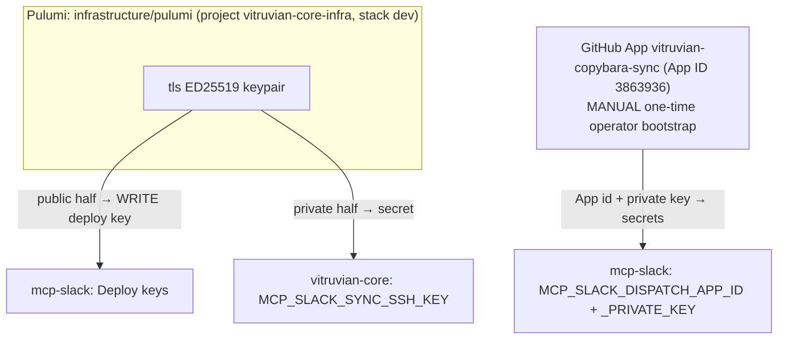
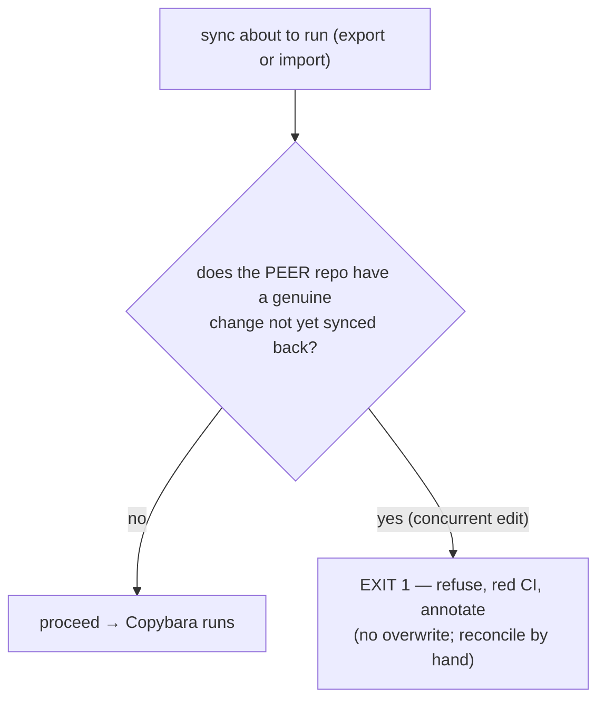
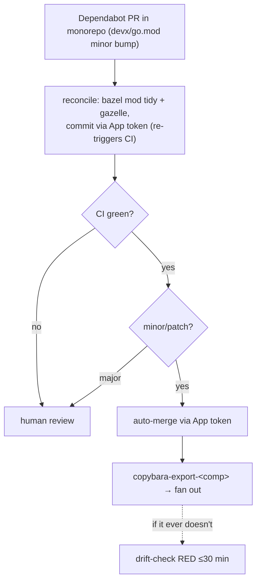

# Copybara Bidirectional Sync — Admin Runbook

**Scope:** how the bidirectional sync between each `vitruvian-core/<component>/` subtree and its
standalone `github.com/VitruvianSoftware/<component>` repo works, how to operate and maintain it, and
what to watch out for. **Live for all four components:** `mcp-slack`, `devx`, `homelab`,
`nexus-agent`. The mechanism is identical per component; the Copybara config is one parameterized
loop and the CI workflows are two reusable workflows with thin per-component callers.

> [!WARNING]
> **Conflict handling is NOT fail-loud.** If the *same line* is edited on **both** repos before a
> sync cycle completes, the two repos **silently diverge** — both syncs run green and end up holding
> opposite values, with no error. See [§7 Conflicts](#7-conflicts--the-one-thing-to-watch). Normal
> (non-concurrent) edits sync correctly with no bounce.

---

## 1. TL;DR

- **Bidirectional, on-push, near-real-time.** A push under `vitruvian-core/<component>/**` is
  exported to that standalone repo; a push to a standalone repo is imported back under
  `<component>/`.
- **Centralized hub.** All sync logic (the Copybara config + the reusable sync workflows) lives in
  **vitruvian-core**. Each standalone repo carries exactly one tiny workflow that fires a
  `repository_dispatch`.
- **One config, N components.** `copy.bara.sky` generates `export_<comp>`/`import_<comp>` for every
  component from a `COMPONENTS` list; CI uses two reusable workflows + per-component callers.
- **No bounce.** Per-direction rev-id labels + a per-commit skip-guard stop an exported change from
  bouncing back as an import (and vice-versa).
- **Auth is IaC.** A write SSH deploy key + a GitHub App, provisioned by Pulumi.

---

## 2. Architecture at a glance

Per component (`<comp>` ∈ {mcp-slack, devx, homelab, nexus-agent}):



> §3–§4 below walk the flow using **mcp-slack** as the worked example; every component behaves
> identically (substitute `<comp>` and its `<COMP>_*` secrets / `<COMP>_REV_ID` label).

### Moving parts

| File | Repo | Purpose |
|---|---|---|
| `tools/copybara/copy.bara.sky` | vitruvian-core | The Copybara config. A `COMPONENTS` list drives a function (run via a top-level comprehension — Starlark forbids top-level `for`) that generates `export_<comp>`/`import_<comp>` for every component: `ITERATIVE` mode, rev-id labels, skip-guards, path `core.move`, `**/BUILD` + context-file excludes. |
| `.github/workflows/_copybara-export.yaml` | vitruvian-core | **Reusable** (`workflow_call`). All export logic + the pinned Copybara image, parameterized by `component` / `standalone_only` / `sync_ssh_key`. |
| `.github/workflows/_copybara-import.yaml` | vitruvian-core | **Reusable.** All import logic (incl. the push-race retry). |
| `.github/workflows/copybara-export-<comp>.yaml` | vitruvian-core | Thin caller (×4). Owns the `push` path trigger (`<comp>/**`) + per-component concurrency group; calls the export reusable. |
| `.github/workflows/copybara-import-<comp>.yaml` | vitruvian-core | Thin caller (×4). Owns the `repository_dispatch` trigger (type `<comp>-import`) + per-component concurrency; calls the import reusable. |
| `.github/workflows/copybara-drift-check.yaml` | vitruvian-core | Loops all 4 components, diffs each subtree against its standalone (gated on whether the component is seeded). |
| `tools/copybara/conflict-precheck.sh` | vitruvian-core | Component-aware pre-push conflict guard (run by both reusables). |
| `.github/workflows/sync-to-monorepo.yaml` | **each standalone** | On push, mints a GitHub App token and fires the `repository_dispatch` into vitruvian-core. The only sync machinery a standalone carries. |
| `infrastructure/pulumi/pkg/copybara_sync/sync.go` | vitruvian-core | IaC: loops `syncedProjects`, provisioning each component's deploy key + three Actions secrets. |

### Versions / identifiers (pinned)

| Thing | Value |
|---|---|
| Copybara image | `olivr/copybara@sha256:87e2e9089344e64693faebb2ee0ed33b8797358c0420b0fa98325ca611e98679` (2023-01 build, reports "Unknown version") |
| Dispatch token action | `actions/create-github-app-token@bcd2ba49218906704ab6c1aa796996da409d3eb1` (v3.2.0) |
| GitHub App | `vitruvian-copybara-sync`, **App ID 3863936**, installed on `vitruvian-core` only (Contents: Read & write). **Reused by all four components** (one App, its id/key placed as per-component secrets). |
| Export-push secret | `<COMP>_SYNC_SSH_KEY` (in vitruvian-core) ↔ write deploy key on the standalone. e.g. `DEVX_SYNC_SSH_KEY`, `NEXUS_AGENT_SYNC_SSH_KEY`. |
| Dispatch secrets | `<COMP>_DISPATCH_APP_ID`, `<COMP>_DISPATCH_APP_PRIVATE_KEY` (in each standalone) — all hold the same reused App's credentials. |
| Rev-id labels | export stamps `MONOREPO_REV_ID` (shared — each lands on a *separate* standalone); import stamps a per-component `<COMP>_REV_ID` (unique — they all land in the *shared* monorepo). |

---

## 3. How the EXPORT flow works (monorepo → standalone)

**Trigger:** a push to `vitruvian-core` `main` touching `mcp-slack/**`.

1. `copybara-export.yaml` fires (`on: push`, `paths: mcp-slack/**`).
2. It writes auth to the runner: the deploy key → `~/.ssh/id_rsa` (with a guaranteed trailing
   newline), and `GITHUB_TOKEN` → `~/.git-credentials`.
3. It runs `docker run olivr/copybara@sha256:… copybara` with `COPYBARA_WORKFLOW=export_mcp_slack`.
4. Copybara **reads** vitruvian-core over **HTTPS** (`GITHUB_TOKEN`), strips the `mcp-slack/` prefix
   (`core.move`), and **pushes** the migrated commit(s) to the standalone over **SSH** (deploy key),
   stamping each with `MONOREPO_REV_ID`.
5. That push to mcp-slack `main` triggers `sync-to-monorepo.yaml` → a `repository_dispatch` → the
   import. The import sees the `MONOREPO_REV_ID` label and **skip-guards** it (no bounce).



---

## 4. How the IMPORT flow works (standalone → monorepo)

**Trigger:** a push to `mcp-slack` `main`.

1. `sync-to-monorepo.yaml` (in mcp-slack) fires `on: push`.
2. It mints a short-lived token from the **GitHub App** (`create-github-app-token`, using the
   `MCP_SLACK_DISPATCH_APP_*` secrets) and `POST`s a `repository_dispatch` (`event_type:
   mcp-slack-import`) to vitruvian-core. *(The App is needed because the standalone's own
   `GITHUB_TOKEN` can't reach vitruvian-core.)*
3. `copybara-import.yaml` fires on that dispatch, sets up the same auth, and runs
   `COPYBARA_WORKFLOW=import_mcp_slack`.
4. Copybara **reads** mcp-slack over **SSH** (deploy key), adds the `mcp-slack/` prefix, and
   **pushes** to vitruvian-core `main` over **HTTPS** (`GITHUB_TOKEN`, needs `contents: write`),
   stamping each commit with `MCP_SLACK_REV_ID`.
5. That push is made by `GITHUB_TOKEN`, which **does not trigger workflows** — so the export is not
   re-triggered. (The skip-guard would also catch it; this is belt-and-suspenders.)



---

## 5. How loop-prevention works (and why `ITERATIVE` is mandatory)

Two cooperating mechanisms, **both required**:

1. **Per-direction rev-id labels.** Export stamps `MONOREPO_REV_ID`; import stamps `MCP_SLACK_REV_ID`
   (via `experimental_custom_rev_id`). A change's label tells you which side it originated on.
2. **A per-commit skip-guard** (`core.dynamic_transform` → `core.fail_with_noop`): if a commit
   carries the *other* direction's label, drop it instead of migrating it back.



> [!IMPORTANT]
> **Use `ITERATIVE`, never `SQUASH`.** In SQUASH mode the skip-guard sees the labels of the *whole
> squashed range*, so a range that merely **contains** one peer-origin commit is skipped **entirely**
> — including genuine changes batched with it. Because an import lands on monorepo `main` via
> `GITHUB_TOKEN` (which doesn't advance the export baseline), the next export range includes that
> import commit, and SQUASH would skip the genuine change too — **the export direction gets stuck.**
> `ITERATIVE` evaluates the guard per commit, so only peer commits are skipped. (Verified the hard
> way in CI on 2026-05-26.)

---

## 6. Auth & secrets (all IaC except the App bootstrap)



- **Export push** (vitruvian-core → mcp-slack): the **write deploy key** on mcp-slack. Private half
  is `MCP_SLACK_SYNC_SSH_KEY` in vitruvian-core.
- **Reading vitruvian-core / writing it on import:** the workflow's `GITHUB_TOKEN` over HTTPS.
- **The dispatch** (mcp-slack → vitruvian-core): the **GitHub App**. The App is installed on
  `vitruvian-core` only (least-privilege; `repository_dispatch` needs Contents: write there). Its
  credentials live as secrets in mcp-slack.
- **Provisioned by Pulumi** (`pkg/copybara_sync/sync.go`): per component, the deploy key + all three
  secrets — it loops `syncedProjects`. The App itself is created/installed by hand (GitHub has no
  headless App-creation API); Pulumi only places its credentials, supplied as stack config secrets
  `<comp>DispatchAppId` / `<comp>DispatchAppPrivateKey` (all set to the one reused App).
- **Pulumi config gotchas:** the stack sets `github:owner=VitruvianSoftware` (without it the GitHub
  provider defaults to the token's user and 404s). The pulumi program is its own Go module outside the
  monorepo `go.work`, so run pulumi with **`GOWORK=off`** (else the build resolves the wrong main
  module). `Pulumi.dev.yaml` is gitignored; Pulumi Cloud (`ipv1337/vitruvian-core-infra/dev`) is the
  source of truth.

---

## 7. Conflicts — THE one thing to watch

```mermaid
sequenceDiagram
    participant VC as vitruvian-core main
    participant MS as mcp-slack main
    Note over VC,MS: in sync; line L = "old"
    par concurrent conflicting edits
        VC->>VC: edit L="A", push (→ export)
    and
        MS->>MS: edit L="B", push (→ import)
    end
    VC-->>MS: export overwrites L → "A" (green)
    MS-->>VC: import overwrites L → "B" (green)
    Note over VC,MS: DIVERGED — VC="B", MS="A", NO error
```

**What happens:** Copybara's `git.destination` makes the destination *match the origin* (a state
sync, not a 3-way merge). The rev-id labels do **loop-prevention, not conflict-detection** — nothing
checks "did the destination move out from under me since the baseline?" So two concurrent conflicting
edits each overwrite the other; the repos end up inconsistent, silently, with green CI.

**What to do today:**
- Treat the sync as **last-writer-wins**, and avoid editing the *same* file on both repos at once.
- After any suspected concurrent edit, **diff the component on both repos** (see §9) and reconcile by
  hand.

**Divergence is now detected LOUD (implemented):**
[`.github/workflows/copybara-drift-check.yaml`](../.github/workflows/copybara-drift-check.yaml)
diffs `vitruvian-core/mcp-slack/` against the standalone root (applying the same context-file
excludes) and goes **RED** with a CI error annotation if they diverge. It runs **after every sync**
(`workflow_run`), **every 30 min** (`schedule`), and **on demand**
(`gh workflow run copybara-drift-check.yaml -R VitruvianSoftware/vitruvian-core`). So a conflict no
longer corrupts silently — you get a failing run pointing you at the diverged files; reconcile by
hand (see the diff in the run log).

**Conflicts are now also PREVENTED (implemented):** each sync workflow runs
[`tools/copybara/conflict-precheck.sh`](../tools/copybara/conflict-precheck.sh) **before** Copybara.
It refuses to sync (exit 1, red, with an error annotation) when the **peer** repo has an un-synced
*genuine* change — a commit that does **not** carry the other direction's rev-id label, i.e. a real
edit not yet reflected back. Syncing then would overwrite it. Because **both** directions run the
check, a true conflict fails **both** runs and **neither overwrites** — the two edits stay intact on
their own sides, and you reconcile by hand and re-run. (A `--force` dispatch skips the pre-check, for
deliberate re-seeds.)



> **Why not just serialize the two workflows?** It doesn't help here: in ITERATIVE mode each side's
> commit is replayed onto the other *regardless of order*, so serializing the runs still diverges.
> Refusing when the peer is ahead with a genuine change is what actually prevents the overwrite.

So a conflict now **fails both syncs loud** (pre-check, before any write); the **drift check** above
remains as a backstop for anything that slips through. Recovery = reconcile the two edits by hand,
then re-run the sync.

---

## 8. Routine maintenance (step by step)

### 8a. Re-run a sync manually
Every caller workflow exposes `workflow_dispatch` with a `copybara_options` input. Use the
**per-component** file name:

```bash
# Export (normal), e.g. devx:
gh workflow run copybara-export-devx.yaml -R VitruvianSoftware/vitruvian-core --ref main
# Import (normal), e.g. devx:
gh workflow run copybara-import-devx.yaml -R VitruvianSoftware/vitruvian-core --ref main
```

### 8b. Seed a fresh component baseline (first-ever sync) — the tested recipe
A brand-new destination has **no rev-id baseline**, so a normal run errors with
`Previous revision label <LABEL> could not be found … --last-rev or --init-history were not passed`.
**`--force` alone is NOT enough** — Copybara needs `--init-history`, and the baseline is anchored by a
**real migration** (a commit that touches managed paths). If the two repos are already byte-identical
the seed no-ops and stamps nothing, so seeding needs a transient diff. The tested recipe (verified
for devx/homelab/nexus-agent on 2026-05-26), using a throwaway marker that nets to zero:

```bash
COMP=devx   # the component
# 1. Add a transient marker in the monorepo (skip CI so the export doesn't auto-fire un-seeded):
#    echo seed > $COMP/.copybara-seed ; git commit -m "seed [skip ci]" ; git push
# 2. Export seed — forces a SQUASH "Project import" commit on the standalone (anchors MONOREPO_REV_ID):
gh workflow run copybara-export-$COMP.yaml --ref main \
  -f copybara_options="--force --squash --init-history --ignore-noop"
# 3. Remove the marker ON THE STANDALONE (git rm + push). Note the export-seed "Project import" SHA.
# 4. Import seed — ITERATIVE with --last-rev = that "Project import" SHA, so the range is JUST the
#    genuine removal (do NOT use --squash here: the squash range would include the MONOREPO_REV_ID
#    "Project import" commit and the skip-guard would drop the whole squash → no baseline):
gh workflow run copybara-import-$COMP.yaml --ref main \
  -f copybara_options="--force --last-rev <export-seed-Project-import-SHA> --ignore-noop"
```
After both seeds, the marker is gone from both repos and a **normal** `--ignore-noop` run finds the
baseline and no-ops. Confirm with `copybara-drift-check.yaml` (it should report the component "in
sync"). A `--force` run always skips the conflict pre-check.

### 8c. Watch / debug a run
```bash
gh run list   -R VitruvianSoftware/vitruvian-core --workflow=copybara-export.yaml --limit 5
gh run view  <id> -R VitruvianSoftware/vitruvian-core --log-failed
```

### 8d. Rotate the deploy key (via Pulumi)
The key lives in Pulumi state. Changing the generated key is **ForceNew** on the deploy key, so it
rotates the keypair + updates the secret. From `infrastructure/pulumi/`:
```bash
export GITHUB_OWNER=VitruvianSoftware GITHUB_TOKEN="$(gh auth token)"
pulumi preview --stack dev   # confirm only the deploy key + secret change
pulumi up --stack dev
```

### 8e. Rotate / replace the GitHub App private key
The App is a manual resource. Generate a new private key in the App settings, then update the Pulumi
config secret and re-apply:
```bash
pulumi config set --secret mcpSlackDispatchAppPrivateKey < new-key.pem   # never echo the key
pulumi up --stack dev   # updates MCP_SLACK_DISPATCH_APP_PRIVATE_KEY in mcp-slack
```

### 8f. Onboard another component
mcp-slack, devx, homelab, nexus-agent are already onboarded. For a **new** one (standalone repo must
already exist — this setup never creates repos):
1. **Config:** add a dict to `COMPONENTS` in `copy.bara.sky` — `name`, a unique
   `standalone_rev_id` (`<COMP>_REV_ID`), and `standalone_only` (always the dispatch workflow; add
   `package-lock.json` for npm components). The `**/BUILD` exclude is automatic. (No `core.move` or
   workflow hand-edits — the loop generates `export_<comp>`/`import_<comp>`.)
2. **CI:** add two thin callers — `copybara-export-<comp>.yaml` (push `paths: <comp>/**`) and
   `copybara-import-<comp>.yaml` (`repository_dispatch` type `<comp>-import`); copy an existing pair
   and swap the component name + `<COMP>_SYNC_SSH_KEY` secret. Add the component to the
   `drift-check` `workflow_run` list + `components` loop.
3. **Auth:** append the component to `syncedProjects` in `pkg/copybara_sync/sync.go`; set its
   `<comp>DispatchAppId` / `<comp>DispatchAppPrivateKey` config to the reused App's creds
   (`pulumi config get … | pulumi config set --secret …` so the key never prints); `pulumi up`.
4. **Dispatch workflow:** push `.github/workflows/sync-to-monorepo.yaml` to the standalone (copy an
   existing one; swap the `<COMP>_DISPATCH_APP_*` secret names + `event_type=<comp>-import`).
5. **Seed** both baselines per §8b, then confirm with the drift check.

---

## 9. Troubleshooting

| Symptom (in the run log) | Cause | Fix |
|---|---|---|
| `Cannot find last imported revision … <LABEL> could not be found` | Destination has no rev-id baseline yet | Seed once with `--last-rev`/`--force` (§8b) |
| `Load key "/root/.ssh/id_rsa": invalid format` → `Permission denied (publickey)` | SSH key lost its trailing newline | We run the image directly and write the key with a guaranteed `\n` — do **not** switch to `olivr/copybara-action` (it trims the newline via `core.getInput`) |
| A genuine change silently doesn't sync; export "succeeds" as NO_OP | Skip-guard over-fired (only possible in `SQUASH`) | Ensure `mode = "ITERATIVE"` in `copy.bara.sky` (§5) |
| Repos hold different values for the same line, both runs green | Concurrent conflicting edit (see §7) | Reconcile by hand; consider the fail-loud options in §7 |
| Export pushes but the standalone loses `package-lock.json` / the dispatch workflow; or import deletes a gazelle `BUILD` | Missing context-file exclude | Confirm the `glob(..., exclude=[…])` lists in `copy.bara.sky` (see below) |
| Import "succeeds" as NO_OP during seeding, no baseline stamped | `--squash` seed range included the export-origin `Project import` commit (skip-guard dropped the whole squash) | Seed the import with `--last-rev <export-seed-SHA>` in ITERATIVE, not `--squash` (§8b) |

**Diff the component across both repos:**
```bash
gh api repos/VitruvianSoftware/vitruvian-core/contents/mcp-slack/<file>?ref=main --jq .content | base64 -d
gh api repos/VitruvianSoftware/mcp-slack/contents/<file>?ref=main --jq .content | base64 -d
```

**Context files that must NOT cross the boundary** (already configured in `copy.bara.sky`):
- export keeps each standalone's `.github/workflows/sync-to-monorepo.yaml` (and `package-lock.json`
  for npm components: mcp-slack, nexus-agent);
- both directions keep the monorepo-only gazelle `**/BUILD` files (devx alone has 57).

---

## 10. Why the unusual choices (so you don't "fix" them and break it)

- **Direct `docker run`, not `olivr/copybara-action`** — the action trims the SSH key's trailing
  newline. We pin the image by digest and manage auth ourselves.
- **`experimental_custom_rev_id` (not `custom_rev_id`)** and `_REV_ID` label format — required by the
  pinned 2023 image. On a newer Copybara you'd rename to `custom_rev_id` (the `_REV_ID` labels still
  work).
- **`ITERATIVE` mode** — mandatory (see §5).
- **GitHub App for the dispatch (not a PAT)** — org-managed, rotatable, least-privilege.
- **Per-component import concurrency groups + a retry (NOT a shared group).** Every import pushes to
  the same monorepo `main`, so concurrent imports can race ("behind destination"). A *shared*
  concurrency group looks tempting but GitHub **cancels intermediate pending runs** in a group — that
  would silently DROP a component's import. So each import keeps its own group (no cancellation) and
  `_copybara-import.yaml` instead **retries** Copybara a few times: a losing push just means another
  import landed first, and re-running re-fetches `main` and replays cleanly. (Both learned the hard
  way during the 2026-05-26 templating: a shared group cancelled a third simultaneous import.)

### Pending hardening — mirror the Copybara image to GHCR
The sync pulls `olivr/copybara@sha256:…` from Docker Hub on every run. To remove that external
dependency, mirror the pinned digest to `ghcr.io/vitruviansoftware/copybara` and repin. **This needs
a token with `write:packages`** (the day-to-day automation token only has `repo`/`workflow`), so it
is an operator hand-off:
```bash
# With a PAT that has write:packages:
echo "$GHCR_PAT" | docker login ghcr.io -u <user> --password-stdin
docker pull  olivr/copybara@sha256:87e2e9089344e64693faebb2ee0ed33b8797358c0420b0fa98325ca611e98679
docker tag   olivr/copybara@sha256:87e2e90… ghcr.io/vitruviansoftware/copybara:2023-01-olivr
docker push  ghcr.io/vitruviansoftware/copybara:2023-01-olivr        # note the resulting GHCR digest
# Make the package public (simplest — it's a public-image mirror) OR add `packages: read` +
# `docker login ghcr.io` to the reusables. Then repin BOTH _copybara-{export,import}.yaml to
# ghcr.io/vitruviansoftware/copybara@sha256:<ghcr-digest> and re-run a sync to validate.
```
Do **not** repin the workflows before the GHCR image exists — every sync would fail pulling a
missing image.

---

## 11. Dependency updates (Dependabot)

Dependabot is **centralized in the monorepo** but split by what it can actually scan, then fanned out
to the standalones via the export. You manage every component's Dependabot config from here.

### Split model (who owns which ecosystem)
- **The monorepo owns** `gomod` (devx, homelab) **+** root `github-actions` — these live in
  `.github/dependabot.yml` and are scanned in-tree.
- **Each component's OWN workflow action pins** (e.g. its `sync-to-monorepo.yaml`) and **npm** are
  updated **per-standalone** — Dependabot can't scan a *subtree's* workflows from the monorepo, so
  those updates have to run where the workflow is the repo root.
- But the **standalone Dependabot configs still live here:** each is committed at
  `<comp>/.github/dependabot.yml` in the monorepo and **fans out via the export** to the standalone,
  where Dependabot then runs against it. **To add or adjust a standalone's Dependabot config, edit
  `<comp>/.github/dependabot.yml` in the monorepo** — the export does the rest. (See §8f when
  onboarding a new component.)

### Pipeline (a monorepo Go bump, end to end)
1. A monorepo Dependabot **Go PR** opens (e.g. a `devx/go.mod` bump).
2. [`dependabot-bazel-reconcile.yml`](../.github/workflows/dependabot-bazel-reconcile.yml) runs
   `bazel mod tidy` + `bazel run //:gazelle` and **commits any fix to the PR branch via the App
   token** — which **re-triggers CI** (a bot's own `GITHUB_TOKEN` push wouldn't). Version-only bumps
   reconcile to a **no-op**.
3. **CI** (`bazel build` / `bazel test`) runs on the PR.
4. After CI succeeds, [`dependabot-auto-merge.yml`](../.github/workflows/dependabot-auto-merge.yml)
   (triggered on **`workflow_run`** after `CI`) does a **direct merge** of **minor/patch** PRs **via
   the App token**, so the merge is **App-attributed**. Minor/patch is detected from the Dependabot
   **branch name** (our gomod/actions groups are `*-minor-patch`, so qualifying PRs land on
   `…/go-minor-patch-*` / `…/actions-minor-patch-*` branches); major bumps come on individual
   branches and never match. *(A direct `workflow_run` merge rather than `gh pr merge --auto` because
   the VitruvianSoftware org disables repo-level auto-merge.)*
5. The merge push triggers **`copybara-export-<comp>`**, which **fans the change out** to the
   standalone (same export flow as §3).
6. The 30-min **`copybara-drift-check`** (§7) is the **backstop** — if a merge ever fails to fan out,
   it goes RED within 30 min.

> **Major bumps are NOT auto-merged.** Review, **reconcile by hand if CI is red**, then merge
> manually. A normal **user** merge is **user-attributed**, so it **still triggers the export** and
> fans out — only `GITHUB_TOKEN`-attributed pushes are inert.



### App permissions (prerequisite for auto-merge)
The reused `vitruvian-copybara-sync` App (App ID 3863936) needs **Pull requests: write** — to merge —
in addition to its **Contents: write** (export push + reconcile commit). If auto-merge fails with
`Resource not accessible by integration (repository.pullRequest)`, the App is missing Pull requests:
write: grant it in the App's settings and **re-approve** the new permission on the vitruvian-core
installation. (Auto-merge stays inert until this is granted; the rest of the sync is unaffected.)

### Secrets
`SYNC_APP_ID` / `SYNC_APP_PRIVATE_KEY` exist on **vitruvian-core** as **both** a **Dependabot secret**
(so Dependabot-triggered runs — e.g. the reconcile — can read them) **and** an **Actions secret** (so
the `workflow_run` auto-merge, which runs in the default-branch context, can read them). Both are
provisioned by Pulumi (`pkg/copybara_sync/sync.go`).

### Invariant that keeps the reconcile safe
`bazel run //:gazelle` is kept a **no-op on `main`** — the root `BUILD` carries
`# gazelle:exclude infrastructure`. That is what makes the reconcile step's `git add -A` safe: gazelle
never rewrites unrelated `BUILD` files into the PR, so the only thing committed back is the genuine
dependency reconciliation.

---

*Pilot design + decision history: [`docs/planning/2026-05-25-copybara-bidi-sync-design.md`](planning/2026-05-25-copybara-bidi-sync-design.md)
and [`…-plan.md`](planning/2026-05-25-copybara-bidi-sync-plan.md) (see its `## Outcome`).*
