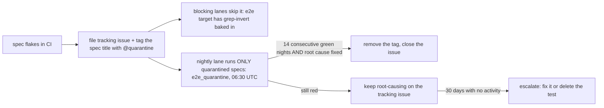

# Flaky tests: quarantine + culprit-finding (#501)

With the merge queue batching up to 5 PRs (`ALLGREEN`), one flaky test fails
five unrelated PRs at once. This page defines the two mechanisms that keep
flakes from taxing everyone and breakages from going unattributed.

## Quarantine (Playwright e2e specs)

The flaky unit in this repo's e2e suite is a *spec* inside one Bazel target
(`//tabula/extension:e2e`), so quarantine happens at the Playwright level, not
the Bazel tag level (tagging the whole target would drop the entire suite).

**To quarantine a spec:**

1. **File a tracking issue** describing the failure signature, evidence
   (run links), and current hypothesis. A quarantine without an issue is a
   silent coverage hole — the conformance of this rule is review, so put the
   issue number in the code comment.
2. Append ` @quarantine` to the spec title and add a `// QUARANTINED (#NNN)`
   comment above it.
3. That's it. The lanes split automatically via two Bazel targets in
   `tabula/extension/BUILD` (the grep filters are baked into `fixed_args`
   there — the service manager execs the Playwright binary directly, so a
   workflow-level `--test_arg` would silently never arrive):
   - **`//tabula/extension:e2e`** (blocking lanes, and any local run) carries
     `--grep-invert @quarantine` — the spec cannot fail unrelated changes.
   - **`//tabula/extension:e2e_quarantine`** (`manual`-tagged; run nightly by
     `tabula-e2e.yaml`'s `schedule:` by explicit label with
     `--nocache_test_results`) carries `--grep @quarantine
     --pass-with-no-tests`, so the spec keeps producing fresh signal and an
     empty register is a clean no-op.

**Exit criteria:** root cause fixed *and* 14 consecutive green nightly
quarantine runs → remove the tag and close the tracking issue. A quarantined
spec with no activity on its issue for 30 days should be escalated (fix it or
delete the test — permanent quarantine is deletion with extra steps).

**Current quarantine register:** search the tree for `@quarantine`; each hit
carries its issue number. (First entries: the two `sync-convergence.spec.ts`
LWW/reorder specs, [#512].)

## Culprit-finding (red nightly sweep)

`periodic-full-sweep.yaml` builds+tests all of `//...` nightly and files a P0
issue on red. Because merge-queue/postsubmit lanes are affected-scoped, a red
sweep means a breakage slipped past graph attribution — possibly landed by any
commit since the last green sweep, across a batch of merges.

`culprit-finder.yaml` (workflow_dispatch) bisects that range mechanically:

- **Inputs:** `good` (last green sweep's commit), `bad` (defaults to the red
  run's commit), `targets` (the failing target(s) from the sweep log).
- **Mechanism:** `git bisect run` driving `bazel test` on exactly the failing
  targets, with the BuildBuddy remote cache making midpoint builds cheap
  (`tools/ci/bisect-culprit.sh`).
- **Output:** the first-bad commit, posted as a comment on the breakage issue
  when an `issue` number is supplied.

Run it from the breakage issue the sweep filed — the issue body links the
failing run; the run log names the failing targets.

[#512]: https://github.com/VitruvianSoftware/vitruvian-core/issues/512
