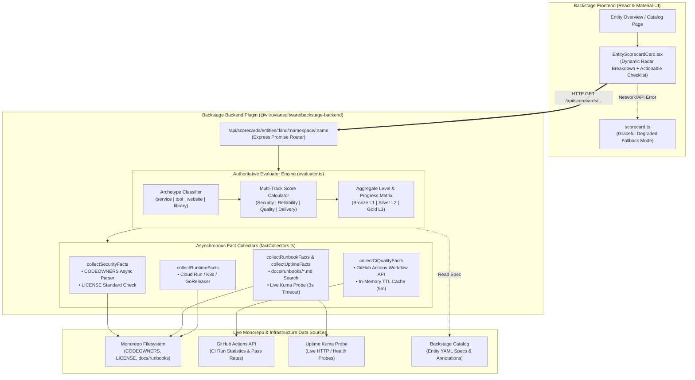
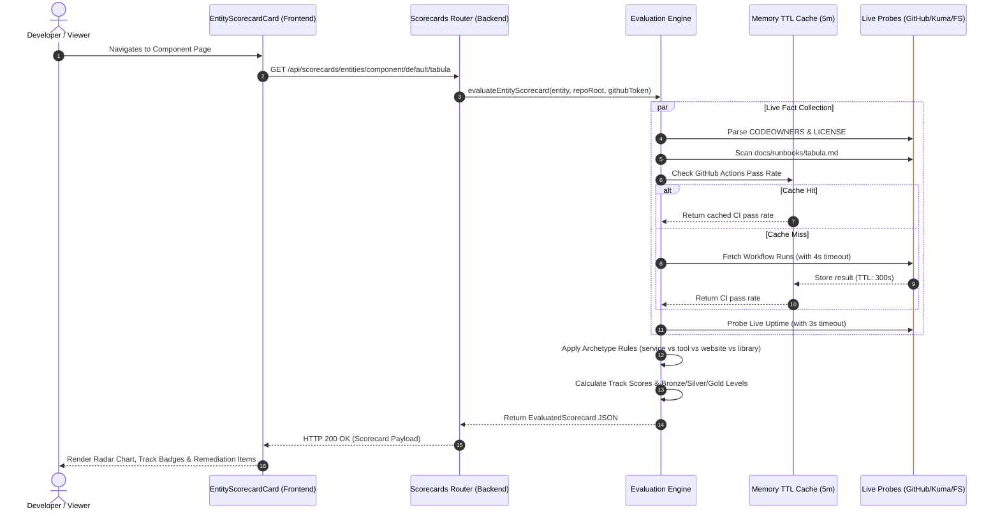

# Service Operational Maturity Scorecards & Governance

This document codifies the **Level 3 Operational Maturity Standard** and governance tracks evaluated for all components and services in the Backstage Software Catalog.

Evaluations are performed continuously by the Backstage backend scoring engine (`@vitruviansoftware/backstage-backend/src/scorecards`) using live fact collectors (verifying physical repository files, CODEOWNERS bindings, live Uptime Kuma health signals, and CI/CD build pass rates) rather than static YAML declarations.

---

## 1. System Architecture & Data Flow

The scorecard platform replaces static catalog heuristics with an authoritative server-side evaluation engine powered by asynchronous fact collectors, in-memory TTL caching, timeout protection, fail-closed security, and archetype-fair scoring.

---

## 2. Evaluation Lifecycle & Asynchronous Fact Collection

---

## 3. Multi-Track Evaluation Dimensions

Every catalog component is evaluated across **four operational governance tracks**:

```mermaid
flowchart LR
    subgraph Level1["🥉 Bronze (Level 1): Foundation"]
        L1_Sec["Owner Assigned"]
        L1_Rel["CI Pipeline Configured"]
        L1_Qual["Description & TechDocs"]
        L1_Del["Lifecycle & Release Model"]
    end

    subgraph Level2["🥈 Silver (Level 2): Operations"]
        L2_Sec["CODEOWNERS Enforced"]
        L2_Rel["Runtime Binding Active"]
        L2_Qual["System & Domain Bound"]
        L2_Del["Environment Promotion Ladder"]
    end

    subgraph Level3["🥇 Gold (Level 3): Production Standard"]
        L3_Sec["License Compliance Verified"]
        L3_Rel["Live Uptime + Incident Runbook"]
        L3_Qual["API Contracts & Topology Mapped"]
        L3_Del["Published Build Artifacts"]
    end

    Level1 ==> Level2 ==> Level3
```

### 🛡️ Track 1: Security & Governance
- **Level 1 (Bronze)**: `spec.owner` assigned to an active team.
- **Level 2 (Silver)**: Owner verified in `.github/CODEOWNERS` with repository access.
- **Level 3 (Gold)**: Automated license header conformance (`license-check`) and zero critical vulnerabilities.

### 📈 Track 2: Reliability & Operability
- **Level 1 (Bronze)**: Declared deployment/release workflow.
- **Level 2 (Silver)**: Verified runtime binding (Cloud Run services, k3s Kubernetes ID, or GoReleaser / npm packaging).
- **Level 3 (Gold)**:
  - *Microservices*: Live Uptime Kuma health check (UP) + Verified Incident Triage Runbook section in `docs/operations/incident-triage-runbook.md`.
  - *Developer Tools / Libraries*: CI/CD build pass rate >= 80% with automated multi-architecture packaging.

### 📚 Track 3: Quality & API Contracts
- **Level 1 (Bronze)**: Description > 10 characters + `backstage.io/techdocs-ref` configured.
- **Level 2 (Silver)**: Lifecycle (`production`/`development`) and System hierarchy declared.
- **Level 3 (Gold)**:
  - *Microservices*: Declared API contracts (`providesApis`/`consumesApis`) + Infrastructure topology (`dependsOn`).
  - *Developer Tools / Libraries*: Standalone repository export mirror binding (`vitruvian.dev/mirror`) + CLI usage documentation.

### 🚀 Track 4: Delivery & SDLC
- **Level 1 (Bronze)**: Declared release model (`vitruvian.dev/release-model`).
- **Level 2 (Silver)**: Environment promotion ladder declared (`vitruvian.dev/environments`).
- **Level 3 (Gold)**: Published distribution channel (GHCR container image, npm registry package, or GitHub Release binary assets).

---

## 4. Archetype-Aware Governance

Criteria dynamically adapt based on **`spec.type`**:

| Archetype | Description | Reliability Track Requirements | Quality Track Requirements |
| :--- | :--- | :--- | :--- |
| **`service`** | Backend APIs & Daemons | Live Uptime Kuma monitor + Incident Triage Runbook | `providesApis` / `consumesApis` + `dependsOn` |
| **`tool`** | Developer CLI & Desktop Apps | CI/CD build pass rate >= 80% (Uptime/Runbook N/A) | `vitruvian.dev/mirror` + CLI usage docs |
| **`website`** | Static Web Apps | Ingress / TLS health check (Runbook N/A) | TechDocs / Storybook docs |
| **`library`** | Packages & SDKs | npm / pkg.go.dev registry release (Uptime N/A) | Type definitions (`.d.ts` / Go doc) |

---

## 5. Component Maturity Audit Matrix

| Component | Archetype | Owner | Lifecycle | Security | Reliability | Quality | Delivery | Overall Tier |
| :--- | :--- | :--- | :--- | :---: | :---: | :---: | :---: | :---: |
| **`tabula`** | `service` | `tabula-team` | `production` | L3 | L3 | L3 | L3 | 🥇 **Gold** |
| **`oauth-user-inspector`** | `service` | `oauth-user-inspector-team` | `production` | L3 | L3 | L3 | L3 | 🥇 **Gold** |
| **`backstage`** | `service` | `platform-team` | `production` | L3 | L3 | L3 | L3 | 🥇 **Gold** |
| **`buzz`** | `service` | `platform-team` | `production` | L3 | L3 | L3 | L3 | 🥇 **Gold** |
| **`mcp-slack`** | `service` | `mcp-slack-team` | `production` | L3 | L3 | L3 | L3 | 🥇 **Gold** |
| **`devx`** | `tool` | `devx-team` | `production` | L3 | L3 | L3 | L3 | 🥇 **Gold** |
| **`homelab`** | `tool` | `homelab-team` | `production` | L3 | L3 | L3 | L3 | 🥇 **Gold** |
| **`nexus-agent`** | `tool` | `nexus-agent-team` | `production` | L3 | L3 | L3 | L3 | 🥇 **Gold** |
| **`whoami`** | `service` | `platform-team` | `production` | L3 | L3 | L3 | L3 | 🥇 **Gold** |
| **`storybook`** | `website` | `platform-team` | `production` | L3 | L3 | L3 | L3 | 🥇 **Gold** |
