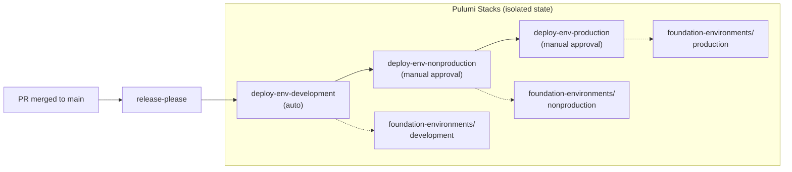

# Foundation Promotion Strategies

This document describes three strategies for promoting foundation infrastructure
changes through environments (development → nonproduction → production) in a
monorepo. The **recommended approach** is Option C (Reusable Workflow with
Chained Deploys), which is currently implemented in
[foundation-release.yaml](../../.github/workflows/foundation-release.yaml) and
[foundation-env-deploy.yaml](../../.github/workflows/foundation-env-deploy.yaml).

## Context

The upstream [terraform-example-foundation](https://github.com/terraform-google-modules/terraform-example-foundation)
uses a **branch promotion strategy**: three long-lived branches (`development`,
`nonproduction`, `production`) each trigger `terraform apply` against their
respective environments. Merging `development → nonproduction` promotes changes.

This approach doesn't work in a monorepo because merging one environment branch
into another would carry *all* monorepo changes, not just the foundation stage.
The strategies below achieve the same sequential promotion without
environment-specific branches.

---

## Option A: Sequential Deploy in a Single Workflow (Simplest)

One Pulumi project, three stacks. A single deploy job runs `pulumi up` against
each stack in sequence within the same workflow run. GitHub Environment
protection rules gate nonproduction and production.

```yaml
deploy-environments:
  steps:
    - run: pulumi stack select -c development && pulumi up --yes
    - run: pulumi stack select -c nonproduction && pulumi up --yes  # gated by GH Environment
    - run: pulumi stack select -c production && pulumi up --yes     # gated by GH Environment
```

### Pros
- Minimal workflow complexity — single workflow file, single job
- Easy to understand and debug

### Cons
- All environments deploy in a single workflow run
- No way to "hold" at nonproduction for days before promoting to production
  without blocking the entire workflow run
- A failure in nonproduction blocks production even if the failure is transient

---

## Option B: Path-Filtered Promotion via Dispatch (Most Flexible)

On merge to `main`, only `development` auto-deploys. Manual `workflow_dispatch`
events (or `/promote nonproduction` comment triggers) advance to the next
environment.

```yaml
# Trigger A: on merge to main
deploy-development:
  if: github.event_name == 'push'
  steps:
    - run: pulumi stack select -c development && pulumi up --yes

# Trigger B: manual dispatch
deploy-environment:
  if: github.event_name == 'workflow_dispatch'
  steps:
    - run: pulumi stack select -c "${{ inputs.environment }}" && pulumi up --yes
```

### Pros
- Maximum control — can wait arbitrarily long between environments
- Can re-promote a single environment without touching others
- Supports hotfix scenarios (deploy directly to production)

### Cons
- Requires manual dispatch — easy to forget or skip an environment
- More workflow files to maintain
- No built-in enforcement that development was deployed before nonproduction

---

## Option C: Reusable Workflow with Chained Deploys (Recommended) ✅

A reusable workflow (`foundation-env-deploy.yaml`) accepts `environment` as
input. The release workflow chains three calls:



Each environment maps to:
- A **Pulumi stack** with isolated state and per-stack config
  (`Pulumi.{environment}.yaml`)
- A **GitHub Environment** with optional protection rules
  (`foundation-env-{environment}`)

```yaml
# foundation-release.yaml
deploy-env-development:
  needs: release-gcp-environments
  if: needs.release-gcp-environments.outputs.release_created == 'true'
  uses: ./.github/workflows/foundation-env-deploy.yaml
  with: { environment: development }
  secrets: inherit

deploy-env-nonproduction:
  needs: deploy-env-development
  uses: ./.github/workflows/foundation-env-deploy.yaml
  with: { environment: nonproduction }
  secrets: inherit

deploy-env-production:
  needs: deploy-env-nonproduction
  uses: ./.github/workflows/foundation-env-deploy.yaml
  with: { environment: production }
  secrets: inherit
```

### Pros
- Clean separation — each environment has isolated Pulumi state
- GitHub UI shows pending approvals with clear visual indicators
- Scales naturally to `3-networks` and `4-projects` (same reusable workflow)
- Reusable workflow can also be called from `workflow_dispatch` for ad-hoc
  deploys or rollbacks
- Enforces sequential promotion order

### Cons
- Slightly more workflow boilerplate than Option A
- GitHub Environment protection rules must be configured manually in repo
  settings (one-time setup)

### Setup

1. Create three GitHub Environments in repo settings:
   - `foundation-env-development` — no protection rules (auto-deploy)
   - `foundation-env-nonproduction` — require reviewers (manual approval)
   - `foundation-env-production` — require reviewers (manual approval)

2. Ensure each environment has access to the required secrets/variables:
   - `PULUMI_ACCESS_TOKEN`
   - `GCP_WORKLOAD_IDENTITY_PROVIDER`
   - `GCP_SERVICE_ACCOUNT`

---

## Migration Path

If you need to switch between strategies:

- **A → C**: Extract the sequential steps into a reusable workflow. Create
  per-environment GitHub Environments.
- **C → B**: Keep the reusable workflow but change the callers from chained
  `needs` to independent `workflow_dispatch` triggers.
- **B → C**: Add `needs` dependencies between the dispatch-triggered jobs.
