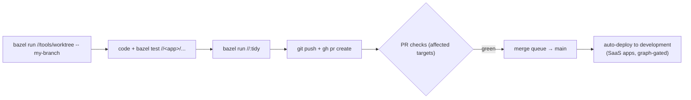

# Quick start — application developer

You build, test, and ship the apps in this repo (or you're about to create a new
one). This page gets you from a fresh clone to a merged PR; everything links onward
to the deeper material.

## Your first hour

```bash
# 1. Toolchain: Node 22 + pnpm via corepack, Bazelisk installed AS `bazel`
nvm install && corepack enable
bazel version                  # -> 9.x, pinned by .bazelversion

# 2. Verify your environment (per-app: bazel run //tabula:doctor, etc.)
bazel run //:doctor

# 3. Warm the build (hits the remote cache) and run the tests
bazel build //...
bazel test  //tabula/...       # scope to the app you're touching
```

Exact prerequisites and per-app inner loops:
[CONTRIBUTING §1–3](../../CONTRIBUTING.md#1-prerequisites--toolchain). If an app's own
README contradicts CONTRIBUTING, **CONTRIBUTING wins** (some per-app docs are
known-stale).

## The loop you'll live in



Five things that are **enforced, not conventions**:

1. **Branch in a worktree** — `bazel run //tools/worktree -- <branch>`. Building on a
   branch in the primary checkout fails on purpose.
2. **`bazel run //:tidy` before every PR** — the `tidy-check` CI job fails on any diff.
3. **Conventional Commits** (`feat:`, `fix:`, `docs:`…) — they drive release-please.
4. **Never merge locally** — the merge queue is the only path to `main`.
5. **Secrets never in git** — local dev uses gitignored `.env` files from committed
   `.env.example` templates ([CONTRIBUTING §7](../../CONTRIBUTING.md#7-secrets-handling)).

## How your change ships

Merging to `main` auto-deploys **development** (for the Cloud Run apps) via a
blue-green rollout that can't take down the live revision. Promotion to
nonproduction/production happens when a **release is cut** (the release-please PR
merges), not on every merge. CLIs and MCP services *release* (Homebrew/npm from the
mirror) instead of deploying. The whole picture, with diagrams:
[The SDLC](../concepts/sdlc.md).

## Building a new app?

1. Pick your category and hosting target with the
   [decision guide](../engineering/application-development-principles.md#4-decision-guide-choosing-a-category--hosting-target-for-a-new-app)
   — the category fixes the stack, build shape, and deploy mechanics.
2. Read your category's playbook section in the
   [Guiding Principles](../engineering/application-development-principles.md#3-per-category-playbook).
3. Follow the [OSS app onboarding checklist](../guides/oss-app-onboarding-checklist.md)
   phase by phase — it's distilled from a real migration.
4. A new app is **born aligned**: WIF deploy identity as code, `.env.example`, MIT +
   governance quartet, CI build+test gate, `/health` + structured logs.

## Going deeper

- [Bazel targets & tools catalog](../reference/bazel-targets.md) — everything you can
  `bazel run`.
- [Build caching](../guides/build-cache.md) and [remote builds](../guides/remote-build.md)
  — make builds fast.
- [Dependency versioning](../dependency-versioning/index.md) — adding a third-party
  dep in any ecosystem (the One Version Rule).
- [Flaky tests](../engineering/flaky-tests.md) — what to do when e2e flakes.
- [Alignment gaps](../engineering/application-alignment-gaps.md) — where existing apps
  don't yet meet the standard, so you don't copy the wrong pattern.
