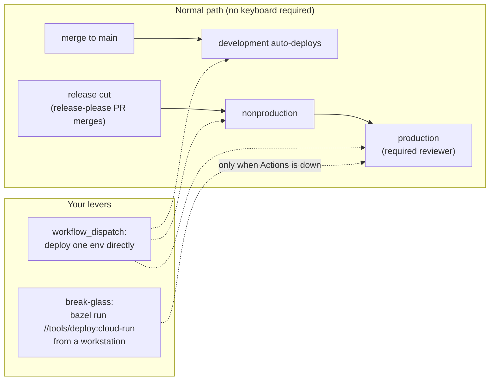

# Quick start — operator

You run what's deployed: promote releases, watch health, rotate secrets, respond to
incidents — for the Cloud Run apps and for the self-hosted platform. This page is
your map of the normal paths and the break-glass paths.

## The operating model

Almost nothing here is operated by hand: deploys fire from the pipeline, the cluster
reconciles from git, and every manual action you *do* take is a `bazel run` target
that injects the right identity and environment for you.

Read [The SDLC §3–4](../concepts/sdlc.md#3--ship-deploy-release-promote) for the full
promotion model, then keep these to hand:

## Runbooks

| Situation | Runbook |
|---|---|
| GitHub Actions is down and you must deploy | [Break-glass deploy](../operations/break-glass-deploy-runbook.md) |
| Mirror release must be published without CI | `bazel run //tools/release:publish-local` (dry-run by default) |
| Sealed secret needs (re)sealing, backup, or the controller keys need custody | [Sealed secrets](../operations/sealed-secrets.md) |
| A credential/API key needs rotating | [Key rotation](../operations/key-rotation.md); BuildBuddy: `bazel run //tools/rotate-buildbuddy-key` |
| GCP Secret Manager value needs seeding/rotating | `bazel run //tools/gcp-secrets:{status,seed}` |
| GitHub environment secrets drifted | `bazel run //tools/sync-env-secrets:apply` |
| Foundation must be torn down / redeployed | [Teardown & redeploy](../operations/foundation-teardown-redeploy-runbook.md) |
| A node is sick / needs draining | `bazel run //tools/cluster:{cordon,drain,uncordon}` — diagnostics first: `:balance`, `:placement` |

The full ops-target catalog: [Bazel targets & tools](../reference/bazel-targets.md).

## Observability

- **Cloud Run apps**: structured logs in Cloud Logging (revision-tagged), `/health`
  endpoints, post-deploy smoke checks. A failed smoke means the candidate never took
  traffic — the live revision is still serving.
- **Platform**: Prometheus/Grafana/Loki/Tempo on the dev-local cluster, reconciled
  from git like everything else.
- **CI as a signal**: a red nightly full sweep files a P0 issue automatically;
  `culprit-finder` bisects to the first bad commit.

## Incidents

1. Stabilize using the runbooks above. Remember the GitOps rule: if you must touch
   the cluster by hand, it's explicit break-glass and the fix gets backfilled into
   git immediately.
2. Write a dated postmortem in
   [`docs/operations/incidents/`](../operations/incidents/) — the two existing ones
   ([Prometheus WAL corruption](../operations/incidents/2026-06-13-prometheus-wal-corruption.md),
   [fedora node freeze cascade](../operations/incidents/2026-06-21-fedora-freeze-cluster-cascade.md))
   are the template.
3. Every fix ships with the check that would catch the regression
   ([Principles §2.19](../engineering/application-development-principles.md#219-every-fix-ships-with-the-test-or-check-that-would-catch-it-again)).

## What survives what

Before you rely on the platform in anger, know its failure envelope:
[resilience catalog](../infrastructure/resilience-catalog.md) — per-service
"survives 1–2 node loss?" verdicts and the cluster's two hard ceilings. The
**Zitadel masterkey and the sealed-secrets controller keys are the crown jewels**;
their custody targets (`//tools/gitops:sealed-secrets-{backup,restore,verify}`) exist
so that loss is a restore, not a rebuild.
